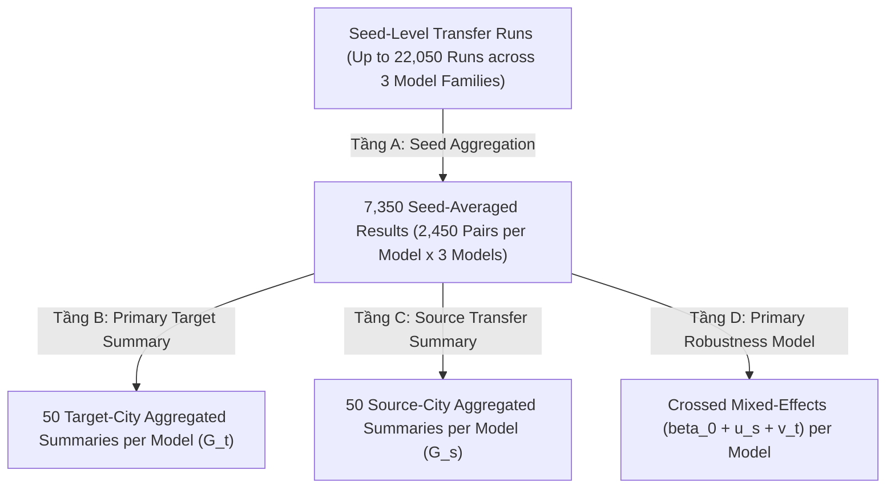

# Research Protocol: Distance-Binned Distribution (DBD) Calibration for Zero-Shot OD Flow Prediction

---

## 1. Nghiên cứu & Mục tiêu (Core Framework)

### 1.1. Bối cảnh & Câu hỏi nghiên cứu
Nghiên cứu đánh giá khả năng chuyển giao không mẫu (zero-shot transfer) của ba họ mô hình căn bản đại diện cho ba cơ chế khác nhau (`gravity_2param`, `pairwise_mlp`, `urban_gnn`) trong bài toán dự báo lưu lượng di chuyển đô thị (Origin-Destination flow) dưới điều kiện dữ liệu nguồn cực kỳ hạn chế (data-scarce environment).

Hai câu hỏi nghiên cứu trung tâm:
- **RQ1 (Added Value):** Thông tin phân phối cự ly tổng hợp của thành phố đích ($Y_D^{\text{target}}$) có cải thiện được dự báo chuyển giao zero-shot từ một thành phố nguồn khan hiếm dữ liệu hay không?
- **RQ2 (Sensitivity & Robustness):** Mức độ cải thiện phụ thuộc như thế nào vào độ phân giải khoảng cách ($K$) và sai số đo lường trong phân phối đích ($\text{TV}$ error)?

### 1.2. Luồng thực thi hai tầng


---

## 2. Thiết lập thực nghiệm (Experimental Setting)

### 2.1. Không gian Dữ liệu & Tập Hỗ trợ Độc quyền (Positive Interzonal OD Support)

Từ thời điểm này, toàn bộ pipeline từ huấn luyện nguồn, đánh giá held-out, zero-shot transfer, xây dựng phân phối DBD, hiệu chuẩn hậu nghiệm, kiểm tra bảo toàn lưu lượng và tính toán toàn bộ các metric bắt buộc phải sử dụng **duy nhất một tập hỗ trợ cố định cho mỗi thành phố**:
$$\Omega_t^+ = \{(i,j) \in \Omega_t \mid i \neq j, \; D_{t,ij} > 0, \; T_{t,ij} \ge 1\}$$
Đây là thiết lập **Fixed Positive Interzonal OD Support / Oracle-Support Intensity Reconstruction Setting**.

#### 1. Quy tắc Tạo và Đóng băng Support (Freeze Invariant):
Với mỗi thành phố đích $t$, tập hỗ trợ $\Omega_t^+$ được xác định đúng một lần từ dữ liệu quan sát thực nghiệm:
```python
positive_support_t = (
    (origin != destination)
    & (distance_km > 0)
    & (true_flow >= 1)
)
```
Sau khi tạo, tập chỉ số $\Omega_t^+$ được **đóng băng (freeze)** và tái sử dụng bất biến xuyên suốt toàn bộ pipeline. Tuyệt đối không tạo lại support dựa trên giá trị dự báo ($\hat{T} > 0$ hay threshold dự báo).

#### 2. Phạm vi Bài toán Khoa học (Problem Scope):
Nghiên cứu này định vị rõ ràng:
- **Bài toán:** Đánh giá khả năng tái tạo cường độ lưu lượng OD (OD flow intensity reconstruction) có điều kiện trên tập hỗ trợ dương quan sát được $\Omega_t^+$.
- **Phạm vi ngoài lề:** Việc phân loại/dự báo ma trận thưa (zero vs. non-zero support classification) nằm ngoài phạm vi nghiên cứu (outside the scope of this study).

#### 3. Quy tắc Ràng buộc Toàn diện trên $\Omega_t^+$:
- **Baseline Prediction:** Dự báo zero-shot từ mô hình nguồn $\hat{T}^{(0)}$ lập tức được lọc hạn chế về đúng tập $\Omega_t^+$ trước bất kỳ phép tính nào: `eval_df = target_df.loc[positive_support_t].copy()`.
- **Target DBD ($p_{s,t}$):** Chỉ tính trên các cặp OD thuộc $\Omega_t^+$:
  $$p_{s,t,b} = \frac{\sum_{(i,j) \in \Omega_t^+, d_{ij} \in B_b^{(s,K)}} T_{t,ij}}{\sum_{(i,j) \in \Omega_t^+} T_{t,ij}}$$
  Tuyệt đối không đưa vào cặp zero-flow hay các cặp ngoài $\Omega_t^+$.
- **Predicted DBD ($q_{s,t}$):** Sử dụng **chính xác cùng tập OD** $\Omega_t^+$ và cùng hệ bin cự ly nguồn:
  $$q_{s,t,b} = \frac{\sum_{(i,j) \in \Omega_t^+, d_{ij} \in B_b^{(s,K)}} \hat{T}^{(0)}_{s,t,ij}}{\sum_{(i,j) \in \Omega_t^+} \hat{T}^{(0)}_{s,t,ij}}$$
- **Calibration & Volume Preservation:** Chỉ áp dụng hiệu chuẩn trên các cặp thuộc $\Omega_t^+$, và kiểm tra bảo toàn lưu lượng độc quyền trên $\Omega_t^+$:
  $$\left|\sum_{(i,j) \in \Omega_t^+} \hat{T}^{(1)}_{s,t,ij} - \sum_{(i,j) \in \Omega_t^+} \hat{T}^{(0)}_{s,t,ij}\right| < 10^{-10}$$
- **Evaluation Metrics:** Toàn bộ các chỉ số trước và sau hiệu chuẩn ($\text{CPC}, \text{CPC}_{\text{norm}}, \text{MAE}, \text{MSE}, \text{RMSE}, \Delta \text{CPC}, \Delta \text{MAE}, \Delta \text{MSE}$) được tính toán độc quyền trên $\Omega_t^+$.

#### 4. Nghiêm cấm Tự ý Thay đổi Support:
Tuyệt đối không chuyển sang: all possible OD pairs, intrazonal pairs, cặp $T_{ij}=0$, cặp dự báo $>0$, ngưỡng theo flow dự báo, source support, hay phép giao/hợp support.

#### 5. Sanity Checks Bắt buộc cho Mỗi Thành phố Đích:
```python
assert np.all(eval_df["origin"] != eval_df["destination"])
assert np.all(eval_df["distance_km"] > 0)
assert np.all(eval_df["true_flow"] >= 1)
assert abs(p.sum() - 1.0) < 1e-12
assert abs(q.sum() - 1.0) < 1e-12
assert len(y_true) == len(y_pred_before) == len(y_pred_after)
```

#### 6. Định nghĩa và Quy tắc Độc quyền cho Chỉ số Chẩn đoán $R_{\text{vol}}$ (Evaluation-Only Diagnostic):
Trong toàn bộ nghiên cứu:
$$R_{\text{vol}} = \frac{\sum_{(i,j) \in \Omega_t^+} \hat{T}^{(0)}_{s,t,ij}}{\sum_{(i,j) \in \Omega_t^+} T_{t,ij}}$$
Trong đó:
- Tử số = tổng lưu lượng baseline dự báo trên tập hỗ trợ dương interzonal $\Omega_t^+$;
- Mẫu số = tổng lưu lượng thực tế của thành phố đích trên chính cùng tập $\Omega_t^+$.

**Các nguyên tắc bất biến nghiêm ngặt:**
1. **Chỉ dùng cho đánh giá (Evaluation-Only Diagnostic):** Tuyệt đối không dùng $R_{\text{vol}}$ hoặc mẫu số $\sum T_{t,ij}$ để huấn luyện mô hình, điều chỉnh siêu tham số, chuẩn hóa/rescale dự báo baseline ($\hat{T} \cdot \sum T / \sum \hat{T}$), hiệu chuẩn DBD, chọn checkpoint, chọn source model, chọn donor, hay điều chỉnh $(G, \alpha)$.
2. **Không volume-normalize baseline bằng target truth:** Mọi metric baseline được tính trực tiếp trên raw zero-shot predictions $\hat{T}^{(0)}$ (hoặc sau softplus), tuyệt đối không chia theo target total flow vì điều đó sẽ phá vỡ điều kiện zero-shot.
3. **DBD Calibration không được truy cập mẫu số của $R_{\text{vol}}$:** Bộ hiệu chuẩn DBD chỉ nhận vector phân phối chuẩn hóa $p_b = \sum_{B_b} T / \sum T$ (tổng bằng 1.0) và hoàn toàn không nhận tổng lưu lượng $\sum T_{t,ij}$ dưới bất kỳ hình thức nào.
4. **Bảo toàn Lưu lượng Tuyệt đối:** Vì quá trình hiệu chuẩn DBD là bảo toàn lưu lượng chính xác ($\sum \hat{T}^{(1)} = \sum \hat{T}^{(0)}$), nên bắt buộc:
   $$R_{\text{vol}}^{\text{after}} = \frac{\sum \hat{T}^{(1)}}{\sum T} = R_{\text{vol}}^{\text{before}}$$
   (sai số chấp nhận $|R_{\text{vol}}^{\text{before}} - R_{\text{vol}}^{\text{after}}| < 10^{-10}$ đóng vai trò là sanity check bắt buộc).
5. **Sanity Check Bắt buộc trong Code:**
   ```python
   r_before = pred_before.sum() / true_flow.sum()
   r_after = pred_after.sum() / true_flow.sum()
   assert abs(r_before - r_after) < 1e-10
   ```
6. **Đặt tên chuẩn hóa:** Giữ tên cột `R_vol` hoặc `volume_ratio_pred_to_true` thống nhất toàn dự án.
7. **Mô tả Phương pháp luận chuẩn cho Bài báo (Paper Wording):**
   > *“We additionally report the predicted-to-observed total-volume ratio $R_{\mathrm{vol}} = \sum \hat{T} / \sum T$ as an evaluation-only diagnostic. This quantity is never used for model fitting or DBD calibration.”*

#### 7. Tách biệt Nghiêm ngặt Giao diện Calibrator và Evaluator (Calibration vs. Evaluation Contract):
Để ngăn chặn hoàn toàn rò rỉ thông tin (data leakage) từ ground truth đích:
1. **Calibration Input Contract:**
   Bộ hiệu chuẩn chỉ nhận các mảng tối thiểu:
   ```python
   pred_after = calibrate_dbd(
       pred_flow=pred_before,
       distance_km=distance_km,
       bin_edges=source_bin_edges,
       target_dbd_p=target_dbd_p,
   )
   ```
   Tuyệt đối **không truyền**: `true_flow`, `true_total_flow`, `CPC`, `MAE`, `MSE`, `R_vol` hoặc toàn bộ DataFrame chứa `true_flow` vào calibrator.
2. **`target_dbd_p` là Đầu vào Duy nhất từ Phía Dữ liệu Đích:**
   Thông tin duy nhất từ target ground truth được đưa vào calibration là vector phân phối chuẩn hóa:
   $$p = (p_1, \ldots, p_K), \quad \sum_{b=1}^K p_b = 1.0$$
   Calibration module hoàn toàn không biết các giá trị $T_{ij}$ riêng lẻ hay tổng volume $\sum T_{ij}$.
3. **Mô-đun Tạo Target DBD Độc lập:**
   ```python
   target_dbd_p = build_target_dbd(
       true_flow=true_flow,
       distance_km=distance_km,
       bin_edges=source_bin_edges,
   )
   ```
   Sau khi hàm trả về vector $p$, dữ liệu ground truth $T_{ij}$ lập tức bị loại bỏ khỏi luồng tính của calibrator.
4. **Evaluator Contract:**
   Chỉ sau khi calibration hoàn thành và trả về `pred_after`, evaluation module mới được kích hoạt:
   ```python
   metrics = evaluate_calibration_transfer(
       true_flow=true_flow,
       pred_before=pred_before,
       pred_after=pred_after,
   )
   ```
   Evaluator tính toán độc quyền các chỉ số đánh giá ($\text{CPC}, \text{CPC}_{\text{norm}}, \text{MAE}, \text{MSE}, \text{RMSE}, R_{\text{vol}}$) và các chỉ số cải thiện ($\Delta$).
5. **Cấm Dùng Metric Điều khiển Calibration:**
   Tuyệt đối không thử nhiều biến thể calibration, không tính CPC để chọn variant tốt nhất, không tune epsilon/smoothing dựa trên target metrics.
6. **Mô tả Phương pháp luận chuẩn cho Bài báo (Paper Wording):**
   > *“The post-hoc calibrator receives only the baseline OD predictions, source-defined physical-distance bins, and the normalized target distance-binned distribution. Pair-level target OD flows and target total volume are withheld from the calibration operator and are accessed only by the evaluation stage. Thus, target information enters calibration only through the normalized distance-distribution vector, while absolute target flow volume remains unavailable.”*

#### 8. Mô tả Phương pháp luận chuẩn cho Bài báo về Positive Support (Method Wording):
> *“All zero-shot evaluation and post-hoc DBD calibration are conducted on a fixed positive interzonal OD support, defined as OD pairs with $i \neq j$, positive distance, and observed flow $T_{ij} \ge 1$. The same target-city support is used for baseline evaluation, DBD construction, calibration, and post-calibration evaluation. Accordingly, the experiment evaluates OD flow intensity reconstruction conditional on the observed positive OD support; predicting the zero/non-zero OD support itself is outside the scope of this study.”*

### 2.2. Phân chia Cố định 30/70 trên Positive OD Support (Fixed 30/70 Split on Positive OD Support)

Từ thời điểm này, việc phân chia dữ liệu của thành phố nguồn bắt buộc phải tuân thủ đúng quy trình nghiêm ngặt dưới đây. Tuyệt đối không thêm stratification, balancing, resampling, retry hay bất kỳ heuristic nào khác.

#### 1. Tập Dữ liệu Được phép Phân chia:
Với mỗi thành phố nguồn $s$, trước tiên xác định tập positive interzonal OD support:
$$\Omega_s^+ = \{(i,j) \in \Omega_s \mid i \neq j, \; D_{s,ij} > 0, \; T_{s,ij} \ge 1\}$$
Chỉ các cặp OD thuộc $\Omega_s^+$ mới được đưa vào bước phân chia 30/70. Tuyệt đối không phân chia trên full matrix, zero-flow pairs hay bất kỳ support nào khác.

#### 2. Quy tắc Chia Ngẫu nhiên Đồng nhất (Uniform Random Split):
Thực hiện đúng một lần duy nhất cho mỗi thành phố nguồn:
$$N_s = |\Omega_s^+|$$
Số training pairs:
$$N_s^{\text{train}} = \lfloor 0.30 N_s \rfloor$$
Số held-out evaluation pairs:
$$N_s^{\text{eval}} = N_s - N_s^{\text{train}}$$
Quá trình lấy mẫu là **lấy mẫu ngẫu nhiên đồng nhất không hoàn lại (uniform random sampling without replacement)** trên toàn bộ $\Omega_s^+$ với hạt giống cố định duy nhất:
$$\text{split\_seed} = 42$$

#### 3. Nghiêm cấm Phân tầng & Bao phủ Nhân tạo (No Stratification & No Artificial Coverage):
- **Không stratification:** Tuyệt đối không phân tầng hoặc cân bằng split theo khoảng cách, độ lớn lưu lượng, origin, destination, tract, dân số, vùng địa lý, distance bin, flow quantile hay node degree.
- **Không coverage nhân tạo:** Không ép mỗi origin/destination phải xuất hiện trong train, không ép mỗi distance bin phải có đủ cặp train. Nếu phép chia ngẫu nhiên đồng nhất tạo ra việc một tract hay một nhóm cự ly có ít/không có dữ liệu train, **chấp nhận giữ nguyên kết quả đó**, tuyệt đối không resample để sửa đổi.
- **Không retry chọn split thuận lợi:** Không sinh nhiều split rồi chọn split có CPC cao nhất hoặc mô hình hội tụ tốt nhất. Split seed 42 được tạo một lần và chấp nhận nguyên trạng.

#### 4. Quy trình Thực thi Chuẩn mực (Deterministic Implementation):
Để đảm bảo kết quả không phụ thuộc vào thứ tự hàng ban đầu trong các tệp CSV, các cặp OD trong $\Omega_s^+$ bắt buộc phải được **sắp xếp theo thứ tự xác định (deterministic sort)** trước khi thực hiện hoán vị:
```python
def create_source_split(df, source_city):
    support = df[
        (df["origin"] != df["destination"])
        & (df["distance_km"] > 0)
        & (df["flow"] >= 1)
    ].copy()

    # Sắp xếp xác định theo (origin, destination)
    support = support.sort_values(["origin", "destination"]).reset_index(drop=True)

    rng = np.random.default_rng(42)
    perm = rng.permutation(len(support))

    n_train = int(np.floor(0.30 * len(support)))
    train_idx = perm[:n_train]
    heldout_idx = perm[n_train:]

    support["split"] = "heldout"
    support.loc[train_idx, "split"] = "train"
    support["split_seed"] = 42
    return support
```

#### 5. Manifest là Source of Truth Duy Nhất:
Sau khi tạo, toàn bộ kết quả phân chia được lưu trữ cố định tại [`manifests/od_split_manifest.csv`](file:///Users/nguyenquocthinh/Documents/distance-binned-distribution/manifests/od_split_manifest.csv) với cấu trúc:
`source_city, origin, destination, split, split_seed`
trong đó $\text{split} \in \{\text{"train"}, \text{"heldout"}\}$.
- **Source of truth:** Các script huấn luyện không được tự phân chia lại ngẫu nhiên trong code. Mọi quy trình bắt buộc phải load manifest và lọc `split == "train"` cho huấn luyện và `split == "heldout"` cho within-source evaluation.
- **Nhất quán mô hình:** Cùng một source city $s$, cả ba họ mô hình (`gravity_2param`, `pairwise_mlp`, `urban_gnn`) dùng chung 100% cùng tập train và tập held-out.
- **Độc lập với Model Seeds:** Ba model seeds $\{1, 10, 100\}$ chỉ dùng cho khởi tạo trọng số ngẫu nhiên và tối ưu hóa; tuyệt đối không thay đổi split 30/70.

#### 6. Quy tắc Xử lý Lỗi (Failure Rules):
Nếu phát hiện trùng lặp khóa `(origin, destination)`, thiếu cặp OD so với $\Omega_s^+$, cặp xuất hiện đồng thời ở train và heldout, hoặc tỷ lệ split sai lệch: pipeline lập tức **RAISE ERROR**, không được tự sửa hay tiếp tục chạy ngầm.

#### 7. Mục đích của Tập 70% Held-Out:
Tập 70% held-out chỉ được phép dùng để tính các chỉ số within-source evaluation ($\text{CPC}, \text{MAE}, \text{MSE}, \text{RMSE}$). Tuyệt đối không dùng để tuning hyperparameters, early stopping, chọn epoch, chọn checkpoint hay chọn binning.

#### 8. Mô tả Phương pháp luận chuẩn cho Bài báo (Method Wording):
> *“For each source city, the positive interzonal OD support was randomly partitioned once into a 30% training subset and a 70% within-city held-out subset using a fixed split seed of 42. Sampling was uniform without replacement and was not stratified by distance, flow magnitude, origin, destination, or any other attribute. The resulting split was frozen and reused identically across both model architectures and all model-initialization seeds. The three training seeds affect only stochastic model initialization and optimization; they do not alter the underlying 30/70 OD split.”*

### 2.3. Ba Họ Mô Hình Căn Bản Độc Lập (Three Distinct OD Flow Baseline Families)

Nghiên cứu thiết lập và đánh giá chính xác **3 họ mô hình căn bản đại diện cho 3 cơ chế mô hình hóa khác nhau**:
1. **Two-Parameter Gravity Model (`gravity_2param`):** Mô hình vật lý suy giảm cự ly kinh điển với 2 tham số tự do;
2. **Pairwise MLP (`pairwise_mlp`):** Mô hình mạng nơ-ron học đặc trưng cặp OD trực tiếp (lấy cảm hứng từ DeepGravity nhưng thích ứng cho bài toán hồi quy lưu lượng trực tiếp khi không có target outflow);
3. **Urban-GNN (`urban_gnn`):** Mô hình mạng nơ-ron đồ thị không gian có cơ chế truyền tin (spatial message passing) kết hợp với thành phần gravity học đồng thời.

$$\boxed{\text{Ba họ mô hình độc lập về cơ chế; không ép buộc kiến trúc đồng nhất hay cân bằng tham số giả tạo}}$$

Đơn vị so sánh khoa học chung được kiểm soát chặt chẽ:
- Cùng thành phố nguồn $s$;
- Cùng tập 30% training OD pairs trên positive support $\Omega_s^+$;
- Cùng tập 70% held-out source support;
- Cùng positive support của thành phố đích $\Omega_t^+$;
- Cùng bộ hạt giống khởi tạo $\{1, 10, 100\}$ (với các mô hình có tính ngẫu nhiên);
- Cùng hệ thống chỉ số đánh giá và cùng pipeline DBD calibration.

---

#### 1. MODEL 1 — TWO-PARAMETER GRAVITY MODEL (`gravity_2param`)
- **Định nghĩa toán học:**
  $$\hat{T}_{ij} = \exp(G) \cdot P_i P_j \cdot D_{ij}^{-\alpha}$$
  trong đó $P_i, P_j$ là dân số gốc của origin/destination tract; $D_{ij} > 0$ là khoảng cách vật lý thực tế (km); $G$ là hệ số quy mô toàn cục; $\alpha$ là số mũ suy giảm cự ly.
- **Ranh giới cơ chế (Separation Rule):**
  - Chỉ có đúng $2$ tham số huấn luyện: $\theta_{\text{gravity}} = \{G, \alpha\}$.
  - Tuyệt đối **không** dùng mạng nơ-ron, không MLP, không đồ thị, không node embedding, không message passing.
  - Sử dụng khoảng cách vật lý gốc $D_{ij}$ (không dùng $\log(1+d)$, không z-score, không embedding).
- **Hợp đồng Dân số & Cự ly Thô (Raw Population & Distance Invariant):**
  - $P_i, P_j$ là raw origin/destination population theo đơn vị gốc của dataset. Tuyệt đối **không** dùng `log1p(population)`, `z-score`, `min-max` hay `target-normalized population` bên trong phương trình gravity.
  - Phân tách rõ ràng hai biểu diễn: `population_raw` (dùng độc quyền cho Gravity equation và explicit gravity prior) và `population_processed` (dùng làm node feature cho Pairwise MLP / GNN sau log1p và z-score).
  - Khoảng cách $D_{ij}$ là khoảng cách vật lý thật theo km (`distance_km_raw` > 0).
  - Kiểm tra tính hợp lệ trước training/prediction:
    ```python
    assert np.isfinite(P_origin).all()
    assert np.isfinite(P_destination).all()
    assert (P_origin >= 0).all()
    assert (P_destination >= 0).all()
    ```
  - Xử lý khuyết thiếu: Nếu population có missing value, áp dụng quy tắc gán trung vị nguồn $m_{s,\text{pop}} = \operatorname{median}(P_s)$ đã khóa, nhưng sau khi gán, giá trị đưa vào gravity vẫn giữ nguyên ở thang đo gốc raw population (không z-score).
- **Hợp đồng Ổn định Số học Bắt buộc (Numerical Stability Contract):**
  - **Khoảng cách dương nghiêm ngặt:** $D_{ij} = \text{distance\_km\_raw} > 0$ được bảo đảm bởi tập hỗ trợ dương liên vùng ($\Omega^+$). Kiểm tra: `assert (distance_km_raw > 0).all()`. Không tự ý cộng thêm $\epsilon$ vào khoảng cách.
  - **Dân số không âm & xử lý dân số bằng 0:** $P_i \ge 0, P_j \ge 0$. Nếu xuất hiện giá trị âm, lập tức **RAISE DATA ERROR** (không lấy trị tuyệt đối, không clip về 0). Nếu $P_i = 0$ hoặc $P_j = 0$, mô hình dự báo chính xác $\hat{T}_{ij} = 0$ một cách tất định, không gọi $\log(0)$ và không cộng thêm $\epsilon$ vào dân số.
  - **Tham số $\alpha$ dương nghiêm ngặt theo đúng Baseline Code (Strict Baseline-Matching Parameterization):** Nhằm bảo đảm tính suy giảm cự ly vật lý ($\alpha > 0$, lưu lượng không tăng theo khoảng cách) và giữ nguyên 100% cách tham số hóa của mã nguồn baseline (`GravityPrior` trong `src/models/gravity.py`):
    $$\alpha = \exp(\text{log\_alpha}) > 0$$
    với $\text{log\_alpha} \in \mathbb{R}$ là tham số học tự do (`self.log_alpha = nn.Parameter(torch.tensor(math.log(init_alpha), dtype=torch.float32))`). Khởi tạo baseline chuẩn xác: $G_0 = 0.0, \alpha_0 = 1.0 \implies \text{log\_alpha}_0 = 0.0$. Tuyệt đối không thay thế bằng Softplus hay hard-clip $\alpha$ sau optimizer.
  - **Tham số $G$ không ràng buộc (Unconstrained Global Scale):** $G \in \mathbb{R}$ đại diện cho log-scale toàn cục, không clamp.
  - **Tính toán trong Log-Space (Log-Space Computation):** Để triệt tiêu nguy cơ overflow/underflow, đối với các cặp có $P_i > 0$ và $P_j > 0$:
    $$\log \hat{T}_{ij} = G + \log P_i + \log P_j - \alpha \log D_{ij} \implies \hat{T}_{ij} = \exp(\log \hat{T}_{ij})$$
  - **Nghiêm cấm Arbitrary Prediction Clipping:** Tuyệt đối không tự ý áp đặt ngưỡng cắt cứng (như `np.clip(pred, 0, 1e6)`). Nếu $\log \hat{T}_{ij}$ vượt giới hạn biểu diễn dấu phẩy động ($> 88.0$), pipeline lập tức **RAISE NUMERICAL ERROR** và ghi log chẩn đoán $(s, \text{seed}, G, \alpha, \max \log \hat{T}, \min \log \hat{T})$.
  - **Kiểm tra tính hữu hạn của Dự báo & Gradient:**
    - Sau forward pass: `assert np.isfinite(predicted_flow).all()` và `assert (predicted_flow >= 0).all()`.
    - Sau mỗi epoch: `assert np.isfinite(loss)` và `assert all gradients are finite`. Nếu loss hoặc gradient bị NaN/Inf: lập tức **STOP RUN & RAISE ERROR**, không âm thầm bỏ qua optimizer step hay restart với seed khác.
    - Sau epoch 40: `assert np.isfinite(G_final)`, `assert np.isfinite(alpha_final)`, và `assert alpha_final > 0`.
  - **Cấu hình huấn luyện không ngoại lệ:** Dùng đúng optimizer `AdamW`, learning rate $\eta = 2 \times 10^{-3}$, 40 epochs, Log1p-MSE loss, tuyệt đối không chỉnh riêng hyperparameter cho Gravity.
  - **Lưu vết huấn luyện:** Ghi lại `gravity_training_trace.csv` chứa `(epoch, G, alpha, train_loss)` phục vụ kiểm toán hội tụ.
- **Mô tả Phương pháp luận chuẩn cho Bài báo (Paper Wording):**
  > *“The Two-Parameter Gravity model uses raw origin and destination population together with raw physical distance. Neural feature normalization is not applied inside the gravity equation. The gravity distance-decay parameter was parameterized as $\alpha = \exp(\log \alpha) > 0$ strictly matching the baseline implementation, while the global log-scale parameter remained unconstrained. Predictions were computed using a numerically stable log-space formulation.”*
- **Huấn luyện & Chuyển giao:**
  - Tối ưu hóa bằng Log1p-MSE trên 30% training OD pairs:
    $$L = \frac{1}{N} \sum_{(i,j) \in \Omega_{s,\text{train}}^+} \left[\log(1 + T_{ij}) - \log(1 + \hat{T}_{ij})\right]^2$$
  - Sau 40 epochs, bộ tham số $(G_s, \alpha_s)$ được đóng băng và lưu trữ vào `gravity_parameters.csv`.
  - Dự báo zero-shot sang target $t$: $\hat{T}_{s,t,ij} = \exp(G_s) P_{t,i} P_{t,j} D_{t,ij}^{-\alpha_s}$ (với $\hat{T}=0$ nếu $P_i P_j = 0$).

---

#### 2. MODEL 2 — PAIRWISE MLP (`pairwise_mlp`)
- **Mục tiêu & Cơ chế:**
  Hồi quy lưu lượng OD trực tiếp từ vector đặc trưng ghép nối:
  $$\hat{T}_{ij} = \operatorname{Softplus}\left(f_{\text{MLP}}\left([x_i \parallel x_j \parallel d'_{ij}]\right)\right) \ge 0$$
  Lấy cảm hứng từ DeepGravity nhưng được điều chỉnh để dự báo cường độ lưu lượng trực tiếp trong điều kiện zero-shot (do thành phố đích không có thông tin tổng lưu lượng phát sinh $O_i$). Tuyệt đối không dùng softmax theo origin và không dùng outflow constraint $\hat{T}_{ij} = O_i p_{ij}$.
- **Quy tắc Phân tách Tuyệt đối (Critical Separation Rule):**
  - Tuyệt đối **không chứa**: tham số $G$, $\alpha$, phương trình gravity hiển ngôn, gravity residual, gravity multiplicative prior, gravity initialization hay gravity regularization.
  - Tuyệt đối **không có** message passing, đồ thị, ma trận kề, hay neighborhood aggregation.
  - Mô hình học lưu lượng hoàn toàn từ dữ liệu nơ-ron thuần túy.
- **Kiến trúc & Fixed Feature Schema:**
  - **Danh sách Đặc trưng Node Cố định (Canonical Node Feature List):** Sử dụng danh sách có thứ tự cố định gồm đúng 26 đặc trưng được chuẩn hóa từ dataset gốc:
    - *Census (13 đặc trưng):* `total_population`, `median_age`, `median_income`, `per_capita_income`, `employment_rate`, `unemployment_rate`, `commute_transit_pct`, `commute_active_pct`, `commute_wfh_pct`, `zero_vehicle_pct`, `avg_vehicles_per_household`, `higher_education_pct`, `homeownership_rate`.
    - *POI (8 đặc trưng):* `office`, `office_density`, `industrial`, `industrial_density`, `commercial`, `commercial_density`, `education_primary`, `education_primary_density`.
    - *Road Network (5 đặc trưng):* `road_length_total`, `road_density`, `road_count`, `motorway_length`, `primary_length`.
  - **Origin và Destination Dùng Chung Schema:** $x_i \in \mathbb{R}^{26}$ và $x_j \in \mathbb{R}^{26}$ tuân thủ đúng cùng một thứ tự và phương pháp tiền xử lý source-fitted.
  - **Đặc trưng Cự ly Duy nhất:** Cự ly không nằm trong node feature list mà xuất hiện độc quyền dưới dạng một pairwise feature chuẩn hóa:
    $$d^{\text{std}}_{ij} = \frac{\log(1 + d_{\text{raw},ij}) - \mu_s^{\text{distance}}}{\sigma_s^{\text{distance}}}$$
  - **Kích thước Đầu vào Bắt buộc:** Đúng $2F + 1 = 2 \times 26 + 1 = 53$ chiều: $[x_i \parallel x_j \parallel d^{\text{std}}_{ij}]$. Kiểm tra kích thước nghiêm ngặt trước khi forward: `assert mlp_input.shape[-1] == 53`.
  - **Đóng băng trong Manifest:** Toàn bộ danh mục và thứ tự đặc trưng được khóa bất biến tại `manifests/model_feature_schema.json` kèm theo `feature_schema_hash`. Mọi checkpoint và quá trình suy luận zero-shot phải kiểm tra khớp hash.
  - **Nghiêm cấm Rò rỉ Dữ liệu & Biến thể Không Hợp lệ:**
    - Tuyệt đối **không** dùng features suy biến từ true target flow (không target outflow $O_i$, không inflow $I_j$, không rank, không volume).
    - Tuyệt đối **không** dùng features suy biến từ đồ thị GNN (không node degree GNN, không graph centrality, không message-passed embedding).
    - Tuyệt đối **không** dùng features suy biến từ mô hình gravity (không $P_i P_j$, không $d^{-\alpha}$, không $G, \alpha$ fitted).
    - Tuyệt đối **không** dùng danh tính thành phố (không city ID, không city embedding, không one-hot).
    - Tuyệt đối **không** feature selection theo kết quả (không chọn subset theo SHAP, không đổi features theo validation/target performance).
  - **Mạng dense nhiều tầng:** $\text{Dense}(53 \to 64) \to \text{LayerNorm} \to \text{ReLU} \to \text{Dropout}(0.1) \to \text{Dense}(64 \to 64) \to \text{LayerNorm} \to \text{ReLU} \to \text{Dropout}(0.1) \to \text{Dense}(64 \to 32) \to \text{ReLU} \to \text{Dropout}(0.1) \to \text{Dense}(32 \to 1) \to \text{Softplus}$.
- **Mô tả Phương pháp luận chuẩn cho Bài báo (Paper Wording):**
  > *“The Pairwise MLP receives a fixed ordered vector of source-standardized origin and destination node attributes together with a source-standardized log-distance feature. The feature schema is frozen before transfer and is identical across all cities. No graph-derived, gravity-derived, target-flow-derived, or city-identity features are provided.”*
- **Huấn luyện:** Huấn luyện trực tiếp bằng Log1p-MSE trên 30% training OD support với 3 seeds $\{1, 10, 100\}$.

---

#### 3. MODEL 3 — URBAN-GNN (`urban_gnn`)
- **Mục tiêu & Cơ chế:**
  Mô hình nhận biết cấu trúc đồ thị không gian thông qua cơ chế truyền tin (spatial message passing) trên đồ thị địa lý đô thị $G^{\text{urban}}$:
  $$h_i = \text{GNN}_{\theta}(X, G^{\text{urban}})$$
  $$m_{ij} = W_{\text{msg}} [h_j \parallel \log(1 + d_{ij})]$$
- **Quy tắc Bất biến Xây dựng Đồ thị Không gian (Spatial Graph Construction Contract):**
  - **Tập đỉnh hoàn chỉnh (Full Tract Node Set $V_c$):** Đồ thị không gian của mỗi thành phố $c$ bắt buộc phải được xây dựng từ **toàn bộ tập tract nodes** có trong bảng node canonical:
    $$V_c = \{\text{all tracts in canonical node table of city } c\}$$
    Tuyệt đối **không** dùng tập đỉnh rút gọn chỉ gồm các tract xuất hiện trong 30% training OD pairs. Tract chỉ xuất hiện trong 70% held-out OD pairs vẫn phải tồn tại đầy đủ trong đồ thị.
  - **Độc lập hoàn toàn giữa Topology đồ thị và OD Split:**
    $$\begin{aligned}
    \text{Toàn bộ tract nodes } V_c & \longrightarrow \text{Dựng spatial graph } G^{\text{urban}} \longrightarrow \text{GNN Message Passing} \\
    \text{30\% Training OD Pairs} & \longrightarrow \text{Tính hàm mất mát giám sát (Supervised Loss) duy nhất}
    \end{aligned}$$
    Hai pipeline này tuyệt đối độc lập và không được trộn lẫn.
  - **Cạnh địa lý cự ly thực (Strict 5.0 km Radius Rule):**
    $$(i,j) \in E \iff d^{\text{raw}}_{ij} \le 5.0\text{ km} \quad (i \neq j)$$
    trong đó $d^{\text{raw}}_{ij}$ là khoảng cách Haversine giữa hai tâm tract (km). Tuyệt đối không dùng flow OD, không dùng nhãn huấn luyện, không dùng target DBD để tạo cạnh.
  - **Bắt buộc có Self-Loops:** Mọi đỉnh $i \in V_c$ phải có cạnh self-loop $(i,i) \in E$ với $d_{ii} = 0.0$.
  - **Xử lý đỉnh cô lập (Isolated Nodes):** Nếu một node không có láng giềng nào trong bán kính $5.0\text{ km}$, cạnh self-loop bảo đảm node tồn tại trong đồ thị. Tuyệt đối không tăng bán kính riêng, không tự động nối nearest neighbor ngoài $5.0\text{ km}$, và không drop node cô lập.
  - **Bán kính cố định không thích ứng (Fixed 5.0 km Radius):** Bán kính luôn giữ nguyên $5.0\text{ km}$ cho cả 50 thành phố, không co giãn theo kích thước hay mật độ thành phố.
  - **Xây dựng riêng cho từng thành phố:** $G_s = (V_s, E_s)$ và $G_t = (V_t, E_t)$ được xây dựng độc lập theo cùng quy tắc khách quan từ tọa độ địa lý ngoại sinh quan sát được. Không chuyển giao ma trận kề của source sang target.
  - **Không rò rỉ nhãn (No Label Leakage):** Pipeline xây dựng đồ thị chỉ nhận tọa độ $(lon, lat)$ và danh mục node; tuyệt đối không nhận target flow, CPC hay DBD.
  - **Sanity Checks bắt buộc:**
    ```python
    assert graph.num_nodes == len(canonical_city_nodes)
    assert all(raw_haversine_km <= 5.0 + 1e-4)  # cho mọi non-self edge
    assert every_node_has_self_loop
    ```
- **Thành phần Gravity kết hợp đồng thời (Joint Gravity Component):**
  Khác với MLP, Urban-GNN duy trì thành phần vật lý gravity hiển ngôn được tích hợp từ baseline `GravityPrior` (`src/models/gravity.py`):
  $$\log T_{ij}^{\text{grav}} = G + \log(\max(P_i, 1.0)) + \log(\max(P_j, 1.0)) - \alpha \log(\max(D_{ij}, 0.1))$$
  - **Quy tắc Ổn định Số học Kế thừa từ Baseline Code (Baseline Numerical Clamping Invariant):**
    - Để triệt tiêu nguy cơ $\log(0) = -\infty$ khi gặp các tract có dân số $P = 0$ (hoặc cự ly cực nhỏ) đưa vào nơ-ron decoder, baseline code sử dụng quy tắc cắt dưới tường minh:
      ```python
      log_pi = torch.log(torch.clamp(population_i, min=1.0))
      log_pj = torch.log(torch.clamp(population_j, min=1.0))
      log_d = torch.log(torch.clamp(distance_km, min=0.1))
      ```
    - Quy tắc này bảo đảm giá trị $\log T_{ij}^{\text{grav}}$ luôn luôn **hữu hạn** ($\in \mathbb{R}$) đối với mọi cặp OD dương, ngăn ngừa hoàn toàn hiện tượng $-\infty$ đi vào các lớp `nn.Linear` và `nn.LayerNorm` của `PairwiseODDecoder`.
    - Cùng với hàm kích hoạt $\operatorname{Softplus}$ đặt sau residual decoder và số hạng $+10^{-4}$, Urban-GNN luôn tạo ra dự báo $\hat{T}_{ij} > 0$ hữu hạn trên toàn bộ tập hỗ trợ $\Omega_t^+$ ($P_{\text{covered}} = 1.0$).
  - $G, \alpha$ là các tham số học đồng thời (*jointly trainable*) cùng các trọng số GNN trên 30% training OD pairs nguồn (không pre-fit riêng rẽ, không đóng băng trước, không detach gradient).
- **Công thức Dự báo Chính xác & Cơ chế Kết hợp Cố định (Exact Prediction Equation):**
  Phương trình dự báo cuối cùng của Urban-GNN được audit và đóng băng chính xác từ mã nguồn hiện hữu:
  $$\boxed{\hat{T}_{ij} = \operatorname{Softplus}\left(\log T_{ij}^{\text{grav}} + \operatorname{MLP}_{\text{dec}}\left([h_i \parallel h_j \parallel \log(1 + D_{ij}) \parallel \log T_{ij}^{\text{grav}}]\right)\right) + 10^{-4}}$$
  Trong đó:
  1. **Neural Edge Representation:** $e_{ij} = [h_i \parallel h_j \parallel \log(1 + D_{ij}) \parallel \log T_{ij}^{\text{grav}}] \in \mathbb{R}^{2 \cdot d_h + 2}$ (với $d_h = 64 \implies 130$ chiều).
  2. **Neural Residual Decoder ($\operatorname{MLP}_{\text{dec}}$):**
     $$\operatorname{Linear}(130 \to 64) \to \text{LayerNorm} \to \text{ReLU} \to \text{Dropout}(0.1) \to \operatorname{Linear}(64 \to 32) \to \text{ReLU} \to \text{Dropout}(0.1) \to \operatorname{Linear}(32 \to 1)$$
     Lớp tuyến tính cuối cùng được khởi tạo bằng 0 (`nn.init.zeros_`), giúp tại thời điểm khởi tạo, $\text{Residual}_{ij} \approx 0$ và mô hình bắt đầu từ $\operatorname{Softplus}(\log T_{ij}^{\text{grav}})$.
  3. **Quy tắc Kết hợp (Combination Operation):** Phép cộng log-scale (*additive log-space residual offset*):
     $$\log \mu_{ij} = \log T_{ij}^{\text{grav}} + \text{Residual}_{ij}$$
  4. **Vị trí Hàm kích hoạt (Activation Placement):** $\operatorname{Softplus}$ được đặt **sau** bước cộng residual, kèm số hạng dịch chuyển số học $+10^{-4}$:
     $$\hat{T}_{ij} = \operatorname{Softplus}(\log \mu_{ij}) + 10^{-4}$$
  - **Khóa Bất biến Kiến trúc (Architecture Invariant):**
    - Tuyệt đối không thay đổi sang $T^{\text{grav}} + T^{\text{neural}}$, không $T^{\text{grav}} \times T^{\text{neural}}$, không thay đổi thứ tự hay vị trí Softplus.
    - Không detach gradient của thành phần gravity; $G, \alpha$ nhận gradient trực tiếp từ final loss $\mathcal{L}(\hat{T}, T)$ trong suốt 40 epochs.
    - Dự báo zero-shot sang target $t$ sử dụng chính xác cùng forward function và cùng bộ trọng số đã đóng băng $(G_s, \alpha_s, \theta_{\text{GNN}})$.
- **Mô tả Phương pháp luận chuẩn cho Bài báo (Paper Wording):**
  > *“For each city, the spatial graph is constructed over the complete tract set using centroid-based Haversine distance and a fixed 5-km radius, with self-loops included. The OD train/held-out split affects only supervised flow labels and does not alter the graph topology. Urban-GNN integrates spatial message passing on this geographic radius graph with a jointly trained two-parameter gravity prior. Origin and destination node embeddings, log-distance, and log-gravity flow are concatenated into a pairwise decoder that learns an additive log-space residual offset: $\hat{T}_{ij} = \operatorname{Softplus}(\log T_{ij}^{\text{grav}} + \operatorname{MLP}_{\text{dec}}([h_i \parallel h_j \parallel \log(1 + D_{ij}) \parallel \log T_{ij}^{\text{grav}}])) + 10^{-4}$. Both components are trained jointly end-to-end and frozen before zero-shot transfer.”*
- **Huấn luyện:** Huấn luyện bằng Log1p-MSE với 3 seeds $\{1, 10, 100\}$, mỗi seed học bộ $(G, \alpha, \theta_{\text{GNN}})$ riêng.

---

#### 4. Bảng Phân Định Ranh Giới Ba Họ Mô Hình (Three-Model Separation Invariant):
| Thuộc tính cơ chế | 2-Param Gravity | Pairwise MLP | Urban-GNN |
|---|:---:|:---:|:---:|
| **Mạng nơ-ron (Neural Network)** | Không | Có | Có |
| **Đồ thị không gian (Spatial Graph)** | Không | Không | Có ($r=5.0\text{ km}$) |
| **Truyền tin (Spatial Message Passing)** | Không | Không | Có |
| **Thành phần Gravity hiển ngôn ($G, \alpha$)** | Có (độc lập) | Không | Có (học đồng thời) |
| **Học đặc trưng cặp trực tiếp** | Không | Có | Có |
| **Yêu cầu Target Outflow** | Không | Không | Không |
| **Huấn luyện trên 30% flow nguồn** | Có | Có | Có |
| **Thích ứng zero-shot trên đích** | Không | Không | Không |

> **Nguyên tắc Diễn giải Khoa học:** Ba mô hình này đại diện cho ba họ tiếp cận độc lập, không phải các phép triệt tiêu thành phần (controlled ablations) của nhau. Không được tuyên bố độ chênh lệch GNN - MLP là thuần túy do message passing vì GNN còn chứa thành phần gravity mà MLP không có.

#### 5. Cam Kết Công Bằng Thông Tin Đặc Trưng (Feature Information Fairness Guarantee):
Để bảo đảm tính công bằng tuyệt đối về thông tin thuộc tính ngoại sinh quan sát được giữa Pairwise MLP và Urban-GNN:
- **Dùng chung 100% Canonical Raw Node Features:** Cả Pairwise MLP và Urban-GNN đều nhận đúng cùng danh sách $F = 26$ đặc trưng tract thô từ `manifests/model_feature_schema.json` (13 Census, 8 POI, 5 Road Network).
- **Dùng chung 100% Node Scaler:** Node scaler $(m_{s,f}, \mu_{s,f}, \sigma_{s,f})$ được fit một lần duy nhất trên toàn bộ $N$ tracts của source city và chia sẻ đồng nhất giữa cả hai mô hình. Cả hai mô hình đều nhận vector $x_i, x_j \in \mathbb{R}^{26}$ đã chuẩn hóa giống hệt nhau.
- **Phân định ranh giới cơ chế (Mechanism Separation, Not Information Advantage):**
  - **Urban-GNN** được quyền truy cập đồ thị không gian $G^{\text{urban}}$ (bán kính 5.0 km xây dựng từ tọa độ địa lý ngoại sinh) và thành phần gravity prior ($P_i, P_j, D_{ij}$) bởi vì đây là **cơ chế mô hình hóa nội tại** của kiến trúc GNN.
  - **Pairwise MLP** nhận cự ly dưới dạng đặc trưng cặp chuẩn hóa $d^{\text{std}}_{ij}$ ($53$ chiều đầu vào), tuyệt đối không nhận thêm các đặc trưng phái sinh từ đồ thị (node degree, centrality) hay gravity prior.
  - Không có sự bất công về thuộc tính ngoại sinh: Mọi thông tin ngoại sinh mà GNN có về các vùng (dân số, kinh tế, đường xá, POI) thì MLP đều được cung cấp đầy đủ thông qua vector đặc trưng $x_i, x_j$.

#### 6. Cấu hình Huấn luyện Chung & Quy tắc Chọn Mô hình:
- **Kiểu dữ liệu bắt buộc (Global Floating-Point Precision):** Khóa cố định `dtype = torch.float32` (hoặc `np.float32` đối với mảng dự báo nơ-ron trước calibration; và `np.float64` cho phân phối DBD và tỷ lệ calibration) cho toàn bộ 3 họ mô hình. Mọi tensor trọng số, gradient, đầu vào và forward activations đều được tính toán trên `torch.float32`.
- **Optimizer:** `AdamW`, Learning rate $\eta = 2 \times 10^{-3}$, Weight decay $= 10^{-4}$, Gradient clipping $= 5.0$.
- **Số epoch:** $40$ epochs cố định, không early stopping.
- **Checkpoint chuyển giao:** Lấy duy nhất checkpoint tại epoch cuối cùng (epoch 40).
- **Tên mô hình chuẩn hóa trong kết quả:** `gravity_2param`, `pairwise_mlp`, `urban_gnn`.

#### 7. Mô tả Phương pháp luận chuẩn cho Bài báo (Method Wording):
> *“We evaluate three distinct modeling families: a parsimonious two-parameter physics-based gravity model, a DeepGravity-inspired pairwise MLP adapted to direct flow-intensity regression in the absence of target origin outflows, and a graph-based neural model (Urban-GNN) featuring spatial message passing and a jointly trained gravity component. All three baseline families are trained on the exact same 30% positive OD pairs per source city and transferred unchanged to unseen target cities. The same post-hoc DBD calibration operator is applied across model families, with support conditioning when a baseline assigns zero mass to an observed target distance bin.”*

### 2.4. Giao thức Đa Hạt Giống (Multi-Seed Protocol)
Để đảm bảo tính khoa học trung thực và loại bỏ hoàn toàn thiên kiến do khởi tạo trọng số ngẫu nhiên:
- **Áp dụng Đa hạt giống:**
  - Đối với 2 họ mô hình nơ-ron (`pairwise_mlp`, `urban_gnn`): Huấn luyện độc lập qua **3 random seeds cố định**:
    $$\text{Seeds} \in \{1, 10, 100\}$$
    do trọng số nơ-ron và dropout tạo ra tính ngẫu nhiên thực sự (*genuine stochasticity*).
  - Đối với Two-Parameter Gravity (`gravity_2param`): Vẫn đi qua cùng evaluation runner với 3 nhãn seed $\{1, 10, 100\}$ để giữ schema bảng kết quả thống nhất. Tuy nhiên:
    $$\boxed{\text{Tuyệt đối không inject randomness nhân tạo chỉ để tạo khác biệt giữa 3 seeds cho Gravity}}$$
    - Không thêm khởi tạo ngẫu nhiên giả tạo cho $G, \alpha$;
    - Không thêm nhiễu vào hàm mất mát;
    - Không subsampling ngẫu nhiên;
    - Cả 3 seed labels chạy trên đúng cùng tập 30% training OD pairs với khởi tạo baseline cố định ($G_0 = 0.0, \alpha_0 = 1.0$).
    - Do quá trình tối ưu hóa full-batch AdamW của Two-Parameter Gravity là tất định (*strictly deterministic*), 3 runs sẽ cho ra kết quả trùng khớp hoàn toàn:
      $$G^{(1)} = G^{(10)} = G^{(100)}, \quad \alpha^{(1)} = \alpha^{(10)} = \alpha^{(100)}$$
    - **Không giả mạo phương sai:** Báo cáo đúng $\text{std} = 0.0$ (dưới dạng $\text{mean} \pm 0.0$). Tuyệt đối không thêm jitter để tạo phương sai giả tạo.
- **Theo dõi Metadata trong bảng kết quả:**
  Ghi nhận trường `stochastic_training`:
  ```text
  model, seed, stochastic_training
  pairwise_mlp, 1, true
  urban_gnn, 1, true
  gravity_2param, 1, false
  ```
- **Quy tắc tổng hợp (Aggregation Policy):**
  - Mọi dự báo và chỉ số đánh giá được tính toán riêng biệt cho từng seed $s \in \{1, 10, 100\}$.
  - Kết quả báo cáo chính là **giá trị trung bình qua 3 seeds** (kèm theo độ lệch chuẩn $\pm \text{std}$):
    $$\overline{\text{Metric}} = \frac{1}{3} \sum_{\text{seed} \in \{1, 10, 100\}} \text{Metric}_{\text{seed}}$$
  - Đối với Gravity, giá trị trung bình chính là giá trị duy nhất thu được từ quá trình tối ưu hóa tất định.
- **Mô tả Phương pháp luận chuẩn cho Bài báo (Paper Wording):**
  > *“For consistency with the common evaluation pipeline, the gravity baseline is indexed by the same nominal seed set as the neural models. Because its optimization is deterministic under the fixed initialization and full-batch setup, repeated runs yield identical estimates; no artificial randomness is introduced.”*

### 2.5. Tiền xử lý & Chuẩn hóa Đặc trưng Nguồn (Source-Fitted Feature Preprocessing)
Nguyên tắc cốt lõi:
$$\boxed{\text{Fit preprocessing trên source} \longrightarrow \text{freeze} \longrightarrow \text{apply y nguyên sang target}}$$
Tuyệt đối không dùng bất kỳ thông tin hay thống kê phân phối nào từ thành phố đích để chuẩn hóa đầu vào.

#### 1. Phân nhóm đặc trưng và quy tắc biến đổi:
- **Nhóm đặc trưng lệch phải mạnh (Non-negative strongly skewed features):**
  Bao gồm: `total_population`, `median_income`, `per_capita_income`, toàn bộ các đặc trưng đếm và mật độ POI (`office`, `industrial`, `commercial`, `education_primary` cùng các `*_density` tương ứng), độ dài và mật độ mạng lưới đường bộ (`road_length_total`, `road_density`, `road_count`, `motorway_length`, `primary_length`), và khoảng cách vật lý `distance_km`.
  Áp dụng phép biến đổi log trước:
  $$x^{\log} = \log(1 + x)$$
  sau đó chuẩn hóa z-score theo thống kê của riêng source city hiện tại:
  $$x' = \frac{x^{\log} - \mu_s}{\sigma_s}$$
- **Nhóm đặc trưng đối xứng hoặc tỷ lệ (Symmetric / Bounded features):**
  Các đặc trưng tỷ lệ phần trăm (đã nằm trong $[0, 1]$ hoặc $[0, 100]$) như `employment_rate`, `unemployment_rate`, `commute_*_pct`, `zero_vehicle_pct`, `higher_education_pct`, `homeownership_rate`, cùng các chỉ số `median_age`, `avg_vehicles_per_household` được chuẩn hóa trực tiếp bằng z-score theo source city:
  $$x' = \frac{x - \mu_s}{\sigma_s}$$
- **Khoảng cách vật lý (Pairwise Distance):**
  Áp dụng cùng nguyên tắc source-fitted:
  $$d^{\log} = \log(1 + d_{\text{km}}), \quad d' = \frac{d^{\log} - \mu^{\text{distance}}_s}{\sigma^{\text{distance}}_s}$$
  Tuyệt đối không tính lại $\mu, \sigma$ của khoảng cách trên target city.

#### 2. Quy trình trích xuất & Đóng băng thống kê nguồn với hai Fitting Scopes riêng biệt:
Với mỗi thành phố nguồn $s$, hai pipeline fitting được phân định ranh giới chặt chẽ:
1. **Scope 1 — Node-Feature Preprocessing (Toàn bộ Source Tract Nodes $V_s$):**
   - Áp dụng cho 26 đặc trưng thuộc canonical node schema (`total_population`, `median_income`, POI, road attributes, v.v.).
   - **Phạm vi fit:** $\boxed{\text{Toàn bộ các tracts/nodes của source city } s}$. Tuyệt đối không chỉ fit trên các node xuất hiện trong 30% training OD pairs, vì node features là thuộc tính ngoại sinh quan sát được (*exogenous observable attributes*), không phụ thuộc vào nhãn lưu lượng OD.
   - **Pipeline:** $\text{All source nodes} \to \text{Source-side median imputation} \to \text{Fixed transform (log1p nếu skewed)} \to \text{Fit source } (\mu_s, \sigma_s) \to \text{Freeze}$.
   - **Chia sẻ nhất quán giữa MLP và GNN:** Cả Pairwise MLP và Urban-GNN dùng chung 100% cùng bộ tham số node scaler $(m_{s,f}, \mu_{s,f}, \sigma_{s,f})$ cho cùng một source city. Tuyệt đối không fit riêng node scaler cho từng mô hình.
2. **Scope 2 — Pairwise Distance Preprocessing (Duy nhất 30% Source Training OD Pairs $\Omega_{s,\text{train}}^+$):**
   - Áp dụng độc quyền cho đặc trưng khoảng cách chuẩn hóa $d_{\text{std}}$ của Pairwise MLP:
     $$d^{\log} = \log(1 + d_{\text{km}}), \quad d_{\text{std}} = \frac{d^{\log} - \mu_s^{\text{distance}}}{\sigma_s^{\text{distance}}}$$
   - **Phạm vi fit:** $\boxed{\text{Chỉ fit trên tập 30\% training OD pairs của source city } s}$. Tuyệt đối không dùng 70% held-out OD pairs, và tuyệt đối không tạo toàn bộ $N \times (N-1)$ cặp không gian toàn thành phố để fit thống kê khoảng cách.
   - **Độc quyền cho MLP:** Distance scaler này chỉ phục vụ Pairwise MLP. Urban-GNN message-passing layer tiếp tục dùng $\log(1 + d_{\text{raw}})$; Two-Parameter Gravity và gravity prior dùng cự ly vật lý thật $d_{\text{raw}}$.
3. **Lưu trữ manifest:** Lưu toàn bộ tham số vào `manifests/source_feature_scalers.csv`.
4. **Đóng băng & Chuyển giao:** Toàn bộ tham số được freeze và áp dụng y nguyên sang 49 target cities bằng `transform()` (không `fit` trên target).

#### 3. Quy chuẩn Bắt buộc về Ba Biểu diễn Khoảng cách (Strict Distance Contract):
Trong toàn bộ dự án, phân biệt rõ ràng 3 representations của khoảng cách:
$$d_{\text{raw}} = \text{distance\_km}$$
$$d_{\log} = \log(1 + d_{\text{raw}})$$
$$d_{\text{std}} = \frac{d_{\log} - \mu_s^{\text{distance}}}{\sigma_s^{\text{distance}}}$$

Ba representations này phục vụ các mục đích độc lập và tuyệt đối **không được dùng thay thế lẫn nhau**:

| Thành phần (Component) | Biểu diễn Khoảng cách (Distance Representation) | Quy tắc Chi tiết |
|---|---|---|
| **Two-Parameter Gravity** | $d_{\text{raw}} = \text{distance\_km}$ | $\hat{T}_{ij} = \exp(G) P_i P_j d_{\text{raw},ij}^{-\alpha}$, dùng cự ly vật lý thật, không log1p, không z-score |
| **Pairwise MLP Input** | $d_{\text{std}} = \frac{\log(1 + d_{\text{raw}}) - \mu_s}{\sigma_s}$ | $x_{ij} = [x_i \parallel x_j \parallel d_{\text{std},ij}]$, fit $(\mu_s, \sigma_s)$ trên 30% train nguồn rồi đóng băng |
| **GNN Graph Radius** | $d_{\text{raw}} = \text{distance\_km}$ | Cạnh địa lý $(i,j) \in E \iff d_{\text{raw},ij} \le 5.0\text{ km}$ (Haversine centroid), có self-loops |
| **GNN Message Passing** | $d_{\log} = \log(1 + d_{\text{raw}})$ | $m_{ij} = W_{\text{msg}} [h_j \parallel d_{\log,ij}]$, không dùng $d_{\text{std}}$, không target-normalize |
| **GNN Gravity Prior** | $d_{\text{raw}} = \text{distance\_km}$ | $T_{ij}^{\text{grav}} = \exp(G) P_i P_j d_{\text{raw},ij}^{-\alpha}$, bắt buộc dùng raw km |
| **Source DBD Binning** | $d_{\text{raw}} = \text{distance\_km}$ | $D_{\text{cap}}^{(s)} = P_{99}(d_{\text{raw}} \mid \text{train}_s)$, ranh giới tính bằng km |
| **Target Bin Assignment** | $d_{\text{raw}} = \text{distance\_km}$ | Gán OD pair vào bin bằng $d_{\text{raw}}$, không dùng log hay std |
| **DBD Calibration** | Bins derived from $d_{\text{raw}}$ | $r_b = p_b / q_b$ dựa trên bin xác định từ cự ly vật lý raw km |

##### Quy ước Đặt tên Biến (Naming Convention) & Bảo toàn Cự ly Vật lý:
- Tuyệt đối không dùng tên biến mơ hồ `distance`. Phải dùng rõ ràng: `distance_km_raw`, `distance_log`, `distance_std`.
- Tuyệt đối không overwrite cột gốc: `df["distance_km"] = scaler.transform(...)` bị nghiêm cấm vì sẽ làm mất cự ly vật lý thật. Phải giữ riêng 3 biến.
- **Sanity checks bắt buộc trong mã nguồn:**
  - `assert np.all(distance_km_raw > 0)` trên positive interzonal support.
  - `assert np.allclose(distance_log, np.log1p(distance_km_raw))`.
  - `assert np.allclose(distance_std, (distance_log - source_mean) / source_std)`.
  - Radius graph: `assert raw_haversine_distance_km <= 5.0` cho mọi cạnh không phải self-loop.
  - Gravity: Sử dụng đúng `distance_km_raw`.
- **Quy tắc đặc trưng không biến thiên (Zero-variance distance rule):** Nếu khoảng cách trong 30% train của source có $\sigma_s^{\text{distance}} < 10^{-12}$, đặt $d_{\text{std}} = 0$ cho MLP. Quy tắc này hoàn toàn không ảnh hưởng đến Gravity, GNN graph, GNN gravity prior hay DBD bins vì các thành phần này luôn dùng raw km.
- **Tuyệt đối không tự “đồng nhất preprocessing”:** Không được đưa ra nhận định “để công bằng cả 3 mô hình nên dùng cùng một normalized distance”. Mỗi thành phần sử dụng biểu diễn khoảng cách phù hợp với bản chất cơ chế của nó.

#### 4. Quy tắc Bất biến (Invariants & Safety Rules):
- **Không chuẩn hóa theo target (No target-specific normalization):** Tuyệt đối không tính lại target mean/std, không fit MinMaxScaler/PCA trên target, không tính percentile clipping từ target distribution.
- **Không clipping trong main experiment (No clipping):** Mặc định giữ nguyên giá trị sau z-score để phản ánh đúng mức độ phân kỳ phân phối (out-of-distribution) tự nhiên giữa các thành phố.
- **Nhất quán giữa mô hình và hạt giống:** Node-feature imputation/transformation/scaler parameters được dùng chung bất biến giữa Pairwise MLP và Urban-GNN. Two-Parameter Gravity chỉ dùng chung giá trị gán trung vị nguồn của dân số ($m_{s,\text{pop}}$) khi cần thiết, và giữ nguyên vẹn dân số cùng khoảng cách trên thang đo vật lý gốc raw physical scale ($P_{\text{raw}}, D_{\text{raw}}$). Scaler parameters được đóng băng và áp dụng đồng nhất sang toàn bộ 49 target cities với cùng một source city.

#### 5. Xử lý Giá trị Khuyết thiếu & Khóa Tính sẵn có Đặc trưng (Missing-Value Handling & Canonical Schema):
- **Nguyên tắc Canonical Schema:** Mọi thành phố nguồn và đích bắt buộc phải cung cấp đầy đủ các cột thuộc canonical schema đã khóa trong `manifests/model_feature_schema.json`. Nếu một cột bắt buộc hoàn toàn không tồn tại: pipeline lập tức **RAISE SCHEMA ERROR**, tuyệt đối không tự drop feature, drop city hay tạo zero-column.
- **Thứ tự thực hiện tiền xử lý (Execution Order):**
  $$\text{Raw Source Feature} \longrightarrow \text{Fit Source Median } m_{s,f} \longrightarrow \text{Impute } m_{s,f} \longrightarrow \log(1+x) \text{ (nếu skewed)} \longrightarrow \text{Fit } (\mu_s, \sigma_s) \longrightarrow \text{Z-score}$$
- **Quy tắc gán giá trị khuyết thiếu (Source-Median Imputation):**
  - Giá trị khuyết thiếu nội tại (NaN, Inf) trong một cột quan sát được gán bằng trung vị của chính cột đó trên source city: $m_{s,f} = \operatorname{median}(x_{s,f})$ tính trên các phần tử hợp lệ ($N_{\text{valid}} > 0$). Nếu $N_{\text{valid}} == 0$ trên source city, lập tức **RAISE ERROR**.
  - Khi chuyển giao sang target city $t$, các ô khuyết thiếu trong target được gán bằng đúng giá trị trung vị $m_{s,f}$ đã fit từ source (tuyệt đối không tính target median, không dùng 50-city pooled median).
- **Tính nhất quán giữa các mô hình:**
  - Quy trình impute bằng source median được chia sẻ đồng nhất giữa Pairwise MLP và Urban-GNN.
  - Biến dân số (`total_population`) dùng trong Two-Parameter Gravity Model cũng tuân thủ cùng quy tắc source-median imputation trước khi tính toán.
- **Kiểm tra tính hữu hạn tuyệt đối:**
  Sau khi impute và scale, kiểm tra bắt buộc: `assert np.isfinite(features).all()`. Nếu vẫn còn NaN hoặc Inf, pipeline báo lỗi ngay lập tức. Nghiêm cấm `fillna(0)` mù quáng hoặc tự ý drop các tract/cặp OD.

#### 6. Mô tả Phương pháp luận chuẩn cho Bài báo (Method Wording):
> *“Node-feature preprocessing parameters are fitted using all source-city tracts because these attributes are exogenous and do not contain OD-flow labels. In contrast, pairwise distance normalization for the MLP is fitted only on the fixed 30% source training OD pairs. All fitted preprocessing parameters are frozen before zero-shot transfer.”*

---

---

## 3. Quy trình Chuyển giao Zero-Shot & Hiệu chuẩn DBD

### 3.1. Zero-Shot Master Prediction Pool & Phân định Quy mô Thử nghiệm
Để đảm bảo tính chuẩn xác và nhất quán tuyệt đối về mặt thuật ngữ phương pháp luận trên **cả ba họ mô hình căn bản** (`gravity_2param`, `pairwise_mlp`, `urban_gnn`):
- **Source-Target Transfer Pair:** Một cặp $(s,t)$ với $s \neq t$ ($50 \times 49 = 2.450$ source-target pairs per model).
- **Model-Transfer Combination:** Một bộ $(s, t, \text{model})$ ($2.450 \times 3 = 7.350$ model-transfer combinations trên 3 họ mô hình).
- **Seed-Level Transfer Run:**
  - Đối với 2 mô hình nơ-ron (`pairwise_mlp`, `urban_gnn`): $2.450 \text{ pairs} \times 3 \text{ seeds} = 7.350$ runs mỗi mô hình.
  - Đối với `gravity_2param`: Khởi tạo và tối ưu xác định, đánh giá trên 3 seeds tương ứng $7.350$ runs (ghi nhận $G, \alpha$ giống nhau nếu tối ưu tất định, đảm bảo tính nhất quán của execution wrapper).
  - Tổng quy mô: $7.350 \times 3 = 22.050$ seed-level transfer runs overall.
- **Seed-Averaged Results (sau khi lấy trung bình 3 seeds):**
  - Mỗi mô hình có đúng **2.450 seed-averaged source-target results**.
  - Cả 3 họ mô hình có tổng cộng **7.350 seed-averaged model-transfer results**.

Sau khi fit trên 30% positive OD support của thành phố nguồn $s$, toàn bộ tham số mô hình được **đóng băng (freeze)** và suy luận trực tiếp sang 49 thành phố đích còn lại. Toàn bộ raw predictions $\hat{T}^{(0)}_{s,t,ij,\text{model},\text{seed}}$ được lưu trữ làm baseline bất biến trước khi tiến hành DBD calibration.

### 3.2. Giao thức Phân khoảng Cự ly Đặc thù Nguồn (Source-Specific Fixed-Width Distance Binning)
Để đảm bảo quy trình zero-shot hoàn toàn trong sạch, không sử dụng bất kỳ thông tin nào từ thành phố đích để định hình cấu trúc bin:

1. **Xác định distance cap từ 30% training split của source city:**
   Với mỗi thành phố nguồn $s$, chỉ lấy các khoảng cách thực tế từ tập training 30%:
   $$D^{(s)}_{\text{cap}} = P_{99}\left(d_{ij} \mid (i,j) \in \Omega^{\text{train}}_s\right)$$
   - Sử dụng phân vị 99 ($P_{99}$) để tránh các cặp OD ngoại lai quá xa làm giãn độ rộng bin bất hợp lý.
   - Tuyệt đối không dùng 70% held-out của source, không dùng dữ liệu/khoảng cách của target city, không dùng flow $T_{ij}$.
2. **Định nghĩa các bins có độ rộng cố định cho từng độ phân giải $K$:**
   Độ rộng mỗi bin:
   $$w_s(K) = \frac{D^{(s)}_{\text{cap}}}{K}$$
   Hệ thống $K$ khoảng cự ly của source $s$ được cố định như sau:
   $$B^{(s,K)}_1 = [0, w_s), \quad B^{(s,K)}_2 = [w_s, 2w_s), \quad \ldots, \quad B^{(s,K)}_K = [(K-1)w_s, \infty)$$
   Bin cuối cùng $B^{(s,K)}_K$ hấp thụ toàn bộ khoảng cách vượt quá $D^{(s)}_{\text{cap}}$.
3. **Ý nghĩa phương pháp luận (Source-Specific, Target-Independent):**
   Binning phản ánh đúng quy mô vật lý tự nhiên của thành phố nguồn, đồng thời hoàn toàn độc lập với thành phố đích (không dùng global bins từ 50 cities, không dùng target-specific bins, không học từ target distribution).
4. **Quy tắc nhất quán tuyệt đối (Consistency Invariant):**
   Với một thành phố nguồn $s$: cùng split 30%, cùng $D^{(s)}_{\text{cap}}$, cùng ranh giới bin $B^{(s,K)}$ được dùng chung bất biến cho cả ba họ mô hình (`gravity_2param`, `pairwise_mlp`, `urban_gnn`), 3 seeds và toàn bộ 49 target cities.

### 3.3. Công thức DBD Calibration (Pure Distance-Binned Distribution Calibration)
Khi mô hình nguồn $s$ chuyển giao sang thành phố đích $t$, cả phân phối dự đoán $q_{s,t}$ và phân phối thực nghiệm đích $p_{s,t}$ đều được tính toán trên **chính hệ thống bin của source $B^{(s,K)}$ và độc quyền trên tập hỗ trợ dương interzonal $\Omega_t^+$**:
1. **Phân phối đích trên bins của source:**
   $$p_{s,t,b} = \frac{\sum_{(i,j) \in \Omega_t^+ \cap B^{(s,K)}_b} T_{t,ij}}{\sum_{(i,j) \in \Omega_t^+} T_{t,ij}}, \quad \sum_{b=1}^K p_{s,t,b} = 1$$
2. **Phân phối dự báo từ mô hình nguồn:**
   $$q_{s,t,b} = \frac{\sum_{(i,j) \in \Omega_t^+ \cap B^{(s,K)}_b} \hat{T}^{(0)}_{s,t,ij}}{\sum_{(i,j) \in \Omega_t^+} \hat{T}^{(0)}_{s,t,ij}}, \quad \sum_{b=1}^K q_{s,t,b} = 1$$
3. **Tỷ lệ hiệu chuẩn từng bin (Piecewise Pure Calibration Ratio - không dùng $\epsilon$ smoothing):**
   - **Trường hợp chuẩn ($q_{s,t,b} > 0$ trên mọi bin có $p_{s,t,b} > 0$):**
     Áp dụng cho các mô hình nơ-ron (`pairwise_mlp`, `urban_gnn`) có hàm kích hoạt $\operatorname{Softplus}$ bảo đảm $\hat{T}_{ij} > 0$:
     $$r_{s,t,b} = \begin{cases} \dfrac{p_{s,t,b}}{q_{s,t,b}}, & q_{s,t,b} > 0 \\ 1, & p_{s,t,b} = 0 \text{ và } q_{s,t,b} = 0 \end{cases}$$
   - **Xử lý Empty Bin trên support:** Nếu một bin không có cặp OD nào trên support ($p_{s,t,b} = 0$ và $q_{s,t,b} = 0$), bin đó được định nghĩa là empty bin và không thực hiện hiệu chỉnh ($r_{s,t,b} = 1$). Tuyệt đối không dùng smoothing bằng $\epsilon$.
   - **Xử lý Bất thường khi $q_{s,t,b} = 0$ và $p_{s,t,b} > 0$ (Hỗ trợ Điều kiện hóa cho Two-Parameter Gravity):**
     Kiểm toán thực nghiệm trên toàn bộ 50 thành phố cho thấy có **122.668 cặp OD dương thuộc $\Omega_t^+$ kết nối với các tract có dân số bằng 0 ($P_i P_j = 0$, chiếm 2,02% tổng số cặp dương)**. Đối với mô hình vật lý `gravity_2param`, các cặp này tự nhiên cho ra dự báo $\hat{T}_{ij} = 0$. Khi một khoảng cự ly xa (ở các độ phân giải mịn $K=12, 20$) chỉ chứa các cặp OD thuộc nhóm này, xác suất dự báo của bin đó sẽ là $q_b = 0$ trong khi thực tế $p_b > 0$.
     - Vì baseline dự báo $\hat{T}^{(0)} = 0$ trên toàn bộ các cặp trong bin đó, nhân với bất kỳ tỷ lệ hữu hạn nào vẫn cho ra lưu lượng bằng 0 ($0 \times r_b = 0$).
     - Để bảo toàn toán học và bảo toàn lưu lượng chính xác tuyệt đối ($\sum_{(i,j) \in \Omega_t^+} \hat{T}^{(1)} = \sum_{(i,j) \in \Omega_t^+} \hat{T}^{(0)}$), bộ hiệu chuẩn áp dụng **Support-Conditioned DBD Calibration**: điều kiện hóa phân phối đích trên tập các bin có dự báo dương (positive baseline support):
       $$B^+ = \{b \in \{1,\ldots,K\} \mid q_{s,t,b} > 0\}, \quad P_{\text{covered}} = \sum_{b \in B^+} p_{s,t,b}$$
       - Với $b \in B^+$:
         $$r_{s,t,b} = \frac{p_{s,t,b} / P_{\text{covered}}}{q_{s,t,b}}$$
       - Với $b \notin B^+$ (các bin có $q_{s,t,b} = 0$):
         $$r_{s,t,b} = 1.0 \implies \hat{T}^{(1)}_{ij} = 1.0 \times 0.0 = 0.0$$
       - Khi toàn bộ các bin có $p_b > 0$ đều có $q_b > 0$ (như MLP và GNN), $P_{\text{covered}} = 1.0$ và công thức trùng khớp hoàn toàn $100\%$ với $r_b = p_b / q_b$.
     - **Ghi nhận Chẩn đoán Kiểm toán Bắt buộc:** Khi chạy Gravity baseline, pipeline bắt buộc xuất thêm 3 trường chẩn đoán kiểm toán:
       ```text
       covered_target_mass = P_covered
       uncovered_target_mass = 1.0 - P_covered
       n_uncovered_bins = sum(q_b == 0 and p_b > 0)
       ```
     - **Diễn giải Khoa học Chuẩn mực cho Bài báo (Paper Wording):**
       > *“For neural models (MLP, GNN), the Softplus activation ensures strictly positive predictions across all positive-support OD pairs, yielding full support coverage ($P_{\mathrm{covered}} = 1.0$). For the physical Two-Parameter Gravity model, zero-population tracts naturally predict zero flow; when an entire distance bin falls on zero-population tracts, $q_b = 0$ while $p_b > 0$. In such cases, DBD calibration operates as a support-conditioned calibration on the positive baseline support $B^+ = \{b : q_b > 0\}$, renormalizing the target DBD by $P_{\mathrm{covered}}$. Unpredicted bins remain unscaled ($r_b = 1.0$, producing zero flow), preserving exact flow volume without infinite multipliers. We explicitly report the covered target mass $P_{\mathrm{covered}}$ and number of uncovered bins for diagnostic transparency.”*
4. **Dự báo sau hiệu chuẩn:**
   $$\hat{T}^{(1)}_{s,t,ij} = r_{s,t,b(i,j)} \cdot \hat{T}^{(0)}_{s,t,ij}$$

**Tính chất bảo toàn lưu lượng tuyệt đối (Exact Volume-Preservation Invariant):**
Tổng lưu lượng dự đoán sau hiệu chuẩn được bảo toàn nguyên vẹn với sai số số học ở mức máy tính (floating-point tolerance) trên đúng tập $\Omega_t^+$:
$$\left|\sum_{(i,j) \in \Omega_t^+} \hat{T}^{(1)}_{s,t,ij} - \sum_{(i,j) \in \Omega_t^+} \hat{T}^{(0)}_{s,t,ij}\right| < 10^{-10}$$
Ghi nhận rõ ràng trong protocol: đây là **exact volume-preserving calibration up to floating-point tolerance on $\Omega_t^+$**. Tuyệt đối không dùng ground-truth total flow của target city ($\sum_{(i,j) \in \Omega_t^+} T_{t,ij}$) ở bất kỳ bước hiệu chuẩn nào trong main experiment.

### 3.4. Thang đo đánh giá (Original Flow Scale Metrics)
Tất cả các chỉ số được đo trên thang lưu lượng gốc:
- **Common Part of Commuters (CPC):** $\text{CPC} = \frac{2 \sum \min(T, \hat{T})}{\sum T + \sum \hat{T}}$
- **Scale-Normalized CPC ($1 - \text{TVD}$):** $\text{CPC}_{\text{norm}} = \sum \min\left(\frac{T}{\sum T}, \frac{\hat{T}}{\sum \hat{T}}\right)$
- **Mean Absolute Error (MAE):** $\text{MAE} = \frac{1}{N} \sum |T - \hat{T}|$
- **Mean Squared Error (MSE):** $\text{MSE} = \frac{1}{N} \sum (T - \hat{T})^2$
- **Root Mean Squared Error (RMSE):** $\text{RMSE} = \sqrt{\text{MSE}}$

Định nghĩa mức cải thiện (dương = tốt hơn):
$$\Delta \text{CPC} = \text{CPC}^{(1)} - \text{CPC}^{(0)}, \quad \Delta \text{MAE} = \text{MAE}^{(0)} - \text{MAE}^{(1)}, \quad \Delta \text{MSE} = \text{MSE}^{(0)} - \text{MSE}^{(1)}$$

---

## 4. Các thực nghiệm thành phần (Experiments A – E)

#### Experiment A: Main Zero-Shot Transfer Value (Pre-Specified Primary Calibration)
- **Quy chuẩn Cố định Tiền định (Pre-Specified Primary Configuration):**
  $$\boxed{K = 8, \qquad \epsilon = 0}$$
  - Kết quả hiệu chuẩn chính của toàn bộ nghiên cứu được **xác định trước (pre-specified)** tại độ phân giải $K = 8$ khoảng cự ly và không có nhiễu quan sát $\epsilon = 0$ (sử dụng oracle normalized target DBD trên $\Omega_t^+$).
  - **Không chọn $K$ dựa trên kết quả Sensitivity:** Kể cả khi Experiment B cho thấy $K = 12$ hay $K = 20$ mang lại mean $\Delta \text{CPC}$ cao hơn, cấu hình chính của Experiment A vẫn bắt buộc giữ nguyên $K = 8$. Không được dùng bất kỳ kết quả thử nghiệm nào từ Experiment B để thay đổi $K$ chính.
  - **Không chọn $\epsilon$ dựa trên kết quả:** Thử nghiệm nhiễu (Experiment C/D) thuần túy phục vụ đánh giá tính bền vững (robustness), tuyệt đối không chọn mức nhiễu $\epsilon > 0$ thay thế cho main result dù bất kỳ lý do gì.
  - **Áp dụng Thống nhất cho cả Ba Họ Mô hình:** Cùng cấu hình tiền định $K=8, \epsilon=0$ được áp dụng bất biến cho `gravity_2param`, `pairwise_mlp` và `urban_gnn`. Tuyệt đối không dùng cấu hình $K$ riêng biệt cho từng mô hình.
  - **Tách biệt Độc lập Đầu ra:** File kết quả chính `calibration_results.csv` chỉ chứa duy nhất các dòng ứng với $K=8, \epsilon=0$ (chứa đúng $22.050$ seed-level transfer runs overall, tương ứng $7.350$ runs mỗi mô hình; tổng hợp thành $7.350$ seed-averaged results tại `calibration_results_mean.csv`). Toàn bộ các cấu hình độ phân giải và mức nhiễu khác được lưu trữ riêng biệt tại `noise_robustness_results.csv`.
  - **Sanity Check Bắt buộc:** Khi trích xuất hoặc tạo kết quả main calibration:
    ```python
    assert (df["K"] == 8).all(), "Main calibration results must strictly use K=8"
    assert (df["epsilon"] == 0).all(), "Main calibration results must strictly use epsilon=0"
    ```
  - **Mô tả Phương pháp luận chuẩn cho Bài báo (Paper Wording):**
    > *“The primary calibration configuration was pre-specified at $K=8$ distance bins using the noiseless target DBD ($\epsilon=0$). Alternative bin resolutions and observation-error levels were evaluated only in sensitivity analyses and were not used to select the primary configuration.”*

- **Scale:** 2,450 source-target transfer pairs per model ($50 \times 49$). Across the three baseline families (`gravity_2param`, `pairwise_mlp`, `urban_gnn`), this yields 7,350 model-transfer combinations. Evaluated across 3 nominal initialization seeds $\{1, 10, 100\}$ (với Two-Parameter Gravity chạy tối ưu tất định và lưu đúng 3 seed-labeled rows giống hệt nhau), toàn bộ thử nghiệm chứa **đúng 7.350 seed-level transfer runs mỗi mô hình** và **chính xác 22.050 runs overall** (tổng hợp thành đúng 7.350 seed-averaged model-transfer combinations trên 3 họ mô hình).
- **Mục tiêu:** Định lượng mức cải thiện trung bình và phân vị (mean, median, 25/75th percentile) của $\Delta \text{CPC}$, $\Delta \text{MAE}$, $\Delta \text{MSE}$ sau khi tổng hợp các seeds. Báo cáo độc lập cho từng họ mô hình:
  - `gravity_2param`: 2.450 results (vật lý thuần túy 2 tham số).
  - `pairwise_mlp`: 2.450 seed-averaged results (hồi quy nơ-ron từng cặp trực tiếp).
  - `urban_gnn`: 2.450 seed-averaged results (truyền thông điệp đồ thị không gian kèm prior trọng lực).

### Experiment B: Bin Resolution Sensitivity
- **Cấu hình & Bản chất Phân tích (Slice of Master Sensitivity Grid):**
  $$\boxed{\text{Experiment B} = \text{Master Grid}\mid_{\epsilon = 0}}$$
  *“Experiment B is defined strictly as the noiseless ($\epsilon = 0$) slice of the unified master $K \times \text{TV}$ sensitivity grid (Experiment D). It evaluates the effect of increasing source distance bin resolution across $K \in \{2, 4, 8, 12, 20\}$ on zero-shot transfer quality across all 2,450 source-target transfer pairs per model (7,350 model-transfer combinations across the 3 baseline families). No independent runner, separate bin regeneration, or separate model re-inference is executed for Experiment B.”*
- **Quy chuẩn Bin Nguồn:**
  *“Distance bins are source-specific but fixed before transfer. For each source city, the distance cap is defined as the 99th percentile of OD distances observed only in the 30% source training split. For each resolution $K \in \{2, 4, 8, 12, 20\}$, this source-specific range is divided into $K$ equal-width physical-distance bins, with the last bin absorbing distances beyond the cap. The resulting bin boundaries are frozen and reused for all 49 target cities, both baseline and calibrated predictions, all seeds, and all three baseline model families.”*

### Experiment C: Observation Error Robustness (Exact TV Perturbation Direction)
- **Cấu hình & Bản chất Phân tích (Slice of Master Sensitivity Grid):**
  $$\boxed{\text{Experiment C} = \text{Master Grid}\mid_{K = 8}}$$
  *“Experiment C is defined strictly as the primary resolution ($K = 8$) slice of the unified master $K \times \text{TV}$ sensitivity grid (Experiment D). It evaluates the robustness of DBD calibration against observation errors in the target distance distribution $p \to \tilde{p}$ across error levels $\epsilon \in \{0, 0.01, 0.02, 0.04, 0.06, 0.08, 0.10\}$. No independent noise generation or separate calibration runner is executed for Experiment C.”*

1. **Nguyên tắc sinh nhiễu bảo toàn tổng xác suất & Đạt chính xác $TV(p, \tilde{p}) = \epsilon$:**
   Với mỗi mức nhiễu $\epsilon \in \{0, 0.01, 0.02, 0.04, 0.06, 0.08, 0.10\}$ tại độ phân giải $K = 8$ (cũng như mọi $K$ trong Master Grid):
   - Nếu $\epsilon = 0$: $\tilde{p} = p$ trực tiếp, gán duy nhất `realization_id = 0` (không sinh nhiễu ngẫu nhiên, không lặp lại 20 lần cho case noiseless).
   - Nếu $\epsilon > 0$: Chạy đúng $R = 20$ realizations (`realization_id = 0 ... 19`). Sinh vector ngẫu nhiên $u_b \sim \mathcal{N}(0, 1)$ ($b=1,\ldots,K$) và triệt tiêu kỳ vọng:
     $$u_b \leftarrow u_b - \frac{1}{K} \sum_{k=1}^K u_k \implies \sum_{b=1}^K u_b = 0$$
   - Xác định hệ số co giãn $\alpha$ để Total Variation distance đạt chính xác $\epsilon$:
     $$\alpha = \frac{2\epsilon}{\sum_{b=1}^K |u_b|} \implies \tilde{p}_b = p_b + \alpha u_b$$
     *(Đảm bảo $TV(p, \tilde{p}) = \frac{1}{2} \sum_b |p_b - \tilde{p}_b| = \frac{\alpha}{2} \sum_b |u_b| = \epsilon$ chính xác theo thiết kế).*
2. **Kiểm tra tính khả thi & Cơ chế Rejection Sampling:**
   - Kiểm tra điều kiện không âm: $\min_b \tilde{p}_b \ge 0$.
   - Nếu tồn tại $\tilde{p}_b < 0$, **loại bỏ (reject) hoàn toàn hướng $u$ đó và sinh lại $u$ mới** (tối đa 10.000 lần thử).
   - Tuyệt đối **không** clip giá trị âm về 0 hay re-normalize, vì các thao tác này phá vỡ khoảng cách TV đã thiết kế.
3. **Tiêu chuẩn kiểm chứng số học bắt buộc (Numerical Validation):**
   Mỗi phân phối $\tilde{p}$ sinh ra phải vượt qua 3 ràng buộc khắt khe:
   $$\left| \sum_{b=1}^K \tilde{p}_b - 1 \right| < 10^{-12}, \quad \min_b \tilde{p}_b \ge -10^{-12}, \quad |TV(p, \tilde{p}) - \epsilon| < 10^{-10}$$
   Nếu vi phạm bất kỳ điều kiện nào: lập tức raise error, tuyệt đối không âm thầm sửa chữa (no silent repair).
4. **Quy chuẩn Seed Tất định bằng SHA-256 (Canonical String Formatting) & Không dùng Python hash:**
   - Tuyệt đối không dùng hàm `hash(...)` mặc định của Python vì tính ngẫu nhiên giữa các session (hash randomization).
   - Tạo canonical string chuẩn hóa:
     $$\text{canonical\_string} = \text{global\_noise\_seed} \mid \text{source\_city} \mid \text{target\_city} \mid K \mid \text{epsilon\_string} \mid \text{realization\_id}$$
     với `epsilon_string = f"{epsilon:.6f}"` cố định 6 chữ số thập phân, tên city chuẩn hóa bỏ khoảng trắng thừa.
   - Băm SHA-256 lấy 8 bytes đầu làm số nguyên không dấu big-endian:
     $$\text{digest} = \text{SHA256}(\text{canonical\_string.encode('utf-8')})$$
     $$\text{seed} = \text{int.from\_bytes}(\text{digest}[:8], \text{byteorder}='big', \text{signed}=\text{False}) \pmod{2^{32}}$$
   - **Bắt buộc:** Khóa seed không chứa model hay model_seed. Cùng một tuple $(\text{source}, \text{target}, K, \epsilon, \text{realization\_id})$ được chia sẻ dùng chung 100% cho cả 3 mô hình (`gravity_2param`, `pairwise_mlp`, `urban_gnn`).
5. **Chính sách Thất bại Nghiêm ngặt (Hard Failure Policy):**
   - Giới hạn cố định `max_attempts = 10_000`.
   - Nếu sau 10.000 lần thử vẫn không tìm được vector hướng $u$ thỏa mãn không âm: **RAISE HARD ERROR và dừng chạy ngay lập tức**.
   - Bắt buộc ghi nhận log chẩn đoán đầy đủ:
     `source_city, target_city, K, epsilon, realization_id, noise_seed, max_attempts, min_positive_mass_of_p, number_of_zero_bins`.
   - Tuyệt đối nghiêm cấm: giảm $\epsilon$, đổi $K$, bỏ realization, skip pair, đổi seed hay fallback ngầm sang thuật toán khác.
6. **Diễn giải Khoa học (Interpretation):**
   $\epsilon$ được diễn giải là tỷ lệ xác suất được tái phân bổ qua các bin:
   > *“$\epsilon$ probability mass of the target distance distribution has been redistributed across distance bins (e.g., $TV = 0.10$ corresponds to moving 10% of probability mass between bins).”*
   Tuyệt đối không mô tả $\epsilon$ là độ lệch chuẩn Gaussian hay phần trăm sai số từng bin.
7. **Mô tả Phương pháp luận chuẩn cho Bài báo (Method Wording):**
   > *“Experiments B and C are predefined slices of the same master $K \times \text{TV}$ sensitivity dataset used in Experiment D, rather than independently generated experimental runs. For each prescribed TV-error level $\epsilon$, we generate a random zero-sum perturbation direction over the target DBD bins and scale its $L_1$ magnitude so that the resulting perturbed distribution satisfies $TV(p, \tilde{p}) = \epsilon$ exactly. Perturbations violating non-negativity are rejected and resampled. Twenty independent realizations are generated for each error level when $\epsilon > 0$, while $\epsilon = 0$ evaluates the single noiseless target distribution.”*

### Experiment D: Master $K \times \text{TV}$ Sensitivity Grid & Interaction Analysis
- **Cơ chế Thực thi Đơn nhất (Master Sensitivity Runner):**
  Chỉ có **duy nhất một execution pipeline** chạy toàn bộ lưới:
  $$K \in \{2, 4, 8, 12, 20\} \times \epsilon \in \{0, 0.01, 0.02, 0.04, 0.06, 0.08, 0.10\}$$
  với $\text{realizations} = [0]$ khi $\epsilon = 0$ và $\text{realizations} = [0 \ldots 19]$ khi $\epsilon > 0$.
  Toàn bộ kết quả được ghi vào một file master duy nhất: `noise_robustness_results.csv`.
- **Nguyên tắc Tái sử dụng Dự báo Baseline (Baseline Prediction Caching):**
  $$\hat{T}^{(0)}_{s,t,ij} \text{ chỉ phụ thuộc } (s, t, \text{model}, \text{model\_seed})$$
  Không phụ thuộc vào $K, \epsilon, \text{realization\_id}$. Mô hình chỉ thực hiện inference đúng một lần duy nhất cho mỗi cặp source-target-model-seed. Các vòng lặp $K$, $\epsilon$, $\text{realization}$ hoàn toàn chỉ thực hiện:
  $$\text{choose bins } B^{(s,K)} \to \text{oracle } p \to \text{noise } \tilde{p} \to \text{calibrate } r_b \to \text{evaluate metrics}$$
  Tuyệt đối không gọi lại `model.forward()` hoặc `model.predict()`.
- **Đầu ra chính & Phân tích Tương tác (Interaction Analysis):**
  - Ma trận Heatmap biểu diễn $\text{Mean}(\Delta \text{CPC} \mid K, \epsilon)$ cho từng baseline family.
  - Phân tích tương tác hai chiều $K \times \epsilon$: Kiểm chứng giả thuyết *liệu độ phân giải cự ly mịn hơn ($K$ lớn) có đem lại thông tin giá trị hơn nhưng nhạy cảm hơn trước sai số quan sát $\epsilon$ hay không?*
- **Tính nhất quán Tuyệt đối (Consistency Invariant):**
  Mọi hàng trong Experiment B và C tồn tại đồng nhất 100% trong Experiment D/Master dataset. Các tệp `experiment_b_summary.csv` và `experiment_c_summary.csv` là các derived views được lọc trực tiếp từ master output `noise_robustness_results.csv`. Không có bất kỳ sự sai khác nào giữa các phân tích.

### Experiment E: Structural Control Baselines (Dose-Matched Scaled Donor DBD on Source Bins)
Thí nghiệm kiểm chứng nhằm xác định xem mức tăng hiệu năng của DBD đến từ **cấu trúc khoảng cách đặc thù của thành phố đích (target-aligned structure)** hay chỉ đơn thuần do mô hình nhận một **tác động nhiễu (perturbation magnitude) đủ mạnh**.

#### 1. Nguyên tắc Bất biến Bắt buộc: Source City Quyết định Toàn bộ Ranh giới Bin
$$\boxed{\text{Source city quyết định bin boundaries } B^{(s,K)} \text{ cho cả Baseline, Target và Donor}}$$

Với một transfer pair $(s,t)$ và một donor city $d$, **toàn bộ 3 phân phối sau bắt buộc phải được biểu diễn trên cùng một hệ bin $B^{(s,K)}$ của thành phố nguồn $s$**:
$$q_{s,t}, \quad p_{s,t}, \quad p_{s,d}$$
Trong đó:
- $q_{s,t}$: Baseline predicted DBD của target $t$, tính trên source bins $B^{(s,K)}$ và tập hỗ trợ dương interzonal $\Omega_t^+$:
  $$q_{s,t,b} = \frac{\sum_{(i,j) \in \Omega_t^+ \cap B^{(s,K)}_b} \hat{T}^{(0)}_{s,t,ij}}{\sum_{(i,j) \in \Omega_t^+} \hat{T}^{(0)}_{s,t,ij}}$$
- $p_{s,t}$: Ground-truth Target DBD của target $t$, tính trên source bins $B^{(s,K)}$ và tập hỗ trợ dương interzonal $\Omega_t^+$:
  $$p_{s,t,b} = \frac{\sum_{(i,j) \in \Omega_t^+ \cap B^{(s,K)}_b} T_{t,ij}}{\sum_{(i,j) \in \Omega_t^+} T_{t,ij}}$$
- $p_{s,d}$: Donor DBD của donor city $d$, **bắt buộc tính trên chính source bins $B^{(s,K)}$ và tập hỗ trợ dương interzonal của donor $\Omega_d^+$**:
  $$p_{s,d,b} = \frac{\sum_{(i,j) \in \Omega_d^+ \cap B^{(s,K)}_b} T_{d,ij}}{\sum_{(i,j) \in \Omega_d^+} T_{d,ij}}$$

> **Cơ sở khoa học:** Hai phân phối DBD chỉ có thể so sánh hoặc khớp liều (dose-match) khi và chỉ khi từng bin của chúng đại diện cho **cùng một khoảng cách vật lý thực tế**. Nếu target $t$ dùng bins của Chicago $[0, 14), [14, 28), \ldots$ mà donor $d$ (Seattle) dùng bins riêng của Seattle $[0, 10), [10, 20), \ldots$ thì dù cùng $K=4$, các chiều vector không cùng ý nghĩa vật lý và việc đo RMS log-ratio dose là vô nghĩa về mặt toán học.
> 
> **Quy tắc bất biến (Bin Invariant):** Hệ bin $B^{(s,K)}$ được freeze bất biến cho baseline, target và donor. Tuyệt đối không tính lại bin khi đổi target city, đổi donor city, đổi mô hình hay đổi seed. Chỉ khi đổi sang source city khác mới thay đổi hệ bin.

#### 2. Quy trình Thực nghiệm Chuẩn xác của Experiment E:
1. **Xác định và đóng băng hệ bin của source $s$:** $B^{(s,K)}$ từ $D^{(s)}_{\text{cap}} = P_{99}(\text{train}_s)$.
2. **Tính Target DBD:** $p_{s,t}$ trên $B^{(s,K)}$.
3. **Chọn Donor City $d$ theo Quy tắc Tất định Chuẩn hóa (Deterministic Cyclic Selection) & Tính Donor DBD:** 
   - **Canonical City Ordering:** Sử dụng thứ tự chữ cái chuẩn hóa của 50 thành phố (`cities_canonical`). Tuyệt đối không lấy từ `set`, filesystem hay truy vấn không tất định.
   - **Quy tắc duyệt vòng (Cyclic Selection Rule):**
     1. Tìm vị trí $t_{\text{idx}}$ của target $t$ trong `cities_canonical`.
     2. Bắt đầu từ thành phố ngay sau target: $(t_{\text{idx}} + 1) \pmod{50}$.
     3. Duyệt tuần tự theo vòng tròn và chọn thành phố đầu tiên thỏa mãn:
        $$d \neq t \quad \text{và} \quad d \neq s$$
     4. Sanity checks bắt buộc: `assert donor_city != source_city` và `assert donor_city != target_city`.
   - **Tính Độc lập Tuyệt đối:**
     - Tuyệt đối không dùng `random.choice`, không phụ thuộc model seed, không phụ thuộc noise seed.
     - Tuyệt đối không chọn donor dựa trên similarity (khoảng cách DBD, địa lý, dân số, số tract, CPC ban đầu hay hiệu năng control).
     - Không thử nhiều donor rồi chọn donor dễ khớp liều (dose-match). Nếu donor hợp lệ gặp khó khăn khi khớp liều, áp dụng chính sách xử lý của Experiment E, tuyệt đối không đổi donor.
     - Cả 3 họ mô hình (`gravity_2param`, `pairwise_mlp`, `urban_gnn`) và mọi random seeds sử dụng chung 100% cùng một donor city cho mỗi cặp $(s, t)$.
   - **Đóng băng trong Manifest:** Toàn bộ 2.450 quan hệ donor được sinh trước và khóa bất biến tại `manifests/donor_mapping.csv` (`source_city, target_city, donor_city, donor_rule, canonical_order_hash`).
   - **Tính Donor DBD trên Source Bins:** Tính $p_{s,d}$ trên chính hệ bin $B^{(s,K)}$ của source $s$ sử dụng tập positive support $\Omega_d^+$ của donor.
4. **Đo Calibration Dose (RMS Log-Ratio):**
   - **Target Dose:**
     $$\text{Dose}(p_{s,t}, q_{s,t}) = \sqrt{\frac{1}{K} \sum_{b=1}^{K} \left[ \log\left(\frac{p_{s,t,b} + \epsilon}{q_{s,t,b} + \epsilon}\right) \right]^2}$$
   - **Raw Donor Dose:**
     $$\text{Dose}(p_{s,d}, q_{s,t}) = \sqrt{\frac{1}{K} \sum_{b=1}^{K} \left[ \log\left(\frac{p_{s,d,b} + \epsilon}{q_{s,t,b} + \epsilon}\right) \right]^2}$$
     (với $\epsilon = 10^{-9}$ cố định cho toàn bộ thí nghiệm dose matching).
5. **Biểu diễn Perturbation trong Log-Ratio Space:**
   $$z_{s,d,b} = \log\left(\frac{p_{s,d,b} + \epsilon_d}{q_{s,t,b} + \epsilon_d}\right), \quad \epsilon_d = 10^{-9}$$
6. **Tái tạo Scaled Donor DBD Chính Xác Tuyệt Đối (Exact Simplex & Identity-at-Zero Reconstruction):**
   Để bảo đảm đẳng thức toán học $\boxed{p^{\text{scaled}}_{s,d}(0) = q_{s,t}}$ đạt độ chính xác bit tuyệt đối và bảo toàn không cho các bin dự báo 0 bị gán xác suất nhân tạo:
   - Với $\lambda = 0$:
     $$p^{\text{scaled}}_{s,d}(0) = q_{s,t} \implies \text{Dose}\left(p^{\text{scaled}}_{s,d}(0), q_{s,t}\right) = 0.0 \implies f(0) = -D_{\text{target}}$$
   - Với $\lambda > 0$: Biến đổi được thực hiện trên tập hỗ trợ dương của baseline $B^+ = \{b \in \{1,\ldots,K\} \mid q_{s,t,b} > 0\}$:
     $$\begin{aligned}
     \text{Đối với } b \in B^+: \quad & w_b(\lambda) = \exp\left(\log q_{s,t,b} + \lambda z_{s,d,b} - \max_{k \in B^+} (\log q_{s,t,k} + \lambda z_{s,d,k})\right) \\
     \text{Đối với } b \notin B^+: \quad & w_b(\lambda) = 0.0 \\
     p^{\text{scaled}}_{s,d,b}(\lambda) &= \frac{w_b(\lambda)}{\sum_{k=1}^K w_k(\lambda)}
     \end{aligned}$$
   - Đảm bảo $\lambda \ge 0$, tuyệt đối không tìm kiếm trên $\lambda < 0$ (không đảo chiều donor perturbation).
   - Kiểm tra nghiêm ngặt: $p^{\text{scaled}}_{s,d,b} \ge -10^{-12}$, $\left|\sum_{b=1}^K p^{\text{scaled}}_{s,d,b} - 1\right| < 10^{-12}$, và $p^{\text{scaled}}_{s,d,b}(\lambda) = 0$ cho mọi $b \notin B^+$.
7. **Khớp chính xác Dose bằng Thuật toán Brent Duy nhất ($\lambda^*$ Brent Root Finding):**
   - **Hàm Root:** $f(\lambda) = \text{Dose}\left(p^{\text{scaled}}_{s,d}(\lambda), q_{s,t}\right) - D_{\text{target}}$.
   - Do $p^{\text{scaled}}(0) = q_{s,t}$ chính xác bit, $f(0) = -D_{\text{target}} \le 0$ một cách chính xác tuyệt đối mà không phụ thuộc vào $\epsilon_d$.
   - **Trường hợp $D_{\text{target}} < 10^{-12}$:** Gán trực tiếp $\lambda^* = 0$, $p^{\text{scaled}}_{s,d} = q_{s,t}$, $\text{Dose} = 0$, không chạy solver.
   - **Xác định Bracket Tất định (Deterministic Upper-Bound Doubling):**
     - Cận dưới: $\lambda_{\text{low}} = 0.0$ ($f(0) = -D_{\text{target}} \le 0$).
     - Chuỗi cận trên: khởi tạo $\lambda_{\text{high}} = 1.0$, liên tục nhân đôi $\lambda_{\text{high}} \leftarrow 2 \lambda_{\text{high}}$ qua các giá trị $1, 2, 4, 8, \ldots, \le 1024$ cho đến khi $f(\lambda_{\text{high}}) \ge 0$.
     - **Chính sách Thất bại Nghiêm ngặt (Hard Failure Policy):** Nếu sau khi tăng đến $\lambda_{\text{high}} = 1024$ mà vẫn $f(\lambda_{\text{high}}) < 0$, lập tức **RAISE HARD ERROR và dừng chạy**. Tuyệt đối không fallback sang minimization, không tăng vô hạn, không đổi donor, không scale xấp xỉ.
   - **Tìm nghiệm bằng Brent Root Finding:** Chạy `brentq(f, lambda_low, lambda_high, xtol=1e-12, rtol=1e-12, maxiter=100)`. Tuyệt đối không dùng bounded minimization thay thế hay làm fallback.
   - **Kiểm tra Sai số Dose Sau Tìm nghiệm:**
     $$\text{Dose Error} = \left| \text{Dose}\left(p^{\text{scaled}}_{s,d}(\lambda^*), q_{s,t}\right) - D_{\text{target}} \right| < 10^{-6}$$
     Nếu $\text{Dose Error} \ge 10^{-6}$, raise error và không thực hiện calibration.
8. **Hiệu chuẩn Control:**
   Áp dụng pure ratio piecewise cho donor đã scale:
   $$r^{\text{control}}_{s,d,b} = \begin{cases} \dfrac{p^{\text{scaled}}_{s,d,b}}{q_{s,t,b}}, & q_{s,t,b} > 0 \\ 1, & p^{\text{scaled}}_{s,d,b} = 0 \text{ và } q_{s,t,b} = 0 \end{cases}, \quad \hat{T}^{\text{control}}_{ij} = r^{\text{control}}_{s,d,b(ij)} \cdot \hat{T}^{(0)}_{ij}$$
   (Bảo toàn lưu lượng chính xác $|\sum_{(i,j) \in \Omega_t^+} \hat{T}^{\text{control}}_{ij} - \sum_{(i,j) \in \Omega_t^+} \hat{T}^{(0)}_{ij}| < 10^{-10}$, không dùng target total flow).
9. **Thiết kế Thử nghiệm Cặp & Ưu thế Cấu trúc Đích (Paired Structural Advantage Framework):**
   Thí nghiệm được cố định tại độ phân giải chính $K = 8$ và $\epsilon = 0$.
   - **Tập hợp Hạt giống trước khi Đánh giá (Seed Aggregation First):**
     Với mỗi bộ $(s, t, \text{model})$, lấy trung bình qua 3 model seeds cho cả target calibration và donor control:
     $$\overline{\Delta \text{CPC}}^{\text{target}}_{s,t} = \frac{1}{3} \sum_{r=1}^3 \Delta \text{CPC}^{\text{target}}_{s,t,r}, \quad \overline{\Delta \text{CPC}}^{\text{control}}_{s,t} = \frac{1}{3} \sum_{r=1}^3 \Delta \text{CPC}^{\text{control}}_{s,t,r}$$
     Tuyệt đối không coi 3 seeds là 3 quan sát độc lập.
   - **Định nghĩa Ưu thế Cấu trúc Ghép cặp (Paired Structural Advantage):**
     Do cả hai can thiệp cùng xuất phát từ đúng một dự báo baseline $\hat{T}^{(0)}_{s,t}$, phân tích dựa trên chênh lệch ghép cặp:
     $$\boxed{\delta_{s,t} = \overline{\Delta \text{CPC}}^{\text{target}}_{s,t} - \overline{\Delta \text{CPC}}^{\text{control}}_{s,t}}$$
     $\delta_{s,t} > 0$ biểu thị phân phối DBD khớp cấu trúc đích mang lại lợi ích lớn hơn một can thiệp donor lệch cấu trúc có cùng độ mạnh liều can thiệp. Tuyệt đối không so sánh target và donor như hai nhóm độc lập (no two-sample independent tests).
   - **Chỉ số Tóm tắt Cấp Thành phố Đích (Primary Target-Level Summary $H_t$):**
     Với mỗi thành phố đích $t$, tổng hợp qua 49 thành phố nguồn:
     $$H_t = \frac{1}{49} \sum_{s \neq t} \delta_{s,t}$$
     Thu được đúng **50 target-level structural-advantage summaries** cho mỗi họ mô hình.
   - **Báo cáo Thống kê & Bootstrap Resampling Cấp Target:**
     Trên 50 giá trị $H_t$, báo cáo Mean, Median, IQR, số lượng và tỷ lệ target có $H_t > 0$.
     Bootstrap 95% CI được tính bằng cách **resample 50 giá trị $H_t$ (10.000 resamples với hoàn lại)**, tuyệt đối không bootstrap trực tiếp 2.450 pairs.
     Kiểm định Wilcoxon signed-rank test được áp dụng trên $H_1, \ldots, H_{50}$ so với 0, không chạy naive Wilcoxon trên 2.450 pair deltas.
   - **Mô hình Hiệu ứng Ngẫu nhiên Chéo Kiểm chứng Bền vững (Crossed Mixed-Effects Robustness Model):**
     Sử dụng toàn bộ dữ liệu 2.450 cặp $\delta_{s,t}$ sau seed aggregation:
     $$\delta_{s,t} = \beta_0 + u_s + v_t + \epsilon_{s,t}, \quad u_s \sim \mathcal{N}(0, \sigma_s^2), \quad v_t \sim \mathcal{N}(0, \sigma_t^2)$$
     Ký hiệu: $\delta \sim 1 + (1 \mid \text{source}) + (1 \mid \text{target})$. Báo cáo hệ số cố định $\beta_0$, SE($\beta_0$), 95% Wald CI, phương sai nguồn $\sigma_s^2$, phương sai đích $\sigma_t^2$, và phần dư $\sigma_\epsilon^2$.

#### 3. Mô tả Phương pháp luận chuẩn cho Bài báo (Method Wording):
> *“Experiment E compares target-aligned DBD calibration with a dose-matched structurally mismatched donor intervention on the same baseline predictions. The paired difference in calibration gain is summarized at the target-city level and evaluated with a crossed source-target mixed-effects robustness model. For each source city $s$, the source-specific bin system $B^{(s,K)}$ is frozen before transfer. Baseline, target, and donor distance distributions are all represented on this same source-defined bin system, ensuring that corresponding DBD components have identical physical-distance semantics.”*

---

## 5. Nguyên tắc Thống kê & Cấu trúc Dữ liệu Đầu ra

Do các quan sát chuyển giao có sự phụ thuộc chéo về cả thành phố nguồn và thành phố đích (mỗi thành phố nguồn xuất hiện trong 49 cặp, mỗi thành phố đích cũng xuất hiện trong 49 cặp), quy trình suy luận thống kê được cấu trúc thành hệ thống phân cấp chặt chẽ:
- **2.450 source-target transfer pairs per model** ($50 \times 49$).
- **7.350 model-transfer combinations** ($2.450 \times 3$ models: `gravity_2param`, `pairwise_mlp`, và `urban_gnn`).
- **Lên tới 22.050 seed-level transfer runs overall** (với 3 seeds ngẫu nhiên cho neural models: 7.350 runs per model; và runs tương ứng cho gravity model).



### 5.1. Bốn tầng suy luận thống kê (Four-Tiered Inference Framework)

#### Tầng A: Seed Aggregation trước khi Suy luận (Seed-Level Stability)
- Với mỗi model-transfer combination $(s, t, \text{model})$, tiến hành lấy trung bình các chỉ số qua các seeds ($\text{seeds} \in \{1, 10, 100\}$):
  $$\overline{\Delta \text{CPC}}_{s,t,\text{model}} = \frac{1}{S} \sum_{r=1}^{S} \Delta \text{CPC}_{s,t,\text{model},r}$$
- Thu được **2.450 seed-averaged results per model** (tổng cộng **7.350 seed-averaged model-transfer results** trên cả 3 họ mô hình).
- Tuyệt đối không coi các seeds là các quan sát độc lập. Dữ liệu chi tiết từng seed vẫn được lưu đầy đủ để kiểm tra độ ổn định (mean $\pm$ std).

#### Tầng B: Phân tích & Suy luận Cấp Thành phố Đích (Target-City Summary & Global Target Inference)
Đây là phân tích tổng hợp chính (*primary target-level summary analysis*) để trực tiếp trả lời câu hỏi cốt lõi của nghiên cứu: *Một unseen target city trung bình có nhận được cải thiện từ DBD calibration hay không?*

Quy trình được phân tách rõ ràng thành hai cấp độ độc lập:
1. **Level 1 — Target-City Descriptive Summary (`target_city_summary.csv`):**
   - Với mỗi thành phố đích $t$ và từng mô hình trong 3 baseline families, tổng hợp mức cải thiện từ 49 thành phố nguồn:
     $$G_t = \frac{1}{49} \sum_{s \neq t} \overline{\Delta \text{CPC}}_{s,t}$$
   - Thu được đúng **50 target-city aggregated summaries** $G_1, \ldots, G_{50}$ cho mỗi mô hình (150 hàng cho 3 mô hình).
   - Tuyệt đối **không** lưu p-value (Wilcoxon) hoặc global bootstrap CI trong từng dòng của `target_city_summary.csv`. Bảng này chỉ chứa các đại lượng thống kê mô tả phân phối gain từ 49 sources đối với target đó.
   - Schema bắt buộc: `target_city, model, G_t, median_source_gain, IQR_source_gain, std_source_gain, n_sources, positive_sources, positive_source_fraction`.
2. **Level 2 — Global Across-Target Statistical Inference (`target_level_inference.csv`):**
   - Đơn vị mẫu phân tích duy nhất là **50 giá trị tóm tắt cấp target** $(G_1, \ldots, G_{50})$.
   - **Vai trò của Bootstrap (Target-Level Descriptive Uncertainty Summary):**
     - Resampling unit: Mỗi bootstrap replicate lấy mẫu 50 target indices với replacement từ 50 giá trị $G_t$, tính mean target-level gain. Lặp lại 10.000 lần.
     - Phân vị CI: lấy percentile 2.5% và 97.5%.
     - Fixed statistical seed: Dùng `seed = 42` cố định trong cấu hình phân tích cho cả 3 họ mô hình, tuyệt đối không thay đổi seed theo từng model.
     - Báo cáo: `mean_G`, `bootstrap_ci_low`, `bootstrap_ci_high`.
     - **Ranh giới khoa học:** Bootstrap 10.000 lần trên 50 $G_t$ đóng vai trò là *target-level descriptive uncertainty summary* phản ánh độ biến thiên thực nghiệm giữa các target summaries. Tuyệt đối **không** gọi đây là "cross-dependence-adjusted CI", không gọi là "cluster-robust CI", và không mô tả rằng bootstrap này loại bỏ hay xử lý sự phụ thuộc do dùng chung source models.
     - Tuyệt đối không bootstrap 2.450 pair rows như các quan sát độc lập.
   - **Vai trò của Wilcoxon (Target-Level Summary Test):**
     - Thực hiện đúng **một** kiểm định Wilcoxon signed-rank test trên 50 giá trị $G_t$ so với 0 cho mỗi mô hình (1 test per model, không phải 50 tests riêng rẽ).
     - **Khóa Chặt Cấu Hình Scipy (Locked Wilcoxon Parameters):**
       `scipy.stats.wilcoxon(x=G_t, alternative="two-sided", zero_method="wilcox", correction=False, method="auto")`
     - **Chính sách Đa kiểm định (Multiplicity Policy across 3 Models):** Báo cáo song song cả raw p-value (`wilcoxon_p_raw`) và Holm-Bonferroni adjusted p-value (`wilcoxon_p_holm`) qua 3 họ mô hình để kiểm soát Family-Wise Error Rate (FWER = 0.05).
     - Cho biết phân phối của aggregated target gains có xu hướng lệch khỏi zero hay không.
     - Tuyệt đối **không** tuyên bố rằng kiểm định Wilcoxon này xử lý sự phụ thuộc sinh ra do dùng chung source models.
   - Kết quả xuất ra đúng **1 hàng cho mỗi mô hình** (tổng cộng 3 hàng cho 3 baseline families).
   - Schema bắt buộc: `model, n_targets, mean_G, median_G, IQR_G, bootstrap_ci_low, bootstrap_ci_high, wilcoxon_stat, wilcoxon_p_raw, wilcoxon_p_holm, positive_targets, positive_target_fraction`.
   - Mọi biểu đồ Histogram / KDE cấp target phải vẽ trên 50 giá trị $G_t$, không vẽ trên 2.450 pair deltas.

- **Lưu ý về tính phụ thuộc (Non-independence of Target Summaries):**
  Các giá trị $G_t$ **không hoàn toàn độc lập với nhau** vì chúng chia sẻ nhiều source models chung (ví dụ: $G_{\text{Boston}}$ và $G_{\text{Seattle}}$ đều được tính toán từ các source models như Chicago, New York, Dallas,...). Do đó, $G_{t_1}$ và $G_{t_2}$ là hai bản tóm tắt cấp target khác nhau nhưng không phải hai quan sát độc lập hoàn toàn. Sự phụ thuộc do shared source models được xử lý triệt để ở Tầng D.

#### Tầng C: Phân tích Khả năng Chuyển giao cấp Thành phố Nguồn (Source-City Level Summary Analysis)
Đánh giá mức độ đóng góp trung bình của từng mô hình nguồn qua 49 thành phố đích nhằm mô tả tính không đồng nhất (heterogeneity) giữa các source models:
$$G_s = \frac{1}{49} \sum_{t \neq s} \overline{\Delta \text{CPC}}_{s,t}$$
- **Vai trò Phương pháp luận (Descriptive Diagnostic Only):**
  Tầng C thuần túy đóng vai trò là chẩn đoán mô tả bổ trợ (*supporting descriptive diagnostic*), nhằm kiểm tra xem mức cải thiện DBD có bị chi phối bởi một vài mô hình nguồn cụ thể hay không.
  > *“Source-city summaries are reported as a complementary descriptive analysis of transfer heterogeneity and are not treated as a separate experiment or confirmatory hypothesis test.”*
- **Không phải Experiment Độc lập:** Không gọi Tầng C là Experiment F, không đánh số experiment mới, không thiết lập hypothesis test riêng về quan hệ giữa held-out performance và calibration gain, không tính Pearson/Spearman correlation trong main protocol, và tuyệt đối không diễn giải nhân quả (no causal claim kiểu *"better source models cause larger DBD gains"*).
- Xuất ra tệp `source_city_summary.csv` gồm đúng **50 hàng per model** (150 hàng cho 3 mô hình).
- Schema bắt buộc: `source_city, model, G_s, median_target_gain, IQR_target_gain, std_target_gain, n_targets, positive_targets, positive_target_fraction`.
- Biểu đồ cấp source (phân phối $G_s$, heatmap $50 \times 50$, so sánh top/bottom sources) chỉ mang tính mô tả bổ trợ trực quan.

#### Tầng D: Mô hình Hiệu ứng Ngẫu nhiên Chéo (Crossed Source-Target Mixed-Effects Robustness Model)
Đây là **mô hình kiểm chứng độ bền vững chính xử lý cấu trúc phụ thuộc chéo (Primary Dependence-Aware Robustness Analysis)** sinh ra do cùng một source model xuất hiện trong 49 target results và cùng một target city xuất hiện trong 49 source results:
$$\overline{\Delta \text{CPC}}_{s,t} = \beta_0 + u_s + v_t + \epsilon_{s,t}$$
Ký hiệu mixed-effects tương đương:
$$\Delta \text{CPC} \sim 1 + (1|\text{source}) + (1|\text{target})$$
Trong đó:
- $\beta_0$: Hiệu ứng chuyển giao tổng thể trung bình (overall fixed intercept);
- $u_s \sim \mathcal{N}(0, \sigma_s^2)$: Hiệu ứng ngẫu nhiên của thành phố nguồn (source-specific random effect);
- $v_t \sim \mathcal{N}(0, \sigma_t^2)$: Hiệu ứng ngẫu nhiên của thành phố đích (target-specific random effect);
- $\epsilon_{s,t} \sim \mathcal{N}(0, \sigma_\epsilon^2)$: Sai số ngẫu nhiên dư thừa (residual).

##### Khóa Chặt Quy Chuẩn Hiện Thực Mixed-Effects (Locked Implementation Contract):
Tuyệt đối không để agent tự chọn library, optimizer hay cấu hình fitting. Quy chuẩn thực thi duy nhất được quy định như sau:
1. **Thư viện chuẩn hóa (Library):** Sử dụng `statsmodels` (`statsmodels.regression.mixed_linear_model.MixedLM`).
2. **Phương pháp ước lượng (Estimation Method):** Restricted Maximum Likelihood (`reml = True`), giúp ước lượng thành phần phương sai không thiên lệch. Tuyệt đối không dùng Maximum Likelihood (ML) thuần túy.
3. **Cấu trúc mô hình (Formula & Crossed Groups Specification):**
   - Theo hướng dẫn chính thức của `statsmodels` đối với cấu trúc hiệu ứng ngẫu nhiên chéo (Crossed Random Effects / Crossed Variance Components), toàn bộ dataset được gán vào một group duy nhất, và hai yếu tố chéo được khai báo độc lập thông qua `vc_formula`:
     ```python
     df["_all"] = 1
     model = MixedLM.from_formula(
         "delta_CPC ~ 1",
         groups=df["_all"],
         re_formula="0",
         vc_formula={
             "source": "0 + C(source_city)",
             "target": "0 + C(target_city)",
         },
         data=df,
     )
     result = model.fit(method="lbfgs", maxiter=1000, reml=True)
     ```
   - Cấu trúc này bảo đảm $u_s$ và $v_t$ là hai crossed random effects thực sự tác động xuyên suốt toàn bộ các cặp $(s, t)$, không bị suy biến thành cấu trúc lồng nhau (nested components).
4. **Thuật toán tối ưu (Optimizer):** `method = "lbfgs"` (L-BFGS).
5. **Số vòng lặp tối đa (Max Iterations):** `maxiter = 1000`.
6. **Khoảng tin cậy (Confidence Interval):** 95% Wald CI đối với $\beta_0$:
   $$\text{CI}_{95\%} = \left[\hat{\beta}_0 - 1.95996 \times \text{SE}(\hat{\beta}_0), \; \hat{\beta}_0 + 1.95996 \times \text{SE}(\hat{\beta}_0)\right]$$
7. **Xử lý Không hội tụ (Convergence Failure Policy - Hard Error):**
   - Kiểm tra cờ hội tụ `result.converged == True`.
   - Nếu optimizer không hội tụ sau 1000 vòng lặp: **RAISE HARD ERROR và dừng chạy ngay lập tức**.
   - Tuyệt đối nghiêm cấm tự động fallback sang Nelder-Mead, Powell, đổi optimizer ngầm, bỏ bớt random effect, hay tự động làm mượt dữ liệu để ép mô hình hội tụ.
8. **Xử lý Phương sai Biên / Tiệm cận 0 (Boundary / Near-Zero Variance Policy):**
   - Nếu $\sigma_s^2 < 10^{-8}$ hoặc $\sigma_t^2 < 10^{-8}$ (singular/boundary estimate): **Ghi nhận nguyên trạng giá trị thực nghiệm vào file kết quả**, bật cờ cảnh báo `boundary_warning = True` trong file chẩn đoán.
   - Tuyệt đối **không** đơn giản hóa mô hình (không drop random effect của source hay target, không chuyển thành mô hình OLS một chiều hay single-group mixed model). Mô hình crossed structure $1 + (1|\text{source}) + (1|\text{target})$ được giữ nguyên vẹn trên cả 3 baseline families.
9. **Báo cáo chuẩn hóa:** Báo cáo đầy đủ cho từng họ mô hình: Hệ số chặn $\beta_0$, Sai số chuẩn SE($\beta_0$), 95% Wald CI, phương sai thành phố nguồn $\sigma_s^2$, phương sai thành phố đích $\sigma_t^2$, phương sai phần dư $\sigma_\epsilon^2$, log-likelihood và trạng thái hội tụ.

### 5.2. Hệ thống Phân cấp Diễn giải Bắt buộc (Mandatory Interpretation Hierarchy)

Quy trình báo cáo kết quả phải tuân thủ nghiêm ngặt thứ tự phân cấp sau:
```text
Tier B: Target-Level Summaries
  ↓
  mean / median / IQR, Bootstrap CI, Wilcoxon signed-rank test
  ↓
  Descriptive Target-Level Evidence (Bằng chứng mô tả cấp đích)

Tier D: Crossed Mixed-Effects
  ↓
  beta_0, SE(beta_0), 95% Wald CI, variance components
  ↓
  Dependence-Aware Robustness Evidence (Bằng chứng bền vững xử lý phụ thuộc chéo)
```

1. **Tuyệt đối không đảo vai trò giữa hai tầng:**
   - Bootstrap và Wilcoxon cấp target chỉ cung cấp *empirical variability & summary evidence* giữa 50 target summaries.
   - Crossed Mixed-Effects mới là phân tích chính thức giải quyết *crossed source-target dependence*.
   - Tuyệt đối không bỏ qua Tầng D chỉ vì Bootstrap CI ở Tầng B cho kết quả thuận lợi. Hai phân tích trả lời hai câu hỏi khoa học khác nhau.
2. **Quy tắc phát biểu không thiên kiến:**
   - Tuyệt đối không viết: *"The 50 target cities are independent observations."*
   - Tuyệt đối không viết: *"Bootstrap removes the dependence among target cities."*
   - Tuyệt đối không viết: *"Wilcoxon fully accounts for source sharing."*
3. **Trường hợp Tier B và Tier D cùng nhất quán:**
   Nếu $\text{mean}(G_t) > 0$, bootstrap CI hoàn toàn dương, Wilcoxon $p < 0.05$, và mixed-effects $\beta_0 > 0$ với CI không chứa 0:
   > *“Positive calibration gains are consistently observed in target-level summaries and remain supported after accounting for crossed source- and target-city dependence using a mixed-effects robustness model.”*
4. **Trường hợp Tier B và Tier D có sự phân kỳ:**
   Tuyệt đối không che giấu kết quả hoặc chỉ chọn báo cáo tầng có lợi hơn. Nếu Tier B dương nhưng mixed-effects CI chứa 0:
   > *“Target-level summaries show positive average gains, but the dependence-aware mixed-effects analysis provides weaker evidence once shared source and target effects are accounted for.”*
5. **Dữ liệu phân tích:** 
   Dữ liệu 2.450 source-target pairs (hoặc 7.350 model-transfer combinations across the 3 baseline families) được sử dụng cho biểu đồ phân tán (scatter plots), hàm mật độ KDE, và fitting mô hình mixed-effects, nhưng không dùng làm mẫu độc lập trong các kiểm định giả thuyết ngây thơ (*naive hypothesis tests*).

### 5.3. Mô tả Phương pháp luận chuẩn cho Bài báo (Paper Wording)
> *“We bootstrap the 50 aggregated target-city gains to summarize target-level empirical uncertainty. Because these summaries share source models and are therefore not assumed to be fully independent, crossed source-target dependence is assessed separately using a random-intercept mixed-effects model.”*

---

### 5.4. Cấu trúc Lưu trữ Dữ liệu Đầu ra & Hình ảnh Trực quan

#### Các bảng dữ liệu đầu ra:
1. **`source_city_results.csv`**: Đánh giá 70% within-city held-out set của từng thành phố theo từng seed qua 3 baseline families (chính xác $50 \text{ cities} \times 3 \text{ models} \times 3 \text{ seeds} = 450$ hàng; Two-Parameter Gravity lưu đủ 3 seed-labeled rows với kết quả tất định giống hệt nhau).
   `source_city, model, seed, stochastic_training, train_ratio, CPC_eval, MAE_eval, MSE_eval, RMSE_eval`
   *(Và tệp tổng hợp `source_city_results_mean.csv` chứa các hàng `mean ± std` qua các seeds — Gravity có std = 0.0).*
2. **`manifests/gravity_parameters.csv`**: Bảng 2 tham số vật lý của gravity model trên 50 source cities (chính xác $50 \text{ cities} \times 3 \text{ seeds} = 150$ hàng).
   `source_city, seed, stochastic_training, G, alpha, loss_eval`
   - **`manifests/gravity_training_trace.csv`**: Bảng lưu vết huấn luyện từng epoch của gravity model ($50 \text{ cities} \times 40 \text{ epochs} \times 3 \text{ seeds} = 6.000$ hàng).
     `source_city, seed, epoch, G, alpha, train_loss`
3. **`zero_shot_baseline.csv`**: Kết quả zero-shot thô trước hiệu chuẩn của toàn bộ seed-level transfer runs (chính xác $22.050$ hàng overall; $7.350$ hàng per model; chứa đầy đủ thông tin chẩn đoán scale và volume ratio theo từng transfer run).
   `source_city, target_city, model, seed, CPC_before, CPC_norm_before, MAE_before, MSE_before, pred_total, true_total, R_vol`
4. **`calibration_results.csv`**: Kết quả hiệu chuẩn chính tại $K=8$ của toàn bộ seed-level transfer runs (chính xác $22.050$ hàng overall; $7.350$ hàng per model; có cột `epsilon = 0` để kiểm tra sanity check trực tiếp).
   `source_city, target_city, model, seed, K, epsilon, CPC_before, CPC_after, delta_CPC, MAE_before, MAE_after, delta_MAE, MSE_before, MSE_after, delta_MSE, covered_target_mass, uncovered_target_mass, n_uncovered_bins`
   *(Và tệp tổng hợp `calibration_results_mean.csv` chứa đúng **7.350 seed-averaged model-transfer results** — tức 2.450 hàng per model cho 3 họ mô hình).*
5. **`target_city_summary.csv`**: Bảng thống kê mô tả cấp thành phố đích (Tầng B - Level 1) gồm đúng 50 hàng per model (150 hàng overall cho 3 mô hình). Tuyệt đối không chứa p-values hay global CI.
   `target_city, model, G_t, median_source_gain, IQR_source_gain, std_source_gain, n_sources, positive_sources, positive_source_fraction`
6. **`target_level_inference.csv`**: Bảng suy luận thống kê toàn cục cấp thành phố đích (Tầng B - Level 2) gồm đúng 1 hàng per model (3 hàng overall cho 3 mô hình).
   `model, n_targets, mean_G, median_G, IQR_G, bootstrap_ci_low, bootstrap_ci_high, wilcoxon_stat, wilcoxon_p, positive_targets, positive_target_fraction`
7. **`source_city_summary.csv`**: Bảng thống kê mô tả cấp thành phố nguồn (Tầng C) gồm đúng 50 hàng per model (150 hàng overall cho 3 mô hình).
   `source_city, model, G_s, median_target_gain, IQR_target_gain, std_target_gain, n_targets, positive_targets, positive_target_fraction`
8. **`crossed_effects_results.csv`**: Kết quả ước lượng mô hình hiệu ứng ngẫu nhiên chéo (Tầng D) độc lập cho 3 baseline families (3 hàng overall).
   `model, n_pairs, estimation_method, optimizer, converged, beta0, se_beta0, ci_low, ci_high, source_variance, target_variance, residual_variance, log_likelihood, warnings`
   - **`crossed_effects_diagnostics.csv`**: Bảng chẩn đoán hội tụ và kiểm tra điều kiện biên của mô hình hiệu ứng chéo (3 hàng overall).
     `model, converged, n_iterations, singular_warning, boundary_warning, hessian_warning, other_warning`
9. **`noise_robustness_results.csv` (Master Sensitivity Grid Output):** Toàn bộ kết quả thử nghiệm lưới độ nhạy cự ly và độ bền sai số $K \times \text{TV}$ duy nhất cho cả 3 mô hình (`gravity_2param`, `pairwise_mlp`, `urban_gnn`).
   `source_city, target_city, model, model_seed, K, epsilon, realization_id, noise_seed, actual_TV, CPC_before, CPC_after, delta_CPC, MAE_before, MAE_after, delta_MAE, MSE_before, MSE_after, delta_MSE`
   *(Mỗi unique case được chạy đúng 1 lần. Tuyệt đối không sinh 3 master files riêng biệt).*
   - **`experiment_b_summary.csv` (Derived View):** Lọc trực tiếp từ Master dataset với điều kiện `epsilon == 0` và aggregate theo $K$.
   - **`experiment_c_summary.csv` (Derived View):** Lọc trực tiếp từ Master dataset với điều kiện `K == 8` và aggregate theo $\epsilon$.
   - **`experiment_d_summary.csv` (Derived View):** Tóm tắt ma trận 2 chiều $K \times \epsilon$ từ toàn bộ Master dataset.
10. **`manifests/od_split_manifest.csv`**: Bảng phân chia 30/70 OD split cố định trên positive support của 50 source cities.
    `source_city, origin, destination, split, split_seed`
11. **`manifests/source_distance_bins.csv`**: Bảng ranh giới khoảng cách cho toàn bộ 50 source cities và tất cả $K$.
    `source_city, train_split_seed, K, D_cap_p99, bin_id, lower_km, upper_km`
12. **`manifests/source_feature_scalers.csv`**: Bảng tham số tiền xử lý và scaler của từng thành phố nguồn được đóng băng trước transfer.
    `source_city, feature_name, feature_type, fit_scope, imputation_method, imputation_value, transform, mean, std, zero_variance_flag, n_samples`
13. **`manifests/model_feature_schema.json`**: Bảng danh mục thứ tự cố định gồm 26 node features và 1 distance feature cho Pairwise MLP kèm `feature_schema_hash`.
14. **`manifests/target_support_audit.csv`**: Bảng kiểm toán độc quyền tập hỗ trợ dương interzonal $\Omega_t^+$ cho đúng 50 thành phố đích (chuẩn hóa $50$ hàng, bất biến theo target city).
    `target_city, n_positive_support_pairs, true_total_on_positive_support, support_definition, support_hash`
15. **`manifests/donor_mapping.csv`**: Bảng ánh xạ donor thành phố đích cố định và tất định cho toàn bộ 2.450 cặp transfer (Experiment E).
    `source_city, target_city, donor_city, donor_rule, canonical_order_hash`
16. **`structural_control_results.csv`**: Kết quả kiểm chứng can thiệp Dose-Matched Scaled Donor DBD (Experiment E) cho 3 mô hình ở cấp độ từng seed ($K=8, \epsilon=0$).
    `source_city, target_city, donor_city, model, seed, K, lambda_low, lambda_high, lambda_star, target_dose, donor_raw_dose, donor_scaled_dose, dose_error, root_iterations, root_converged, CPC_before, CPC_target, CPC_donor_control, delta_CPC_target, delta_CPC_donor_control`
17. **`structural_control_mean.csv`**: Bảng tổng hợp seed-averaged và ưu thế cấu trúc ghép cặp $\delta_{s,t}$ cho 2.450 cặp mỗi mô hình (7.350 hàng tổng cộng).
    `source_city, target_city, model, K, target_delta_CPC_mean, control_delta_CPC_mean, structural_advantage_delta`
18. **`structural_control_target_summary.csv`**: Bảng tổng hợp ưu thế cấu trúc chính cấp thành phố đích $H_t$ (50 hàng mỗi mô hình, 150 hàng tổng cộng).
    `target_city, model, mean_structural_advantage, median_structural_advantage, n_sources, positive_sources`
19. **`structural_control_inference.csv`**: Bảng suy luận thống kê suy diễn tổng thể cho Experiment E (Bootstrap CI, Wilcoxon, và Crossed Mixed-Effects) cho 3 mô hình.
    `model, mean_H, median_H, IQR_H, bootstrap_ci_low, bootstrap_ci_high, wilcoxon_stat, wilcoxon_p, positive_targets, n_targets, mixed_beta0, mixed_se, mixed_ci_low, mixed_ci_high, source_variance, target_variance, residual_variance`

#### Hình ảnh trực quan bổ sung (Figure):
- **Transfer Heatmap $50 \times 50$:** Ma trận trực quan hóa mức cải thiện $\overline{\Delta \text{CPC}}_{s,t}$ trung bình qua 3 seeds:
  - Trục tung (Rows): 50 thành phố nguồn.
  - Trục hoành (Columns): 50 thành phố đích.
  - Giá trị ô: $\overline{\Delta \text{CPC}}_{s,t}$ (đường chéo $s = t$ để trống `NA`).
  - Phục vụ trực quan hóa dị biệt nguồn (source effects), dị biệt đích (target effects) và tính không đồng nhất của DBD calibration. Không thay thế cho suy luận thống kê chính thống.