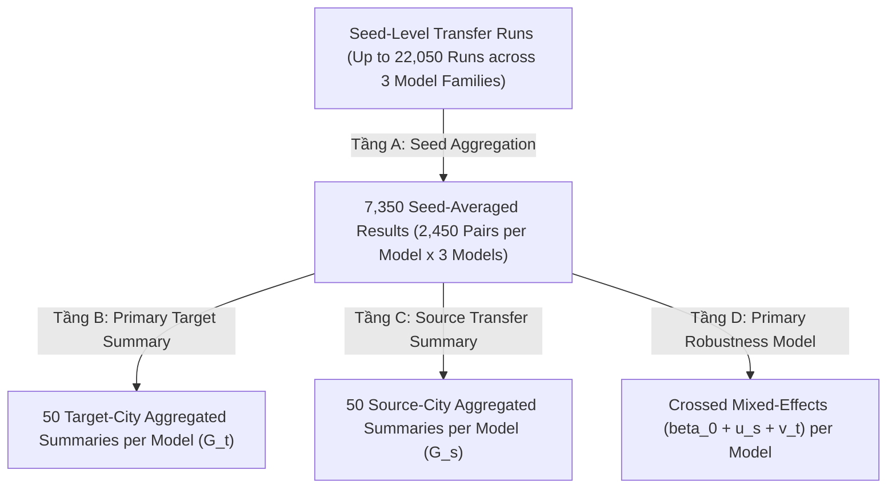

# Research Protocol: Distance-Binned Distribution (DBD) Calibration for Zero-Shot OD Flow Prediction

> **Protocol Freeze Rule:**  
> After the revised scientific design is accepted, implementation agents must not introduce new training fractions, bin resolutions, error levels, model variants, calibration rules, controls, thresholds, preprocessing choices, or statistical procedures. Undefined cases must raise a specification issue rather than being resolved autonomously.

---

## 1. Nghiên cứu & Mục tiêu (Core Framework)

### 1.1. Core Scientific Motivation
Detailed pair-level Origin-Destination (OD) flow data are often difficult or expensive to obtain at sufficient coverage, whereas aggregate mobility summaries such as distance distributions may be obtainable from aggregated mobile-device, location-intelligence, or other privacy-preserving mobility sources.

Nghiên cứu này không định vị câu hỏi đơn giản là *"Does target DBD improve zero-shot prediction?"*, mà định vị câu hỏi trung tâm:
> **Can lightweight aggregate target-city mobility information compensate for limited pair-level OD supervision in cross-city OD flow prediction?**

#### Cấu trúc thông tin (Information Asymmetry):
- **Source side:** Có một lượng **pair-level OD supervision hạn chế** ($T_{s,ij}$) dùng để train mô hình nguồn. Trong thiết lập chính (main setting), tỷ lệ $30\%$ positive source OD pairs ($f_{\text{train}} = 0.30$) được dùng như một môi trường khan hiếm giám sát được kiểm soát (*controlled data-scarcity setting*).
- **Target side:** Target city hoàn toàn:
  - không dùng pair-level target OD flows để huấn luyện;
  - không fine-tune mô hình;
  - không dùng target total flow ($\sum_{(i,j) \in \Omega_t^+} T_{t,ij}$);
  - chỉ cung cấp vector phân phối cự ly tổng hợp chuẩn hóa (normalized aggregate distance-binned distribution DBD, $p \in \Delta^{K-1}$) cho calibrator.
- **Bản chất dữ liệu thực nghiệm:** Do dữ liệu thực nghiệm hiện tại trích xuất target DBD từ true OD data, nghiên cứu định vị đây là:
  > **oracle aggregate target DBD used as a controlled proxy for aggregate mobility information that could originate from an independent mobility data source in practice.**  
  Tuyệt đối không tuyên bố rằng nghiên cứu hiện tại đã sử dụng mobile-phone hay social-media data thực địa khi chưa nạp nguồn dữ liệu độc lập này.

### 1.2. Research Questions (RQs)
Nghiên cứu giải quyết chính xác ba câu hỏi nghiên cứu:

- **RQ1 — Added Value under Limited OD Supervision:**
  > *Under limited source OD supervision, can aggregate target-city distance-binned mobility information improve zero-shot OD flow-intensity reconstruction without using target pair-level OD observations for model training?*  
  $$\text{limited source OD} + \text{target DBD} \longrightarrow \text{improved zero-shot OD intensity?}$$

- **RQ2 — Dependence on OD Data Scarcity:**
  > *How does the benefit of target DBD calibration change as the amount of available pair-level source OD supervision varies?*  
  Khảo sát hàm biến thiên $\Delta \text{CPC}(f)$ theo tỷ lệ giám sát nguồn $f \in \{0.10, 0.20, 0.30, 0.50, 1.00\}$. Đây là một giả thuyết khoa học mở cần kiểm chứng thực nghiệm, tuyệt đối không tiên nghiệm giả định monotonicity.

- **RQ3 — Target Information Requirements and Specificity:**
  > *How does DBD calibration benefit depend on the resolution, measurement error, and target-specific structural alignment of the aggregate mobility information?*  
  Khảo sát tương tác giữa độ phân giải bin ($K$), sai số đo lường thực tế ($\text{TV}$ error), và phân định giữa thông tin cấu trúc cự ly đặc thù đích với can thiệp donor kiểm chứng liều tương đương nhưng lệch cấu trúc.

### 1.3. Scientific Contributions
1. **Limited-supervision zero-shot setting:** Thiết lập một khung chuyển giao liên đô thị có kiểm soát (controlled cross-city transfer framework), trong đó baseline models chỉ được huấn luyện từ một phần quan sát OD của thành phố nguồn (source OD supervision scarcity).
2. **Aggregate target information as calibration signal:** Đánh giá target DBD như một tín hiệu tổng hợp số chiều thấp từ thành phố đích (low-dimensional aggregate target-side signal) có khả năng hiệu chuẩn hậu nghiệm dự báo zero-shot của mô hình đã đóng băng (frozen base models) mà không cần retrain hay fine-tune mô hình.
3. **Characterizing when DBD is useful:** Định lượng và làm rõ các điều kiện biên hiệu quả của DBD theo:
   - mức độ giám sát OD nguồn ($f \in \{0.10, 0.20, 0.30, 0.50, 1.00\}$);
   - độ phân giải cự ly ($K$);
   - sai số quan sát tổng hợp ($\epsilon$);
   - tính đặc thù cấu trúc đích so với can thiệp kiểm chứng donor tương đương liều can thiệp.

> *Lưu ý về vị trí mô hình:* Ba họ mô hình căn bản (`gravity_2param`, `pairwise_mlp`, `urban_gnn`) không phải là đóng góp chính của nghiên cứu. Chúng đóng vai trò đại diện cho ba cơ chế mô hình hóa khác nhau (vật lý tham số, hồi quy nơ-ron từng cặp, và mạng đồ thị truyền tin không gian kèm prior vật lý) nhằm kiểm tra tính tổng quát của hiệu ứng hiệu chuẩn DBD.

### 1.4. Quy tắc Không tạo Thử nghiệm Full-Factorial (Non-Full-Factorial Invariant)
> **Strict Factorial Isolation Invariant:**  
> The study does not execute the full factorial product of training fraction $\times$ bin resolution $\times$ observation error.  
> Tuyệt đối không chạy lưới tích $\{0.10, 0.20, 0.30, 0.50, 1.00\} \times \{2, 4, 8, 12, 20\} \times \{\epsilon\}$. Mỗi thực nghiệm cô lập duy nhất một nhân tố khoa học mục tiêu:
> - **Experiment A (Main Added Value):** $f = 30\%$, $K = 8$, $\epsilon = 0$;
> - **Experiment B (OD Scarcity Sensitivity):** $f \in \{0.10, 0.20, 0.30, 0.50, 1.00\}$, $K = 8$, $\epsilon = 0$;
> - **Experiment C (Information Quality Sensitivity):** $f = 30\%$, $K \in \{2, 4, 8, 12, 20\} \times \epsilon \in \{0, 0.01, 0.02, 0.04, 0.06, 0.08, 0.10\}$;
> - **Experiment D (Target Structural Specificity Control):** $f = 30\%$, $K = 8$, $\epsilon = 0$.

### 1.5. Giới hạn Diễn giải Khoa học (Interpretation Boundaries)
#### Tuyệt đối không tuyên bố (Prohibited Claims):
- DBD giải quyết bài toán tái tạo ma trận OD toàn diện (DBD solves full OD matrix reconstruction).
- DBD dự báo tập hỗ trợ zero / non-zero của ma trận OD.
- DBD thay thế hoàn toàn dữ liệu OD của thành phố đích.
- DBD đã được chứng minh trích xuất thành công từ điện thoại di động / mạng xã hội trong khuôn khổ thực nghiệm hiện tại.
- Hiệu chuẩn DBD luôn luôn cải thiện mọi cặp chuyển giao trong mọi trường hợp.
- Lợi ích của DBD nhất thiết phải tăng đơn điệu khi độ giám sát nguồn suy giảm.
- Chênh lệch hiệu năng giữa Urban-GNN và Pairwise MLP thuần túy do cơ chế truyền thông điệp (message passing).

#### Có thể tuyên bố nếu kết quả thực nghiệm ủng hộ (Permissible Claims):
- DBD cung cấp nguồn thông tin tổng hợp hữu ích bổ sung từ phía thành phố đích.
- DBD cải thiện việc tái tạo cường độ lưu lượng OD có điều kiện (conditional OD intensity reconstruction) dưới điều kiện giám sát nguồn hạn chế.
- Thông tin di chuyển tổng hợp của thành phố đích có thể bù đắp một phần khoảng trống hiệu năng sinh ra do khan hiếm dữ liệu giám sát OD nguồn.
- Lợi ích của hiệu chuẩn DBD phụ thuộc vào chất lượng thông tin (độ phân giải, sai số quan sát) và tính khớp cấu trúc đích.
- Hiệu ứng hiệu chuẩn có tính tổng quát trên các họ mô hình có cơ chế hoạt động dị biệt.

### 1.6. Sơ đồ Khái niệm Nghiên cứu (Main Conceptual Diagram)
```text
Limited Source Pair-Level OD (f in {0.10, 0.20, 0.30, 0.50, 1.00})
                    ↓
            Train Base Model
 (gravity_2param / pairwise_mlp / urban_gnn)
                    ↓
               Freeze Model
                    ↓
             Unseen Target City
                    ↓
        Raw Zero-Shot OD Prediction
                    ↓
           Aggregate Target DBD  <--  Low-dimensional aggregate mobility information
                    ↓                 (no target pair-level OD labels exposed to calibrator)
          Post-hoc Calibration
 (Support-Conditioned Exact-Volume-Preserving)
                    ↓
        Calibrated OD Intensities
```

---

## 2. Thiết lập thực nghiệm (Experimental Setting)

### 2.1. Không gian Dữ liệu & Tập Hỗ trợ Độc quyền (Positive Interzonal OD Support)

Từ thời điểm này, toàn bộ pipeline từ huấn luyện nguồn, đánh giá held-out, zero-shot transfer, xây dựng phân phối DBD, hiệu chuẩn hậu nghiệm, kiểm tra bảo toàn lưu lượng và tính toán toàn bộ các metric bắt buộc phải sử dụng **duy nhất một tập hỗ trợ cố định cho mỗi thành phố**:
$$\Omega_t^+ = \{(i,j) \in \Omega_t \mid i \neq j, \; D_{t,ij} > 0, \; T_{t,ij} \ge 1\}$$
Đây là thiết lập **Fixed Positive Interzonal OD Support / Oracle-Support Intensity Reconstruction Setting**.

#### 1. Quy tắc Tạo và Đóng băng Support (Freeze Invariant):
Với mỗi thành phố đích $t$, tập hỗ trợ $\Omega_t^+$ được xác định đúng một lần từ dữ liệu quan sát thực nghiệm:
```python
positive_support_t = (
    (origin != destination)
    & (distance_km > 0)
    & (true_flow >= 1)
)
```
Sau khi tạo, tập chỉ số $\Omega_t^+$ được **đóng băng (freeze)** và tái sử dụng bất biến xuyên suốt toàn bộ pipeline. Tuyệt đối không tạo lại support dựa trên giá trị dự báo ($\hat{T} > 0$ hay threshold dự báo).

#### 2. Phạm vi Bài toán Khoa học (Problem Scope):
Nghiên cứu này định vị rõ ràng:
- **Bài toán:** Đánh giá khả năng tái tạo cường độ lưu lượng OD (OD flow intensity reconstruction) có điều kiện trên tập hỗ trợ dương quan sát được $\Omega_t^+$.
- **Phạm vi ngoài lề:** Việc phân loại/dự báo ma trận thưa (zero vs. non-zero support classification) nằm ngoài phạm vi nghiên cứu (outside the scope of this study).

#### 3. Quy tắc Ràng buộc Toàn diện trên $\Omega_t^+$:
- **Baseline Prediction:** Dự báo zero-shot từ mô hình nguồn $\hat{T}^{(0)}$ lập tức được lọc hạn chế về đúng tập $\Omega_t^+$ trước bất kỳ phép tính nào: `eval_df = target_df.loc[positive_support_t].copy()`.
- **Target DBD ($p_{s,t}$):** Chỉ tính trên các cặp OD thuộc $\Omega_t^+$:
  $$p_{s,t,b} = \frac{\sum_{(i,j) \in \Omega_t^+, d_{ij} \in B_b^{(s,K)}} T_{t,ij}}{\sum_{(i,j) \in \Omega_t^+} T_{t,ij}}$$
  Tuyệt đối không đưa vào cặp zero-flow hay các cặp ngoài $\Omega_t^+$.
- **Predicted DBD ($q_{s,t}$):** Sử dụng **chính xác cùng tập OD** $\Omega_t^+$ và cùng hệ bin cự ly nguồn:
  $$q_{s,t,b} = \frac{\sum_{(i,j) \in \Omega_t^+, d_{ij} \in B_b^{(s,K)}} \hat{T}^{(0)}_{s,t,ij}}{\sum_{(i,j) \in \Omega_t^+} \hat{T}^{(0)}_{s,t,ij}}$$
- **Calibration & Volume Preservation:** Chỉ áp dụng hiệu chuẩn trên các cặp thuộc $\Omega_t^+$, và kiểm tra bảo toàn lưu lượng độc quyền trên $\Omega_t^+$:
  $$\left|\sum_{(i,j) \in \Omega_t^+} \hat{T}^{(1)}_{s,t,ij} - \sum_{(i,j) \in \Omega_t^+} \hat{T}^{(0)}_{s,t,ij}\right| < 10^{-10}$$
- **Evaluation Metrics:** Toàn bộ các chỉ số trước và sau hiệu chuẩn ($\text{CPC}, \text{CPC}_{\text{norm}}, \text{MAE}, \text{MSE}, \text{RMSE}, \Delta \text{CPC}, \Delta \text{MAE}, \Delta \text{MSE}$) được tính toán độc quyền trên $\Omega_t^+$.

#### 4. Nghiêm cấm Tự ý Thay đổi Support:
Tuyệt đối không chuyển sang: all possible OD pairs, intrazonal pairs, cặp $T_{ij}=0$, cặp dự báo $>0$, ngưỡng theo flow dự báo, source support, hay phép giao/hợp support.

#### 5. Sanity Checks Bắt buộc cho Mỗi Thành phố Đích:
```python
assert np.all(eval_df["origin"] != eval_df["destination"])
assert np.all(eval_df["distance_km"] > 0)
assert np.all(eval_df["true_flow"] >= 1)
assert abs(p.sum() - 1.0) < 1e-12
assert abs(q.sum() - 1.0) < 1e-12
assert len(y_true) == len(y_pred_before) == len(y_pred_after)
```

#### 6. Định nghĩa và Quy tắc Độc quyền cho Chỉ số Chẩn đoán $R_{\text{vol}}$ (Evaluation-Only Diagnostic):
Trong toàn bộ nghiên cứu:
$$R_{\text{vol}} = \frac{\sum_{(i,j) \in \Omega_t^+} \hat{T}^{(0)}_{s,t,ij}}{\sum_{(i,j) \in \Omega_t^+} T_{t,ij}}$$
Trong đó:
- Tử số = tổng lưu lượng baseline dự báo trên tập hỗ trợ dương interzonal $\Omega_t^+$;
- Mẫu số = tổng lưu lượng thực tế của thành phố đích trên chính cùng tập $\Omega_t^+$.

**Các nguyên tắc bất biến nghiêm ngặt:**
1. **Chỉ dùng cho đánh giá (Evaluation-Only Diagnostic):** Tuyệt đối không dùng $R_{\text{vol}}$ hoặc mẫu số $\sum T_{t,ij}$ để huấn luyện mô hình, điều chỉnh siêu tham số, chuẩn hóa/rescale dự báo baseline ($\hat{T} \cdot \sum T / \sum \hat{T}$), hiệu chuẩn DBD, chọn checkpoint, chọn source model, chọn donor, hay điều chỉnh $(G, \alpha)$.
2. **Không volume-normalize baseline bằng target truth:** Mọi metric baseline được tính trực tiếp trên raw zero-shot predictions $\hat{T}^{(0)}$ (hoặc sau softplus), tuyệt đối không chia theo target total flow vì điều đó sẽ phá vỡ điều kiện zero-shot.
3. **DBD Calibration không được truy cập mẫu số của $R_{\text{vol}}$:** Bộ hiệu chuẩn DBD chỉ nhận vector phân phối chuẩn hóa $p_b = \sum_{B_b} T / \sum T$ (tổng bằng 1.0) và hoàn toàn không nhận tổng lưu lượng $\sum T_{t,ij}$ dưới bất kỳ hình thức nào.
4. **Bảo toàn Lưu lượng Tuyệt đối:** Vì quá trình hiệu chuẩn DBD là bảo toàn lưu lượng chính xác ($\sum \hat{T}^{(1)} = \sum \hat{T}^{(0)}$), nên bắt buộc:
   $$R_{\text{vol}}^{\text{after}} = \frac{\sum \hat{T}^{(1)}}{\sum T} = R_{\text{vol}}^{\text{before}}$$
   (sai số chấp nhận $|R_{\text{vol}}^{\text{before}} - R_{\text{vol}}^{\text{after}}| < 10^{-10}$ đóng vai trò là sanity check bắt buộc).
5. **Sanity Check Bắt buộc trong Code:**
   ```python
   r_before = pred_before.sum() / true_flow.sum()
   r_after = pred_after.sum() / true_flow.sum()
   assert abs(r_before - r_after) < 1e-10
   ```
6. **Đặt tên chuẩn hóa:** Giữ tên cột `R_vol` hoặc `volume_ratio_pred_to_true` thống nhất toàn dự án.
7. **Mô tả Phương pháp luận chuẩn cho Bài báo (Paper Wording):**
   > *“We additionally report the predicted-to-observed total-volume ratio $R_{\mathrm{vol}} = \sum \hat{T} / \sum T$ as an evaluation-only diagnostic. This quantity is never used for model fitting or DBD calibration.”*

#### 7. Tách biệt Nghiêm ngặt Giao diện Calibrator và Evaluator (Calibration vs. Evaluation Contract):
Để ngăn chặn hoàn toàn rò rỉ thông tin (data leakage) từ ground truth đích:
1. **Calibration Input Contract:**
   Bộ hiệu chuẩn chỉ nhận các mảng tối thiểu:
   ```python
   pred_after = calibrate_dbd(
       pred_flow=pred_before,
       distance_km=distance_km,
       bin_edges=source_bin_edges,
       target_dbd_p=target_dbd_p,
   )
   ```
   Tuyệt đối **không truyền**: `true_flow`, `true_total_flow`, `CPC`, `MAE`, `MSE`, `R_vol` hoặc toàn bộ DataFrame chứa `true_flow` vào calibrator.
2. **`target_dbd_p` là Đầu vào Duy nhất từ Phía Dữ liệu Đích:**
   Thông tin duy nhất từ target ground truth được đưa vào calibration là vector phân phối chuẩn hóa:
   $$p = (p_1, \ldots, p_K), \quad \sum_{b=1}^K p_b = 1.0$$
   Calibration module hoàn toàn không biết các giá trị $T_{ij}$ riêng lẻ hay tổng volume $\sum T_{ij}$.
3. **Mô-đun Tạo Target DBD Độc lập:**
   ```python
   target_dbd_p = build_target_dbd(
       true_flow=true_flow,
       distance_km=distance_km,
       bin_edges=source_bin_edges,
   )
   ```
   Sau khi hàm trả về vector $p$, dữ liệu ground truth $T_{ij}$ lập tức bị loại bỏ khỏi luồng tính của calibrator.
4. **Evaluator Contract:**
   Chỉ sau khi calibration hoàn thành và trả về `pred_after`, evaluation module mới được kích hoạt:
   ```python
   metrics = evaluate_calibration_transfer(
       true_flow=true_flow,
       pred_before=pred_before,
       pred_after=pred_after,
   )
   ```
   Evaluator tính toán độc quyền các chỉ số đánh giá ($\text{CPC}, \text{CPC}_{\text{norm}}, \text{MAE}, \text{MSE}, \text{RMSE}, R_{\text{vol}}$) và các chỉ số cải thiện ($\Delta$).
5. **Cấm Dùng Metric Điều khiển Calibration:**
   Tuyệt đối không thử nhiều biến thể calibration, không tính CPC để chọn variant tốt nhất, không tune epsilon/smoothing dựa trên target metrics.
6. **Mô tả Phương pháp luận chuẩn cho Bài báo (Paper Wording):**
   > *“The post-hoc calibrator receives only the baseline OD predictions, source-defined physical-distance bins, and the normalized target distance-binned distribution. Pair-level target OD flows and target total volume are withheld from the calibration operator and are accessed only by the evaluation stage. Thus, target information enters calibration only through the normalized distance-distribution vector, while absolute target flow volume remains unavailable.”*

#### 8. Mô tả Phương pháp luận chuẩn cho Bài báo về Positive Support (Method Wording):
> *“All zero-shot evaluation and post-hoc DBD calibration are conducted on a fixed positive interzonal OD support, defined as OD pairs with $i \neq j$, positive distance, and observed flow $T_{ij} \ge 1$. The same target-city support is used for baseline evaluation, DBD construction, calibration, and post-calibration evaluation. Accordingly, the experiment evaluates OD flow intensity reconstruction conditional on the observed positive OD support; predicting the zero/non-zero OD support itself is outside the scope of this study.”*

### 2.2. Phân chia Cố định trên Positive OD Support & Hợp Đồng Nested Split (Fixed Split & Nested Split Contract)

Từ thời điểm này, việc phân chia dữ liệu của thành phố nguồn bắt buộc phải tuân thủ đúng quy trình nghiêm ngặt dưới đây. Tuyệt đối không thêm stratification, balancing, resampling, retry hay bất kỳ heuristic nào khác.

#### 1. Tập Dữ liệu Được phép Phân chia:
Với mỗi thành phố nguồn $s$, trước tiên xác định tập positive interzonal OD support:
$$\Omega_s^+ = \{(i,j) \in \Omega_s \mid i \neq j, \; D_{s,ij} > 0, \; T_{s,ij} \ge 1\}$$
Chỉ các cặp OD thuộc $\Omega_s^+$ mới được đưa vào bước phân chia. Tuyệt đối không phân chia trên full matrix, zero-flow pairs hay bất kỳ support nào khác.

#### 2. Hợp Đồng Phân Chia Lồng Nhau Nghiêm Ngặt (Strict Nested Split Contract for $f \in \{0.10, 0.20, 0.30, 0.50, 1.00\}$):
Với mỗi thành phố nguồn $s$:
1. Lấy positive support $\Omega_s^+$, độ lớn $N_s = |\Omega_s^+|$.
2. **Deterministic sort** theo `(origin, destination)`.
3. Sinh đúng một hoán vị duy nhất bằng hạt giống cố định `split_seed = 42`: $\pi_s = \text{Permutation}(\Omega_s^+)$.
4. Định nghĩa các tập huấn luyện:
   $$\text{Train}_{10}(s) = \pi_s[:\lfloor 0.10 N_s \rfloor]$$
   $$\text{Train}_{20}(s) = \pi_s[:\lfloor 0.20 N_s \rfloor]$$
   $$\text{Train}_{30}(s) = \pi_s[:\lfloor 0.30 N_s \rfloor]$$
   $$\text{Train}_{50}(s) = \pi_s[:\lfloor 0.50 N_s \rfloor]$$
   $$\text{Train}_{100}(s) = \pi_s[:N_s]$$
5. **Ràng buộc bất biến lồng nhau (Nesting Invariant):**
   $$\boxed{\text{Train}_{10}(s) \subset \text{Train}_{20}(s) \subset \text{Train}_{30}(s) \subset \text{Train}_{50}(s) \subset \text{Train}_{100}(s)}$$
   - Tập $\text{Train}_{30}(s)$ chính xác là tập huấn luyện 30% dùng trong main Experiment A, Experiment C, và Experiment D.
   - Tập 70% held-out cho within-source evaluation tại main setting ($f = 0.30$) được định nghĩa là $\Omega_s^+ \setminus \text{Train}_{30}(s)$.
   - Tuyệt đối **không** tạo hoán vị ngẫu nhiên khác cho mỗi fraction, không resample, không stratify, không retry, không chọn subset dựa trên model performance.

#### 3. Nghiêm cấm Phân tầng & Bao phủ Nhân tạo (No Stratification & No Artificial Coverage):
- **Không stratification:** Tuyệt đối không phân tầng hoặc cân bằng split theo khoảng cách, độ lớn lưu lượng, origin, destination, tract, dân số, vùng địa lý, distance bin, flow quantile hay node degree.
- **Không coverage nhân tạo:** Không ép mỗi origin/destination phải xuất hiện trong train, không ép mỗi distance bin phải có đủ cặp train. Nếu phép chia ngẫu nhiên đồng nhất tạo ra việc một tract hay một nhóm cự ly có ít/không có dữ liệu train, **chấp nhận giữ nguyên kết quả đó**, tuyệt đối không resample để sửa đổi.
- **Không retry chọn split thuận lợi:** Không sinh nhiều split rồi chọn split có CPC cao nhất hoặc mô hình hội tụ tốt nhất. Split seed 42 được tạo một lần và chấp nhận nguyên trạng.

#### 4. Quy trình Thực thi Chuẩn mực (Deterministic Implementation):
Để đảm bảo kết quả không phụ thuộc vào thứ tự hàng ban đầu trong các tệp CSV, các cặp OD trong $\Omega_s^+$ bắt buộc phải được sắp xếp theo thứ tự xác định trước khi thực hiện hoán vị:
```python
def create_nested_source_splits(df, source_city):
    support = df[
        (df["origin"] != df["destination"])
        & (df["distance_km"] > 0)
        & (df["flow"] >= 1)
    ].copy()

    # Sắp xếp xác định theo (origin, destination)
    support = support.sort_values(["origin", "destination"]).reset_index(drop=True)

    rng = np.random.default_rng(42)
    perm = rng.permutation(len(support))

    n_total = len(support)
    n_train_10 = int(np.floor(0.10 * n_total))
    n_train_20 = int(np.floor(0.20 * n_total))
    n_train_30 = int(np.floor(0.30 * n_total))
    n_train_50 = int(np.floor(0.50 * n_total))

    idx_10 = perm[:n_train_10]
    idx_20 = perm[:n_train_20]
    idx_30 = perm[:n_train_30]
    idx_50 = perm[:n_train_50]
    idx_100 = perm[:n_total]

    support["in_train_10"] = False
    support["in_train_20"] = False
    support["in_train_30"] = False
    support["in_train_50"] = False
    support["in_train_100"] = True

    support.loc[idx_10, "in_train_10"] = True
    support.loc[idx_20, "in_train_20"] = True
    support.loc[idx_30, "in_train_30"] = True
    support.loc[idx_50, "in_train_50"] = True

    # Sanity checks set inclusion
    s10 = set(idx_10)
    s20 = set(idx_20)
    s30 = set(idx_30)
    s50 = set(idx_50)
    s100 = set(idx_100)
    assert s10 <= s20 <= s30 <= s50 <= s100, "Nested split set inclusion invariant violated!"

    # Main split compatibility: split column for 30/70
    support["split"] = "heldout"
    support.loc[idx_30, "split"] = "train"
    support["split_seed"] = 42
    return support
```

#### 5. Manifest là Source of Truth Duy Nhất:
Toàn bộ kết quả phân chia được lưu trữ cố định tại `manifests/od_split_manifest.csv`:
- `source_city, origin, destination, split, in_train_10, in_train_20, in_train_30, in_train_50, in_train_100, split_seed`
trong đó `split` tương thích ngược cho main 30/70 split (`split == "train"` tương đương `in_train_30 == True`).
- **Source of truth:** Các script huấn luyện không được tự phân chia lại ngẫu nhiên trong code. Mọi quy trình bắt buộc phải load manifest và lọc đúng tập training fraction tương ứng.
- **Nhất quán mô hình:** Cùng một source city $s$ và cùng một fraction $f$, cả ba họ mô hình (`gravity_2param`, `pairwise_mlp`, `urban_gnn`) dùng chung 100% cùng tập train.
- **Độc lập với Model Seeds:** Ba model seeds $\{1, 10, 100\}$ chỉ dùng cho khởi tạo trọng số ngẫu nhiên và tối ưu hóa; tuyệt đối không thay đổi split.

#### 6. Quy tắc Xử lý Lỗi (Failure Rules):
Nếu phát hiện vi phạm tính lồng nhau ($\text{Train}_{10} \not\subset \text{Train}_{30}$ hoặc $\text{Train}_{30} \not\subset \text{Train}_{100}$), trùng lặp khóa `(origin, destination)`, thiếu cặp OD so với $\Omega_s^+$, hoặc tỷ lệ split sai lệch: pipeline lập tức **RAISE ERROR**, không được tự sửa hay tiếp tục chạy ngầm.

#### 7. Mục đích & Giới hạn của Tập 70% Held-Out (Within-Source Evaluation Scope):
- **Chỉ tồn tại cho Main Setting ($f = 0.30$):** Tập 70% held-out source evaluation ($\Omega_s^+ \setminus \text{Train}_{30}(s)$) **chỉ tồn tại duy nhất cho cấu hình chính $f = 0.30$** (Experiments A, C, D).
- **Experiment B không tạo held-out split mới:** Đối với Experiment B tại các mức $f \in \{0.10, 0.20, 0.50, 1.00\}$, nghiên cứu **tuyệt đối không tạo within-source validation/evaluation split mới** (tại $f = 1.00$, 100% positive pairs đã dùng cho training, không còn cặp nào để tạo held-out split).
- **Tuyệt đối không dùng để chọn mô hình:** Tuyệt đối không dùng within-source metrics để chọn model, checkpoint, hyperparameter, training fraction, hay binning. Tập 70% held-out của main setting thuần túy phục vụ báo cáo chẩn đoán nội vùng (*within-city diagnostic reference*).

#### 8. Mô tả Phương pháp luận chuẩn cho Bài báo (Method Wording):
> *“For each source city, the positive interzonal OD support was partitioned using a deterministic nested split contract with a fixed seed of 42. Following a canonical sort by origin and destination tracts, a single random permutation was generated to define nested training fractions: $Train_{10} \subset Train_{20} \subset Train_{30} \subset Train_{50} \subset Train_{100}$. Sampling was uniform without replacement and was not stratified by distance, flow magnitude, origin, destination, or any other attribute. The main 30% subset serves as the controlled data-scarcity environment across all primary evaluations. The three training seeds affect only stochastic model initialization and optimization; they do not alter the underlying OD splits.”*

### 2.3. Ba Họ Mô Hình Căn Bản Độc Lập (Three Distinct OD Flow Baseline Families)

Nghiên cứu thiết lập và đánh giá chính xác **3 họ mô hình căn bản đại diện cho 3 cơ chế mô hình hóa khác nhau**:
1. **Two-Parameter Gravity Model (`gravity_2param`):** Mô hình vật lý suy giảm cự ly kinh điển với 2 tham số tự do;
2. **Pairwise MLP (`pairwise_mlp`):** Mô hình mạng nơ-ron học đặc trưng cặp OD trực tiếp (lấy cảm hứng từ DeepGravity nhưng thích ứng cho bài toán hồi quy lưu lượng trực tiếp khi không có target outflow);
3. **Urban-GNN (`urban_gnn`):** Mô hình mạng nơ-ron đồ thị không gian có cơ chế truyền tin (spatial message passing) kết hợp với thành phần gravity học đồng thời.

$$\boxed{\text{Ba họ mô hình độc lập về cơ chế; không ép buộc kiến trúc đồng nhất hay cân bằng tham số giả tạo}}$$

Đơn vị so sánh khoa học chung được kiểm soát chặt chẽ:
- Cùng thành phố nguồn $s$;
- Cùng tập training OD pairs trên positive support $\Omega_s^+$ theo active fraction $f$ (với main setting $f = 0.30$ cho Experiments A, C, D; và $f \in \{0.10, 0.20, 0.30, 0.50, 1.00\}$ cho Experiment B);
- Cùng tập 70% held-out source support đối với main setting ($f = 0.30$);
- Cùng positive support của thành phố đích $\Omega_t^+$;
- Cùng bộ hạt giống khởi tạo $\{1, 10, 100\}$ (với các mô hình có tính ngẫu nhiên);
- Cùng hệ thống chỉ số đánh giá và cùng pipeline DBD calibration.

---

#### 1. MODEL 1 — TWO-PARAMETER GRAVITY MODEL (`gravity_2param`)
- **Định nghĩa toán học:**
  $$\hat{T}_{ij} = \exp(G) \cdot P_i P_j \cdot D_{ij}^{-\alpha}$$
  trong đó $P_i, P_j$ là dân số gốc của origin/destination tract; $D_{ij} > 0$ là khoảng cách vật lý thực tế (km); $G$ là hệ số quy mô toàn cục; $\alpha$ là số mũ suy giảm cự ly.
- **Ranh giới cơ chế (Separation Rule):**
  - Chỉ có đúng $2$ tham số huấn luyện: $\theta_{\text{gravity}} = \{G, \alpha\}$.
  - Tuyệt đối **không** dùng mạng nơ-ron, không MLP, không đồ thị, không node embedding, không message passing.
  - Sử dụng khoảng cách vật lý gốc $D_{ij}$ (không dùng $\log(1+d)$, không z-score, không embedding).
- **Hợp đồng Dân số & Cự ly Thô (Raw Population & Distance Invariant):**
  - $P_i, P_j$ là raw origin/destination population theo đơn vị gốc của dataset. Tuyệt đối **không** dùng `log1p(population)`, `z-score`, `min-max` hay `target-normalized population` bên trong phương trình gravity.
  - Phân tách rõ ràng hai biểu diễn: `population_raw` (dùng độc quyền cho Gravity equation và explicit gravity prior) và `population_processed` (dùng làm node feature cho Pairwise MLP / GNN sau log1p và z-score).
  - Khoảng cách $D_{ij}$ là khoảng cách vật lý thật theo km (`distance_km_raw` > 0).
  - Kiểm tra tính hợp lệ trước training/prediction:
    ```python
    assert np.isfinite(P_origin).all()
    assert np.isfinite(P_destination).all()
    assert (P_origin >= 0).all()
    assert (P_destination >= 0).all()
    ```
  - Xử lý khuyết thiếu: Nếu population có missing value, áp dụng quy tắc gán trung vị nguồn $m_{s,\text{pop}} = \operatorname{median}(P_s)$ đã khóa, nhưng sau khi gán, giá trị đưa vào gravity vẫn giữ nguyên ở thang đo gốc raw population (không z-score).
- **Hợp đồng Ổn định Số học Bắt buộc (Numerical Stability Contract):**
  - **Khoảng cách dương nghiêm ngặt:** $D_{ij} = \text{distance\_km\_raw} > 0$ được bảo đảm bởi tập hỗ trợ dương liên vùng ($\Omega^+$). Kiểm tra: `assert (distance_km_raw > 0).all()`. Không tự ý cộng thêm $\epsilon$ vào khoảng cách.
  - **Dân số không âm & xử lý dân số bằng 0:** $P_i \ge 0, P_j \ge 0$. Nếu xuất hiện giá trị âm, lập tức **RAISE DATA ERROR** (không lấy trị tuyệt đối, không clip về 0). Nếu $P_i = 0$ hoặc $P_j = 0$, mô hình dự báo chính xác $\hat{T}_{ij} = 0$ một cách tất định, không gọi $\log(0)$ và không cộng thêm $\epsilon$ vào dân số.
  - **Tham số $\alpha$ dương nghiêm ngặt theo đúng Baseline Code (Strict Baseline-Matching Parameterization):** Nhằm bảo đảm tính suy giảm cự ly vật lý ($\alpha > 0$, lưu lượng không tăng theo khoảng cách) và giữ nguyên 100% cách tham số hóa của mã nguồn baseline (`GravityPrior` trong `src/models/gravity.py`):
    $$\alpha = \exp(\text{log\_alpha}) > 0$$
    với $\text{log\_alpha} \in \mathbb{R}$ là tham số học tự do (`self.log_alpha = nn.Parameter(torch.tensor(math.log(init_alpha), dtype=torch.float32))`). Khởi tạo baseline chuẩn xác: $G_0 = 0.0, \alpha_0 = 1.0 \implies \text{log\_alpha}_0 = 0.0$. Tuyệt đối không thay thế bằng Softplus hay hard-clip $\alpha$ sau optimizer.
  - **Tham số $G$ không ràng buộc (Unconstrained Global Scale):** $G \in \mathbb{R}$ đại diện cho log-scale toàn cục, không clamp.
  - **Tính toán trong Log-Space (Log-Space Computation):** Để triệt tiêu nguy cơ overflow/underflow, đối với các cặp có $P_i > 0$ và $P_j > 0$:
    $$\log \hat{T}_{ij} = G + \log P_i + \log P_j - \alpha \log D_{ij} \implies \hat{T}_{ij} = \exp(\log \hat{T}_{ij})$$
  - **Nghiêm cấm Arbitrary Prediction Clipping:** Tuyệt đối không tự ý áp đặt ngưỡng cắt cứng (như `np.clip(pred, 0, 1e6)`). Nếu $\log \hat{T}_{ij}$ vượt giới hạn biểu diễn dấu phẩy động ($> 88.0$), pipeline lập tức **RAISE NUMERICAL ERROR** và ghi log chẩn đoán $(s, \text{seed}, G, \alpha, \max \log \hat{T}, \min \log \hat{T})$.
  - **Kiểm tra tính hữu hạn của Dự báo & Gradient:**
    - Sau forward pass: `assert np.isfinite(predicted_flow).all()` và `assert (predicted_flow >= 0).all()`.
    - Sau mỗi epoch: `assert np.isfinite(loss)` và `assert all gradients are finite`. Nếu loss hoặc gradient bị NaN/Inf: lập tức **STOP RUN & RAISE ERROR**, không âm thầm bỏ qua optimizer step hay restart với seed khác.
    - Sau epoch 40: `assert np.isfinite(G_final)`, `assert np.isfinite(alpha_final)`, và `assert alpha_final > 0`.
  - **Cấu hình huấn luyện không ngoại lệ:** Dùng đúng optimizer `AdamW`, learning rate $\eta = 2 \times 10^{-3}$, 40 epochs, Log1p-MSE loss, tuyệt đối không chỉnh riêng hyperparameter cho Gravity.
  - **Lưu vết huấn luyện:** Ghi lại `gravity_training_trace.csv` chứa `(epoch, G, alpha, train_loss)` phục vụ kiểm toán hội tụ.
- **Mô tả Phương pháp luận chuẩn cho Bài báo (Paper Wording):**
  > *“The Two-Parameter Gravity model uses raw origin and destination population together with raw physical distance. Neural feature normalization is not applied inside the gravity equation. The gravity distance-decay parameter was parameterized as $\alpha = \exp(\log \alpha) > 0$ strictly matching the baseline implementation, while the global log-scale parameter remained unconstrained. Predictions were computed using a numerically stable log-space formulation.”*
- **Huấn luyện & Chuyển giao:**
  - Tối ưu hóa bằng Log1p-MSE trên tập training OD pairs tương ứng $\text{Train}_f(s)$ (trong đó $f = 0.30$ là main setting cho Experiments A, C, D; và $f \in \{0.10, 0.20, 0.30, 0.50, 1.00\}$ cho Experiment B):
    $$L = \frac{1}{|\text{Train}_f(s)|} \sum_{(i,j) \in \text{Train}_f(s)} \left[\log(1 + T_{ij}) - \log(1 + \hat{T}_{ij})\right]^2$$
  - Sau 40 epochs, bộ tham số $(G_s, \alpha_s)$ được đóng băng và lưu trữ vào `gravity_parameters.csv`.
  - Dự báo zero-shot sang target $t$: $\hat{T}_{s,t,ij} = \exp(G_s) P_{t,i} P_{t,j} D_{t,ij}^{-\alpha_s}$ (với $\hat{T}=0$ nếu $P_i P_j = 0$).

---

#### 2. MODEL 2 — PAIRWISE MLP (`pairwise_mlp`)
- **Mục tiêu & Cơ chế:**
  Hồi quy lưu lượng OD trực tiếp từ vector đặc trưng ghép nối:
  $$\hat{T}_{ij} = \operatorname{Softplus}\left(f_{\text{MLP}}\left([x_i \parallel x_j \parallel d'_{ij}]\right)\right) \ge 0$$
  Lấy cảm hứng từ DeepGravity nhưng được điều chỉnh để dự báo cường độ lưu lượng trực tiếp trong điều kiện zero-shot (do thành phố đích không có thông tin tổng lưu lượng phát sinh $O_i$). Tuyệt đối không dùng softmax theo origin và không dùng outflow constraint $\hat{T}_{ij} = O_i p_{ij}$.
- **Quy tắc Phân tách Tuyệt đối (Critical Separation Rule):**
  - Tuyệt đối **không chứa**: tham số $G$, $\alpha$, phương trình gravity hiển ngôn, gravity residual, gravity multiplicative prior, gravity initialization hay gravity regularization.
  - Tuyệt đối **không có** message passing, đồ thị, ma trận kề, hay neighborhood aggregation.
  - Mô hình học lưu lượng hoàn toàn từ dữ liệu nơ-ron thuần túy.
- **Kiến trúc & Fixed Feature Schema:**
  - **Danh sách Đặc trưng Node Cố định (Canonical Node Feature List):** Sử dụng danh sách có thứ tự cố định gồm đúng 26 đặc trưng được chuẩn hóa từ dataset gốc:
    - *Census (13 đặc trưng):* `total_population`, `median_age`, `median_income`, `per_capita_income`, `employment_rate`, `unemployment_rate`, `commute_transit_pct`, `commute_active_pct`, `commute_wfh_pct`, `zero_vehicle_pct`, `avg_vehicles_per_household`, `higher_education_pct`, `homeownership_rate`.
    - *POI (8 đặc trưng):* `office`, `office_density`, `industrial`, `industrial_density`, `commercial`, `commercial_density`, `education_primary`, `education_primary_density`.
    - *Road Network (5 đặc trưng):* `road_length_total`, `road_density`, `road_count`, `motorway_length`, `primary_length`.
  - **Origin và Destination Dùng Chung Schema:** $x_i \in \mathbb{R}^{26}$ và $x_j \in \mathbb{R}^{26}$ tuân thủ đúng cùng một thứ tự và phương pháp tiền xử lý source-fitted.
  - **Đặc trưng Cự ly Duy nhất:** Cự ly không nằm trong node feature list mà xuất hiện độc quyền dưới dạng một pairwise feature chuẩn hóa:
    $$d^{\text{std}}_{ij} = \frac{\log(1 + d_{\text{raw},ij}) - \mu_s^{\text{distance}}}{\sigma_s^{\text{distance}}}$$
  - **Kích thước Đầu vào Bắt buộc:** Đúng $2F + 1 = 2 \times 26 + 1 = 53$ chiều: $[x_i \parallel x_j \parallel d^{\text{std}}_{ij}]$. Kiểm tra kích thước nghiêm ngặt trước khi forward: `assert mlp_input.shape[-1] == 53`.
  - **Đóng băng trong Manifest:** Toàn bộ danh mục và thứ tự đặc trưng được khóa bất biến tại `manifests/model_feature_schema.json` kèm theo `feature_schema_hash`. Mọi checkpoint và quá trình suy luận zero-shot phải kiểm tra khớp hash.
  - **Nghiêm cấm Rò rỉ Dữ liệu & Biến thể Không Hợp lệ:**
    - Tuyệt đối **không** dùng features suy biến từ true target flow (không target outflow $O_i$, không inflow $I_j$, không rank, không volume).
    - Tuyệt đối **không** dùng features suy biến từ đồ thị GNN (không node degree GNN, không graph centrality, không message-passed embedding).
    - Tuyệt đối **không** dùng features suy biến từ mô hình gravity (không $P_i P_j$, không $d^{-\alpha}$, không $G, \alpha$ fitted).
    - Tuyệt đối **không** dùng danh tính thành phố (không city ID, không city embedding, không one-hot).
    - Tuyệt đối **không** feature selection theo kết quả (không chọn subset theo SHAP, không đổi features theo validation/target performance).
  - **Mạng dense nhiều tầng:** $\text{Dense}(53 \to 64) \to \text{LayerNorm} \to \text{ReLU} \to \text{Dropout}(0.1) \to \text{Dense}(64 \to 64) \to \text{LayerNorm} \to \text{ReLU} \to \text{Dropout}(0.1) \to \text{Dense}(64 \to 32) \to \text{ReLU} \to \text{Dropout}(0.1) \to \text{Dense}(32 \to 1) \to \text{Softplus}$.
- **Mô tả Phương pháp luận chuẩn cho Bài báo (Paper Wording):**
  > *“The Pairwise MLP receives a fixed ordered vector of source-standardized origin and destination node attributes together with a source-standardized log-distance feature. The feature schema is frozen before transfer and is identical across all cities. No graph-derived, gravity-derived, target-flow-derived, or city-identity features are provided.”*
- **Huấn luyện:** Huấn luyện trực tiếp bằng Log1p-MSE trên tập training OD support tương ứng $\text{Train}_f(s)$ ($f=0.30$ cho Experiments A, C, D; và $f \in \{0.10, 0.20, 0.30, 0.50, 1.00\}$ cho Experiment B) với 3 seeds $\{1, 10, 100\}$.

---

#### 3. MODEL 3 — URBAN-GNN (`urban_gnn`)
- **Mục tiêu & Cơ chế:**
  Mô hình nhận biết cấu trúc đồ thị không gian thông qua cơ chế truyền tin (spatial message passing) trên đồ thị địa lý đô thị $G^{\text{urban}}$ kết hợp với thành phần gravity học đồng thời và neural pairwise residual decoder:
  $$h_i = \text{GNN}_{\theta}(X, G^{\text{urban}})$$
  $$m_{ji} = W_{\text{msg}} [h_j \parallel \log(1 + d_{ji})]$$

- **Hợp đồng Khóa Bất biến Kiến trúc Urban-GNN (Exact Urban-GNN Encoder & Decoder Contract):**
  > **Chỉ thị Bắt buộc (Strict Invariant):**
  > Urban-GNN encoder và decoder BẮT BUỘC tái sử dụng chính xác 100% kiến trúc mã nguồn hiện hữu trong `src/models/node_encoder.py` (`UrbanGNN`, `GraphConvLayer`), `src/models/decoder.py` (`PairwiseODDecoder`) và `src/models/od_models.py` (`UrbanGNN`).
  > Agent TUYỆT ĐỐI KHÔNG được thiết kế lại, đơn giản hóa, thay thế hoặc diễn giải lại bất kỳ thành phần nào của Urban-GNN.
  > Nếu có bất kỳ sự sai khác nào giữa quy chuẩn thực nghiệm và mã nguồn: **RAISE SPECIFICATION ERROR NGAY LẬP TỨC**. Agent không có quyền tự chọn phương án nào được cho là hợp lý.

  **Chi tiết Kiến trúc Từng Tầng (Frozen Layer-by-Layer Specification):**
  1. **Spatial Graph Topology ($G^{\text{urban}}$):**
     - Đồ thị xây dựng trên toàn bộ $N$ tracts trong bảng node canonical của thành phố $c$ ($V_c$).
     - Ngưỡng cự ly: $r = 5.0\text{ km}$ dựa trên khoảng cách Haversine giữa các tâm centroid tract ($d^{\text{raw}}_{ij} \le 5.0\text{ km}$).
     - Hướng cạnh: **Đồ thị có hướng đối xứng (Bidirectional / Directed Graph)**. Nếu $d^{\text{raw}}_{uv} \le 5.0\text{ km}$ ($u \neq v$), đồ thị chứa cả hai cạnh $(u, v)$ và $(v, u)$ với $d_{uv} = d_{vu}$.
     - Self-loops: Danh sách cạnh không gian $E_{\text{graph}}$ của đồ thị bán kính bao gồm cạnh self-loop $(i,i)$ với cự ly $d_{ii} = 0.0$ cho mọi $i \in V_c$ (bảo đảm đỉnh cô lập vẫn có mặt trong đồ thị).
  2. **GNN Node Input Projection:**
     $$\text{Input: } x_i \in \mathbb{R}^{26} \implies h_i^{(0)} = \operatorname{Dropout}_{0.1}\left(\operatorname{ReLU}\left(\operatorname{LayerNorm}_{64}\left(W_{\text{in}} x_i + b_{\text{in}}\right)\right)\right) \in \mathbb{R}^{64}$$
     với $W_{\text{in}} \in \mathbb{R}^{64 \times 26}$.
  3. **Message-Passing Layers ($L = 2$ layers cố định):**
     Với mỗi layer $\ell \in \{0, 1\}$ (`GraphConvLayer(64, 64)`):
     - **Audit Đối chiếu Mã nguồn về Self-Loop & $W_{\text{self}}$:**
       > *Mã nguồn baseline (`src/data/urban_graph.py` và `src/models/node_encoder.py`) hiện tại đưa cả cạnh self-loop $(i,i)$ vào đồ thị $G^{\text{urban}}$ (qua `include_self_loop=True`) đồng thời lớp `GraphConvLayer` cũng áp dụng phép biến đổi $W_{\text{self}} h_i$.*
       > **Quy chuẩn bất biến:** Pipeline BẮT BUỘC giữ nguyên 100% cơ chế kép này đúng theo implementation hiện hữu. Agent TUYỆT ĐỐI KHÔNG được tự ý gỡ bỏ self-loop khỏi đồ thị, không gỡ bỏ $W_{\text{self}}$, không sửa aggregation operator, và không cố gắng "tinh gọn" vì cho rằng thông tin đỉnh bị tính hai lần.
     - **Message Function:** Với mỗi cạnh $(j \to i)$ có cự ly $d_{ji}$ km:
       $$m_{ji}^{(\ell)} = W_{\text{msg}}^{(\ell)} \left[ h_j^{(\ell)} \parallel \log(1 + d_{ji}) \right] + b_{\text{msg}}^{(\ell)} \in \mathbb{R}^{64}$$
       với $W_{\text{msg}}^{(\ell)} \in \mathbb{R}^{64 \times (64 + 1)}$ và $b_{\text{msg}}^{(\ell)} \in \mathbb{R}^{64}$.
     - **Aggregation Operator:** **Scatter Mean**. Tổng message được chia cho in-degree (clamp tối thiểu bằng 1.0):
       $$\text{Agg}_i^{(\ell)} = \frac{\sum_{j \in \mathcal{N}(i)} m_{ji}^{(\ell)}}{\max\left(1, \; |\mathcal{N}(i)|\right)}$$
     - **Node-Update & Self-Feature Combination:**
       $$h_i^{(\text{agg}, \ell)} = \operatorname{LayerNorm}_{64}\left(\operatorname{ReLU}\left(\text{Agg}_i^{(\ell)} + W_{\text{self}}^{(\ell)} h_i^{(\ell)} + b_{\text{self}}^{(\ell)}\right)\right)$$
       với $W_{\text{self}}^{(\ell)} \in \mathbb{R}^{64 \times 64}$.
     - **Residual Skip Connection & Dropout:**
       $$h_i^{(\ell+1)} = h_i^{(\ell)} + \operatorname{Dropout}_{0.1}\left(h_i^{(\text{agg}, \ell)}\right)$$
  4. **Node Output Projection:**
     $$h_i = W_{\text{out}} h_i^{(2)} + b_{\text{out}} \in \mathbb{R}^{64}$$
     với $W_{\text{out}} \in \mathbb{R}^{64 \times 64}$.
  5. **Joint Classical Gravity Prior Component:**
     - Trainable parameters: $G \in \mathbb{R}$ và $\alpha = \exp(\text{log\_alpha}) > 0$.
     - Baseline clamping bảo đảm hữu hạn tuyệt đối:
       $$\log T_{ij}^{\text{grav}} = G + \log(\max(P_i, 1.0)) + \log(\max(P_j, 1.0)) - \alpha \log(\max(D_{ij}, 0.1))$$
  6. **Neural Residual Pairwise OD Decoder:**
     - Vector ghép nối đầu vào edge: $e_{ij} = [h_i \parallel h_j \parallel \log(1 + D_{ij}) \parallel \log T_{ij}^{\text{grav}}] \in \mathbb{R}^{130}$ ($2 \times 64 + 2 = 130$).
     - Cấu trúc mạng:
       $$\operatorname{Linear}(130 \to 64) \to \operatorname{LayerNorm}(64) \to \operatorname{ReLU}() \to \operatorname{Dropout}(0.1) \to \operatorname{Linear}(64 \to 32) \to \operatorname{ReLU}() \to \operatorname{Dropout}(0.1) \to \operatorname{Linear}(32 \to 1)$$
     - Trọng số và bias của lớp `Linear(32 -> 1)` cuối cùng bắt buộc khởi tạo bằng 0 (`nn.init.zeros_`), bảo đảm $\text{residual}_{ij} \approx 0$ tại bước khởi tạo.
     - Hàm kết hợp và hàm kích hoạt đầu ra:
       $$\hat{T}_{ij} = \operatorname{Softplus}\left(\log T_{ij}^{\text{grav}} + \text{residual}_{ij}\right) + 10^{-4}$$
  7. **Khóa Bất biến Huấn luyện & Chuyển giao:**
     - Toàn bộ tham số $(W_{\text{in}}, W_{\text{msg}}, W_{\text{self}}, W_{\text{out}}, W_{\text{dec}}, G, \text{log\_alpha})$ được tối ưu hóa đồng thời bằng Log1p-MSE qua 40 epochs với `AdamW`, learning rate $\eta = 2 \times 10^{-3}$, weight decay $10^{-4}$, gradient clipping $5.0$.
     - Dự báo zero-shot sang target city $t$ tái sử dụng nguyên vẹn forward function và các trọng số đã freeze từ epoch 40.

- **Quy tắc Bất biến Xây dựng Đồ thị Không gian (Spatial Graph Construction Contract):**
  - **Tập đỉnh hoàn chỉnh (Full Tract Node Set $V_c$):** Đồ thị không gian của mỗi thành phố $c$ bắt buộc phải được xây dựng từ **toàn bộ tập tract nodes** có trong bảng node canonical:
    $$V_c = \{\text{all tracts in canonical node table of city } c\}$$
    Tuyệt đối **không** dùng tập đỉnh rút gọn chỉ gồm các tract xuất hiện trong training OD pairs. Tract không xuất hiện trong training subset vẫn phải tồn tại đầy đủ trong đồ thị.
  - **Độc lập hoàn toàn giữa Topology đồ thị và OD Split:**
    $$\begin{aligned}
    \text{Toàn bộ tract nodes } V_c & \longrightarrow \text{Dựng spatial graph } G^{\text{urban}} \longrightarrow \text{GNN Message Passing} \\
    \text{Active Training OD Pairs } \text{Train}_f(s) & \longrightarrow \text{Tính hàm mất mát giám sát (Supervised Loss) duy nhất}
    \end{aligned}$$
    Hai pipeline này tuyệt đối độc lập và không được trộn lẫn.
  - **Cạnh địa lý cự ly thực (Strict 5.0 km Radius Rule):**
    $$(i,j) \in E \iff d^{\text{raw}}_{ij} \le 5.0\text{ km} \quad (i \neq j)$$
    trong đó $d^{\text{raw}}_{ij}$ là khoảng cách Haversine giữa hai tâm tract (km). Tuyệt đối không dùng flow OD, không dùng nhãn huấn luyện, không dùng target DBD để tạo cạnh.
  - **Bắt buộc có Self-Loops:** Mọi đỉnh $i \in V_c$ phải có cạnh self-loop $(i,i) \in E$ với $d_{ii} = 0.0$.
  - **Xử lý đỉnh cô lập (Isolated Nodes):** Nếu một node không có láng giềng nào trong bán kính $5.0\text{ km}$, cạnh self-loop bảo đảm node tồn tại trong đồ thị. Tuyệt đối không tăng bán kính riêng, không tự động nối nearest neighbor ngoài $5.0\text{ km}$, và không drop node cô lập.
  - **Bán kính cố định không thích ứng (Fixed 5.0 km Radius):** Bán kính luôn giữ nguyên $5.0\text{ km}$ cho cả 50 thành phố, không co giãn theo kích thước hay mật độ thành phố.
  - **Xây dựng riêng cho từng thành phố:** $G_s = (V_s, E_s)$ và $G_t = (V_t, E_t)$ được xây dựng độc lập theo cùng quy tắc khách quan từ tọa độ địa lý ngoại sinh quan sát được. Không chuyển giao ma trận kề của source sang target.
  - **Không rò rỉ nhãn (No Label Leakage):** Pipeline xây dựng đồ thị chỉ nhận tọa độ $(lon, lat)$ và danh mục node; tuyệt đối không nhận target flow, CPC hay DBD.
  - **Sanity Checks bắt buộc:**
    ```python
    assert graph.num_nodes == len(canonical_city_nodes)
    assert all(raw_haversine_km <= 5.0 + 1e-4)  # cho mọi non-self edge
    assert every_node_has_self_loop
    ```
- **Mô tả Phương pháp luận chuẩn cho Bài báo (Paper Wording):**
  > *“For each city, the spatial graph is constructed over the complete tract set using centroid-based Haversine distance and a fixed 5-km radius, with self-loops included. The OD train/held-out split affects only supervised flow labels and does not alter the graph topology. Urban-GNN integrates spatial message passing on this geographic radius graph with a jointly trained two-parameter gravity prior. Origin and destination node embeddings, log-distance, and log-gravity flow are concatenated into a pairwise decoder that learns an additive log-space residual offset: $\hat{T}_{ij} = \operatorname{Softplus}(\log T_{ij}^{\text{grav}} + \operatorname{MLP}_{\text{dec}}([h_i \parallel h_j \parallel \log(1 + D_{ij}) \parallel \log T_{ij}^{\text{grav}}])) + 10^{-4}$. Both components are trained jointly end-to-end and frozen before zero-shot transfer.”*
- **Huấn luyện:** Huấn luyện bằng Log1p-MSE trên $\text{Train}_f(s)$ với 3 seeds $\{1, 10, 100\}$, mỗi seed học bộ $(G, \alpha, \theta_{\text{GNN}})$ riêng.

---

#### 4. Bảng Phân Định Ranh Giới Ba Họ Mô Hình (Three-Model Separation Invariant):
| Thuộc tính cơ chế | 2-Param Gravity | Pairwise MLP | Urban-GNN |
|---|:---:|:---:|:---:|
| **Mạng nơ-ron (Neural Network)** | Không | Có | Có |
| **Đồ thị không gian (Spatial Graph)** | Không | Không | Có ($r=5.0\text{ km}$) |
| **Truyền tin (Spatial Message Passing)** | Không | Không | Có |
| **Thành phần Gravity hiển ngôn ($G, \alpha$)** | Có (độc lập) | Không | Có (học đồng thời) |
| **Học đặc trưng cặp trực tiếp** | Không | Có | Có |
| **Yêu cầu Target Outflow** | Không | Không | Không |
| **Huấn luyện trên flow nguồn** | Có ($\text{Train}_f(s)$) | Có ($\text{Train}_f(s)$) | Có ($\text{Train}_f(s)$) |
| **Thích ứng zero-shot trên đích** | Không | Không | Không |

> **Nguyên tắc Diễn giải Khoa học:** Ba mô hình này đại diện cho ba họ tiếp cận độc lập, không phải các phép triệt tiêu thành phần (controlled ablations) của nhau. Không được tuyên bố độ chênh lệch GNN - MLP là thuần túy do message passing vì GNN còn chứa thành phần gravity mà MLP không có.

#### 5. Cam Kết Công Bằng Thông Tin Đặc Trưng (Feature Information Fairness Guarantee):
Để bảo đảm tính công bằng tuyệt đối về thông tin thuộc tính ngoại sinh quan sát được giữa Pairwise MLP và Urban-GNN:
- **Dùng chung 100% Canonical Raw Node Features:** Cả Pairwise MLP và Urban-GNN đều nhận đúng cùng danh sách $F = 26$ đặc trưng tract thô từ `manifests/model_feature_schema.json` (13 Census, 8 POI, 5 Road Network).
- **Dùng chung 100% Node Scaler:** Node scaler $(m_{s,f}, \mu_{s,f}, \sigma_{s,f})$ được fit một lần duy nhất trên toàn bộ $N$ tracts của source city và chia sẻ đồng nhất giữa cả hai mô hình. Cả hai mô hình đều nhận vector $x_i, x_j \in \mathbb{R}^{26}$ đã chuẩn hóa giống hệt nhau.
- **Phân định ranh giới cơ chế (Mechanism Separation, Not Information Advantage):**
  - **Urban-GNN** được quyền truy cập đồ thị không gian $G^{\text{urban}}$ (bán kính 5.0 km xây dựng từ tọa độ địa lý ngoại sinh) và thành phần gravity prior ($P_i, P_j, D_{ij}$) bởi vì đây là **cơ chế mô hình hóa nội tại** của kiến trúc GNN.
  - **Pairwise MLP** nhận cự ly dưới dạng đặc trưng cặp chuẩn hóa $d^{\text{std}}_{ij}$ ($53$ chiều đầu vào), tuyệt đối không nhận thêm các đặc trưng phái sinh từ đồ thị (node degree, centrality) hay gravity prior.
  - Không có sự bất công về thuộc tính ngoại sinh: Mọi thông tin ngoại sinh mà GNN có về các vùng (dân số, kinh tế, đường xá, POI) thì MLP đều được cung cấp đầy đủ thông qua vector đặc trưng $x_i, x_j$.

#### 6. Cấu hình Huấn luyện Chung & Quy tắc Chọn Mô hình:
- **Kiểu dữ liệu bắt buộc (Global Floating-Point Precision):** Khóa cố định `dtype = torch.float32` (hoặc `np.float32` đối với mảng dự báo nơ-ron trước calibration; và `np.float64` cho phân phối DBD và tỷ lệ calibration) cho toàn bộ 3 họ mô hình. Mọi tensor trọng số, gradient, đầu vào và forward activations đều được tính toán trên `torch.float32`.
- **Hợp đồng Tối ưu Hóa Toàn Tập (Training Batch Contract):**
  > **Chỉ thị Bắt buộc (Strict Full-Batch Contract across Active Fraction):**
  > Toàn bộ cả ba họ mô hình (`gravity_2param`, `pairwise_mlp`, `urban_gnn`) BẮT BUỘC sử dụng tối ưu hóa toàn tập (**Strict Full-Batch Optimization**) trên toàn bộ tập training positive OD pairs $\text{Train}_f(s)$ tương ứng với active fraction:
  > - Experiments A, C, D (Main Setting): Huấn luyện full-batch trên toàn bộ $\text{Train}_{30}(s)$.
  > - Experiment B (OD Scarcity Setting): Huấn luyện full-batch trên toàn bộ $\text{Train}_f(s)$ với $f \in \{0.10, 0.20, 0.30, 0.50, 1.00\}$.
  > - **Định nghĩa 1 Epoch:** Đúng 1 lần forward pass và chính xác 1 lần optimizer update trên toàn bộ $|\text{Train}_f(s)|$ cặp OD.
  > - **Tuyệt đối Nghiêm cấm:** Mini-batching, DataLoader batch size, DataLoader shuffling, drop_last, sample reordering giữa các epoch, resampling, gradient accumulation, hoặc dynamic batch sizing.
- **Optimizer:** `AdamW`, Learning rate $\eta = 2 \times 10^{-3}$, Weight decay $= 10^{-4}$, Gradient clipping $= 5.0$.
- **Số epoch:** $40$ epochs cố định, không early stopping.
- **Checkpoint chuyển giao:** Lấy duy nhất checkpoint tại epoch cuối cùng (epoch 40).
- **Tên mô hình chuẩn hóa trong kết quả:** `gravity_2param`, `pairwise_mlp`, `urban_gnn`.

#### 7. Mô tả Phương pháp luận chuẩn cho Bài báo (Method Wording):
> *“We evaluate three distinct modeling families: a parsimonious two-parameter physics-based gravity model, a DeepGravity-inspired pairwise MLP adapted to direct flow-intensity regression in the absence of target origin outflows, and a graph-based neural model (Urban-GNN) featuring spatial message passing and a jointly trained gravity component. Across all baseline families, models are trained on the exact same active training OD subset $\text{Train}_f(s)$ per source city (using the pre-specified 30% positive OD pairs in primary evaluations, and $f \in \{0.10, 0.20, 0.30, 0.50, 1.00\}$ in data-scarcity evaluations) and transferred unchanged to unseen target cities. The same post-hoc DBD calibration operator is applied across model families, with support conditioning when a baseline assigns zero mass to an observed target distance bin.”*

### 2.4. Giao thức Đa Hạt Giống & Hợp Đồng Tái Lập Tất Định Cấp Thực Thi (Multi-Seed & Strict Run-Level Determinism Contract)
- **Hợp đồng Tái lập Tất định Cấp Thực thi (Strict Run-Level Determinism Contract):**
  Mục tiêu của nghiên cứu là bảo đảm tính tái lập tất định (*strictly reproducible and deterministic*) khi thực thi lại trên **cùng mã nguồn, cùng bộ dữ liệu, cùng manifests, cùng môi trường phần mềm và cùng cấu hình phần cứng/backend**. Protocol không tuyên bố tính đồng nhất bit-to-bit giữa các phiên bản PyTorch, phiên bản CUDA hoặc các kiến trúc phần cứng khác nhau.
  
  Mọi quá trình thực thi bắt buộc ghi nhận metadata môi trường đầy đủ vào file kiểm toán:
  ```text
  python_version
  numpy_version
  torch_version
  device_type
  cuda_version
  cudnn_version
  ```

- **Quy chuẩn PYTHONHASHSEED & Cấm Phụ thuộc Thứ tự Hash:**
  `PYTHONHASHSEED` bắt buộc phải được thiết lập bởi môi trường thực thi trước khi tiến trình Python khởi động (`PYTHONHASHSEED=42`). Việc gán `os.environ["PYTHONHASHSEED"]` bên trong code Python đang chạy không thỏa mãn yêu cầu này.
  Đồng thời, toàn bộ pipeline khoa học **tuyệt đối không được phụ thuộc vào thứ tự hash của Python (không dùng set/dict iteration không sắp xếp cho bất kỳ kết quả khoa học nào)**.

- **Khởi tạo Hạt giống Mô hình:**
  Với mỗi mô hình nơ-ron và mỗi hạt giống huấn luyện $r \in \{1, 10, 100\}$, khối mã khởi tạo môi trường sau BẮT BUỘC phải được thực thi **trước** khi khởi tạo mô hình hoặc optimizer:
  ```python
  import random
  import numpy as np
  import torch

  random.seed(r)
  np.random.seed(r)
  torch.manual_seed(r)
  if torch.cuda.is_available():
      torch.cuda.manual_seed_all(r)
  torch.use_deterministic_algorithms(True)
  torch.backends.cudnn.benchmark = False
  torch.backends.cudnn.deterministic = True
  ```
  - **Quy tắc bất biến:** Khởi tạo trọng số mô hình chỉ được phép diễn ra **sau** khi toàn bộ các seeds và cờ deterministic algorithms ở trên đã được thiết lập đầy đủ.
  - Tuyệt đối không cho phép bất kỳ module nội bộ nào tự sinh seed ngẫu nhiên độc lập ngoài $r$.

- **Áp dụng Đa hạt giống:**
  - Đối với 2 họ mô hình nơ-ron (`pairwise_mlp`, `urban_gnn`): Huấn luyện độc lập qua **3 random seeds cố định**:
    $$\text{Seeds} \in \{1, 10, 100\}$$
    do trọng số nơ-ron và dropout tạo ra tính ngẫu nhiên thực sự (*genuine stochasticity*).
  - Đối với Two-Parameter Gravity (`gravity_2param`): Vẫn đi qua cùng evaluation runner với 3 nhãn seed $\{1, 10, 100\}$ để giữ schema bảng kết quả thống nhất. Tuy nhiên:
    $$\boxed{\text{Tuyệt đối không inject randomness nhân tạo chỉ để tạo khác biệt giữa 3 seeds cho Gravity}}$$
    - Không thêm khởi tạo ngẫu nhiên giả tạo cho $G, \alpha$;
    - Không thêm nhiễu vào hàm mất mát;
    - Không subsampling ngẫu nhiên;
    - Cả 3 seed labels chạy trên đúng cùng tập training OD pairs $\text{Train}_f(s)$ với khởi tạo baseline cố định ($G_0 = 0.0, \alpha_0 = 1.0$).
    - Do quá trình tối ưu hóa full-batch AdamW của Two-Parameter Gravity là tất định (*strictly deterministic*), 3 runs sẽ cho ra kết quả trùng khớp hoàn toàn:
      $$G^{(1)} = G^{(10)} = G^{(100)}, \quad \alpha^{(1)} = \alpha^{(10)} = \alpha^{(100)}$$
    - **Không giả mạo phương sai:** Báo cáo đúng $\text{std} = 0.0$ (dưới dạng $\text{mean} \pm 0.0$). Tuyệt đối không thêm jitter để tạo phương sai giả tạo.
- **Theo dõi Metadata trong bảng kết quả:**
  Ghi nhận trường `stochastic_training`:
  ```text
  model, seed, stochastic_training
  pairwise_mlp, 1, true
  urban_gnn, 1, true
  gravity_2param, 1, false
  ```
- **Quy tắc tổng hợp (Aggregation Policy):**
  - Mọi dự báo và chỉ số đánh giá được tính toán riêng biệt cho từng seed $s \in \{1, 10, 100\}$.
  - Kết quả báo cáo chính là **giá trị trung bình qua 3 seeds** (kèm theo độ lệch chuẩn $\pm \text{std}$):
    $$\overline{\text{Metric}} = \frac{1}{3} \sum_{\text{seed} \in \{1, 10, 100\}} \text{Metric}_{\text{seed}}$$
  - Đối với Gravity, giá trị trung bình chính là giá trị duy nhất thu được từ quá trình tối ưu hóa tất định.
- **Mô tả Phương pháp luận chuẩn cho Bài báo (Paper Wording):**
  > *“For consistency with the common evaluation pipeline, the gravity baseline is indexed by the same nominal seed set as the neural models. Because its optimization is deterministic under the fixed initialization and full-batch setup, repeated runs yield identical estimates; no artificial randomness is introduced.”*

### 2.5. Tiền xử lý & Chuẩn hóa Đặc trưng Nguồn (Source-Fitted Feature Preprocessing)
Nguyên tắc cốt lõi:
$$\boxed{\text{Fit preprocessing trên source} \longrightarrow \text{freeze} \longrightarrow \text{apply y nguyên sang target}}$$
Tuyệt đối không dùng bất kỳ thông tin hay thống kê phân phối nào từ thành phố đích để chuẩn hóa đầu vào.

#### 1. Phân nhóm đặc trưng và quy tắc biến đổi:
- **Nhóm đặc trưng lệch phải mạnh (Non-negative strongly skewed features):**
  Bao gồm: `total_population`, `median_income`, `per_capita_income`, toàn bộ các đặc trưng đếm và mật độ POI (`office`, `industrial`, `commercial`, `education_primary` cùng các `*_density` tương ứng), độ dài và mật độ mạng lưới đường bộ (`road_length_total`, `road_density`, `road_count`, `motorway_length`, `primary_length`), và khoảng cách vật lý `distance_km`.
  Áp dụng phép biến đổi log trước:
  $$x^{\log} = \log(1 + x)$$
  sau đó chuẩn hóa z-score theo thống kê của riêng source city hiện tại:
  $$x' = \frac{x^{\log} - \mu_s}{\sigma_s}$$
- **Nhóm đặc trưng đối xứng hoặc tỷ lệ (Symmetric / Bounded features):**
  Các đặc trưng tỷ lệ phần trăm (đã nằm trong $[0, 1]$ hoặc $[0, 100]$) như `employment_rate`, `unemployment_rate`, `commute_*_pct`, `zero_vehicle_pct`, `higher_education_pct`, `homeownership_rate`, cùng các chỉ số `median_age`, `avg_vehicles_per_household` được chuẩn hóa trực tiếp bằng z-score theo source city:
  $$x' = \frac{x - \mu_s}{\sigma_s}$$
- **Khoảng cách vật lý (Pairwise Distance):**
  Áp dụng cùng nguyên tắc source-fitted:
  $$d^{\log} = \log(1 + d_{\text{km}}), \quad d' = \frac{d^{\log} - \mu^{\text{distance}}_s}{\sigma^{\text{distance}}_s}$$
  Tuyệt đối không tính lại $\mu, \sigma$ của khoảng cách trên target city.

#### 2. Quy trình trích xuất & Đóng băng thống kê nguồn với hai Fitting Scopes riêng biệt:
Với mỗi thành phố nguồn $s$, hai pipeline fitting được phân định ranh giới chặt chẽ:
1. **Scope 1 — Node-Feature Preprocessing (Toàn bộ Source Tract Nodes $V_s$):**
   - Áp dụng cho 26 đặc trưng thuộc canonical node schema (`total_population`, `median_income`, POI, road attributes, v.v.).
   - **Phạm vi fit:** $\boxed{\text{Toàn bộ các tracts/nodes của source city } s}$. Tuyệt đối không chỉ fit trên các node xuất hiện trong training OD pairs, vì node features là thuộc tính ngoại sinh quan sát được (*exogenous observable attributes*), không phụ thuộc vào nhãn lưu lượng OD hay training fraction.
   - **Pipeline:** $\text{All source nodes} \to \text{Source-side median imputation} \to \text{Fixed transform (log1p nếu skewed)} \to \text{Fit source } (\mu_s, \sigma_s) \to \text{Freeze}$.
   - **Chia sẻ nhất quán giữa MLP và GNN:** Cả Pairwise MLP và Urban-GNN dùng chung 100% cùng bộ tham số node scaler $(m_{s,f}, \mu_{s,f}, \sigma_{s,f})$ cho cùng một source city xuyên suốt mọi training fractions. Tuyệt đối không fit riêng node scaler cho từng mô hình hay từng fraction.
2. **Scope 2 — Pairwise Distance Preprocessing (Duy nhất Main 30% Source Reference Split $\text{Train}_{30}(s)$):**
   - Áp dụng độc quyền cho đặc trưng khoảng cách chuẩn hóa $d_{\text{std}}$ của Pairwise MLP:
     $$d^{\log} = \log(1 + d_{\text{km}}), \quad d_{\text{std}} = \frac{d^{\log} - \mu_s^{\text{distance}}}{\sigma_s^{\text{distance}}}$$
   - **Phạm vi fit:** $\boxed{\text{Chỉ fit trên tập main 30\% reference training OD pairs } \text{Train}_{30}(s) \text{ của source city } s}$.
   - **Bảo toàn Scaler trong Experiment B (Scarcity Isolation):** Scaler khoảng cách $(\mu_s^{\text{distance}}, \sigma_s^{\text{distance}})$ được fit và freeze một lần duy nhất từ main 30% reference split và được **giữ nguyên không đổi khi huấn luyện tại các mức $f \in \{0.10, 0.20, 0.50, 1.00\}$**. Tuyệt đối không refit distance scaler riêng cho từng fraction.
   - **Độc quyền cho MLP:** Distance scaler này chỉ phục vụ Pairwise MLP. Urban-GNN message-passing layer tiếp tục dùng $\log(1 + d_{\text{raw}})$; Two-Parameter Gravity và gravity prior dùng cự ly vật lý thật $d_{\text{raw}}$.
3. **Lưu trữ manifest:** Lưu toàn bộ tham số vào `manifests/source_feature_scalers.csv`.
4. **Đóng băng & Chuyển giao:** Toàn bộ tham số được freeze và áp dụng y nguyên sang 49 target cities bằng `transform()` (không `fit` trên target).

#### 3. Quy chuẩn Bắt buộc về Ba Biểu diễn Khoảng cách (Strict Distance Contract):
Trong toàn bộ dự án, phân biệt rõ ràng 3 representations của khoảng cách:
$$d_{\text{raw}} = \text{distance\_km}$$
$$d_{\log} = \log(1 + d_{\text{raw}})$$
$$d_{\text{std}} = \frac{d_{\log} - \mu_s^{\text{distance}}}{\sigma_s^{\text{distance}}}$$

Ba representations này phục vụ các mục đích độc lập và tuyệt đối **không được dùng thay thế lẫn nhau**:

| Thành phần (Component) | Biểu diễn Khoảng cách (Distance Representation) | Quy tắc Chi tiết |
|---|---|---|
| **Two-Parameter Gravity** | $d_{\text{raw}} = \text{distance\_km}$ | $\hat{T}_{ij} = \exp(G) P_i P_j d_{\text{raw},ij}^{-\alpha}$, dùng cự ly vật lý thật, không log1p, không z-score |
| **Pairwise MLP Input** | $d_{\text{std}} = \frac{\log(1 + d_{\text{raw}}) - \mu_s}{\sigma_s}$ | $x_{ij} = [x_i \parallel x_j \parallel d_{\text{std},ij}]$, fit $(\mu_s, \sigma_s)$ trên main 30% reference split rồi đóng băng (kể cả khi train tại các mức $f \in \{0.10, 0.20, 0.50, 1.00\}$) |
| **GNN Graph Radius** | $d_{\text{raw}} = \text{distance\_km}$ | Cạnh địa lý $(i,j) \in E \iff d_{\text{raw},ij} \le 5.0\text{ km}$ (Haversine centroid), có self-loops |
| **GNN Message Passing** | $d_{\log} = \log(1 + d_{\text{raw}})$ | $m_{ij} = W_{\text{msg}} [h_j \parallel d_{\log,ij}]$, không dùng $d_{\text{std}}$, không target-normalize |
| **GNN Gravity Prior** | $d_{\text{raw}} = \text{distance\_km}$ | $T_{ij}^{\text{grav}} = \exp(G) P_i P_j d_{\text{raw},ij}^{-\alpha}$, bắt buộc dùng raw km |
| **Source DBD Binning** | $d_{\text{raw}} = \text{distance\_km}$ | $D_{\text{cap}}^{(s)} = P_{99}(d_{\text{raw}} \mid \text{Train}_{30}(s))$, ranh giới tính bằng km từ main 30% reference split |
| **Target Bin Assignment** | $d_{\text{raw}} = \text{distance\_km}$ | Gán OD pair vào bin bằng $d_{\text{raw}}$, không dùng log hay std |
| **DBD Calibration** | Bins derived from $d_{\text{raw}}$ | $r_b = p_b / q_b$ dựa trên bin xác định từ cự ly vật lý raw km |

##### Quy ước Đặt tên Biến (Naming Convention) & Bảo toàn Cự ly Vật lý:
- Tuyệt đối không dùng tên biến mơ hồ `distance`. Phải dùng rõ ràng: `distance_km_raw`, `distance_log`, `distance_std`.
- Tuyệt đối không overwrite cột gốc: `df["distance_km"] = scaler.transform(...)` bị nghiêm cấm vì sẽ làm mất cự ly vật lý thật. Phải giữ riêng 3 biến.
- **Sanity checks bắt buộc trong mã nguồn:**
  - `assert np.all(distance_km_raw > 0)` trên positive interzonal support.
  - `assert np.allclose(distance_log, np.log1p(distance_km_raw))`.
  - `assert np.allclose(distance_std, (distance_log - source_mean) / source_std)`.
  - Radius graph: `assert raw_haversine_distance_km <= 5.0` cho mọi cạnh không phải self-loop.
  - Gravity: Sử dụng đúng `distance_km_raw`.
- **Quy tắc đặc trưng không biến thiên (Zero-variance rules):**
  - **Pairwise Distance:** Nếu khoảng cách trong main 30% reference split của source có $\sigma_s^{\text{distance}} < 10^{-12}$, đặt $d_{\text{std}} = 0$ cho MLP. Quy tắc này hoàn toàn không ảnh hưởng đến Gravity, GNN graph, GNN gravity prior hay DBD bins vì các thành phần này luôn dùng raw km.
  - **Node Features (Source and Target):** Với mọi đặc trưng node $f$, nếu độ lệch chuẩn mẫu trên source $\sigma_{s,f} < 10^{-12}$, đánh dấu `zero_variance_flag = True` và gán giá trị sau biến đổi bằng $0.0$ cho toàn bộ các node trên source và target:
    ```python
    std_f = float(np.std(col_data, ddof=1))
    if std_f < 1e-12:
        transformed_feature = np.zeros_like(col_data, dtype=np.float32)
        zero_variance_flag = True
    ```
- **Quy chuẩn Định nghĩa Thống kê Toàn cục (Global Summary Statistics Standard):**
  Trong toàn bộ dự án, mọi báo cáo thống kê mô tả bắt buộc tuân thủ đúng một chuẩn tính toán:
  ```python
  std = float(np.std(x, ddof=1))
  q25 = float(np.quantile(x, 0.25, method="linear"))
  q75 = float(np.quantile(x, 0.75, method="linear"))
  IQR = q75 - q25
  positive_count = int(np.sum(x > 0.0))  # strictly positive (> 0), not >= 0
  ```
- **Tuyệt đối không tự “đồng nhất preprocessing”:** Không được đưa ra nhận định “để công bằng cả 3 mô hình nên dùng cùng một normalized distance”. Mỗi thành phần sử dụng biểu diễn khoảng cách phù hợp với bản chất cơ chế của nó.

#### 4. Quy tắc Bất biến (Invariants & Safety Rules):
- **Không chuẩn hóa theo target (No target-specific normalization):** Tuyệt đối không tính lại target mean/std, không fit MinMaxScaler/PCA trên target, không tính percentile clipping từ target distribution.
- **Không clipping trong main experiment (No clipping):** Mặc định giữ nguyên giá trị sau z-score để phản ánh đúng mức độ phân kỳ phân phối (out-of-distribution) tự nhiên giữa các thành phố.
- **Nhất quán giữa mô hình và hạt giống:** Node-feature imputation/transformation/scaler parameters được dùng chung bất biến giữa Pairwise MLP và Urban-GNN. Two-Parameter Gravity chỉ dùng chung giá trị gán trung vị nguồn của dân số ($m_{s,\text{pop}}$) khi cần thiết, và giữ nguyên vẹn dân số cùng khoảng cách trên thang đo vật lý gốc raw physical scale ($P_{\text{raw}}, D_{\text{raw}}$). Scaler parameters được đóng băng và áp dụng đồng nhất sang toàn bộ 49 target cities với cùng một source city.

#### 5. Xử lý Giá trị Khuyết thiếu & Khóa Tính sẵn có Đặc trưng (Missing-Value Handling & Canonical Schema):
- **Nguyên tắc Canonical Schema:** Mọi thành phố nguồn và đích bắt buộc phải cung cấp đầy đủ các cột thuộc canonical schema đã khóa trong `manifests/model_feature_schema.json`. Nếu một cột bắt buộc hoàn toàn không tồn tại: pipeline lập tức **RAISE SCHEMA ERROR**, tuyệt đối không tự drop feature, drop city hay tạo zero-column.
- **Thứ tự thực hiện tiền xử lý (Execution Order):**
  $$\text{Raw Source Feature} \longrightarrow \text{Fit Source Median } m_{s,f} \longrightarrow \text{Impute } m_{s,f} \longrightarrow \log(1+x) \text{ (nếu skewed)} \longrightarrow \text{Fit } (\mu_s, \sigma_s) \longrightarrow \text{Z-score}$$
- **Quy tắc gán giá trị khuyết thiếu (Source-Median Imputation):**
  - Giá trị khuyết thiếu nội tại (NaN, Inf) trong một cột quan sát được gán bằng trung vị của chính cột đó trên source city: $m_{s,f} = \operatorname{median}(x_{s,f})$ tính trên các phần tử hợp lệ ($N_{\text{valid}} > 0$). Nếu $N_{\text{valid}} == 0$ trên source city, lập tức **RAISE ERROR**.
  - Khi chuyển giao sang target city $t$, các ô khuyết thiếu trong target được gán bằng đúng giá trị trung vị $m_{s,f}$ đã fit từ source (tuyệt đối không tính target median, không dùng 50-city pooled median).
- **Tính nhất quán giữa các mô hình:**
  - Quy trình impute bằng source median được chia sẻ đồng nhất giữa Pairwise MLP và Urban-GNN.
  - Biến dân số (`total_population`) dùng trong Two-Parameter Gravity Model cũng tuân thủ cùng quy tắc source-median imputation trước khi tính toán.
- **Kiểm tra tính hữu hạn tuyệt đối:**
  Sau khi impute và scale, kiểm tra bắt buộc: `assert np.isfinite(features).all()`. Nếu vẫn còn NaN hoặc Inf, pipeline báo lỗi ngay lập tức. Nghiêm cấm `fillna(0)` mù quáng hoặc tự ý drop các tract/cặp OD.

#### 6. Mô tả Phương pháp luận chuẩn cho Bài báo (Method Wording):
> *“Node-feature preprocessing parameters are fitted using all source-city tracts because these attributes are exogenous and do not contain OD-flow labels. In contrast, pairwise distance normalization for the MLP is fitted only on the main 30% reference source training OD pairs and frozen across all training fractions. All fitted preprocessing parameters are frozen before zero-shot transfer.”*

---

---

## 3. Quy trình Chuyển giao Zero-Shot & Hiệu chuẩn DBD

### 3.1. Zero-Shot Master Prediction Pool & Phân định Quy mô Thử nghiệm
Để đảm bảo tính chuẩn xác và nhất quán tuyệt đối về mặt thuật ngữ phương pháp luận trên **cả ba họ mô hình căn bản** (`gravity_2param`, `pairwise_mlp`, `urban_gnn`):
- **Source-Target Transfer Pair:** Một cặp $(s,t)$ với $s \neq t$ ($50 \times 49 = 2.450$ source-target pairs per model).
- **Model-Transfer Combination:** Một bộ $(s, t, \text{model})$ ($2.450 \times 3 = 7.350$ model-transfer combinations trên 3 họ mô hình).
- **Seed-Level Transfer Run:**
  - Đối với 2 mô hình nơ-ron (`pairwise_mlp`, `urban_gnn`): $2.450 \text{ pairs} \times 3 \text{ seeds} = 7.350$ runs mỗi mô hình.
  - Đối với `gravity_2param`: Khởi tạo và tối ưu xác định, đánh giá trên 3 seeds tương ứng $7.350$ runs (ghi nhận $G, \alpha$ giống nhau nếu tối ưu tất định, đảm bảo tính nhất quán của execution wrapper).
  - Tổng quy mô: $7.350 \times 3 = 22.050$ seed-level transfer runs overall cho mỗi cấu hình training fraction cố định.
- **Seed-Averaged Results (sau khi lấy trung bình 3 seeds):**
  - Mỗi mô hình có đúng **2.450 seed-averaged source-target results** per fraction.
  - Cả 3 họ mô hình có tổng cộng **7.350 seed-averaged model-transfer results** per fraction.

Sau khi fit trên tập training OD support $\text{Train}_f(s)$ của thành phố nguồn $s$ (với main setting $f=0.30$ cho Experiments A, C, D; và $f \in \{0.10, 0.20, 0.30, 0.50, 1.00\}$ cho Experiment B), toàn bộ tham số mô hình được **đóng băng (freeze)** và suy luận trực tiếp sang 49 thành phố đích còn lại. Toàn bộ raw predictions $\hat{T}^{(0)}_{s,t,ij,\text{model},\text{seed},f}$ được lưu trữ làm baseline bất biến trước khi tiến hành DBD calibration.

### 3.2. Giao thức Phân khoảng Cự ly Đặc thù Nguồn (Source-Specific Nominal Distance Binning)
Để đảm bảo quy trình zero-shot hoàn toàn trong sạch, không sử dụng bất kỳ thông tin nào từ thành phố đích để định hình cấu trúc bin:

1. **Xác định distance cap từ main 30% reference training split của source city:**
   Với mỗi thành phố nguồn $s$, khoảng cách trần được xác định từ tập training $\text{Train}_{30}(s)$ của source:
   $$D^{(s)}_{\text{cap}} = P_{99}\left(d_{ij} \mid (i,j) \in \text{Train}_{30}(s)\right)$$
   - **Quy chuẩn Tính Phân Vị Tuyệt Đối (Strict Quantile Method):**
     ```python
     D_cap = float(np.quantile(source_train_30_distance_km.astype(np.float64), 0.99, method="linear"))
     assert np.isfinite(D_cap)
     assert D_cap > 0.0
     ```
   - Sử dụng phân vị 99 ($P_{99}$) để tránh các cặp OD ngoại lai quá xa làm giãn độ rộng bin bất hợp lý.
   - Tuyệt đối không dùng 70% held-out của source, không dùng dữ liệu/khoảng cách của target city, không dùng flow $T_{ij}$, và **không tính lại $D_{\text{cap}}$ riêng cho $f=0.10$ hay $f=1.00$** (tuân thủ Scarcity Isolation Contract).
2. **Định nghĩa các bins cự ly cho từng độ phân giải $K$:**
   > **Thuật ngữ Toán học Chính xác (Nominal Bins Wording):**
   > $K$ biểu thị **số lượng bin danh nghĩa (nominal number of bins)**. $K - 1$ khoảng cự ly đầu tiên có độ rộng cố định $w_s(K) = D^{(s)}_{\text{cap}} / K$; khoảng cự ly thứ $K$ là khoảng tràn nửa mở (open-ended overflow bin) bắt đầu từ $(K-1) w_s(K)$ kéo dài vô cực.
   
   Độ rộng $K-1$ bin đầu:
   $$w_s(K) = \frac{D^{(s)}_{\text{cap}}}{K}$$
   Hệ thống $K$ khoảng cự ly của source $s$ được cố định như sau:
   $$B^{(s,K)}_1 = [0, w_s), \quad B^{(s,K)}_2 = [w_s, 2w_s), \quad \ldots, \quad B^{(s,K)}_K = [(K-1)w_s, \infty)$$
   Bin cuối cùng $B^{(s,K)}_K$ hấp thụ toàn bộ khoảng cách vượt quá $(K-1)w_s$.
3. **Ý nghĩa phương pháp luận (Source-Specific, Target-Independent):**
   Binning phản ánh đúng quy mô vật lý tự nhiên của thành phố nguồn, đồng thời hoàn toàn độc lập với thành phố đích (không dùng global bins từ 50 cities, không dùng target-specific bins, không học từ target distribution).
4. **Quy tắc nhất quán tuyệt đối (Consistency Invariant):**
   Với một thành phố nguồn $s$: cùng hệ ranh giới bin $B^{(s,K)}$ xác định từ main 30% reference split được dùng chung bất biến cho cả ba họ mô hình (`gravity_2param`, `pairwise_mlp`, `urban_gnn`), 3 seeds, toàn bộ training fractions của Experiment B, và toàn bộ 49 target cities.

### 3.3. Công thức DBD Calibration (Support-Conditioned Pure Distance-Binned Distribution Calibration)
Khi mô hình nguồn $s$ chuyển giao sang thành phố đích $t$, cả phân phối dự đoán $q_{s,t}$ và phân phối thực nghiệm đích $p_{s,t}$ đều được tính toán trên **chính hệ thống bin của source $B^{(s,K)}$ và độc quyền trên tập hỗ trợ dương interzonal $\Omega_t^+$**:

1. **Kiểm tra Tính Hợp Lệ Toàn Cục của Baseline Flow (Baseline Total Prediction Guard):**
   Trước khi tính toán phân phối $q$, bộ hiệu chuẩn kiểm tra tổng lưu lượng dự báo baseline:
   ```python
   pred_total = float(np.sum(pred_before, dtype=np.float64))
   if not np.isfinite(pred_total) or pred_total <= 0.0:
       raise CalibrationDomainError(
           f"Baseline total predicted flow is non-positive or non-finite: {pred_total} "
           f"(source={source_city}, target={target_city}, model={model_name})"
       )
   ```
   **Chính sách Thất bại (Hard Failure Policy):** Nếu `pred_total <= 0` hoặc không hữu hạn: **RAISE CalibrationDomainError**. Tuyệt đối không fallback ngầm sang uniform $q$, không cộng $\epsilon$ smoothing, và không gán $q = p$.

2. **Phân phối đích trên bins của source:**
   $$p_{s,t,b} = \frac{\sum_{(i,j) \in \Omega_t^+ \cap B^{(s,K)}_b} T_{t,ij}}{\sum_{(i,j) \in \Omega_t^+} T_{t,ij}}, \quad \sum_{b=1}^K p_{s,t,b} = 1$$
3. **Phân phối dự báo từ mô hình nguồn:**
   $$q_{s,t,b} = \frac{\sum_{(i,j) \in \Omega_t^+ \cap B^{(s,K)}_b} \hat{T}^{(0)}_{s,t,ij}}{\sum_{(i,j) \in \Omega_t^+} \hat{T}^{(0)}_{s,t,ij}}, \quad \sum_{b=1}^K q_{s,t,b} = 1$$

4. **Hợp đồng Hiệu Chuẩn Điều Kiện Hóa Hỗ Trợ Độc Lập Với Tên Mô Hình (Generic Support-Conditioned Calibration Rule):**
   > **Quy chuẩn Thuật toán Chung (Generic Calibrator Contract):**
   > Hiệu chuẩn có điều kiện hóa hỗ trợ (Support-Conditioned Calibration) là một **quy tắc số học tổng quát áp dụng cho bất kỳ họ mô hình nào** bất cứ khi nào tồn tại bin có $q_{s,t,b} = 0$ và $p_{s,t,b} > 0$.
   > Bộ hiệu chuẩn (`calibrate_dbd`) TUYỆT ĐỐI KHÔNG kiểm tra tên mô hình (không dùng logic `if model == 'gravity_2param'`). Calibrator xác định độ phủ hỗ trợ chỉ dựa trên vector xác suất thực tế $q$ và $p$.

   - **Xác định tập hỗ trợ dương của baseline (Exact-Zero Support Rule):**
     $$B^+ = \{b \in \{1,\ldots,K\} \mid q_{s,t,b} > 0.0\}$$
     > **Quy chuẩn Không Sai Số Ngưỡng (Exact-Zero Support Invariant):**
     > Điều kiện thuộc tập $B^+$ được xác định tuyệt đối và duy nhất bằng so sánh `q_b > 0.0`.
     > Tuyệt đối KHÔNG được áp dụng bất kỳ ngưỡng sai số số học nào như `q_b > 1e-12`, `q_b > eps`, min-probability floor, hay epsilon-clipping để cưỡng ép một bin có xác suất cực nhỏ thành 0 hoặc ngược lại.
   - **Độ phủ target mass:**
     $$P_{\text{covered}} = \sum_{b \in B^+} p_{s,t,b}$$
     - **Trường hợp chuẩn ($P_{\text{covered}} = 1.0$, $|B^+| = K$ hoặc mọi $b \notin B^+$ đều có $p_{s,t,b} = 0$):**
       Toàn bộ target mass nằm trên các bin có baseline dự báo dương:
       $$r_{s,t,b} = \begin{cases} \dfrac{p_{s,t,b}}{q_{s,t,b}}, & b \in B^+ \\ 1.0, & b \notin B^+ \text{ (empty bin trên cả p và q)} \end{cases}$$
     - **Trường hợp khuyết hỗ trợ ($P_{\text{covered}} < 1.0$, tồn tại $b \notin B^+$ có $p_{s,t,b} > 0$):**
       Xảy ra chủ yếu với mô hình vật lý `gravity_2param` trên các khoảng cự ly chỉ chứa cặp OD có $P_i P_j = 0$, hoặc khi mạng nơ-ron underflow float32 về 0.0:
       - Tái chuẩn hóa phân phối target trên tập hỗ trợ $B^+$:
         $$p_{s,t,b}^+ = \frac{p_{s,t,b}}{P_{\text{covered}}}, \quad \forall b \in B^+$$
       - Tỷ lệ hiệu chuẩn:
         $$r_{s,t,b} = \begin{cases} \dfrac{p_{s,t,b}^+}{q_{s,t,b}} = \dfrac{p_{s,t,b}}{P_{\text{covered}} \cdot q_{s,t,b}}, & b \in B^+ \\ 1.0, & b \notin B^+ \end{cases}$$
       - Với $b \notin B^+$, vì $\hat{T}^{(0)}_{ij} = 0.0$, dự báo sau hiệu chuẩn giữ nguyên:
         $$\hat{T}^{(1)}_{ij} = 1.0 \times 0.0 = 0.0$$
       - **Bảo toàn lưu lượng chính xác:**
         $$\sum_{ij \in \Omega_t^+} \hat{T}^{(1)}_{ij} = \sum_{b \in B^+} r_{s,t,b} \sum_{ij \in B_b} \hat{T}^{(0)}_{ij} = \sum_{b \in B^+} \frac{p_{s,t,b}^+}{q_{s,t,b}} \left(q_{s,t,b} \sum_{ij} \hat{T}^{(0)}_{ij}\right) = \left(\sum_{b \in B^+} p_{s,t,b}^+\right) \sum_{ij} \hat{T}^{(0)}_{ij} = \sum_{ij} \hat{T}^{(0)}_{ij}$$
   - **Ghi nhận Chẩn đoán Kiểm toán Bắt buộc:** Báo cáo cho mọi transfer run:
     ```text
     covered_target_mass = P_covered
     uncovered_target_mass = 1.0 - P_covered
     n_uncovered_bins = int(np.sum((q == 0) & (p > 0)))
     ```
   - **Diễn giải Khoa học Chuẩn mực cho Bài báo (Paper Wording):**
     > *“Support-conditioned calibration is implemented as a generic numerical operator applicable to any baseline family whenever $q_b = 0$ while $p_b > 0$. The target DBD is renormalized over the effective baseline support $B^+ = \{b : q_b > 0\}$ by $P_{\mathrm{covered}} = \sum_{b \in B^+} p_b$. Unpredicted bins remain unscaled ($r_b = 1.0$, producing zero flow), preserving exact flow volume without infinite multipliers or arbitrary clipping. We explicitly report the covered target mass $P_{\mathrm{covered}}$ and number of uncovered bins across all runs.”*

5. **Dự báo sau hiệu chuẩn:**
   $$\hat{T}^{(1)}_{s,t,ij} = r_{s,t,b(i,j)} \cdot \hat{T}^{(0)}_{s,t,ij}$$

**Tính chất bảo toàn lưu lượng tuyệt đối (Exact Volume-Preservation Invariant):**
Tổng lưu lượng dự đoán sau hiệu chuẩn được bảo toàn nguyên vẹn với sai số số học ở mức máy tính (floating-point tolerance) trên đúng tập $\Omega_t^+$:
$$\left|\sum_{(i,j) \in \Omega_t^+} \hat{T}^{(1)}_{s,t,ij} - \sum_{(i,j) \in \Omega_t^+} \hat{T}^{(0)}_{s,t,ij}\right| < 10^{-10}$$
Ghi nhận rõ ràng trong protocol: đây là **exact volume-preserving calibration up to floating-point tolerance on $\Omega_t^+$**. Tuyệt đối không dùng ground-truth total flow của target city ($\sum_{(i,j) \in \Omega_t^+} T_{t,ij}$) ở bất kỳ bước hiệu chuẩn nào trong main experiment.

### 3.4. Thang đo đánh giá & Bộ Chỉ Số Chuẩn Hóa Của Evaluator (Canonical 15-Metric Suite)
Tất cả các chỉ số được đo trên thang lưu lượng gốc, độc quyền trên tập hỗ trợ dương interzonal $\Omega_t^+$:
- **Common Part of Commuters (CPC):** $\text{CPC} = \frac{2 \sum \min(T, \hat{T})}{\sum T + \sum \hat{T}}$
- **Scale-Normalized CPC ($1 - \text{TVD}$):** $\text{CPC}_{\text{norm}} = \sum \min\left(\frac{T}{\sum T}, \frac{\hat{T}}{\sum \hat{T}}\right)$
- **Mean Absolute Error (MAE):** $\text{MAE} = \frac{1}{N} \sum |T - \hat{T}|$
- **Mean Squared Error (MSE):** $\text{MSE} = \frac{1}{N} \sum (T - \hat{T})^2$
- **Root Mean Squared Error (RMSE):** $\text{RMSE} = \sqrt{\text{MSE}}$

> **Quy chuẩn Bộ Chỉ Số Chuẩn Hóa (Evaluator Metric Canonical Suite):**
> Bộ đánh giá (`evaluate_calibration_transfer`) BẮT BUỘC trả về đầy đủ **15 metrics chuẩn hóa duy nhất** cho mọi transfer run:
> - `CPC_before`, `CPC_after`, `delta_CPC` (với $\Delta \text{CPC} = \text{CPC}^{\text{after}} - \text{CPC}^{\text{before}}$)
> - `CPC_norm_before`, `CPC_norm_after`, `delta_CPC_norm` (với $\Delta \text{CPC}_{\text{norm}} = \text{CPC}_{\text{norm}}^{\text{after}} - \text{CPC}_{\text{norm}}^{\text{before}}$)
> - `MAE_before`, `MAE_after`, `delta_MAE` (với $\Delta \text{MAE} = \text{MAE}^{\text{before}} - \text{MAE}^{\text{after}}$)
> - `MSE_before`, `MSE_after`, `delta_MSE` (với $\Delta \text{MSE} = \text{MSE}^{\text{before}} - \text{MSE}^{\text{after}}$)
> - `RMSE_before`, `RMSE_after`, `delta_RMSE` (với $\Delta \text{RMSE} = \text{RMSE}^{\text{before}} - \text{RMSE}^{\text{after}}$)
> 
> Agent TUYỆT ĐỐI KHÔNG được tự ý chọn lọc hoặc bỏ bớt bất kỳ metric nào trong 15 metrics trên khi xuất ra các tệp kết quả.

---

### 4. Các thực nghiệm thành phần (Experiments A – D) & Bảng Ánh xạ RQs

### Bảng Ánh Xạ Câu Hỏi Nghiên Cứu và Các Thực Nghiệm (RQ ↔ Experiment Mapping)

| Research Question | Experiment | Cấu hình & Nhân tố Mục tiêu |
|---|---|---|
| **RQ1: Added value under limited OD supervision** | **Experiment A** | $f_{\text{train}} = 30\%$, $K = 8$, $\epsilon = 0$ (Primary evaluation under controlled data-scarcity) |
| **RQ2: Dependence on OD scarcity** | **Experiment B** | $f_{\text{train}} \in \{0.10, 0.20, 0.30, 0.50, 1.00\}$, $K = 8$, $\epsilon = 0$ (Nested source splits, $\Delta \text{CPC}(f)$, Gap Recovery) |
| **RQ3: Resolution / error / structural specificity** | **Experiment C + Experiment D** | **Exp C:** $f=30\%$, $K \in \{2,4,8,12,20\} \times \epsilon \in \{0, 0.01,\ldots,0.10\}$ (Unified Master Sensitivity Grid: C1 resolution, C2 error, C3 interaction)<br>**Exp D:** $f=30\%$, $K = 8$, $\epsilon = 0$ (Target Structural Specificity Control vs. Dose-Matched Scaled Donor) |

---

### Experiment A — Main DBD Added Value under Limited OD Supervision (Primary Experiment)

Đây là primary experiment của toàn bộ công trình.

- **Quy chuẩn Cố định Tiền định (Pre-Specified Primary Configuration):**
  $$\boxed{f_{\text{train}} = 30\%, \quad K = 8, \quad \epsilon = 0}$$
  - $30\%$: Mức độ giám sát OD nguồn hạn chế chính (main limited source OD supervision setting).
  - $K = 8$: Độ phân giải khoảng cách danh nghĩa chính tiền định (pre-specified primary DBD resolution).
  - $\epsilon = 0$: Phân phối cự ly tổng hợp đích chuẩn (oracle normalized aggregate target DBD).
- **Pipeline Thực thi:**
  $$\text{30\% source OD} \longrightarrow \text{Train frozen baseline} \longrightarrow \text{Zero-shot target} \longrightarrow +\text{Target DBD calibration}$$
- **So sánh Mục tiêu:**
  $$\text{CPC}_{\text{before}} \quad \text{vs} \quad \text{CPC}_{\text{after}}$$
  và tương tự với $\text{MAE}, \text{MSE}, \text{RMSE}, \text{CPC}_{\text{norm}}$.
- **Mục tiêu Khoa học của Experiment A:**
  > *Test whether target DBD provides measurable added value when the source model itself is learned under limited OD supervision.*
- **Nguyên tắc Bất biến:**
  - Giữ nguyên toàn bộ 50 source cities, 49 target cities/source (2.450 source-target pairs per model; 7.350 model-transfer combinations trên 3 model families).
  - 3 model seeds $\{1, 10, 100\}$ (22.050 seed-level transfer runs overall, tương ứng 7.350 runs mỗi mô hình; tổng hợp thành 7.350 seed-averaged results tại `calibration_results_mean.csv`).
  - Target-level inference (Tier B) và crossed source-target mixed effects (Tier D).
  - **Không chọn lại cấu hình:** Không dùng Experiment B, C hoặc D để thay đổi $f_{\text{train}}=30\%$, $K=8$ hay $\epsilon=0$ của Experiment A.
  - **Sanity check bắt buộc:**
    ```python
    assert (df["train_fraction"] == 0.30).all(), "Experiment A must strictly use train_fraction=0.30"
    assert (df["K"] == 8).all(), "Experiment A must strictly use K=8"
    assert (df["epsilon"] == 0).all(), "Experiment A must strictly use epsilon=0"
    ```
  - **Mô tả Phương pháp luận chuẩn cho Bài báo (Paper Wording):**
    > *“The primary calibration configuration was pre-specified at $f_{\mathrm{train}}=30\%$ source OD supervision, $K=8$ distance bins, and noiseless target DBD ($\epsilon=0$). Alternative supervision fractions, bin resolutions, and observation-error levels were evaluated in dedicated secondary experiments and were not used to select the primary configuration.”*

---

### Experiment B — Source OD Scarcity Sensitivity

Đây là experiment mới được thiết lập nhằm trả lời trực tiếp **RQ2**.

- **Mục tiêu Khoa học:**
  > *Test whether the calibration benefit of target DBD changes as pair-level source OD supervision becomes more or less scarce.*
- **Tập Training Fractions Khóa Cứng (Locked Training Fractions):**
  $$\boxed{f \in \{0.10, \; 0.20, \; 0.30, \; 0.50, \; 1.00\}}$$
  Tuyệt đối không chạy thêm các mức fraction nào khác ngoài 5 mức chuẩn hóa trên.
- **Cấu hình Cố định:**
  $$\boxed{K = 8, \qquad \epsilon = 0}$$
  Tuyệt đối không chạy full lưới $K \times \text{TV}$ cho từng fraction.
- **Hợp Đồng Nested Split Bắt Buộc (Nested Split Contract):**
  Theo đúng quy chuẩn tại §2.2, với mỗi source city $s$:
  1. Lấy positive support $\Omega_s^+$.
  2. Sắp xếp xác định theo `(origin, destination)`.
  3. Sinh duy nhất một hoán vị $\pi_s$ bằng `split_seed = 42`.
  4. Xác định:
     $$\text{Train}_{10}(s) = \pi_s[:\lfloor 0.10 N_s \rfloor]$$
     $$\text{Train}_{30}(s) = \pi_s[:\lfloor 0.30 N_s \rfloor]$$
     $$\text{Train}_{100}(s) = \pi_s[:N_s]$$
  5. Đảm bảo bất biến lồng nhau:
     $$\boxed{\text{Train}_{10} \subset \text{Train}_{30} \subset \text{Train}_{100}}$$
  - Phân chia $f = 0.30$ trùng khớp 100% với main Experiment A.
  - Không tạo random permutation khác cho mỗi fraction, không stratify, không resample, không retry, không chọn subset theo model performance.
- **Hợp Đồng Cô Lập Mức Độ Giám Sát (Scarcity Isolation Contract):**
  > **Chỉ thị Bắt buộc (Scarcity Isolation Invariant):**  
  > Việc thay đổi `train_fraction` $f \in \{0.10, 0.20, 0.30, 0.50, 1.00\}$ trong Experiment B **chỉ thay đổi duy nhất tập các cặp OD lưu lượng đóng góp vào hàm mất mát giám sát (supervised loss)**:
  > 1. **Node Scaler:** Giữ nguyên vẹn source-wide node scaler fit từ toàn bộ tracts $V_s$.
  > 2. **Pairwise MLP Distance Scaler:** Giữ nguyên scaler khoảng cách $(\mu_s^{\text{distance}}, \sigma_s^{\text{distance}})$ được fit và đóng băng từ main 30% reference split $\text{Train}_{30}(s)$.
  > 3. **DBD Bin Boundaries:** $D_{\text{cap}}^{(s)}$ và các ranh giới bin $B^{(s,K)}$ giữ nguyên vẹn từ main 30% reference split $\text{Train}_{30}(s)$ ($K=8$).
  > 4. **Các thành phần khác:** Feature schema (53 chiều cho MLP), graph topology (bán kính 5.0 km trên toàn bộ tracts cho GNN), optimizer hyperparameters (`AdamW`, lr=$2\times 10^{-3}$, 40 epochs), và thuật toán post-hoc calibrator giữ nguyên 100%.
  > 5. **Cấm refit/regenerate:** Tuyệt đối không refit preprocessing scaler, không tính lại distance scaler, không tái phân chia distance bins riêng cho các mức $f \in \{0.10, 0.20, 0.50, 1.00\}. Mục tiêu duy nhất là cô lập ảnh hưởng thực sự của **khối lượng giám sát lưu lượng OD mức cặp (amount of pair-level flow supervision)**.

- **Evaluation:**
  Với mỗi fraction $f \in \{0.10, 0.30, 1.00\}$:
  $$\Delta \text{CPC}(f) = \text{CPC}_{\text{after DBD}}(f) - \text{CPC}_{\text{baseline}}(f)$$
  Báo cáo độc lập cho cả ba họ mô hình (`gravity_2param`, `pairwise_mlp`, `urban_gnn`).
  - **Câu hỏi chính:** *Does $\Delta \text{CPC}$ change systematically as source OD supervision changes?*
  - Tuyệt đối không giả định tính đơn điệu (monotonicity) hay xu hướng tuyến tính trước khi quan sát dữ liệu thực nghiệm.

- **Khung Suy Luận Thống Kê cho RQ2 (Statistical Analysis Framework for RQ2):**
  Sau khi tổng hợp seeds (seed aggregation), với mỗi bộ $(s, t, \text{model})$ định nghĩa mức cải thiện hiệu chuẩn:
  $$g_{s,t,f} = \overline{\Delta \text{CPC}}_{s,t,f}$$
  Để kiểm tra sự thay đổi của hiệu ứng DBD theo mức độ giám sát mà không làm phân tán năng lực thống kê, nghiên cứu **tuyệt đối không chạy all-pairs comparisons (10 cặp)** làm primary inference. Thay vào đó, protocol xác định chính xác **4 Primary Adjacent Contrasts**:
  $$C^{10-20}_{s,t} = g_{s,t,0.10} - g_{s,t,0.20} \quad (\text{contrast\_name: } \text{"10_vs_20"})$$
  $$C^{20-30}_{s,t} = g_{s,t,0.20} - g_{s,t,0.30} \quad (\text{contrast\_name: } \text{"20_vs_30"})$$
  $$C^{30-50}_{s,t} = g_{s,t,0.30} - g_{s,t,0.50} \quad (\text{contrast\_name: } \text{"30_vs_50"})$$
  $$C^{50-100}_{s,t} = g_{s,t,0.50} - g_{s,t,1.00} \quad (\text{contrast\_name: } \text{"50_vs_100"})$$

  1. **Tổng hợp cấp Target (Target-Level Contrast Aggregation):**
     Với mỗi adjacent contrast và từng họ mô hình, tổng hợp qua 49 thành phố nguồn:
     $$C_t^{a-b} = \frac{1}{49} \sum_{s \neq t} C_{s,t}^{a-b}$$
     Thu được đúng 50 target-level contrast values cho mỗi mô hình per contrast.
  2. **Báo cáo Thống kê Mô tả & Bootstrap Cấp Target:**
     Báo cáo Mean, Median, IQR, phân vị 2.5% và 97.5% từ 10.000 target-level bootstrap replicates (resampling 50 giá trị $C_t^{a-b}$ với hoàn lại, seed = 42).
  3. **Kiểm định Giả thuyết Cấp Target (Wilcoxon Signed-Rank Test):**
     Thực hiện kiểm định Wilcoxon signed-rank test trên 50 giá trị $C_t^{a-b}$ so với 0 (`scipy.stats.wilcoxon(x=C_t, alternative="two-sided", zero_method="wilcox", correction=False, method="auto")`).
  4. **Kiểm soát Đa kiểm định (Holm Correction):**
     Áp dụng hiệu chỉnh Holm-Bonferroni qua đúng **4 adjacent contrasts trong từng họ mô hình** để kiểm soát FWER = 0.05. Báo cáo song song `wilcoxon_p_raw` và `wilcoxon_p_holm`. Tuyệt đối không giả định trước monotonicity hay linear trend.
  5. **Mô hình Hiệu ứng Ngẫu nhiên Chéo Riêng Từng Contrast (Crossed Mixed-Effects per Contrast):**
     Ước lượng mô hình crossed random effects độc lập cho từng contrast trên 2.450 cặp $(s,t)$:
     $$C_{s,t}^{a-b} = \beta_0 + u_s + v_t + \epsilon_{s,t}, \quad u_s \sim \mathcal{N}(0, \sigma_s^2), \quad v_t \sim \mathcal{N}(0, \sigma_t^2)$$
     Ký hiệu: $C \sim 1 + (1 \mid \text{source}) + (1 \mid \text{target})$. Báo cáo $\beta_0$, SE($\beta_0$), 95% CI, $\sigma_s^2, \sigma_t^2, \sigma_\epsilon^2$.
  6. **Mô hình Hồi Quy Hiệu Ứng Phụ Thuộc Tổng Thể (Overall Dependence-Aware Scarcity Model):**
     Để kiểm tra ảnh hưởng tổng thể của nhân tố giám sát nguồn trên toàn bộ dữ liệu 5 fractions mà không ép hàm tuyến tính hay đơn điệu, ước lượng mô hình crossed random effects với $f$ là **categorical factor** (5 levels) và khóa cố định reference level tại $f=1.00$:
     $$\Delta \text{CPC}_{s,t,f} = \beta_0 + \sum_{f \in \{0.10, 0.20, 0.30, 0.50\}} \beta_f \cdot \mathbb{I}_{\text{frac}=f} + u_s + v_t + \epsilon_{s,t,f}$$
     trong đó $u_s \sim \mathcal{N}(0, \sigma_s^2)$, $v_t \sim \mathcal{N}(0, \sigma_t^2)$, và $\beta_0$ đại diện cho baseline calibration gain tại mức full supervision $f=1.00$. Báo cáo ước lượng các hệ số $\beta_f$, khoảng tin cậy 95%, và p-values.

- **Gap Recovery Analysis (Chỉ số Mô tả Bổ trợ):**
  Bổ sung chỉ số mô tả phụ nhằm định lượng phần khoảng trống hiệu năng được bù đắp:
  $$\text{GapRecovery}(f) = \frac{\text{CPC}_{f+\text{DBD}} - \text{CPC}_f}{\text{CPC}_{100\%} - \text{CPC}_f}$$
  - **Quy tắc Tính Toán & Sanity Checks:**
    - **Phạm vi áp dụng:** Chỉ có ý nghĩa cho các mức giám sát hạn chế: $\boxed{f \in \{0.10, \; 0.20, \; 0.30, \; 0.50\}}$.
    - **Đối với $f = 1.00$:** Mẫu số $\text{CPC}_{100\%} - \text{CPC}_{100\%} = 0$. Do đó, bắt buộc thiết lập:
      $$\text{gap\_recovery} = \text{NaN}, \quad \text{gap\_recovery\_valid} = \text{False}, \quad \text{invalid\_reason} = \text{"full\_supervision\_reference"}$$
    - Đối với $f \in \{0.10, 0.20, 0.30, 0.50\}$: Chỉ tính khi mẫu số $\text{CPC}_{100\%} - \text{CPC}_f > 0$. Nếu mẫu số $\le 0$ hoặc không hữu hạn: gán $\text{GapRecovery} = \text{NaN}$, $\text{gap\_recovery\_valid} = \text{False}$, và ghi nhận lý do tương ứng (`invalid_reason = "zero_or_negative_denominator"` hoặc `"non_finite_denominator"`).
    - Tuyệt đối **không clip** giá trị vào $[0, 1]$ hoặc làm tròn giả tạo.
  - **Diễn giải Khoa học Chuẩn mực (Interpretation):**
    > *“Fraction of the performance gap between limited-supervision baseline and full-supervision source baseline recovered by target DBD calibration.”*
    Tuyệt đối không gọi đây là sự thay thế nhân quả dữ liệu OD (*no causal replacement claim*). Trong bài báo bắt buộc dùng thuật ngữ *“performance-gap recovery”*, tuyệt đối không dùng cụm từ *“DBD replaces X% of OD data”*.

---

### Experiment C — DBD Information Quality Sensitivity

Experiment C hợp nhất toàn bộ các phân tích về độ phân giải cự ly và độ bền sai số quan sát vào một khuôn khổ thực nghiệm đơn nhất, tương ứng trả lời phần đầu của **RQ3**.

- **Master Grid Duy Nhất:**
  $$K \in \{2, 4, 8, 12, 20\}, \qquad \epsilon \in \{0, 0.01, 0.02, 0.04, 0.06, 0.08, 0.10\}$$
- **Training Fraction Cố Định:**
  $$\boxed{f_{\text{train}} = 30\%}$$
  Tuyệt đối không chạy grid này ở $f = 10\%$ hay $f = 100\%$.
- **Cơ chế Thực thi Đơn nhất (Master Sensitivity Runner):**
  Chỉ có **duy nhất một master execution runner** tạo ra tệp tổng thể `noise_robustness_results.csv`. Các khảo sát C1 và C2 là **derived views** được trích xuất từ master dataset này, không phải các lượt chạy độc lập.
- **Nguyên tắc Tái sử dụng Dự báo Baseline (Baseline Prediction Caching):**
  $\hat{T}^{(0)}_{s,t,ij}$ chỉ phụ thuộc $(s, t, \text{model}, \text{model\_seed})$ tại $f=30\%$. Dự báo zero-shot được tính đúng một lần duy nhất, sau đó tái sử dụng xuyên suốt toàn bộ các tổ hợp $K \times \epsilon \times \text{realization}$.

#### C1 — Resolution Sensitivity (Slice $\epsilon = 0$):
- Slice: $K \in \{2, 4, 8, 12, 20\}$ tại $\epsilon = 0$.
- Mục tiêu: Trả lời câu hỏi *How much aggregate distance resolution is useful?*
- Binning cự ly hoàn toàn xác định từ 30% training set của source city ($D^{(s)}_{\text{cap}} = P_{99}(\text{train}_s)$), độc lập với target city.

#### C2 — Observation Error Robustness (Slice $K = 8$):
- Slice: $\epsilon \in \{0, 0.01, 0.02, 0.04, 0.06, 0.08, 0.10\}$ tại $K = 8$.
- Mục tiêu: Trả lời câu hỏi *How robust is DBD calibration when aggregate target mobility information is noisy?*
- Sinh nhiễu tuân thủ nghiêm ngặt thuật toán exact-TV perturbation:
  - $\epsilon = 0$: $\tilde{p} = p$, gán `realization_id = 0`.
  - $\epsilon > 0$: Đúng $R = 20$ realizations (`realization_id = 0 ... 19`), sinh vector $u$ triệt tiêu kỳ vọng, scale $\alpha = 2\epsilon / \sum |u_b|$, rejection sampling với kiểm tra $\min \tilde{p}_b \ge 0$ (tối đa 10.000 lần thử).
  - Seed tất định SHA-256 từ `global_noise_seed = 42` kết hợp `source_city | target_city | K | epsilon_string | realization_id`.
  - Hợp đồng support-conditioning tính toán lại 100% từ phân phối nhiễu $\tilde{p}$ và baseline $q$.

#### C3 — Resolution $\times$ Error Interaction (Full Grid $K \times \epsilon$):
- Phân tích tương tác hai chiều trên toàn bộ ma trận $5 \times 7$.
- Mục tiêu: Trả lời câu hỏi *Does higher distance resolution provide more information but become more sensitive to observation error?*
- Trực quan hóa bằng Heatmap $\text{Mean}(\Delta \text{CPC} \mid K, \epsilon)$ cho từng họ mô hình.

---

### Experiment D — Target Structural Specificity Control

Thí nghiệm kiểm chứng cấu trúc được định vị là **Experiment D**, trả lời vế thứ hai của **RQ3**.

- **Tên Chính Thức:**
  > **Experiment D — Target Structural Specificity Control**
- **Cấu hình Thực Nghiệm:**
  $$\boxed{f_{\text{train}} = 30\%, \qquad K = 8, \qquad \epsilon = 0}$$
- **Câu hỏi Khoa học Trọng tâm:**
  > *Is the observed improvement specifically due to alignment with the target city's mobility-distance structure, or can an equally strong but structurally mismatched intervention produce the same gain?*
- **So sánh Mục tiêu:**
  $$\Delta \text{CPC}_{\text{target DBD}} \quad \text{vs} \quad \Delta \text{CPC}_{\text{dose-matched donor}}$$
- **Nguyên tắc Kỹ thuật Khóa Cứng (Preserved Technical Invariants):**
  1. **Source city quyết định hệ bin $B^{(s,K)}$:** Cả baseline $q_{s,t}$, target DBD $p_{s,t}$ và donor DBD $p_{s,d}$ đều được biểu diễn trên cùng một hệ bin cự ly vật lý của source $s$.
  2. **Chọn donor tuần hoàn tất định (Deterministic Cyclic Selection):** Sắp xếp danh mục 50 thành phố chuẩn hóa tại `manifests/cities_canonical.txt`, chọn donor tuần hoàn đầu tiên thỏa mãn $d \neq t$ và $d \neq s$. Khóa cứng tại `manifests/donor_mapping.csv`.
  3. **Đo liều trên Effective Support $B^+$ (Effective Support RMS Log-Ratio):**
     $$D_{\text{target}} = \sqrt{\frac{1}{|B^+|} \sum_{b \in B^+} \left[ \log\left(\frac{p_{s,t,b}^+ + 10^{-9}}{q_{s,t,b} + 10^{-9}}\right) \right]^2}$$
     với $B^+ = \{b \mid q_{s,t,b} > 0.0\}$.
  4. **Tái tạo donor đã scale chính xác bit tại $\lambda = 0$ ($p^{\text{scaled}}(0) = q_{s,t}$):**
     $$w_b(\lambda) = \exp\left(\log q_{s,t,b} + \lambda z_{s,d,b} - \max_{k \in B^+} (\log q_{s,t,k} + \lambda z_{s,d,k})\right)$$
  5. **Khớp liều bằng thuật toán Brent duy nhất ($\lambda^*$ Brent Root Finding):** Nhân đôi bracket $[0, \lambda_{\text{high}}]$ với $\lambda_{\text{high}} \le 1024$. Sai số liều $|\text{Dose}(\lambda^*) - D_{\text{target}}| < 10^{-6}$.
  6. **Ưu thế cấu trúc ghép cặp (Paired Structural Advantage):**
     $$\delta_{s,t} = \overline{\Delta \text{CPC}}^{\text{target}}_{s,t} - \overline{\Delta \text{CPC}}^{\text{control}}_{s,t}$$
  7. **Tóm tắt cấp target và kiểm định thống kê:**
     $$H_t = \frac{1}{49} \sum_{s \neq t} \delta_{s,t}$$
     Đánh giá trên 50 giá trị $H_t$ bằng Bootstrap CI 10.000 lần và Wilcoxon signed-rank test (Holm-Bonferroni correction qua 3 mô hình). Đánh giá độ bền bằng Crossed Mixed-Effects model: $\delta \sim 1 + (1 \mid \text{source}) + (1 \mid \text{target})$.
- **Diễn giải Khoa học Chuẩn mực (Interpretation):**
  Nếu $\delta > 0$, nghiên cứu diễn giải:
  > *“Target-aligned distance structure provides more useful calibration information than a structurally mismatched perturbation of comparable intervention magnitude.”*
  Tuyệt đối không tuyên bố cơ chế nhân quả vượt quá phạm vi thiết lập thực nghiệm.

---

---

## 5. Nguyên tắc Thống kê & Cấu trúc Dữ liệu Đầu ra

Do các quan sát chuyển giao có sự phụ thuộc chéo về cả thành phố nguồn và thành phố đích (mỗi thành phố nguồn xuất hiện trong 49 cặp, mỗi thành phố đích cũng xuất hiện trong 49 cặp), quy trình suy luận thống kê được cấu trúc thành hệ thống phân cấp chặt chẽ:
- **2.450 source-target transfer pairs per model** ($50 \times 49$).
- **7.350 model-transfer combinations** ($2.450 \times 3$ models: `gravity_2param`, `pairwise_mlp`, và `urban_gnn`).
- **Lên tới 22.050 seed-level transfer runs overall** (với 3 seeds ngẫu nhiên cho neural models: 7.350 runs per model; và runs tương ứng cho gravity model).



### 5.1. Bốn tầng suy luận thống kê (Four-Tiered Inference Framework)

#### Tầng A: Seed Aggregation trước khi Suy luận (Seed-Level Stability)
- Với mỗi model-transfer combination $(s, t, \text{model})$, tiến hành lấy trung bình các chỉ số qua các seeds ($\text{seeds} \in \{1, 10, 100\}$):
  $$\overline{\Delta \text{CPC}}_{s,t,\text{model}} = \frac{1}{S} \sum_{r=1}^{S} \Delta \text{CPC}_{s,t,\text{model},r}$$
- Thu được **2.450 seed-averaged results per model** (tổng cộng **7.350 seed-averaged model-transfer results** trên cả 3 họ mô hình).
- Tuyệt đối không coi các seeds là các quan sát độc lập. Dữ liệu chi tiết từng seed vẫn được lưu đầy đủ để kiểm tra độ ổn định (mean $\pm$ std).

#### Tầng B: Phân tích & Suy luận Cấp Thành phố Đích (Target-City Summary & Global Target Inference)
Đây là phân tích tổng hợp chính (*primary target-level summary analysis*) để trực tiếp trả lời câu hỏi cốt lõi của nghiên cứu: *Một unseen target city trung bình có nhận được cải thiện từ DBD calibration hay không?*

Quy trình được phân tách rõ ràng thành hai cấp độ độc lập:
1. **Level 1 — Target-City Descriptive Summary (`target_city_summary.csv`):**
   - Với mỗi thành phố đích $t$ và từng mô hình trong 3 baseline families, tổng hợp mức cải thiện từ 49 thành phố nguồn:
     $$G_t = \frac{1}{49} \sum_{s \neq t} \overline{\Delta \text{CPC}}_{s,t}$$
   - Thu được đúng **50 target-city aggregated summaries** $G_1, \ldots, G_{50}$ cho mỗi mô hình (150 hàng cho 3 mô hình).
   - Tuyệt đối **không** lưu p-value (Wilcoxon) hoặc global bootstrap CI trong từng dòng của `target_city_summary.csv`. Bảng này chỉ chứa các đại lượng thống kê mô tả phân phối gain từ 49 sources đối với target đó.
   - Schema bắt buộc: `target_city, model, G_t, median_source_gain, IQR_source_gain, std_source_gain, n_sources, positive_sources, positive_source_fraction`.
2. **Level 2 — Global Across-Target Statistical Inference (`target_level_inference.csv`):**
   - Đơn vị mẫu phân tích duy nhất là **50 giá trị tóm tắt cấp target** $(G_1, \ldots, G_{50})$.
   - **Vai trò của Bootstrap (Target-Level Descriptive Uncertainty Summary):**
     - Resampling unit: Mỗi bootstrap replicate lấy mẫu 50 target indices với replacement từ 50 giá trị $G_t$, tính mean target-level gain. Lặp lại 10.000 lần.
     - Phân vị CI: lấy percentile 2.5% và 97.5%.
     - Fixed statistical seed: Dùng `seed = 42` cố định trong cấu hình phân tích cho cả 3 họ mô hình, tuyệt đối không thay đổi seed theo từng model.
     - Báo cáo: `mean_G`, `bootstrap_ci_low`, `bootstrap_ci_high`.
     - **Ranh giới khoa học:** Bootstrap 10.000 lần trên 50 $G_t$ đóng vai trò là *target-level descriptive uncertainty summary* phản ánh độ biến thiên thực nghiệm giữa các target summaries. Tuyệt đối **không** gọi đây là "cross-dependence-adjusted CI", không gọi là "cluster-robust CI", và không mô tả rằng bootstrap này loại bỏ hay xử lý sự phụ thuộc do dùng chung source models.
     - Tuyệt đối không bootstrap 2.450 pair rows như các quan sát độc lập.
   - **Vai trò của Wilcoxon (Target-Level Summary Test):**
     - Thực hiện đúng **một** kiểm định Wilcoxon signed-rank test trên 50 giá trị $G_t$ so với 0 cho mỗi mô hình (1 test per model, không phải 50 tests riêng rẽ).
     - **Khóa Chặt Cấu Hình Scipy (Locked Wilcoxon Parameters):**
       `scipy.stats.wilcoxon(x=G_t, alternative="two-sided", zero_method="wilcox", correction=False, method="auto")`
     - **Chính sách Đa kiểm định (Multiplicity Policy across 3 Models):** Báo cáo song song cả raw p-value (`wilcoxon_p_raw`) và Holm-Bonferroni adjusted p-value (`wilcoxon_p_holm`) qua 3 họ mô hình để kiểm soát Family-Wise Error Rate (FWER = 0.05).
     - Cho biết phân phối của aggregated target gains có xu hướng lệch khỏi zero hay không.
     - Tuyệt đối **không** tuyên bố rằng kiểm định Wilcoxon này xử lý sự phụ thuộc sinh ra do dùng chung source models.
   - Kết quả xuất ra đúng **1 hàng cho mỗi mô hình** (tổng cộng 3 hàng cho 3 baseline families).
   - Schema bắt buộc: `model, n_targets, mean_G, median_G, IQR_G, bootstrap_ci_low, bootstrap_ci_high, wilcoxon_stat, wilcoxon_p_raw, wilcoxon_p_holm, positive_targets, positive_target_fraction`.
   - Mọi biểu đồ Histogram / KDE cấp target phải vẽ trên 50 giá trị $G_t$, không vẽ trên 2.450 pair deltas.

- **Lưu ý về tính phụ thuộc (Non-independence of Target Summaries):**
  Các giá trị $G_t$ **không hoàn toàn độc lập với nhau** vì chúng chia sẻ nhiều source models chung (ví dụ: $G_{\text{Boston}}$ và $G_{\text{Seattle}}$ đều được tính toán từ các source models như Chicago, New York, Dallas,...). Do đó, $G_{t_1}$ và $G_{t_2}$ là hai bản tóm tắt cấp target khác nhau nhưng không phải hai quan sát độc lập hoàn toàn. Sự phụ thuộc do shared source models được xử lý triệt để ở Tầng D.

#### Tầng C: Phân tích Khả năng Chuyển giao cấp Thành phố Nguồn (Source-City Level Summary Analysis)
Đánh giá mức độ đóng góp trung bình của từng mô hình nguồn qua 49 thành phố đích nhằm mô tả tính không đồng nhất (heterogeneity) giữa các source models:
$$G_s = \frac{1}{49} \sum_{t \neq s} \overline{\Delta \text{CPC}}_{s,t}$$
- **Vai trò Phương pháp luận (Descriptive Diagnostic Only):**
  Tầng C thuần túy đóng vai trò là chẩn đoán mô tả bổ trợ (*supporting descriptive diagnostic*), nhằm kiểm tra xem mức cải thiện DBD có bị chi phối bởi một vài mô hình nguồn cụ thể hay không.
  > *“Source-city summaries are reported as a complementary descriptive analysis of transfer heterogeneity and are not treated as a separate experiment or confirmatory hypothesis test.”*
- **Không phải Experiment Độc lập:** Không gọi Tầng C là Experiment F, không đánh số experiment mới, không thiết lập hypothesis test riêng về quan hệ giữa held-out performance và calibration gain, không tính Pearson/Spearman correlation trong main protocol, và tuyệt đối không diễn giải nhân quả (no causal claim kiểu *"better source models cause larger DBD gains"*).
- Xuất ra tệp `source_city_summary.csv` gồm đúng **50 hàng per model** (150 hàng cho 3 mô hình).
- Schema bắt buộc: `source_city, model, G_s, median_target_gain, IQR_target_gain, std_target_gain, n_targets, positive_targets, positive_target_fraction`.
- Biểu đồ cấp source (phân phối $G_s$, heatmap $50 \times 50$, so sánh **đúng top 5 và bottom 5** source models theo $G_s$) chỉ mang tính mô tả bổ trợ trực quan. Agent không được tự chọn số lượng top/bottom sources khác ngoài 5.

#### Tầng D: Mô hình Hiệu ứng Ngẫu nhiên Chéo (Crossed Source-Target Mixed-Effects Robustness Model)
Đây là **mô hình kiểm chứng độ bền vững chính xử lý cấu trúc phụ thuộc chéo (Primary Dependence-Aware Robustness Analysis)** sinh ra do cùng một source model xuất hiện trong 49 target results và cùng một target city xuất hiện trong 49 source results:
$$\overline{\Delta \text{CPC}}_{s,t} = \beta_0 + u_s + v_t + \epsilon_{s,t}$$
Ký hiệu mixed-effects tương đương:
$$\Delta \text{CPC} \sim 1 + (1|\text{source}) + (1|\text{target})$$
Trong đó:
- $\beta_0$: Hiệu ứng chuyển giao tổng thể trung bình (overall fixed intercept);
- $u_s \sim \mathcal{N}(0, \sigma_s^2)$: Hiệu ứng ngẫu nhiên của thành phố nguồn (source-specific random effect);
- $v_t \sim \mathcal{N}(0, \sigma_t^2)$: Hiệu ứng ngẫu nhiên của thành phố đích (target-specific random effect);
- $\epsilon_{s,t} \sim \mathcal{N}(0, \sigma_\epsilon^2)$: Sai số ngẫu nhiên dư thừa (residual).

##### Khóa Chặt Quy Chuẩn Hiện Thực Mixed-Effects (Locked Implementation Contract):
Tuyệt đối không để agent tự chọn library, optimizer hay cấu hình fitting. Quy chuẩn thực thi duy nhất được quy định như sau:
1. **Thư viện chuẩn hóa (Library):** Sử dụng `statsmodels` (`statsmodels.regression.mixed_linear_model.MixedLM`).
2. **Phương pháp ước lượng (Estimation Method):** Restricted Maximum Likelihood (`reml = True`), giúp ước lượng thành phần phương sai không thiên lệch. Tuyệt đối không dùng Maximum Likelihood (ML) thuần túy.
3. **Cấu trúc mô hình (Formula & Crossed Groups Specification):**
   - Theo hướng dẫn chính thức của `statsmodels` đối với cấu trúc hiệu ứng ngẫu nhiên chéo (Crossed Random Effects / Crossed Variance Components), toàn bộ dataset được gán vào một group duy nhất, và hai yếu tố chéo được khai báo độc lập thông qua `vc_formula`:
     ```python
     df["_all"] = 1
     model = MixedLM.from_formula(
         "delta_CPC ~ 1",
         groups=df["_all"],
         re_formula="0",
         vc_formula={
             "source": "0 + C(source_city)",
             "target": "0 + C(target_city)",
         },
         data=df,
     )
     result = model.fit(method="lbfgs", maxiter=1000, reml=True)
     ```
   - Cấu trúc này bảo đảm $u_s$ và $v_t$ là hai crossed random effects thực sự tác động xuyên suốt toàn bộ các cặp $(s, t)$, không bị suy biến thành cấu trúc lồng nhau (nested components).
4. **Thuật toán tối ưu (Optimizer):** `method = "lbfgs"` (L-BFGS).
5. **Số vòng lặp tối đa (Max Iterations):** `maxiter = 1000`.
6. **Khoảng tin cậy (Confidence Interval):** 95% Wald CI đối với $\beta_0$:
   $$\text{CI}_{95\%} = \left[\hat{\beta}_0 - 1.95996 \times \text{SE}(\hat{\beta}_0), \; \hat{\beta}_0 + 1.95996 \times \text{SE}(\hat{\beta}_0)\right]$$
7. **Xử lý Không hội tụ (Convergence Failure Policy - Hard Error):**
   - Kiểm tra cờ hội tụ `result.converged == True`.
   - Nếu optimizer không hội tụ sau 1000 vòng lặp: **RAISE HARD ERROR và dừng chạy ngay lập tức**.
   - Tuyệt đối nghiêm cấm tự động fallback sang Nelder-Mead, Powell, đổi optimizer ngầm, bỏ bớt random effect, hay tự động làm mượt dữ liệu để ép mô hình hội tụ.
8. **Xử lý Phương sai Biên / Tiệm cận 0 (Boundary / Near-Zero Variance Policy):**
   - Nếu $\sigma_s^2 < 10^{-8}$ hoặc $\sigma_t^2 < 10^{-8}$ (singular/boundary estimate): **Ghi nhận nguyên trạng giá trị thực nghiệm vào file kết quả**, bật cờ cảnh báo `boundary_warning = True` trong file chẩn đoán.
   - Tuyệt đối **không** đơn giản hóa mô hình (không drop random effect của source hay target, không chuyển thành mô hình OLS một chiều hay single-group mixed model). Mô hình crossed structure $1 + (1|\text{source}) + (1|\text{target})$ được giữ nguyên vẹn trên cả 3 baseline families.
9. **Báo cáo chuẩn hóa:** Báo cáo đầy đủ cho từng họ mô hình: Hệ số chặn $\beta_0$, Sai số chuẩn SE($\beta_0$), 95% Wald CI, phương sai thành phố nguồn $\sigma_s^2$, phương sai thành phố đích $\sigma_t^2$, phương sai phần dư $\sigma_\epsilon^2$, log-likelihood và trạng thái hội tụ.

### 5.2. Hệ thống Phân cấp Diễn giải Bắt buộc (Mandatory Interpretation Hierarchy)

Quy trình báo cáo kết quả phải tuân thủ nghiêm ngặt thứ tự phân cấp sau:
```text
Tier B: Target-Level Summaries
  ↓
  mean / median / IQR, Bootstrap CI, Wilcoxon signed-rank test
  ↓
  Descriptive Target-Level Evidence (Bằng chứng mô tả cấp đích)

Tier D: Crossed Mixed-Effects
  ↓
  beta_0, SE(beta_0), 95% Wald CI, variance components
  ↓
  Dependence-Aware Robustness Evidence (Bằng chứng bền vững xử lý phụ thuộc chéo)
```

1. **Tuyệt đối không đảo vai trò giữa hai tầng:**
   - Bootstrap và Wilcoxon cấp target chỉ cung cấp *empirical variability & summary evidence* giữa 50 target summaries.
   - Crossed Mixed-Effects mới là phân tích chính thức giải quyết *crossed source-target dependence*.
   - Tuyệt đối không bỏ qua Tầng D chỉ vì Bootstrap CI ở Tầng B cho kết quả thuận lợi. Hai phân tích trả lời hai câu hỏi khoa học khác nhau.
2. **Quy tắc phát biểu không thiên kiến:**
   - Tuyệt đối không viết: *"The 50 target cities are independent observations."*
   - Tuyệt đối không viết: *"Bootstrap removes the dependence among target cities."*
   - Tuyệt đối không viết: *"Wilcoxon fully accounts for source sharing."*
3. **Trường hợp Tier B và Tier D cùng nhất quán:**
   Nếu $\text{mean}(G_t) > 0$, bootstrap CI hoàn toàn dương, `wilcoxon_p_holm < 0.05`, và mixed-effects $\beta_0 > 0$ với CI không chứa 0:
   > *“Positive calibration gains are consistently observed in target-level summaries and remain supported after accounting for crossed source- and target-city dependence using a mixed-effects robustness model.”*
4. **Trường hợp Tier B và Tier D có sự phân kỳ:**
   Tuyệt đối không che giấu kết quả hoặc chỉ chọn báo cáo tầng có lợi hơn. Nếu Tier B dương nhưng mixed-effects CI chứa 0 hoặc `wilcoxon_p_holm >= 0.05`:
   > *“Target-level summaries show positive average gains, but the dependence-aware mixed-effects analysis provides weaker evidence once shared source and target effects are accounted for.”*
5. **Dữ liệu phân tích:** 
   Dữ liệu 2.450 source-target pairs (hoặc 7.350 model-transfer combinations across the 3 baseline families) được sử dụng cho biểu đồ phân tán (scatter plots), hàm mật độ KDE, và fitting mô hình mixed-effects, nhưng không dùng làm mẫu độc lập trong các kiểm định giả thuyết ngây thơ (*naive hypothesis tests*).

### 5.3. Mô tả Phương pháp luận chuẩn cho Bài báo (Paper Wording)
> *“We bootstrap the 50 aggregated target-city gains to summarize target-level empirical uncertainty. Because these summaries share source models and are therefore not assumed to be fully independent, crossed source-target dependence is assessed separately using a random-intercept mixed-effects model.”*

---

### 5.4. Cấu trúc Lưu trữ Dữ liệu Đầu ra & Hình ảnh Trực quan

#### Các bảng dữ liệu đầu ra:
1. **`source_city_results.csv`**: Đánh giá 70% within-city held-out set của từng thành phố theo từng seed qua 3 baseline families (chính xác $50 \text{ cities} \times 3 \text{ models} \times 3 \text{ seeds} = 450$ hàng; Two-Parameter Gravity lưu đủ 3 seed-labeled rows với kết quả tất định giống hệt nhau).
   `source_city, model, seed, stochastic_training, train_ratio, CPC_eval, CPC_norm_eval, MAE_eval, MSE_eval, RMSE_eval`
   *(Và tệp tổng hợp `source_city_results_mean.csv` chứa các hàng `mean ± std` qua các seeds — Gravity có std = 0.0).*
2. **`manifests/gravity_parameters.csv`**: Bảng 2 tham số vật lý của gravity model trên 50 source cities (chính xác $50 \text{ cities} \times 3 \text{ seeds} = 150$ hàng).
   `source_city, seed, stochastic_training, G, alpha, loss_eval`
   - **`manifests/gravity_training_trace.csv`**: Bảng lưu vết huấn luyện từng epoch của gravity model ($50 \text{ cities} \times 40 \text{ epochs} \times 3 \text{ seeds} = 6.000$ hàng).
     `source_city, seed, epoch, G, alpha, train_loss`
3. **`zero_shot_baseline.csv`**: Kết quả zero-shot thô trước hiệu chuẩn của toàn bộ seed-level transfer runs (chính xác $22.050$ hàng overall; $7.350$ hàng per model; chứa đầy đủ thông tin chẩn đoán scale và volume ratio theo từng transfer run).
   `source_city, target_city, model, seed, CPC_before, CPC_norm_before, MAE_before, MSE_before, RMSE_before, pred_total, true_total, R_vol`
4. **`calibration_results.csv` (Experiment A Output):** Kết quả hiệu chuẩn chính tại $f=30\%, K=8, \epsilon=0$ của toàn bộ seed-level transfer runs (chính xác $22.050$ hàng overall; $7.350$ hàng per model; chứa đủ 15 evaluator canonical metrics và các trường chẩn đoán coverage; có cột `train_fraction = 0.30`, `K = 8`, `epsilon = 0` để kiểm tra sanity check trực tiếp).
   `source_city, target_city, model, seed, train_fraction, K, epsilon, CPC_before, CPC_after, delta_CPC, CPC_norm_before, CPC_norm_after, delta_CPC_norm, MAE_before, MAE_after, delta_MAE, MSE_before, MSE_after, delta_MSE, RMSE_before, RMSE_after, delta_RMSE, covered_target_mass, uncovered_target_mass, n_uncovered_bins`
   *(Và tệp tổng hợp `calibration_results_mean.csv` chứa đúng **7.350 seed-averaged model-transfer results** — tức 2.450 hàng per model cho 3 họ mô hình).*
5. **`scarcity_results.csv` (Experiment B Output):** Kết quả khảo sát độ nhạy với mức độ giám sát OD nguồn $f \in \{0.10, 0.20, 0.30, 0.50, 1.00\}$ tại $K=8, \epsilon=0$ (gồm đúng **110.250 hàng** = $50 \text{ sources} \times 49 \text{ targets} \times 3 \text{ models} \times 3 \text{ seeds} \times 5 \text{ fractions}$; trong đó Two-Parameter Gravity lưu đủ 3 seed-labeled rows với kết quả tất định giống hệt nhau):
   `source_city, target_city, model, seed, train_fraction, K, CPC_before, CPC_after, delta_CPC, MAE_before, MAE_after, delta_MAE, MSE_before, MSE_after, delta_MSE, RMSE_before, RMSE_after, delta_RMSE`
   - **`scarcity_results_mean.csv`**: Tổng hợp seed-averaged cho Experiment B (gồm đúng **36.750 hàng** = $2.450 \text{ pairs} \times 3 \text{ models} \times 5 \text{ fractions}$):
     `source_city, target_city, model, train_fraction, CPC_before_mean, CPC_after_mean, delta_CPC_mean`
   - **`scarcity_target_summary.csv`**: Bảng tổng hợp cấp thành phố đích cho từng fraction (gồm đúng **750 hàng** = $50 \text{ targets} \times 3 \text{ models} \times 5 \text{ fractions}$):
     `target_city, model, train_fraction, mean_delta_CPC, median_delta_CPC, n_sources, positive_sources`
   - **`scarcity_gap_recovery.csv`**: Bảng phân tích bù đắp khoảng trống hiệu năng Gap Recovery (gồm đúng **36.750 hàng** = $2.450 \text{ pairs} \times 3 \text{ models} \times 5 \text{ fractions}$; trong đó đúng 7.350 hàng ứng với $f=1.00$ có `gap_recovery = NaN`, `gap_recovery_valid = False`, `invalid_reason = "full_supervision_reference"`):
     `source_city, target_city, model, train_fraction, baseline_CPC_fraction, calibrated_CPC_fraction, baseline_CPC_full, gap_denominator, gap_recovery, gap_recovery_valid, invalid_reason`
   - **`scarcity_contrast_target_summary.csv`**: Bảng tổng hợp cấp thành phố đích cho đúng 4 adjacent contrasts (`contrast_name` $\in$ `{"10_vs_20", "20_vs_30", "30_vs_50", "50_vs_100"}`) gồm đúng **600 hàng** = $50 \text{ targets} \times 3 \text{ models} \times 4 \text{ contrasts}$:
     `target_city, model, contrast_name, mean_contrast, median_contrast, IQR_contrast, std_contrast, n_sources, positive_sources`
   - **`scarcity_contrast_inference.csv`**: Bảng suy luận thống kê toàn cục cấp thành phố đích cho 4 adjacent contrasts gồm đúng **12 hàng** = $3 \text{ models} \times 4 \text{ contrasts}$:
     `model, contrast_name, n_targets, mean_contrast, median_contrast, IQR_contrast, bootstrap_ci_low, bootstrap_ci_high, wilcoxon_stat, wilcoxon_p_raw, wilcoxon_p_holm, positive_targets, positive_target_fraction`
   - **`scarcity_contrast_mixed_effects.csv`**: Kết quả ước lượng mô hình hiệu ứng ngẫu nhiên chéo cho 4 adjacent contrasts gồm đúng **12 hàng** = $3 \text{ models} \times 4 \text{ contrasts}$:
     `model, contrast_name, n_pairs, estimation_method, optimizer, converged, beta0, se_beta0, ci_low, ci_high, source_variance, target_variance, residual_variance, log_likelihood, warnings`
   - **`scarcity_overall_mixed_effects.csv`**: Kết quả ước lượng mô hình hiệu ứng ngẫu nhiên chéo tổng thể với $f$ là categorical factor (reference level $f=1.00$) gồm đúng **3 hàng** (1 hàng per model):
     `model, n_obs, estimation_method, optimizer, converged, beta0, beta_10, beta_20, beta_30, beta_50, se_beta0, se_beta10, se_beta20, se_beta30, se_beta50, p_beta10, p_beta20, p_beta30, p_beta50, source_variance, target_variance, residual_variance, log_likelihood, warnings`
6. **`target_city_summary.csv`**: Bảng thống kê mô tả cấp thành phố đích (Tầng B - Level 1) gồm đúng 50 hàng per model (150 hàng overall cho 3 mô hình). Tuyệt đối không chứa p-values hay global CI.
   `target_city, model, G_t, median_source_gain, IQR_source_gain, std_source_gain, n_sources, positive_sources, positive_source_fraction`
7. **`target_level_inference.csv`**: Bảng suy luận thống kê toàn cục cấp thành phố đích (Tầng B - Level 2) gồm đúng 1 hàng per model (3 hàng overall cho 3 mô hình).
   `model, n_targets, mean_G, median_G, IQR_G, bootstrap_ci_low, bootstrap_ci_high, wilcoxon_stat, wilcoxon_p_raw, wilcoxon_p_holm, positive_targets, positive_target_fraction`
   *(Ngưỡng kết luận ý nghĩa thống kê chính thức là `wilcoxon_p_holm < 0.05`, tuyệt đối không dùng raw p-value để tuyên bố ý nghĩa).*
8. **`source_city_summary.csv`**: Bảng thống kê mô tả cấp thành phố nguồn (Tầng C) gồm đúng 50 hàng per model (150 hàng overall cho 3 mô hình).
   `source_city, model, G_s, median_target_gain, IQR_target_gain, std_target_gain, n_targets, positive_targets, positive_target_fraction`
9. **`crossed_effects_results.csv`**: Kết quả ước lượng mô hình hiệu ứng ngẫu nhiên chéo (Tầng D) độc lập cho 3 baseline families (3 hàng overall).
   `model, n_pairs, estimation_method, optimizer, converged, beta0, se_beta0, ci_low, ci_high, source_variance, target_variance, residual_variance, log_likelihood, warnings`
   - **`crossed_effects_diagnostics.csv`**: Bảng chẩn đoán hội tụ và kiểm tra điều kiện biên của mô hình hiệu ứng chéo (3 hàng overall).
     `model, converged, n_iterations, singular_warning, boundary_warning, hessian_warning, other_warning`
10. **`noise_robustness_results.csv` (Experiment C Master Sensitivity Grid Output):** Toàn bộ kết quả thử nghiệm lưới độ nhạy cự ly và độ bền sai số $K \times \text{TV}$ duy nhất cho cả 3 mô hình (`gravity_2param`, `pairwise_mlp`, `urban_gnn`) tại $f=30\%$.
    `source_city, target_city, model, model_seed, K, epsilon, realization_id, noise_seed, actual_TV, CPC_before, CPC_after, delta_CPC, CPC_norm_before, CPC_norm_after, delta_CPC_norm, MAE_before, MAE_after, delta_MAE, MSE_before, MSE_after, delta_MSE, RMSE_before, RMSE_after, delta_RMSE, covered_target_mass, uncovered_target_mass, n_uncovered_bins`
    *(Mỗi unique case được chạy đúng 1 lần. Tuyệt đối không sinh 3 master files riêng biệt).*
    - **`experiment_c1_resolution_summary.csv` (Derived View C1):** Lọc trực tiếp từ Master dataset với điều kiện `epsilon == 0` và aggregate theo $K$.
    - **`experiment_c2_error_summary.csv` (Derived View C2):** Lọc trực tiếp từ Master dataset với điều kiện `K == 8` và aggregate theo $\epsilon$.
    - **`experiment_c3_interaction_summary.csv` (Derived View C3):** Tóm tắt ma trận 2 chiều $K \times \epsilon$ từ toàn bộ Master dataset.
11. **`manifests/od_split_manifest.csv`**: Bảng phân chia lồng nhau (nested OD splits) cố định trên positive support của 50 source cities.
    `source_city, origin, destination, split, in_train_10, in_train_20, in_train_30, in_train_50, in_train_100, split_seed`
12. **`manifests/source_distance_bins.csv`**: Bảng ranh giới khoảng cách cho toàn bộ 50 source cities và tất cả $K$.
    `source_city, train_split_seed, K, D_cap_p99, bin_id, lower_km, upper_km`
13. **`manifests/source_feature_scalers.csv`**: Bảng tham số tiền xử lý và scaler của từng thành phố nguồn được đóng băng trước transfer.
    `source_city, feature_name, feature_type, fit_scope, imputation_method, imputation_value, transform, mean, std, zero_variance_flag, n_samples`
14. **`manifests/model_feature_schema.json`**: Bảng danh mục thứ tự cố định gồm 26 node features và 1 distance feature cho Pairwise MLP kèm `feature_schema_hash`.
15. **`manifests/cities_canonical.txt`**: Danh sách 50 tên thành phố chuẩn hóa được sắp xếp cố định làm Source of Truth duy nhất cho thứ tự các thành phố (50 dòng, 1 thành phố/dòng).
16. **`manifests/target_support_audit.csv`**: Bảng kiểm toán độc quyền tập hỗ trợ dương interzonal $\Omega_t^+$ cho đúng 50 thành phố đích (chuẩn hóa $50$ hàng, bất biến theo target city).
    `target_city, n_positive_support_pairs, true_total_on_positive_support, support_definition, support_hash`
17. **`manifests/donor_mapping.csv`**: Bảng ánh xạ donor thành phố đích cố định và tất định cho toàn bộ 2.450 cặp transfer (Experiment D).
    `source_city, target_city, donor_city, donor_rule, canonical_order_hash`
18. **`structural_control_results.csv` (Experiment D Output):** Kết quả kiểm chứng can thiệp Dose-Matched Scaled Donor DBD (Experiment D) cho 3 mô hình ở cấp độ từng seed ($f=30\%, K=8, \epsilon=0$).
    `source_city, target_city, donor_city, model, seed, K, lambda_low, lambda_high, lambda_star, target_dose, donor_raw_dose, donor_scaled_dose, dose_error, root_iterations, root_converged, CPC_before, CPC_target, CPC_donor_control, delta_CPC_target, delta_CPC_donor_control`
19. **`structural_control_mean.csv`**: Bảng tổng hợp seed-averaged và ưu thế cấu trúc ghép cặp $\delta_{s,t}$ cho 2.450 cặp mỗi mô hình (7.350 hàng tổng cộng).
    `source_city, target_city, model, K, target_delta_CPC_mean, control_delta_CPC_mean, structural_advantage_delta`
20. **`structural_control_target_summary.csv`**: Bảng tổng hợp ưu thế cấu trúc chính cấp thành phố đích $H_t$ (50 hàng mỗi mô hình, 150 hàng tổng cộng).
    `target_city, model, mean_structural_advantage, median_structural_advantage, n_sources, positive_sources`
21. **`structural_control_inference.csv`**: Bảng suy luận thống kê suy diễn tổng thể cho Experiment D (Bootstrap CI, Wilcoxon, và Crossed Mixed-Effects) cho 3 mô hình.
    `model, mean_H, median_H, IQR_H, bootstrap_ci_low, bootstrap_ci_high, wilcoxon_stat, wilcoxon_p_raw, wilcoxon_p_holm, positive_targets, positive_target_fraction, n_targets, mixed_beta0, mixed_se, mixed_ci_low, mixed_ci_high, source_variance, target_variance, residual_variance`

#### Hình ảnh trực quan bổ sung (Figure):
- **Transfer Heatmap $50 \times 50$:** Ma trận trực quan hóa mức cải thiện $\overline{\Delta \text{CPC}}_{s,t}$ trung bình qua 3 seeds:
  - Trục tung (Rows): 50 thành phố nguồn.
  - Trục hoành (Columns): 50 thành phố đích.
  - Giá trị ô: $\overline{\Delta \text{CPC}}_{s,t}$ (đường chéo $s = t$ để trống `NA`).
  - Phục vụ trực quan hóa dị biệt nguồn (source effects), dị biệt đích (target effects) và tính không đồng nhất của DBD calibration. Không thay thế cho suy luận thống kê chính thống.

---

## 6. Scientific Logic of the Experimental Design

Toàn bộ cấu trúc thực nghiệm được thiết kế theo một logic suy luận khoa học khép kín và chặt chẽ:

$$\boxed{\text{Does DBD help?} \implies \textbf{Experiment A}}$$
*(Test whether target DBD provides measurable added value when the source model itself is learned under limited OD supervision: $f=30\%, K=8, \epsilon=0$)*

$$\boxed{\text{Does its value depend on OD scarcity?} \implies \textbf{Experiment B}}$$
*(Test whether the calibration benefit changes systematically as source OD supervision varies: $f \in \{0.10, 0.20, 0.30, 0.50, 1.00\}, K=8, \epsilon=0$)*

$$\boxed{\text{How much DBD quality is required?} \implies \textbf{Experiment C}}$$
*(Evaluate sensitivity to bin resolution and robustness against observation errors: $f=30\%, K \in \{2,4,8,12,20\} \times \epsilon \in \{0, 0.01,\ldots,0.10\}$)*

$$\boxed{\text{Does the correct target structure matter?} \implies \textbf{Experiment D}}$$
*(Distinguish genuine target structural alignment from generic perturbation via dose-matched donor controls: $f=30\%, K=8, \epsilon=0$)*

### Kết Luận Định Hướng Khoa Học (Scientific Framing Synthesis)
> **The study is not primarily a competition among OD prediction architectures. The three baseline families provide heterogeneous transfer mechanisms on which to test a common scientific hypothesis: whether low-dimensional aggregate target mobility information can improve cross-city OD intensity reconstruction when detailed pair-level OD supervision is limited.**