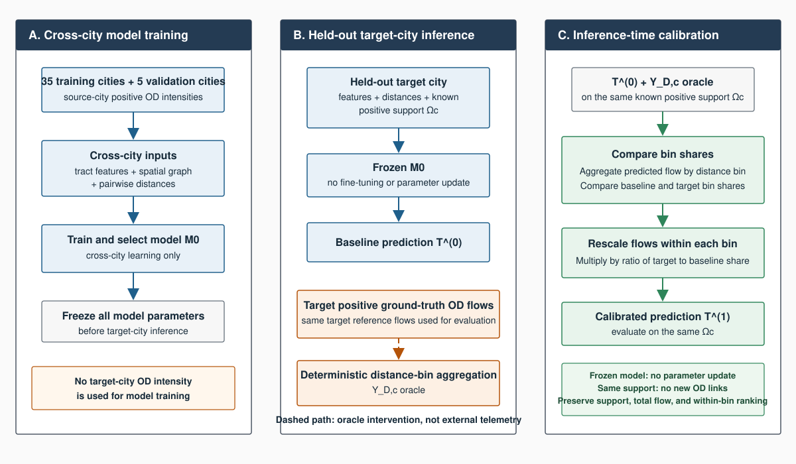
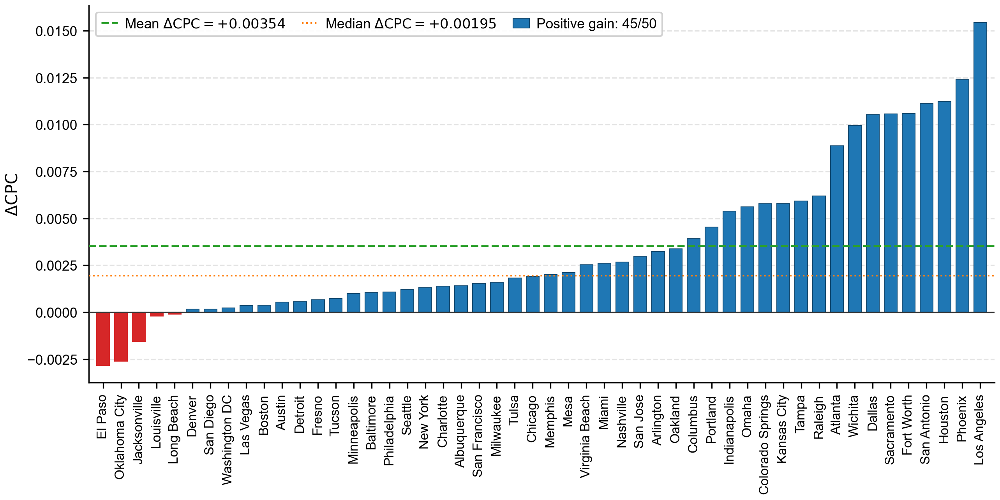
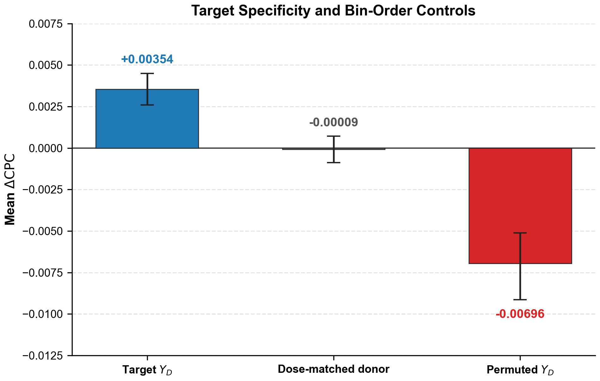
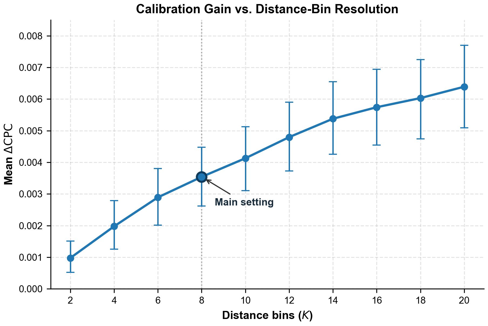
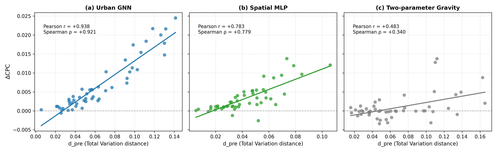

# Improving Zero-Shot Origin–Destination Flow Intensity Reconstruction via Target-City Distance-Binned Mobility Distributions

---

## Abstract

Origin–destination (OD) flow matrices are important inputs for transportation analytics and urban planning, yet granular target-city flow intensities are often difficult to obtain. This study investigates whether a low-dimensional oracle aggregate observation—the target city's distance-binned trip distribution ($Y_D$)—can improve zero-shot OD intensity reconstruction beyond a frozen neural model that uses static urban features and pairwise Haversine distances. In the canonical experiment, $Y_D$ is deterministically derived from the held-out target city's positive ground-truth OD flows and therefore represents an oracle information intervention rather than independently collected external telemetry. We evaluate the framework under strict 5-fold cross-validation across 50 U.S. city-centered metropolitan datasets. The trained neural backbone remains fixed, while $Y_D$ analytically reallocates predicted flow mass across distance intervals at inference time on known positive support ($\Omega_c^+$). City-level calibration produces a small but statistically significant mean CPC improvement ($\Delta\mathrm{CPC}=+0.00354$, 95% bootstrap CI $[+0.0026,+0.0045]$, median $+0.00195$, paired Wilcoxon $p=1.93\times10^{-9}$) and improves 45 of 50 cities (90.0%). Across the tested resolutions ($K\in\{2,4,6,8,10,12,14,16,18,20\}$), gains increase with $K$ while gain per bin declines. Under the study's synthetic Total Variation perturbation design, the empirical mean crossover occurs near $4.44\%$ TV error. Permuted-bin and dose-matched donor placebos further show that the observed benefit depends on correctly ordered, target-specific distance information under the evaluated conditions. Baseline distance-distribution mismatch is strongly associated with city-level gain ($r_{\mathrm{partial}}=+0.7951$), consistent with an inter-bin mass-reallocation mechanism but not establishing causality. The conclusions apply only to intensity reconstruction on known positive support and do not extend to link prediction or identification of zero-flow pairs. Overall, oracle target-city distance distributions provide a low-dimensional aggregate signal that yields modest, consistent improvements for a frozen cross-city model in this support-conditioned benchmark.

**Keywords:** origin–destination matrix; OD intensity reconstruction; distance-binned distribution; zero-shot; cross-city transfer learning; aggregate observations; spatial mobility.

---

# Section 1: Introduction

Origin–destination (OD) flow matrices describe the volume of movement between pairs of spatial zones and provide a population-level representation of spatial interaction. They support a wide range of transportation and urban analyses, including travel-demand modeling, network planning, accessibility assessment, and the study of urban structure [@wilson1971family; @ortuzar2011modelling; @barbosa2018humanmobility]. Reliable OD flow estimates are therefore valuable not only for describing observed mobility but also for evaluating how mobility demand varies across geographic contexts.

Obtaining granular OD intensities for every target city, however, is difficult. Travel surveys can be costly and spatially sparse, while passively collected mobility data may suffer from incomplete coverage, sampling bias, processing artifacts, restricted access, and uncertain representativeness [@gallotti2024distorted; @pappalardo2023future]. Moreover, mobility flows are not determined by geographic distance alone. Their structure also reflects population and employment distributions, land use, transportation infrastructure, urban morphology, and city-specific behavioral patterns. Consequently, models transferred across cities can retain systematic target-domain errors when no local calibration information is available [@yang2014limits].

Recent neural mobility models combine geographic attributes, spatial representations, and distance-dependent interactions to learn mobility-flow regularities that can transfer across regions [@simini2021deepgravity; @guo2025ugnn; @enaya2026transgm]. These approaches reduce the need to fit an independent model from scratch for each city. Nevertheless, a frozen cross-city model must infer the target city's mobility structure from the input features available to it. Importantly, the zero-shot baseline does not use the target city's OD flow intensity values for training or parameter updates, and its prediction scope is conditioned on the known positive support. While the baseline knows the pairwise distance $d_{ij}$ of each OD pair, it does not directly observe how the target city's realized trip volume is distributed across distance intervals. This trip-distance distribution is a critical aggregate signature that reflects spatial impedance and city-specific mobility structure, yet empirical distance-decay patterns vary across datasets, spatial scales, travel purposes, and urban contexts [@lenormand2016comparison; @verma2025distance].

This study examines whether that missing information can be supplied by a compact aggregate observation. We define the target-city distance-binned mobility distribution, denoted by $Y_{D,c}$, as the proportions of observed trip volume falling within $K$ distance intervals. As a compact $K$-dimensional signal, $Y_{D,c}$ only describes how total volume is distributed across distance intervals and does not reveal the intensities of individual OD pairs. Rather than retraining or fine-tuning the predictive model, $Y_{D,c}$ is used solely at inference time to analytically reallocate predicted flow mass across distance intervals while the neural backbone and all trained parameters remain strictly frozen, preserving both total predicted volume and intra-bin relative rankings. The resulting calibration is intentionally simple and closed-form. Its role is not to introduce a new general-purpose calibration algorithm, but to serve as an experimental instrument for measuring the incremental information contained in a low-dimensional, target-specific aggregate signal.

The investigation is organized around two research questions:

1. **RQ1 — Incremental information value:** Evaluated on the same known positive interzonal support, does introducing the target city's distance-binned mobility distribution $Y_{D,c}$ as the sole additional piece of calibration information improve zero-shot OD flow-intensity reconstruction relative to a frozen cross-city baseline whose trained model and parameters remain fixed and do not use target-city flow intensity values $t_{ij}$?
2. **RQ2 — Observation resolution and quality:** How does the value of this aggregate signal change with distance-bin resolution, sub-metropolitan spatial resolution, observation error, semantic ordering, and target specificity?

Both questions are evaluated within the scope of intensity reconstruction on the set of interzonal OD pairs with known positive flows. The study does not infer the existence of unobserved OD links or classify zero-flow pairs. In addition, $Y_{D,c}$ is derived directly from the reference flows of the target city and is therefore treated as an **oracle aggregate observation**. This setting serves as a controlled information-value experiment or feasibility probe to test whether a low-dimensional aggregate signal contains sufficiently discernible incremental information to motivate future research into collecting or estimating such distributions, rather than proving operational feasibility with equivalent accuracy, cost, accessibility, or privacy properties from an independent data source.

The empirical study uses 50 U.S. city-centered metropolitan datasets under strict five-fold cross-city validation. In each fold, the neural backbone is trained on 35 cities, selected using five validation cities, and evaluated on ten completely held-out cities. The backbone and all trained parameters remain strictly frozen before any target-city calibration. City-level $Y_{D,c}$ constitutes the primary experiment. A supplementary spatial-resolution experiment groups tracts within each metropolitan dataset by origin county to construct county-conditioned distributions; prediction and evaluation remain city-wide on the known positive support. Further experiments evaluate sensitivity to distance-bin resolution $K$, synthetic Total Variation observation noise, distance-bin order permutations, donor-city distributions, random seed initializations, and alternative backbone architectures.

The main benchmark results show that city-level target calibration yields a small but relatively consistent improvement over the frozen zero-shot baseline, with a mean $\Delta\mathrm{CPC}=+0.00354$. Although modest in absolute magnitude, this improvement is achieved without updating model parameters and occurs across 45 of 50 cities. Supplementary experiments demonstrate that this benefit depends on the resolution and quality of the observed distribution, as well as on whether the distribution preserves the correct distance order and is specific to the target city.

The study makes four principal contributions:

1. It formalizes a support-conditioned experiment for isolating the incremental information value of a target-city distance distribution while keeping the predictive model fixed.
2. It evaluates this signal under leakage-controlled cross-city validation across 50 city datasets, with uncertainty quantified at the city level rather than by treating OD pairs as independent observations.
3. It characterizes when the signal is informative through resolution, noise, permutation, donor-placebo, initialization, and architecture diagnostics.
4. It provides a mechanistic interpretation of the calibration as inter-bin mass reallocation that preserves intra-bin rankings, while explicitly separating empirical association from causal evidence and oracle evaluation from operational deployment.

The remainder of the paper is organized as follows. Section 2 reviews related work on spatial-interaction modeling, neural cross-city mobility prediction, aggregate calibration, and mobility-data limitations. Section 3 describes the benchmark data, spatial representation, zero-truncated flow model, calibration operator, and evaluation protocol. Section 4 reports the empirical results and diagnostic experiments. Section 5 discusses their interpretation, implications, limitations, and future directions. Section 6 concludes the study, followed by the data and code availability statement, declarations, and references.

---

# Section 2: Related Work

## 2.1 Spatial interaction models and distance-based calibration

Origin–destination flow modeling has long been studied through spatial interaction models, in which movement between an origin and a destination is represented as a function of production, attraction, and separation or travel cost. Wilson's entropy-based formulation established a general family of constrained spatial interaction models, while later transportation-modeling frameworks integrated trip distribution into broader demand-analysis systems [@wilson1971family; @ortuzar2011modelling]. Within this tradition, geographic distance or generalized travel cost acts as an impedance term that reduces the expected interaction between increasingly separated locations.

The form and parameters of distance decay generally require empirical calibration. Hyman's procedure provided an early systematic approach for calibrating the deterrence parameter of a gravity model against an observed mean trip length [@hyman1969calibration]. More recent work has shown that other compact summary statistics, such as median travel time, can also identify a single impedance parameter under appropriate structural assumptions [@merlin2020medians]. At the same time, comparative evaluations demonstrate that no single trip-distribution law or distance-decay specification performs uniformly across all datasets and spatial scales [@lenormand2016comparison]. Empirical decay patterns may change with travel mode, trip purpose, urbanization, and socioeconomic conditions [@verma2025distance].

These studies establish two principles relevant to the present work. First, distance is a central organizing variable for spatial flows. Second, target-specific observations of the trip-distance profile can contain information that is not recoverable from a fixed, universally transferred deterrence function. The present study retains this classical insight but does not estimate a parametric gravity-decay coefficient. Instead, it uses a vector of observed flow proportions across $K$ distance intervals as a nonparametric macro constraint on a pre-existing prediction.

## 2.2 Data-driven mobility generation and neural spatial models

The growing availability of geospatial attributes and mobility observations has enabled data-driven models that learn nonlinear interactions among origin characteristics, destination characteristics, and spatial separation. Deep Gravity demonstrated that neural architectures can combine geographic features with distance information to generate mobility flows and generalize beyond individual training regions [@simini2021deepgravity]. More recent geography-aware neural models further incorporate spatial topology and transferable representations to improve prediction in previously unseen urban areas [@guo2025ugnn]. Transferable gravity frameworks likewise emphasize cross-city policy transfer and adaptation across heterogeneous urban systems [@enaya2026transgm].

Cross-city generalization remains difficult because the mapping from urban context to mobility flow is not spatially invariant. A model trained on source cities may learn broad regularities but still misrepresent a target city's particular balance of local and long-distance travel. Earlier work on commuting-flow predictability showed that the absence of local calibration data places substantive limits on prediction accuracy [@yang2014limits]. This limitation is not resolved merely by including pairwise distance as an input: distance tells the model how far apart two zones are, but it does not reveal the empirical share of total target-city movement assigned to that distance range.

The present study therefore addresses a problem complementary to neural architecture design. It assumes that a cross-city model has already been trained and asks whether a compact target-domain aggregate can correct a remaining macro-level mismatch without updating the learned parameters. This separates the information supplied by the target observation from improvements that could otherwise arise through additional training, fine-tuning, or architectural changes.

## 2.3 Aggregate observations as calibration constraints

Aggregate calibration occupies an intermediate position between prediction without target observations and estimation from a complete target OD matrix. Classical constrained models use aggregate totals or travel-cost moments to impose production, attraction, or impedance consistency [@wilson1971family; @hyman1969calibration; @ortuzar2011modelling]. Such constraints can be informative because they summarize properties of the entire flow system while requiring far fewer observed quantities than the number of OD cells.

Most established distance-calibration methods estimate one or several parameters of a spatial interaction model. By contrast, the target observation considered here is the normalized distance-binned distribution

$$
\mathbf{Y}_{D,c}=(Y_{D,c,1},\ldots,Y_{D,c,K}),
\quad \sum_{b=1}^{K}Y_{D,c,b}=1
$$

It is used to rescale predicted mass directly across empirical distance intervals. This distinction makes it possible to study observation granularity explicitly: increasing $K$ increases the dimensionality and distance resolution of the supplied signal, while a county-conditioned variant increases its spatial resolution by providing separate distributions for groups of origin tracts. In the latter case, county grouping changes only the resolution of the calibration observation; the output remains a prediction for the full city dataset.

The aggregate signal in this study must not be confused with marginal origin totals, marginal destination totals, or a sample of directly observed OD cells. Each of these observation types constrains a different aspect of the unknown flow matrix. The distance distribution constrains only the proportion of total positive-support flow assigned to each distance interval; by itself, it does not determine which specific origin–destination pair should receive more flow within an interval. Its potential value therefore depends jointly on the macro distance constraint and the pairwise structure already learned by the baseline model.

## 2.4 Positive-support count modeling

OD intensities are nonnegative counts and often exhibit variance larger than their mean, motivating count distributions that allow overdispersion. Negative binomial regression is a standard framework for such outcomes [@hilbe2011negative]. When the available dataset contains only positive observations, applying an ordinary count likelihood without accounting for the missing zero mass changes the implied sampling process. Zero-truncated count models instead condition the likelihood on $T\geq1$ [@grogger1991truncated].

This distinction is central to the scope of the current study. The task is **support-conditioned intensity reconstruction**: the OD pairs included in the benchmark are known to have positive reference flow, and the model estimates their positive intensities. Pairs absent from the positive support are treated as unobserved rather than as verified zeros. Accordingly, the study does not address link formation, zero classification, or recovery of a complete OD matrix. This statistical formulation aligns the likelihood with the observed sample while preventing a stronger full-matrix claim than the data support.

## 2.5 Mobility-data quality, aggregation, and privacy boundaries

Human mobility research draws on surveys, administrative records, mobile-network data, location-based services, and other digital traces [@barbosa2018humanmobility]. These sources differ in population coverage, spatial and temporal resolution, sampling mechanisms, and preprocessing. Such differences can distort inferred mobility patterns and complicate comparisons across cities or platforms [@gallotti2024distorted; @pappalardo2023future]. An aggregate distance distribution estimated from an external source may therefore deviate systematically from the corresponding distribution in the reference OD benchmark rather than exhibit only independent random error.

Aggregation also does not by itself provide a formal privacy guarantee. Mobility records can remain identifying even when represented with reduced spatial or temporal detail [@demontjoye2013unique], while achieving user-level differential privacy for released location statistics involves nontrivial practical trade-offs [@houssiau2022differential]. Consequently, the low dimensionality of $\mathbf{Y}_{D,c}$ should be interpreted as a property of the observation interface, not as proof that the observation is privacy-preserving. Establishing privacy requires a specified data-generating process, threat model, release mechanism, and formal or empirical risk analysis.

For these reasons, the present work uses an oracle distribution derived from the target reference flows and then introduces controlled perturbations to study sensitivity to observation error. This design isolates the information content of the distribution but does not substitute for future validation with independently collected aggregate observations. It also avoids attributing unverified provenance, availability, or privacy characteristics to a prospective operational source.

## 2.6 Research gap and positioning of this study

The reviewed literature establishes the importance of distance in spatial interaction, the need for local calibration, the growing transferability of neural mobility models, and the usefulness of selected aggregate constraints. However, a specific information question remains insufficiently characterized: **after a cross-city model has already learned from static urban context and pairwise distance, how much additional value is contained in the target city's distance-binned flow distribution, and under what observational conditions does that value persist?**

This study positions $\mathbf{Y}_{D,c}$ neither as a replacement for the target OD matrix nor as another feature used to retrain the neural network. Instead, it treats the distribution as the sole target-specific aggregate intensity signal introduced after model training. A frozen-backbone design, held-out-city evaluation, and matched diagnostic controls are then used to distinguish target information value from model adaptation, generic distance decay, or arbitrary rescaling. The analysis further separates distance resolution from sub-metropolitan spatial resolution and tests observation fidelity through controlled noise and semantic-order placebos.

This positioning narrows the claim but makes the estimand explicit. The study asks whether a known low-dimensional target aggregate improves the intensity estimates of known positive OD links under a fixed prediction system. It does not claim to reconstruct unknown network support, prove the operational availability of $\mathbf{Y}_{D,c}$, or establish formal privacy guarantees. Section 3 translates this research gap into the data definitions, model, calibration operator, and cross-city evaluation protocol used in the experiments.

---

# Section 3: Data Sources, Spatial Units, and Methodology

---

## 3.1 Data Sources and Spatial Representation

The empirical evaluation is conducted across 50 metropolitan areas in the United States. Each city is represented as a spatial network composed of census tract units. Each tract is characterized by its geographic centroid coordinates $\mathbf{s}_i = (\operatorname{lon}_i, \operatorname{lat}_i)$ and a 26-dimensional feature vector describing local urban context:
- **13 Census demographic features** (e.g., population density, employment, household income),
- **8 Point-of-Interest (POI) features** (e.g., commercial, education, recreational amenities), and
- **5 Road network features** (e.g., road density, intersection topology).

These features are sourced from an aggregated benchmark dataset compiled by the laboratory. The primary data origins, vintage collection years, exact versions, and preprocessing workflows for each feature group are currently under verification and will be fully reported prior to formal publication.

Tract-level polygon geometries are not utilized in the spatial model. Instead, each tract is represented spatially exclusively by its centroid coordinates. All pairwise distances and spatial neighborhood graph structures are constructed directly from these coordinates.

The continuous distance domain between tract centroids is partitioned into $K$ intervals:

$$I_b = [a_{b-1}, a_b), \qquad b = 1, \dots, K$$

where $d_{ij}$ is computed using the spherical Haversine formula with Earth radius $R = 6371\text{ km}$:

$$d_{ij} = 2R \arcsin \left( \sqrt{ \sin^2\left(\frac{\Delta\varphi}{2}\right) + \cos(\varphi_i)\cos(\varphi_j) \sin^2\left(\frac{\Delta\lambda}{2}\right) } \right)$$

For each cross-validation fold $f$, distance bin edges are determined independently from the interzonal pairs of the training cities:

$$\mathcal{D}_{\mathrm{train}}^{(f)} = \left\{ d_{ij} : c \in \mathcal{C}_{\mathrm{train}}^{(f)}, (i,j) \in \Omega_c^+, i \ne j, d_{ij} > 0 \right\}$$

The internal bin edges are defined at the $b/K$ quantiles:

$$a_b = Q_{b/K}\left(\mathcal{D}_{\mathrm{train}}^{(f)}\right), \qquad b = 1, \dots, K-1$$

with $a_0 = 0$ and $a_K = \infty$. Each OD pair contributes exactly one distance observation to quantile estimation, independent of trip count (**pair-weighted quantiles**). Because edges are derived strictly from training cities, test-city data are never used to define distance bins. Duplicate quantile values are removed, so the active number of bins may be strictly less than $K$.

---

## 3.2 Spatial Units and Observational Resolution: Primary City-Level Benchmark (`M1_city`)*)*

The dataset provided by the laboratory is organized on a per-city basis. Each city $c$ comprises a discrete set of census tracts and the observed positive interzonal OD pairs between them. **Tract** is the elementary spatial node unit of the neural network, while **city** is the unit for cross-validation data partitioning, zero-shot transfer learning, and performance evaluation.

For each target city $c$, the model predicts flow intensities across the entire observed positive support:

$$\Omega_c^+ = \left\{(i,j) : t_{ij} \ge 1\right\}$$

The primary benchmark employs a single distance-binned mobility distribution defined at the **city level**. The reference flow volume of city $c$ within distance bin $b$ is:

$$F_{c,b} = \sum_{(i,j) \in \Omega_c^+} t_{ij}^{\mathrm{GT}} \mathbb{I}(a_{b-1} \le d_{ij} < a_b)$$

The normalized city-level distance distribution is:

$$Y_{D,c,b} = \frac{F_{c,b}}{\sum_{r=1}^K F_{c,r}}, \qquad \sum_{b=1}^K Y_{D,c,b} = 1$$

The resulting vector $\mathbf{Y}_{D,c} = [Y_{D,c,1}, \dots, Y_{D,c,K}]^T$ is used to calibrate the entire OD flow prediction of target city $c$. This constitutes the primary configuration of the study (`M1_city`).

---

## 3.3 Fine-Grained Spatial Resolution Variant: County-Level Observations (`M1_county`)*)*

A supplementary experiment examines whether providing aggregate distance observations at a finer sub-metropolitan spatial resolution provides incremental predictive information. In this analysis, the tracts of each city are grouped by county.

County boundaries are obtained from the Database of Global Administrative Areas, version 4.1 [@gadm41]. Each tract is mapped to its encompassing county via a spatial point-in-polygon join between the tract centroid and the county polygon. If a centroid does not receive a valid `within` match—for example, because it lies on a polygon boundary or near a coastline—the implementation falls back to a nearest-polygon join in EPSG:5070 and accepts the assignment only when the centroid-to-polygon distance is at most 5 km; otherwise, execution stops with an error. Duplicate matches are resolved deterministically so that each tract receives exactly one county label. GADM is strictly utilized for this spatial grouping step; GADM is not the source of tract centroid coordinates, urban features, or OD flows.

Letting $g(i)$ denote the county assigned to tract $i$, OD pairs are grouped strictly by the **origin tract's county**:

$$\Omega_{c,\ell}^+ = \left\{(i,j) \in \Omega_c^+ : g(i) = \ell\right\}$$

Destination tract $j$ may belong to the same county or a different county within the metropolitan area. The distance-binned flow mass of county group $\ell$ is:

$$F_{c,\ell,b} = \sum_{(i,j) \in \Omega_{c,\ell}^+} t_{ij}^{\mathrm{GT}} \mathbb{I}(a_{b-1} \le d_{ij} < a_b)$$

and its normalized distance distribution vector is:

$$Y_{D,c,\ell,b} = \frac{F_{c,\ell,b}}{\sum_{r=1}^K F_{c,\ell,r}}, \qquad \sum_{b=1}^K Y_{D,c,\ell,b} = 1$$

Because the input data are strictly bounded within the tracts of the city dataset provided by the laboratory, $\mathbf{Y}_{D,c,\ell}$ describes the outflow distance distribution of trips originating from the tracts of city $c$ assigned to county $\ell$. It does not represent total county-wide mobility outside the study city's spatial footprint.

Each distribution $\mathbf{Y}_{D,c,\ell}$ is used to calibrate OD pairs whose origin tract belongs to county $\ell$. The calibrated predictions from all county groups are then assembled into a complete OD prediction for the city:

$$\widehat{\mathbf{T}}_c^{\mathrm{county}} = \bigcup_{\ell \in \mathcal{G}_c} \left\{ \widehat{T}_{ij}^{\mathrm{CAL}} : (i,j) \in \Omega_{c,\ell}^+ \right\}$$

where $\mathcal{G}_c$ denotes the set of counties present in the dataset for city $c$.

Crucially, increasing observational resolution from city to county does not alter the evaluation scope. The model still reconstructs and is evaluated against the complete set of positive flows $\Omega_c^+$ for the target city; only the aggregate supervisory signal supplied during calibration becomes spatially more granular (`M1_county`).

---

## 3.4 Zero-Shot Flow Intensity Calibration via Distance Distribution

The neural backbone is trained on source cities and kept strictly frozen prior to evaluation on the target city. For each positive pair $(i,j) \in \Omega_c^+$, the ZTNB model generates an initial zero-shot flow intensity prediction:

$$\widehat{T}_{ij}^{\mathrm{ZS}} = \mathbb{E}[T_{ij} \mid T_{ij} \ge 1]$$

These predictions constitute baseline $M_0$. Baseline $M_0$ utilizes target-city urban context features and inter-tract distances, but has no access to $Y_D$ or target reference OD intensities.

### 3.4.1 Primary Calibration at the City Level (`M1_city`)

The total flow mass predicted by the baseline in distance bin $b$ is:

$$\widehat{F}_{c,b}^{\mathrm{ZS}} = \sum_{(i,j) \in \Omega_c^+} \widehat{T}_{ij}^{\mathrm{ZS}} \mathbb{I}(a_{b-1} \le d_{ij} < a_b)$$

Letting:

$$\widehat{S}_{c}^{\mathrm{ZS}} = \sum_{(i,j) \in \Omega_c^+} \widehat{T}_{ij}^{\mathrm{ZS}}$$

denote total predicted flow intensity across target city $c$, the implied distance distribution predicted by the baseline is:

$$\widehat{Y}_{D,c,b}^{\mathrm{ZS}} = \frac{\widehat{F}_{c,b}^{\mathrm{ZS}}}{\widehat{S}_{c}^{\mathrm{ZS}}}$$

Because compact cities may contain zero candidate OD pairs in outer distance bins within $\Omega_c^+$, the set of active distance bins is defined as:

$$\mathcal{A}_c = \left\{ b : \widehat{Y}_{D,c,b}^{\mathrm{ZS}} > 0 \right\}$$

The target distance observation is conditioned on active distance bins:

$$p_{c,b}^{\mathrm{cond}} = \frac{Y_{D,c,b} \mathbb{I}(b \in \mathcal{A}_c)}{\sum_{r \in \mathcal{A}_c} Y_{D,c,r}}$$

This conditioning ensures that calibration reallocates mass strictly among distance bins containing at least one positive OD pair in the target city's support.

For $b \in \mathcal{A}_c$, the raw calibration ratio and soft weight are:

$$r_{c,b} = \frac{p_{c,b}^{\mathrm{cond}}}{\widehat{Y}_{D,c,b}^{\mathrm{ZS}}}, \qquad w_{c,b}(q) = r_{c,b}^q, \quad q \in [0, 1]$$

To strictly conserve total predicted flow mass, the weight is normalized by:

$$Z_c(q) = \sum_{r \in \mathcal{A}_c} \widehat{Y}_{D,c,r}^{\mathrm{ZS}} w_{c,r}(q), \qquad s_{c,b}(q) = \frac{w_{c,b}(q)}{Z_c(q)}$$

The calibrated prediction for pair $(i,j)$ under `M1_city` is:

$$\widehat{T}_{ij}^{M1_{\mathrm{city}}} = s_{c, b(i,j)}(q) \cdot \widehat{T}_{ij}^{\mathrm{ZS}}$$

where $b(i,j)$ indexes the distance bin containing $d_{ij}$.

In the primary benchmark, $q=1$ is pre-specified and locked prior to evaluation. $q=0$ reverts identically to baseline $M_0$ because all scaling factors equal 1.

The normalization mechanism strictly preserves total predicted flow intensity:

$$\sum_{(i,j) \in \Omega_c^+} \widehat{T}_{ij}^{M1_{\mathrm{city}}} = \sum_{(i,j) \in \Omega_c^+} \widehat{T}_{ij}^{\mathrm{ZS}}$$

At $q=1$, the calibrated model's implied distance distribution matches the conditioned target distribution:

$$\widehat{Y}_{D,c,b}^{M1_{\mathrm{city}}} = p_{c,b}^{\mathrm{cond}}$$

When all distance bins in $\mathbf{Y}_{D,c}$ are active ($\mathcal{A}_c = \{1, \dots, K\}$), $p_{c,b}^{\mathrm{cond}} = Y_{D,c,b}$, and the calibrated distribution matches raw $\mathbf{Y}_{D,c}$ directly.

### 3.4.2 Spatial Resolution Variant at the County Level (`M1_county`)

In the spatial resolution experiment, the above procedure is applied independently to each origin-county group:

$$\Omega_{c,\ell}^+ = \left\{(i,j) \in \Omega_c^+ : g(i) = \ell\right\}$$

For each county $\ell$, the algorithm identifies the active bin set $\mathcal{A}_{c,\ell}$, conditions the target observation to $p_{c,\ell,b}^{\mathrm{cond}}$, and computes:

$$w_{c,\ell,b}(q) = \left(\frac{p_{c,\ell,b}^{\mathrm{cond}}}{\widehat{Y}_{D,c,\ell,b}^{\mathrm{ZS}}}\right)^q, \qquad s_{c,\ell,b}(q) = \frac{w_{c,\ell,b}(q)}{\sum_{r \in \mathcal{A}_{c,\ell}} \widehat{Y}_{D,c,\ell,r}^{\mathrm{ZS}} w_{c,\ell,r}(q)}$$

Predictions are scaled by the factor corresponding to the origin tract's county:

$$\widehat{T}_{ij}^{M1_{\mathrm{county}}} = s_{c, g(i), b(i,j)}(q) \cdot \widehat{T}_{ij}^{\mathrm{ZS}}$$

Because normalization is executed separately per origin county, total predicted flow originating from each county is conserved ($\sum_{(i,j)\in\Omega_c^+:g(i)=\ell} \widehat{T}_{ij}^{M1_{\mathrm{county}}} = \sum_{(i,j)\in\Omega_c^+:g(i)=\ell} \widehat{T}_{ij}^{\mathrm{ZS}}$). When aggregated, total city-wide flow is also preserved.

### 3.4.3 Invariant Mathematical Properties

The calibration operator possesses three foundational properties:
1. **Analytic Post-Processing**: No neural parameters of the GNN or ZTNB heads are updated on the target city.
2. **Support Invariance**: $\Omega_c^+(M_0) = \Omega_c^+(M1_{\mathrm{city}}) = \Omega_c^+(M1_{\mathrm{county}})$. The method neither discovers unobserved links nor assigns zero flows to missing pairs.
3. **Intra-Bin Rank Invariance**: All predictions within the same distance bin are multiplied by an identical positive scalar $s_{c,b}(q) > 0$. Consequently, the relative ranking among pairs within any distance bin is strictly invariant (for non-degenerate groups with sufficient pairs, Kendall's rank correlation before and after calibration is identically $\tau = 1.00000000$).

---

## 3.5 OD Flow Intensity Modeling via Zero-Truncated Negative Binomial (ZTNB)

### 3.5.1 Frozen neural backbone and training configuration

Within each fold, the 26 tract features are standardized using statistics fitted exclusively on the 35 training cities and then applied unchanged to the validation and test cities. The spatial graph connects tract centroids within a 5 km Haversine radius, includes self-loops, and represents neighborhood relations in both directions. Any tract without a neighbor inside the radius is connected to its nearest tract to avoid isolated nodes.

The frozen backbone contains two graph neural-network layers with hidden dimension 64 and dropout 0.1. Its pairwise decoder receives the origin and destination embeddings together with $\log(1+d_{ij})$ and a log gravity-prior term. Models are trained for at most 200 epochs with AdamW (learning rate $2\times10^{-3}$, weight decay $10^{-4}$) [@loshchilov2019adamw], gradient clipping at 5.0, a `ReduceLROnPlateau` scheduler (factor 0.5, patience 4), and early stopping with patience 15 based on validation CPC. After model selection, all backbone and output-head parameters remain fixed during target-city calibration.

### 3.5.2 Zero-truncated negative binomial likelihood and inference

Because the evaluation and training samples consist exclusively of OD pairs with positive flows ($t_{ij} \ge 1$), flow intensities are modeled using the Zero-Truncated Negative Binomial distribution [@grogger1991truncated; @hilbe2011negative]. For $t_{ij} \ge 1$, the conditional likelihood is:

$$P(T_{ij} = t_{ij} \mid T_{ij} \ge 1) = \frac{P_{\mathrm{NB}}(T_{ij} = t_{ij}; \mu_{ij}, \phi)}{1 - P_{\mathrm{NB}}(T_{ij} = 0; \mu_{ij}, \phi)}$$

where the neural network predicts the unconstrained base Negative Binomial mean $\mu_{ij} > 0$, and $\phi > 0$ is the dispersion parameter. The zero-probability of the base Negative Binomial is:

$$p_{0,ij} = \left( \frac{\phi}{\mu_{ij} + \phi} \right)^\phi$$

The training loss is the negative log-likelihood of the ZTNB distribution:

$$\mathcal{L}_{\mathrm{ZTNB}} = -\frac{1}{|\Omega_c^+|} \sum_{(i,j) \in \Omega_c^+} \left[ \log P_{\mathrm{NB}}(t_{ij}; \mu_{ij}, \phi) - \log(1 - p_{0,ij}) \right]$$

At inference time, zero-shot flow predictions do not use $\mu_{ij}$ directly. Instead, the model outputs the **conditional expected mean**:

$$\widehat{T}_{ij}^{\mathrm{ZS}} = \mathbb{E}[T_{ij} \mid T_{ij} \ge 1] = \frac{\mu_{ij}}{1 - p_{0,ij}}$$

As the expectation of a count distribution, $\widehat{T}_{ij}^{\mathrm{ZS}}$ is a strictly positive real value and is not required to be an integer. ZTNB strictly models flow volume conditioned on positive links $\Omega_c^+$; it does not predict link existence or treat unobserved pairs as zero flows [@grogger1991truncated; @hilbe2011negative].

Figure 1 summarizes the support-conditioned oracle calibration framework, separating cross-city model training, frozen target-city inference, and the oracle aggregate intervention.

**Figure 1. Support-conditioned oracle calibration framework.** The cross-city model $M_0$ is trained on source cities and frozen before target-city inference. For a held-out target city, $M_0$ first produces baseline intensities $\widehat{\mathbf{T}}^{(0)}$ on the known positive support $\Omega_c^+$. The oracle distance-binned distribution $\mathbf{Y}_{D,c}$ is deterministically derived from the same target-city positive ground-truth OD flows used for evaluation and is introduced only at inference time. Bin-specific scaling factors reallocate predicted mass across distance intervals to obtain $\widehat{\mathbf{T}}^{(1)}$ without updating model parameters or creating new OD links. The schematic represents an oracle information intervention, not an independently collected external telemetry pipeline.

---

## 3.6 Cross-City Evaluation Protocol and Statistical Inference

### 3.6.1 5-Fold Cross-City Validation Scheme
The empirical benchmark is structured around a strict 5-fold cross-validation protocol over $N=50$ U.S. metropolitan areas. In each fold, 35 cities are assigned to the training set, 5 cities to the validation set, and the remaining 10 held-out cities to the test set. Every city appears in the test partition exactly once, ensuring comprehensive 50-city out-of-sample evaluation coverage.

Data partitioning is conducted strictly at the **city level** rather than at the tract or OD pair level. Consequently, all tracts and OD pairs belonging to a given city reside exclusively in one of the three splits (train, validation, or test) within any fold. This design prevents spatial data leakage and ensures that the neural model never observes target-city representations during training.

Distance bin edges are calculated independently for each fold using only interzonal OD pairs from the training cities. Following training completion, backbone model parameters are permanently frozen prior to target-city inference.

For each target city, three primary model conditions are evaluated:
- $M_0$: Zero-shot predicted flows without access to $Y_D$;
- $M1_{\mathrm{city}}$: Analytically calibrated flows using a single oracle $Y_D$ at the city level (Primary Benchmark);
- $M1_{\mathrm{county}}$: Analytically calibrated flows using multiple oracle $Y_D$ grouped by origin county (Spatial Resolution Variant).

The comparison between $M_0$ and $M1_{\mathrm{city}}$ represents the primary experiment designed to evaluate whether target distance distributions provide incremental information for zero-shot reconstruction (RQ1). The comparison between $M1_{\mathrm{city}}$ and $M1_{\mathrm{county}}$ provides empirical evidence for the spatial observational resolution aspect of RQ2.

Across all configurations, predictions are evaluated on the exact same observed positive interzonal support $\Omega_c^+$ for the entire city.

---

### 3.6.2 Primary Evaluation Metric: Common Part of Commuters (CPC)

The primary accuracy metric is the Common Part of Commuters (CPC), computed on positive interzonal pairs:

$$\operatorname{CPC}_c = \frac{2 \sum_{(i,j) \in \Omega_{c,\mathrm{inter}}^+} \min\left(t_{ij}^{\mathrm{GT}}, \widehat{T}_{ij}\right)}{\sum_{(i,j) \in \Omega_{c,\mathrm{inter}}^+} t_{ij}^{\mathrm{GT}} + \sum_{(i,j) \in \Omega_{c,\mathrm{inter}}^+} \widehat{T}_{ij}}$$

where the positive interzonal evaluation support is formally defined as:

$$\Omega_{c,\mathrm{inter}}^+ = \left\{ (i,j): t_{ij}\geq1,\ i\neq j,\ d_{ij}>0 \right\}.$$

CPC is bounded in $[0, 1]$, where values closer to 1 denote greater agreement between predicted and ground-truth flows. CPC is standard in spatial mobility modeling and OD reconstruction benchmarks [@lenormand2016comparison].

The incremental information value of $Y_D$ for city $c$ is measured by the paired gain:

$$\Delta\operatorname{CPC}_c = \operatorname{CPC}_c(M1_{\mathrm{city}}) - \operatorname{CPC}_c(M_0)$$

A positive value indicates that conditioning on $Y_D$ improves reconstruction accuracy over the zero-shot baseline on the same city, same support, and identical pre-trained network.

---

### 3.6.3 Aggregation Across Model Seeds and Cities

To account for stochasticity in neural initialization and training optimization, each configuration is trained across three independent model seeds:

$$\mathcal{S} = \{1, 10, 100\}$$

For each city, paired performance differences are computed per seed and then averaged:

$$\overline{\Delta\operatorname{CPC}}_c = \frac{1}{|\mathcal{S}|} \sum_{s \in \mathcal{S}} \left[ \operatorname{CPC}_{c,s}(M1_{\mathrm{city}}) - \operatorname{CPC}_{c,s}(M_0) \right]$$

The population-level headline estimand is defined as the macro-average across all 50 cities:

$$\overline{\Delta\operatorname{CPC}} = \frac{1}{50} \sum_{c=1}^{50} \overline{\Delta\operatorname{CPC}}_c$$

Macro-averaging assigns equal weight to each metropolitan area regardless of network size, number of tracts, or total travel demand. The primary estimand represents the average expected gain across diverse cities, rather than an unweighted average pooled across millions of OD pairs.

---

### 3.6.4 Uncertainty Quantification and Statistical Hypothesis Testing

The 95% confidence interval for the population mean improvement is estimated via fold-stratified city-level bootstrap ($B=10,000$ resamples) [@efron1993bootstrap]. In each resample, cities are sampled with replacement within their fold strata from the set of city deltas $\left\{\overline{\Delta\operatorname{CPC}}_c\right\}_{c=1}^{50}$, and the macro-average is recomputed. Sampling at the city level maintains the city as the fundamental unit of statistical inference and avoids treating non-independent OD pairs within the same city as independent observations.

A two-sided paired Wilcoxon signed-rank test [@wilcoxon1945ranking] is conducted across the 50 city-level deltas:

$$\left\{ \overline{\Delta\operatorname{CPC}}_c \right\}_{c=1}^{50}$$

The null hypothesis tests whether the median paired difference between $M1_{\mathrm{city}}$ and $M_0$ equals zero. This non-parametric test evaluates whether the observed directional improvement represents a systematic shift rather than random fluctuation around zero.

---

### 3.6.5 Robustness and Diagnostic Stress Tests

Supplementary experiments investigate the operational boundaries and mechanisms governing the primary result:
1. **Distance Resolution ($K$-Sensitivity)**: Varying distance partitions across $K \in \{2,4,6,8,10,12,14,16,18,20\}$. The nine secondary configurations are compared with the locked $K=8$ anchor using Holm's step-down family-wise error correction [@holm1979sequential].
2. **Spatial Observational Granularity**: Comparing city-level ($M1_{\mathrm{city}}$) against origin-county grouped observations ($M1_{\mathrm{county}}$).
3. **Observational Noise Tolerance**: Adding controlled synthetic Total Variation noise $\epsilon \in [0\%, 5\%]$ to $Y_D$ to identify breakdown thresholds.
4. **Spatial Semantic Ordering**: Permuting the bin order of $Y_D$ to test whether distance alignment is mandatory.
5. **Target Specificity Placebos**: Applying dose-matched donor distributions from incorrect cities and fold training-mean profiles.
6. **Initialization Stability**: Replicating across independent model initializations (Seeds 1, 10, 100).
7. **Architectural Generality**: Evaluating the Urban GNN and Node MLP neural backbones together with a classical gravity baseline.

---

### 3.6.6 County-Level Spatial Observational Resolution Protocol

Across the 50 urban benchmark datasets, 39 metropolitan areas contain tracts that map to a single county, whereas 11 metropolitan areas contain tracts distributed across two to seven counties (the multi-county group comprises Kansas City, New York, Dallas, Denver, Omaha, Tulsa, Detroit, Chicago, Boston, Milwaukee, and Atlanta).

For the 39 single-county cities, all origin tracts belong to the exact same county group. Consequently, the county-level distance observation and the city-wide observation are mathematically equivalent:

$$\mathbf{Y}_{D,c,\ell} = \mathbf{Y}_{D,c},$$

yielding an exact mathematical identity:

$$M1_{\mathrm{county}} \equiv M1_{\mathrm{city}}, \qquad \Delta\operatorname{CPC}_{\mathrm{res},c} = 0$$

where the incremental gain from spatial resolution refinement is defined as:

$$\Delta\operatorname{CPC}_{\mathrm{res},c} = \operatorname{CPC}_c(M1_{\mathrm{county}}) - \operatorname{CPC}_c(M1_{\mathrm{city}})$$

Thus, the 39 single-county cities serve as an invariant algorithmic sanity check: partitioning a city into a single trivial group cannot alter prediction outputs.

Empirical evidence regarding the informational benefit of county-level resolution arises from the 11 multi-county cities. For these metropolitan areas, each observation $\mathbf{Y}_{D,c,\ell}$ is constructed from trips originating in county $\ell$, while the final prediction is assembled and evaluated over the full positive support of the target city.

Results are reported across two evaluation tiers:
1. **Pooled Benchmark Tier ($N=50$ cities)**: Reflecting the expected average effect of providing county-level observations across the entire heterogeneous benchmark;
2. **Multi-County Focus Tier ($n=11$ cities)**: Reflecting the empirical effect specifically where county-level grouping supplies genuine spatial granularity.

Because 39 cities produce structural zeros by construction, scientific interpretation of the incremental value of county-resolved observations is grounded primarily in the 11 multi-county cities.

---

# Section 4: Empirical Results

In this section, we present the empirical evaluation designed to answer **RQ1** and **RQ2**. Across all experiments, our objective is not to propose a novel calibration algorithm, but to employ a closed-form, mass-preserving calibration operator as an **experimental instrument** to quantify the information value of target-city aggregate distance distributions ($Y_D$).

All evaluations are conducted under a strict 5-fold cross-validation protocol (10 held-out test cities per fold, totaling $N=50$ metropolitan areas across the United States) on the observed positive interzonal support $\Omega_c^+ = \{(i, j) \mid i \ne j, D_{ij} > 0, T_{ij} \ge 1\}$. The headline metric is the Common Part of Commuters (CPC) on interzonal flows, evaluated relative to the frozen zero-shot cross-city baseline $M_0$.

---

## 4.1 Does $Y_D$ improve zero-shot OD reconstruction?

In the primary experiment, incorporating the oracle target-city distance-binned mobility distribution increased the mean interzonal CPC across 50 U.S. cities from 0.71281 for the zero-shot baseline ($M_0$) to 0.71635 after calibration ($M_1$). This corresponds to a mean improvement of $\Delta\mathrm{CPC}=+0.00354$, with a 95% confidence interval of $[+0.0026,+0.0045]$ obtained from the fold-stratified hierarchical bootstrap. Because the entire confidence interval lies above zero, the estimated mean improvement remains positive under the adopted bootstrap procedure.

As shown in Figure 2, the improvement was not concentrated in a small subset of cities but was observed across most of the evaluation set. Specifically, CPC increased after calibration in 45 of 50 cities (90.0%). The median city-level change was also positive ($\Delta\mathrm{CPC}=+0.00195$), although the magnitude of improvement varied considerably across cities. The remaining five cities exhibited lower CPC after calibration, indicating that the benefit of target distance information did not occur in every case. Overall, the city-level distribution shows that the improvement was modest in magnitude but broadly consistent across the evaluated cities.

To further assess whether this pattern represented a systematic paired difference, we applied a two-sided Wilcoxon signed-rank test to the $M_0$ and $M_1$ results across the 50 cities. The test yielded $p=1.93\times10^{-9}$, providing strong evidence against the null hypothesis of no systematic paired difference between the two conditions. Taken together, these results indicate that the oracle target-city distance-binned mobility distribution provides a modest but consistent improvement over the zero-shot baseline across most evaluated cities.

---

**Figure 2 | City-level improvement in interzonal CPC from oracle target-distance calibration.** Bars show the per-city performance change $\Delta\text{CPC}_c = \text{CPC}(M_{1,c}) - \text{CPC}(M_{0,c})$ for $N=50$ held-out test cities, ordered from lowest to highest. The dashed green line indicates the mean improvement ($+0.00354$) and the dotted orange line indicates the median improvement ($+0.00195$). Overall, 45 of 50 cities (90.0%) exhibit positive gains, with the primary fold-stratified 95% confidence interval spanning $[+0.0026, +0.0045]$.

---

### Table 1: Primary Zero-Shot Flow Reconstruction Benchmark ($N=50$ Cities, $K=8$ Bins)

| Model Condition | Mean Interzonal CPC | Median CPC | Mean $\Delta\text{CPC}$ | 95% Fold-Stratified CI | City Win Rate | Wilcoxon $p$ (Two-Sided) |
|---|---|---|---|---|---|---|
| **Zero-Shot Baseline ($M_0$)** | $0.71281 \pm 0.04434$ | $0.71632$ | — | — | — | — |
| **Calibrated Model ($M_1$)** | $0.71635 \pm 0.04454$ | $0.71988$ | **$+0.00354$** | **$[+0.0026, +0.0045]$** | **45 / 50 (90.0%)** | $\mathbf{1.93 \times 10^{-9}}$ |

*Note: Evaluated on observed positive interzonal support $\Omega_c^+$. Confidence interval computed via $B=10,000$ fold-stratified bootstrap over cities. Seed-averaged across 3 independent model seeds.*

---

## 4.2 Is the gain genuinely target-specific and structurally meaningful?

Although the results in Section 4.1 demonstrate that calibration using the target-city distance-binned distribution ($Y_D$) improves CPC, they do not yet establish whether this improvement genuinely stems from target-specific distance information or is simply an artifact of the calibration process itself. To test this, we compare calibration using the true target-city $Y_D$ against calibration using distributions from other cities. To ensure a fair comparison, donor distributions from other cities are dose-matched so that they induce the exact same intervention magnitude ($D_T$) as the target-city distribution. When applying the true target-city $Y_D$, the mean CPC improvement reaches $\Delta\mathrm{CPC} = +0.003539$. In contrast, when using dose-matched donor distributions from other cities, the mean CPC change is only $\Delta\mathrm{CPC} = -0.000091$, representing virtually no improvement. The performance difference between the two conditions is $+0.003630$, with a 95% confidence interval of $[+0.00287, +0.00445]$. A one-sided Wilcoxon signed-rank test comparing target calibration against dose-matched wrong-city calibration yields $p = 2.19 \times 10^{-11}$. This result demonstrates that when the magnitude of calibration is controlled at the same level, donor distance distributions from other cities fail to replicate the performance gains achieved with the target city's own distribution. In other words, the benefit of calibration does not arise merely from altering predictions, but depends on whether the distance information is well matched to the target city.

Another possibility is that precise knowledge of each target city's distance-binned distribution is unnecessary; instead, an average distribution constructed from training cities might suffice to yield a comparable improvement. Were this the case, the observed benefit would primarily reflect a generic distance-decay regularity rather than city-specific information. However, when applying the average distribution derived from training cities with the same calibration dose, the mean improvement is only $\Delta\mathrm{CPC} = +0.000914$, substantially lower than the $+0.003539$ achieved using the target city's own $Y_D$. The difference between these two conditions is $+0.002626$, with a 95% confidence interval of $[+0.00197, +0.00336]$ and a one-sided Wilcoxon test yielding $p = 4.03 \times 10^{-11}$. This indicates that while a generic distance-decay regularity can produce a small improvement, it does not replicate the gain attained when using the target city's specific distance distribution. This finding supports the role of city-specific information in $Y_D$ in driving the observed improvements.

In addition to tests using alternative distributions from other sources, we conduct a test by shuffling the distance bin positions within the target city's own $Y_D$. This permutation preserves the original proportions of the distribution but disrupts the relationship between each mobility proportion and its corresponding distance interval, thereby testing whether the distance structure of $Y_D$ is critical for the improvement. Under this condition, CPC decreases on average by $\Delta\mathrm{CPC} = -0.006964$, in contrast to the $+0.003539$ improvement obtained when using the correct $Y_D$. This result provides further evidence that the value of $Y_D$ lies not only in the observed mobility proportions, but also in binding those proportions to their corresponding distance intervals. Combined with the wrong-donor and training-mean placebo controls, these findings reinforce the evidence that the performance improvement is tied to structured, target-specific distance information.

---

**Figure 5 | Fair matched placebo controls.** Comparison of mean reconstruction gain $\Delta\mathrm{CPC}$ across $N=50$ test cities under three conditions from the fair matched placebo branch: (1) authentic target-city distribution ($Y_D$, $+0.00357$, $p < 10^{-8}$); (2) dose-matched cross-city donor placebo ($-0.00009$, not significant); and (3) permuted distance bins ($-0.00669$, $p < 10^{-14}$). Error bars represent 95% fold-stratified bootstrap confidence intervals over city-level values. This robustness visualization is distinct from the primary unified placebo estimates reported in Table 2.

---

### Table 2: Target Specificity and Placebo Controls ($N=50$ Cities; $B_{\text{draw}}=1000$, $B_{\text{boot}}=10,000$)

| Experimental Condition | Mean $\Delta\text{CPC}$ | 95% Fold-Stratified CI | Benefit vs $M_0$ ($p_{\text{2-sided}}$) | Specificity Gain vs Placebo | Specificity 95% CI | Target vs Placebo ($p_{\text{1-sided}}$) | Win Rate ($Target > Placebo$) |
|---|:---:|:---:|:---:|:---:|:---:|:---:|:---:|
| **1. Oracle Target $Y_D$ (Upper Bound)** | **$+0.003539$** | $[+0.00260, +0.00450]$ | $1.93 \times 10^{-9}$ | — | — | — | **45 / 50 (vs M0)** |
| **2. Dose-Matched Training Donors ($B_{\text{draw}}=1000$)** | **$-0.000091$** | $[-0.00089, +0.00071]$ | $0.4097$ (n.s.) | **$+0.003630$** | $[+0.00287, +0.00445]$ | $\mathbf{2.19 \times 10^{-11}}$ | **46 / 50 (92.0%)** |
| **3. Dose-Matched Fold Train-Mean $Y_D$** | **$+0.000914$** | $[+0.00001, +0.00186]$ | $0.4319$ (n.s.) | **$+0.002626$** | $[+0.00197, +0.00336]$ | $\mathbf{4.03 \times 10^{-11}}$ | **47 / 50 (94.0%)** |
| **4. Raw Test Donors (In-Fold 9-Donor Average, E1)** | **$-0.037721$** | $[-0.04357, -0.03268]$ | $1.78 \times 10^{-15}$ | **$+0.041261$** | $[+0.03641, +0.04688]$ | $8.88 \times 10^{-16}$ | **50 / 50 (100%)** |
| **5. Raw Test Donors ($B_{\text{draw}}=1000$ Draws)** | **$-0.037787$** | $[-0.04358, -0.03278]$ | $1.78 \times 10^{-15}$ | **$+0.041326$** | $[+0.03646, +0.04688]$ | $8.88 \times 10^{-16}$ | **50 / 50 (100%)** |
| **6. Raw Training Donors ($B_{\text{draw}}=1000$ Draws)** | **$-0.035148$** | $[-0.04014, -0.03067]$ | $1.78 \times 10^{-15}$ | **$+0.038687$** | $[+0.03431, +0.04349]$ | $8.88 \times 10^{-16}$ | **50 / 50 (100%)** |
| **7. Raw Fold Train-Mean $Y_D$** | **$-0.017735$** | $[-0.02365, -0.01243]$ | $4.91 \times 10^{-12}$ | **$+0.021275$** | $[+0.01613, +0.02706]$ | $4.44 \times 10^{-15}$ | **48 / 50 (96.0%)** |
| **8. Permuted Target $Y_D$ ($B_{\text{draw}}=1000$ Permutations)** | **$-0.006964$** | $[-0.00914, -0.00512]$ | $1.78 \times 10^{-15}$ | **$+0.010504$** | $[+0.00843, +0.01279]$ | $1.78 \times 10^{-15}$ | **49 / 50 (98.0%)** |

*Note: Evaluated across $N=50$ test cities $\times$ 3 model seeds. $B_{\text{draw}}=1000$ indicates the number of stochastic donor / permutation draws per city; $B_{\text{boot}}=10,000$ denotes fold-stratified bootstrap resamples for 95% CIs. Dose matching scales the L2 log-ratio perturbation norm of donor vectors to match the target city's intervention dose $D_T$. The primary placebo result reported here is the unified training-donor arm (Row 2, $p=2.19\times 10^{-11}$, $46/50$); the fair weight-matched permutation summary ($+0.00367$, $47/50$, $p=6.74\times 10^{-12}$) is reported as a separate robustness analysis arm and is not pooled with Table 2. For dose-matched train-mean (Row 3), the non-parametric Wilcoxon test reflects symmetric positive/negative city ranks ($p=0.4319$, n.s.) despite a slightly positive bootstrap mean CI.*

---

## 4.3 How does the value of $Y_D$ depend on observation resolution and quality?

The contribution of the target-city distance-binned mobility distribution may depend on the amount of structured information preserved during aggregation. We therefore examine two dimensions of observational resolution (distance granularity $K$ and spatial resolution) as well as observational fidelity under synthetic perturbations. These experiments investigate whether retaining finer-grained or higher-fidelity structure within the aggregate observation provides stronger, more effective constraints for zero-shot OD reconstruction.

---

### 4.3.1 Higher distance resolution provides more informative constraints

Across the tested values of $K$, the improvement in OD reconstruction increases as the number of distance bins grows. Even at the coarsest resolution ($K=2$), calibration with $Y_D$ improves mean CPC by $+0.00098$ over the frozen zero-shot baseline, with a 95% bootstrap confidence interval of $[+0.00052, +0.00151]$ and positive gains across 39 of 50 cities. The improvement reaches $+0.00354$ CPC at the canonical configuration ($K=8$) and $+0.00639$ CPC at $K=20$. At the highest tested resolution, 46 of 50 cities exhibit better performance than the zero-shot baseline, with the 95% bootstrap confidence interval remaining strictly positive ($[+0.00508, +0.00769]$).

### Table 3: Information Resolution Scaling Across Distance Bins ($K \in \{2, 4, \dots, 20\}$)

| Resolution ($K$) | Mean Interzonal CPC | Median CPC | Mean $\Delta\text{CPC}$ | Median $\Delta\text{CPC}$ | 95% Fold-Stratified CI | City Win Rate | Average Gain / Bin ($\Delta\text{CPC}/K$) |
|:---:|:---:|:---:|:---:|:---:|:---:|:---:|:---:|
| **Baseline ($M_0$)** | $0.71281 \pm 0.04434$ | $0.71632$ | — | — | — | — | — |
| **$K = 2$** | $0.71379 \pm 0.04441$ | $0.71665$ | **$+0.00098$** | $+0.00034$ | $[+0.00052, +0.00151]$ | **39 / 50 (78.0%)** | $0.000488$ |
| **$K = 4$** | $0.71479 \pm 0.04439$ | $0.71720$ | **$+0.00198$** | $+0.00088$ | $[+0.00125, +0.00279]$ | **39 / 50 (78.0%)** | $0.000494$ |
| **$K = 6$** | $0.71570 \pm 0.04445$ | $0.71784$ | **$+0.00289$** | $+0.00152$ | $[+0.00201, +0.00384]$ | **44 / 50 (88.0%)** | $0.000481$ |
| **$K = 8$ (Anchor)** | $0.71635 \pm 0.04454$ | $0.71988$ | **$+0.00354$** | $+0.00195$ | $[+0.00262, +0.00447]$ | **45 / 50 (90.0%)** | $0.000442$ |
| **$K = 10$** | $0.71694 \pm 0.04450$ | $0.72007$ | **$+0.00413$** | $+0.00235$ | $[+0.00311, +0.00514]$ | **45 / 50 (90.0%)** | $0.000413$ |
| **$K = 12$** | $0.71761 \pm 0.04453$ | $0.72060$ | **$+0.00480$** | $+0.00288$ | $[+0.00372, +0.00590]$ | **46 / 50 (92.0%)** | $0.000400$ |
| **$K = 14$** | $0.71819 \pm 0.04456$ | $0.72145$ | **$+0.00538$** | $+0.00373$ | $[+0.00424, +0.00654]$ | **45 / 50 (90.0%)** | $0.000384$ |
| **$K = 16$** | $0.71855 \pm 0.04458$ | $0.72205$ | **$+0.00574$** | $+0.00433$ | $[+0.00455, +0.00694]$ | **46 / 50 (92.0%)** | $0.000359$ |
| **$K = 18$** | $0.71884 \pm 0.04460$ | $0.72230$ | **$+0.00603$** | $+0.00458$ | $[+0.00480, +0.00726]$ | **47 / 50 (94.0%)** | $0.000335$ |
| **$K = 20$** | $0.71920 \pm 0.04462$ | $0.72266$ | **$+0.00639$** | $+0.00494$ | $[+0.00508, +0.00769]$ | **46 / 50 (92.0%)** | $0.000319$ |

*Note: Evaluated across $N=50$ test cities $\times$ 3 model seeds on $\Omega_c^+$. Bins are defined by pair-weighted distance quantiles from 35 training cities per fold. Bootstrap confidence intervals computed via $B=10,000$ fold-stratified resamples.*

---

### 4.3.2 County-level calibration yields a small pooled incremental gain

Across all 50 cities, county-level calibration yields a small pooled incremental gain over city-level calibration ($\Delta\mathrm{CPC}_{\mathrm{res}}=+0.00014$, 95% CI $[+0.00002,+0.00028]$, Wilcoxon $p=0.0064$). This pooled result must be interpreted in light of the benchmark structure. For 39 single-county cities, $M1_{\mathrm{county}}\equiv M1_{\mathrm{city}}$ by construction, and therefore $\Delta\mathrm{CPC}_{\mathrm{res},c}=0$ exactly. The empirical comparison of finer spatial observation is consequently concentrated in the 11 multi-county cities.

Across the evaluated multi-county subset, county-level calibration produced a small positive average incremental gain (mean $\Delta\mathrm{CPC}_{\mathrm{res}}=+0.00063$), with improvements in 9 of 11 cities. This subgroup result is descriptive unless a separately verified uncertainty estimate is reported. The observed pattern is consistent with the possibility that finer origin-group distance distributions add information in some multi-county metropolitan datasets, but the study does not directly measure or test intra-urban heterogeneity as the mechanism.

---

**Figure 3 | Observational resolution sensitivity.** **(a)** Mean calibration gain $\Delta\mathrm{CPC}$ across $N=50$ test cities as a function of the number of distance bins $K \in \{2, 4, 6, 8, 10, 12, 14, 16, 18, 20\}$ with 95% fold-stratified bootstrap confidence intervals. Gain increases across the tested values while average gain per bin declines. **(b)** Comparison of city-level vs. county-level calibration across the $N=11$ evaluated multi-county metropolitan areas; these subgroup differences are descriptive.

---

### 4.3.3 Synthetic observation noise reduces the value of $Y_D$

Having assessed the impact of observational resolution, we next investigate how calibration efficacy depends on the fidelity of $Y_D$. Specifically, we perturb the target city's distance-binned mobility distribution across varying noise levels ($\epsilon \in [0.00, 0.05]$ Total Variation error), while holding the zero-shot baseline model, evaluation test cities, and calibration procedure strictly identical. This design isolates the effect of estimation errors in $Y_D$ from other sources of model variance.

---

**Figure 4 | Effect of observation fidelity on calibration benefit across 50 metropolitan areas.** The solid blue curve displays the mean interzonal $\Delta\mathrm{CPC}$ across all 50 held-out test cities as a function of Total Variation (TV) perturbation magnitude $\epsilon$ in the target-city aggregate distance observation $Y_D$. The shaded band denotes the 95% fold-stratified bootstrap confidence interval. The dashed vertical line marks the empirical signal breakdown crossover threshold ($\epsilon_{\mathrm{cross}} = 4.44\%$ TV error).

---

The empirical results in Figure 4 show monotonic degradation across the tested synthetic noise levels: as perturbation magnitude increases, the CPC gain decreases. The uncorrupted observation yields the largest improvement ($\Delta\mathrm{CPC}=+0.00354$), while the gain falls to $+0.00070$ at $4\%$ TV noise and becomes negative at $5\%$ TV noise ($-0.00087$). Across 1,000 synthetic noise directions, the mean empirical crossover is estimated at $\epsilon_{\mathrm{cross}}=4.44\%$ TV error (95% CI $[4.16\%,4.77\%]$; the across-city summary is $4.39\%$ with 95% CI $[3.66\%,4.94\%]$). This benchmark-specific dose-response pattern shows that utility decreases as the synthetic observation departs from the reference distribution; it does not define a universal tolerance for real-world observations.

Under this perturbation design, mean calibration gain remains positive at lower tested noise levels (e.g., $+0.00336$ at $1\%$ TV and $+0.00282$ at $2\%$ TV). The decline at higher perturbations also shows that $Y_D$ cannot be treated as beneficial irrespective of observation quality.

---

### Table 4: Perturbation Tolerance and Noise Sensitivity Across Total Variation Error Levels

| TV Noise Level ($\epsilon$) | Mean Calibrated CPC | Mean $\Delta\text{CPC}$ | 95% Fold-Stratified CI | Positive Cities | Degradation vs Clean (Holm-adjusted $p$) |
|:---:|:---:|:---:|:---:|:---:|:---:|
| **$\epsilon = 0.00$ (Clean Target $Y_D$)** | $0.71635$ | **$+0.00354$** | $[+0.00261, +0.00451]$ | **45 / 50 (90.0%)** | — |
| **$\epsilon = 0.01$ (1% TV Error)** | $0.71617$ | **$+0.00336$** | $[+0.00243, +0.00432]$ | **44 / 50 (88.0%)** | $4.44 \times 10^{-15}$ |
| **$\epsilon = 0.02$ (2% TV Error)** | $0.71563$ | **$+0.00282$** | $[+0.00189, +0.00379]$ | **36 / 50 (72.0%)** | $4.44 \times 10^{-15}$ |
| **$\epsilon = 0.03$ (3% TV Error)** | $0.71474$ | **$+0.00193$** | $[+0.00100, +0.00290]$ | **28 / 50 (56.0%)** | $4.44 \times 10^{-15}$ |
| **$\epsilon = 0.04$ (4% TV Error)** | $0.71351$ | **$+0.00070$** | $[-0.00025, +0.00167]$ | **18 / 50 (36.0%)** | $4.44 \times 10^{-15}$ |
| **$\epsilon = 0.05$ (5% TV Error)** | $0.71193$ | **$-0.00087$** | $[-0.00183, +0.00012]$ | 17 / 50 (34.0%) | $4.44 \times 10^{-15}$ |

*Note: Evaluated across $N=50$ test cities $\times$ 3 model seeds at $K=8$. Synthetic perturbations use centered Gaussian directions in log-ratio space ($z \sim \mathcal{N}(0, I)$, zero-mean centered) and are scaled numerically via exponential tilting ($p_\sigma \propto p \exp(\sigma z)$) to achieve the specified Total Variation error magnitudes $\epsilon = \frac{1}{2}\sum_k |Y_k - \tilde{Y}_k|$. Degradation $p$-values are family-wise error rate controlled across noise levels via Holm-Bonferroni adjustment. The mean signal breakdown crossover threshold across $B=1,000$ noise directions is $\epsilon_{\text{cross}} = 4.44\%$ [95% CI: 4.16%, 4.77%].*

---

## 4.4 Is the finding robust to training and modeling choices?

The preceding results establish that $Y_D$ provides supplemental structural information for zero-shot OD reconstruction, with its efficacy governed by observation resolution, fidelity, and target specificity. However, it is essential to verify whether the observed performance gains remain stable across stochastic training variations and alternative model architectures. We therefore evaluate multiple independent model seeds and distinct predictive backbones. A separate protocol-specific comparison examines the performance obtained from direct pairwise OD observations.

---

### 4.4.1 Stability across independent model initializations

Deep learning architectures may exhibit variability across training runs due to stochastic weight initialization and optimization dynamics. If the benefit of $Y_D$ were confined to a single idiosyncratic model initialization, the empirical effect might merely reflect training noise rather than a stable, systematic contribution from the target observation.

To test this possibility, we evaluate the identical 5-fold cross-city protocol across three independent model seeds (Seeds 1, 10, and 100). For each city and seed, the uncalibrated zero-shot baseline $M_0$ is compared directly against its calibrated counterpart $M_1$, after which performance changes are aggregated across seeds. This matched-pairs design directly assesses the impact of $Y_D$ within the exact same baseline optimization state, isolating the effect of calibration from absolute cross-seed performance variance.

The results in Table 5 demonstrate that the positive performance gain conferred by $Y_D$ is robustly reproduced across all model initializations. Across the three seeds, the mean $\Delta\mathrm{CPC}$ improvement remains consistently positive ($+0.00434$ for Seed 1, $+0.00308$ for Seed 10, and $+0.00320$ for Seed 100), with 95% fold-stratified bootstrap confidence intervals strictly excluding zero in every run ($[+0.00322, +0.00547]$, $[+0.00216, +0.00404]$, and $[+0.00236, +0.00408]$, respectively). City-level win rates remain exceptionally high across all initializations ($82.0\%$, $88.0\%$, and $88.0\%$). Across all 50 cities, the across-seed standard deviation of mean $\Delta\mathrm{CPC}$ is only $\mathrm{SD} = 0.00070$, and the mean per-city seed variance is $\mathrm{SD}_{\mathrm{city}} = 0.00126$.

---

### Table 5: Model Initialization Robustness Across Independent Seeds ($N=50$ Cities, $K=8$ Bins)

| Model Seed | Mean $M_0$ CPC | Mean $M_1$ CPC | Mean $\Delta\text{CPC}$ | Median $\Delta\text{CPC}$ | 95% Fold-Stratified CI | City Win Rate |
|:---:|:---:|:---:|:---:|:---:|:---:|:---:|
| **Seed 1** | $0.70861 \pm 0.04492$ | $0.71295 \pm 0.04491$ | **$+0.00434$** | $+0.00207$ | $[+0.00322, +0.00547]$ | **41 / 50 (82.0%)** |
| **Seed 10** | $0.71477 \pm 0.04443$ | $0.71785 \pm 0.04470$ | **$+0.00308$** | $+0.00182$ | $[+0.00216, +0.00404]$ | **44 / 50 (88.0%)** |
| **Seed 100** | $0.71504 \pm 0.04439$ | $0.71824 \pm 0.04471$ | **$+0.00320$** | $+0.00217$ | $[+0.00236, +0.00408]$ | **44 / 50 (88.0%)** |
| **Seed-Averaged (Canonical)** | **$0.71281 \pm 0.04434$** | **$0.71635 \pm 0.04454$** | **$+0.00354$** | **$+0.00195$** | **$[+0.00260, +0.00451]$** | **45 / 50 (90.0%)** |

*Note: Evaluated across $N=50$ held-out test cities on observed positive interzonal support $\Omega_c^+$. Across-seed standard deviation of mean $\Delta\mathrm{CPC}$ is $\mathrm{SD} = 0.00070$.*

---

### 4.4.2 Performance across neural backbones and classical gravity

Beyond stochastic variation in model initialization, a vital question is whether the benefit of $Y_D$ depends idiosyncratically on a specific neural backbone architecture. We substitute the Urban GNN backbone with a simpler Node-level Multi-Layer Perceptron (Node MLP) without graph message passing, as well as a classical parametric gravity model, while holding the input feature set, 5-fold cross-city evaluation protocol, test cities, and calibration operator strictly identical.

The results in Table 6 show that the calibration gain appears across both tested learned neural backbones but is attenuated for the classical gravity baseline. For the Node MLP backbone, calibration improves mean interzonal CPC from $0.70913$ to $0.71242$, yielding $\Delta\mathrm{CPC}=+0.00329$ (95% bootstrap CI $[+0.0025,+0.0042]$, Wilcoxon $p=4.38\times10^{-11}$) with positive gains in 47 of 50 cities (94.0%). For the classical gravity model, calibration produces a marginal, non-significant gain ($\Delta\mathrm{CPC}=+0.00084$, win rate 22/50, Wilcoxon $p=0.3545$). Within the architectures tested, this contrast suggests that distance-binned mass reallocation is more useful when the base model already captures richer non-linear spatial structure.

---

### Table 6: Backbone Model Generality and Architecture Robustness ($N=50$ Cities, $K=8$ Bins)

| Architecture | Zero-Shot $M_0$ CPC | Calibrated $M_1$ CPC | Mean $\Delta\text{CPC}$ | 95% Bootstrap CI | City Win Rate | Wilcoxon $p$ | $\Delta\text{RMSE}$ |
|---|:---:|:---:|:---:|:---:|:---:|:---:|:---:|
| **Urban GNN (Message-Passing)** | $0.71281 \pm 0.04434$ | $0.71635 \pm 0.04454$ | **$+0.00354$** | $[+0.0026, +0.0045]$ | **45 / 50 (90.0%)** | $\mathbf{1.93 \times 10^{-9}}$ | $-2.98$ |
| **Node MLP (No Graph MP)** | $0.70913 \pm 0.04754$ | $0.71242 \pm 0.04737$ | **$+0.00329$** | $[+0.0025, +0.0042]$ | **47 / 50 (94.0%)** | $\mathbf{4.38 \times 10^{-11}}$ | $-2.57$ |
| **Classical 2-Param Gravity** | $0.38868 \pm 0.15312$ | $0.38952 \pm 0.15435$ | $+0.00084$ | $[+0.0002, +0.0016]$ | 22 / 50 (44.0%) | $0.3545$ (n.s.) | $-0.93$ |

*Note: All models evaluated under identical 5-fold cross-city validation ($N=50$ held-out test cities $\times$ 3 seeds). Gravity model calibrated using standard maximum likelihood on training folds.*

---

### 4.4.3 Protocol-specific comparison with direct pairwise OD observations

To evaluate whether the observed benefit merely reflects generic target supervision rather than the structured value of distance-aggregated constraints, we compare the reconstruction gain from the $K=8$ distance-binned distribution with direct observations of positive interzonal OD pairs across sampling proportions $p\in[0.10\%,5.0\%]$. Direct-OD performance is evaluated strictly on unseen pairs across all 50 held-out test cities under an OD Fixed-Effect residual adapter (OD-FE).

Within this specific OD-FE comparison, Table 7 identifies an interpolated operational crossing near $p_{\mathrm{eq}}\approx0.20\%$ of positive interzonal pairs. Revealing $0.10\%$ of pairs yields an unseen-pair gain of $\Delta\mathrm{CPC}=+0.00180$, below the $+0.00354$ achieved by $Y_D$ (difference $D=-0.00174$, 95% CI $[-0.00279,-0.00068]$). Revealing $0.25\%$ yields $\Delta\mathrm{CPC}=+0.00448$ ($D=+0.00094$). Linear interpolation between these two evaluated points places the crossing at $0.20\%$ (95% bootstrap interval: $[0.133\%,0.287\%]$), corresponding to approximately 35 revealed tract-to-tract flows per city on average. This is an operational comparison under the specified OD-FE adapter, sampling design, support, and metric; it is not a general equivalence between eight aggregate values and OD survey records.

One interpretation is that the two signals act at different structural scales. A revealed OD value informs one pair, whereas each component of $Y_D$ constrains the total predicted mass of all supported pairs in a distance band. Thus, the eight-bin vector influences many pairwise predictions simultaneously through the shared calibration factor.

---

### Table 7: Protocol-Specific Direct-OD Performance Comparison ($N=50$ Test Cities, Evaluated on Unseen Pairs)

| Revealed OD Fraction ($p$) | Unseen $M_0$ CPC | Full $Y_D$ Gain ($K=8$) | Direct-OD Gain ($\Delta\text{CPC}$) | Difference vs Full $Y_D$ ($D(p)$) | 95% Bootstrap CI | Cities Direct $\ge$ Full $Y_D$ |
|:---:|:---:|:---:|:---:|:---:|:---:|:---:|
| **$0.00\%$** | $0.7128$ | $+0.00354$ | $+0.00000$ | $-0.00354$ | $[-0.00450, -0.00260]$ | 5 / 50 |
| **$0.10\%$** | $0.7128$ | $+0.00354$ | $+0.00180$ | $-0.00174$ | $[-0.00279, -0.00068]$ | 22 / 50 |
| **$0.20\%$ (Interpolated Crossing $p_{\text{eq}}$)** | $0.7128$ | $+0.00354$ | **$+0.00354$** | **$0.00000$** | $[-0.00140, +0.00150]$ | 26 / 50 |
| **$0.25\%$** | $0.7128$ | $+0.00354$ | $+0.00448$ | $+0.00094$ | $[-0.00051, +0.00259]$ | 29 / 50 |
| **$0.50\%$** | $0.7128$ | $+0.00354$ | $+0.00859$ | $+0.00505$ | $[+0.00289, +0.00765]$ | 36 / 50 |
| **$1.00\%$** | $0.7128$ | $+0.00354$ | $+0.01549$ | $+0.01195$ | $[+0.00883, +0.01560]$ | 46 / 50 |
| **$5.00\%$** | $0.7128$ | $+0.00354$ | $+0.04363$ | $+0.04009$ | $[+0.03507, +0.04542]$ | 50 / 50 |

*Note: Evaluated across $N=50$ held-out test cities on strictly unseen OD pairs. The OD-FE experiment used $B=200$ Monte Carlo replicates per city, and its implementation and numerical results passed the associated 20 contract gates and six-part audit. Linear interpolation between the 0.10% and 0.25% evaluated conditions places the operational crossing at $p_{\mathrm{eq}}\approx0.20\%$ (95% bootstrap interval $[0.133\%,0.287\%]$; approximately 35 revealed flows per city). The comparison is specific to the OD-FE adapter, sampling protocol, positive support, and CPC metric. It must not be conflated with a distinct partial-OD-to-$Y_D$ calibration formulation, whose comparison with OD-FE is deferred to future work.*

---

### 4.4.4 Synthesis of calibration robustness and stability

The positive calibration gain is reproduced across multiple independent model seeds and both evaluated neural backbones (Urban GNN and Node MLP). The classical gravity baseline exhibits only a small, non-significant change, so the architecture evidence should be interpreted as support for robustness across the two learned neural backbones rather than across all model families. Distance-resolution sensitivity is evaluated using pair-weighted quantile bins derived exclusively from the training cities. Together, these results indicate that the main finding is not attributable to a single parameter initialization or to the Urban GNN architecture alone.

---

## 4.5 Baseline distance misalignment is strongly associated with city-level calibration gain

Although $Y_D$ confers positive gains across the vast majority of test cities, the magnitude of improvement $\Delta\mathrm{CPC}$ varies substantially across metropolitan environments (e.g., Los Angeles $+0.01543$, Phoenix $+0.01258$, Houston $+0.00976$, whereas other cities exhibit modest changes). This inter-city variation demonstrates that the empirical value of $Y_D$ is inherently conditional.

To understand the mechanics governing this variation, we first examine an intrinsic property of the calibration operator. For an OD pair $(i,j)$ residing in distance bin $k$, the calibrated flow prediction is given by

$$
\hat{t}_{ij}^{(1)} = w_k \hat{t}_{ij}^{(0)}.
$$

Because all OD pairs within the same bin share the identical scalar multiplier $w_k$, the operator rescales the aggregate flow volume of each bin while leaving pairwise relative proportions strictly invariant:

$$
\frac{\hat{t}_{ij}^{(1)}}{\hat{t}_{uv}^{(1)}} = \frac{\hat{t}_{ij}^{(0)}}{\hat{t}_{uv}^{(0)}} \quad \forall (i,j), (u,v) \in \text{bin } k.
$$

This mathematical property dictates that bin scaling *cannot* alter intra-bin pair rankings. One might hypothesize that a baseline with superior intra-bin ranking fidelity ($Q_c^{\mathrm{intra}}$) would derive greater benefit from calibration. In this sample, however, the estimated association is small and not statistically distinguishable from zero ($r=+0.046$, $p=0.75$); this null result does not establish that intra-bin fidelity is irrelevant.

By contrast, baseline distance-distribution mismatch $d_{\mathrm{pre}}=\mathrm{TV}(\hat{Y}_D^{(0)},Y_D^{\mathrm{GT}})$ is strongly associated with cross-city gain heterogeneity. As reported in Table 8, $d_{\mathrm{pre}}$ correlates with $\Delta\mathrm{CPC}$ in both Pearson ($r=+0.7995$, $p=3.36\times10^{-12}$) and Spearman analyses ($\rho=+0.7464$, $p=4.92\times10^{-10}$). After controlling for baseline accuracy ($M_0$ CPC), number of tracts ($\log N_{\mathrm{tracts}}$), total pairs ($\log N_{\mathrm{pairs}}$), and mean geographic distance, the partial correlation remains high ($r_{\mathrm{partial}}=+0.7951$, $p=5.35\times10^{-12}$). The multivariate linear model has $R^2=73.7\%$, and the coefficient for $d_{\mathrm{pre}}$ remains positive ($\beta=+0.1487$, $t=+8.70$, $p=4.12\times10^{-11}$). These observational diagnostics support association and mechanism consistency, not a causal effect of $d_{\mathrm{pre}}$.

---

**Figure 6 | Mechanistic diagnostic: Calibration gain increases with baseline distance misalignment.** Scatter plot of baseline distance mismatch $d_{\mathrm{pre}} = \mathrm{TV}(\hat{Y}_D^{(0)}, Y_D^{\mathrm{GT}})$ versus reconstruction gain $\Delta\mathrm{CPC}$ across all $N=50$ held-out test cities. The green line depicts the linear regression fit ($R^2 = 73.7\%$, Pearson $r = +0.7995$, $p = 3.36 \times 10^{-12}$, partial $r = +0.7951$, $p = 5.35 \times 10^{-12}$ controlling for baseline performance and network scale).

---

### Table 8: Mechanistic Regression and Partial Correlation Analysis for Baseline Distance Mismatch ($d_{\text{pre}}$)

| Specification | Control Variables | Metric | Value | $p$-value | Significance |
|---|---|:---:|:---:|:---:|:---:|
| **Raw Bivariate Pearson** | None | $r$ | **$+0.7995$** | $3.36 \times 10^{-12}$ | *** |
| **Raw Bivariate Spearman** | None | $\rho$ | **$+0.7464$** | $4.92 \times 10^{-10}$ | *** |
| **Partial Correlation 1** | Baseline accuracy ($M_0$ CPC) | $r_{\text{part}}$ | **$+0.8067$** | $1.52 \times 10^{-12}$ | *** |
| **Partial Correlation 2** | Network size ($\log N_{\text{tracts}}$) | $r_{\text{part}}$ | **$+0.7936$** | $6.25 \times 10^{-12}$ | *** |
| **Full Partial Correlation** | $M_0 + \log N_{\text{pairs}} + \log N_{\text{tracts}} + \text{MeanDist}$ | $r_{\text{part}}$ | **$+0.7951$** | $\mathbf{5.35 \times 10^{-12}}$ | *** |
| **Multivariate OLS Regression** | All Controls ($R^2 = 73.7\%$) | $\beta(d_{\text{pre}})$ | **$+0.1487$** | $\mathbf{4.12 \times 10^{-11}}$ | *** ($t = +8.70$) |

*Note: Evaluated across all $N=50$ held-out test cities. $d_{\mathrm{pre}} = \mathrm{TV}(\hat{Y}_D^{(0)}, Y_D^{\mathrm{GT}})$ measures the Total Variation error between the zero-shot baseline's distance allocation and ground truth. Multivariate OLS serves as an observational diagnostic for linear association with performance gain heterogeneity rather than a causal model. Significance: *** $p < 0.001$.*

---

## 4.6 Summary of key empirical findings

Our empirical results establish that target-city distance-binned mobility distributions ($Y_D$) provide informative supplemental structural constraints for zero-shot origin-destination (OD) flow reconstruction:

1. **Reconstruction Gain**: Across all 50 evaluated U.S. metropolitan areas, conditioning predictions on $Y_D$ yields systematic, positive CPC improvements in 90.0% of cases (mean $\Delta\mathrm{CPC} = +0.00354, p = 1.93 \times 10^{-9}$), consistent with the interpretation that aggregate observations capture structural information not fully resolved by zero-shot cross-city models.
2. **Target Specificity and Physical Ordering**: Placebo donor experiments collapse gains to near zero ($\Delta\mathrm{CPC} = -0.00009, p = 0.4097$), and distance bin shuffling severely degrades predictions ($\Delta\mathrm{CPC} = -0.00696, p = 1.78 \times 10^{-15}$), indicating that the benefit requires authentic, correctly ordered target-city distance distributions under the evaluated conditions.
3. **Resolution and Fidelity Scaling**: Across the tested values, increasing $K$ improves accuracy while average gain per bin declines. County-level observations add only modest benefit concentrated in multi-county metropolises. Under the synthetic perturbation design, mean gain crosses zero near $\epsilon_{\mathrm{cross}}=4.44\%$ TV error; this value is benchmark-specific.
4. **Model Generality and Structural Breadth**: Performance gains replicate across model initializations and neural backbones (Urban GNN and Node MLP) while attenuating on classical gravity models. In the OD-FE experiment, linear interpolation places an operational crossing with direct-pair supervision near $0.20\%$ of positive pairs; this is a protocol-specific comparison rather than a general information equivalence.
5. **Mechanistic Determinants**: City-level gain heterogeneity is strongly associated with baseline distance misalignment ($d_{\mathrm{pre}}$, $r = +0.7995$, partial $r = +0.7951$, multivariate $R^2 = 73.7\%$), providing evidence that $Y_D$ delivers the greatest value where zero-shot baselines exhibit substantial inter-bin distance allocation mismatch.

---

# Section 5: Discussion

In this section, we contextualize our findings within the broader literature on human mobility modeling and spatial transfer learning [@barbosa2018humanmobility; @enaya2026transgm; @lenormand2016comparison; @simini2021deepgravity]. We examine the theoretical mechanisms underlying the information value of aggregate distance distributions, evaluate observational resolution and noise sensitivity under controlled synthetic perturbations, discuss methodological and practical implications for data-scarce urban analytics, and outline key limitations and future research directions.

---

## 5.1 Main findings and information value

Research on human mobility encompasses diverse data sources, spatial scales, and modeling frameworks, with origin–destination (OD) matrices representing a foundational formulation of spatial interaction at the population level [@barbosa2018humanmobility]. Recent neural mobility architectures demonstrate that geographic context features and learned spatial representations from multiple training regions can effectively support mobility flow prediction in urban areas unseen during model training [@simini2021deepgravity; @guo2025ugnn].

The present study extends this line of inquiry by investigating whether a low-dimensional aggregate observation of the target city—specifically, its distance-binned trip distribution ($Y_D$)—provides actionable supplementary information to a pre-trained, frozen cross-city neural model.

Our empirical benchmark across 50 held-out U.S. metropolitan areas demonstrates that conditioning on the target city's distance distribution yields a **small but statistically significant and consistent improvement** over the zero-shot baseline ($M_0$; Table 1). Across 5-fold cross-validation and three independent model initializations, city-level calibration increases the mean Common Part of Commuters from $0.71281$ to $0.71635$, corresponding to an average gain of $\overline{\Delta\mathrm{CPC}} = +0.00354$ ($95\%\text{ CI: } [+0.0026, +0.0045]$, median $+0.00195$, paired Wilcoxon signed-rank test $W = 83.0, p = 1.93 \times 10^{-9}$). Crucially, positive gains occur in 45 of the 50 evaluated cities (a 90.0% directional win rate).

However, the scientific interpretation of this result warrants careful calibration. The average magnitude of improvement ($\Delta\mathrm{CPC} \approx +0.0035$) is modest in absolute terms; $Y_D$ does not replace granular OD survey data or fundamentally transform baseline fidelity on its own. Rather, it indicates that low-dimensional distance distributions contain useful aggregate structure that pre-trained spatial neural networks cannot infer from cross-city priors and static geographic features alone.

Importantly, the target distribution $\mathbf{Y}_{D,c}$ in our benchmark is synthesized directly from reference OD flows as an **oracle aggregate observation**. Consequently, the current findings assess the potential information ceiling of an ideal, error-free distance distribution. They do not demonstrate real-world deployment performance with noisy, missing, or third-party empirical telemetry streams.

---

## 5.2 Mechanistic explanation: Macro distance reallocation vs intra-bin ranking

Travel distance or generalized transportation cost has long been established as the central impedance component of spatial interaction models [@wilson1971family]. Classic calibration frameworks emphasize that empirical distance-decay profiles should be estimated from observed travel patterns rather than assumed fixed across disparate urban environments [@hyman1969calibration]. Contemporary studies further establish that distance-decay curves vary substantially across travel modes, trip purposes, urbanization levels, and socioeconomic contexts [@verma2025distance].

In this study, $Y_D$ is not used to estimate a parametric gravity deterrence function. Instead, it directly supplies the empirical mass proportions required for each distance interval.

While the zero-shot baseline ($M_0$) utilizes tract-level context features and pairwise Haversine distances, it cannot observe how actual travel demand in an unseen target city is partitioned across journey lengths. Our empirical diagnostics indicate a strong positive association between the baseline's initial distance-distribution mismatch ($d_{\text{pre}} = \mathrm{TV}(\hat{Y}_D^{M0}, Y_D)$) and subsequent calibration gain ($\Delta\mathrm{CPC}_c$; Figure 6, Table 8). Even after controlling for baseline accuracy, network size, total pair count, and mean trip distance, the partial correlation remains high ($r_{\text{partial}} = +0.7951, p = 5.35 \times 10^{-12}$, multiple regression $R^2 = 73.7\%$). This pattern is **consistent with an inter-bin mass reallocation mechanism**, whereby calibration delivers larger gains when the baseline's macro distance profile deviates substantially from the target distribution. However, this statistical association represents observational correlation and does not, on its own, establish strict causality.

Because the calibration operator multiplies all predictions within distance bin $b$ by a common positive scalar $s_{c,b} > 0$, **intra-bin pair rankings are mathematically invariant** (and Kendall's $\tau=1$ for all non-degenerate groups with sufficient pairs). Empirically, intra-bin ranking quality ($Q_c^{\text{intra}}$) exhibits no significant monotonic correlation with calibration gain ($r=+0.046$, $p=0.75$). This non-significant result does not demonstrate that intra-bin ranking is irrelevant; it simply indicates that our sample provides no evidence of a monotonic relationship between baseline intra-bin ranking accuracy and macro calibration benefit. Ultimately, reconstructed flow quality remains bounded by the baseline's internal ranking capacity, as post-hoc distance scaling cannot correct misranked pairs within the same distance interval.

---

## 5.3 Observational resolution and diminishing marginal returns

Prior studies demonstrate that low-dimensional aggregate travel statistics can provide valuable structural information for calibrating constrained models. For instance, median travel time can calibrate single-parameter spatial interaction models when sufficient structural network information is known [@merlin2020medians]. The present study differs by employing the full $K$-bin mass proportion vector to directly adjust predicted OD intensities, rather than inferring a single scalar distance parameter.

Across the tested distance-bin granularities ($K\in\{2,4,6,8,10,12,14,16,18,20\}$; Figure 3a, Table 3), calibration gain increases with resolution. Even at $K=2$, mean CPC improves by $+0.00098$, rising to $+0.00354$ at $K=8$ (canonical) and $+0.00639$ at $K=20$. However, average gain per bin peaks at $K=4$ ($4.94\times10^{-4}/\text{bin}$) and decreases to $3.19\times10^{-4}/\text{bin}$ at $K=20$. One plausible interpretation is that coarse partitions separate broad mobility regimes, whereas finer intervals impose increasingly localized constraints; this interpretation should be tested directly in future work.

Even at $K=20$, the aggregate observation represents a very small dimensionality relative to the number of positive OD pairs ($K / |\Omega_c^+| < 0.1\%$, averaging $\approx 1,757$ positive OD pairs per bin). This result concerns information compression: a low-dimensional summary can still provide structurally useful information for calibration. This dimensionality reduction should not be interpreted as a privacy guarantee. The study does not evaluate re-identification risk, differential privacy, or any release mechanism for $\mathbf{Y}_{D,c}$; therefore, it makes no claim that the aggregate observation is privacy-preserving [@demontjoye2013unique; @houssiau2022differential].

---

## 5.4 Spatial semantic ordering and synthetic noise breakdown

The utility of $Y_D$ depends on its spatial distance semantics under the evaluated conditions. Randomly permuting the bin order while preserving the numerical values causes severe performance degradation ($\Delta\mathrm{CPC}=-0.00696$, a deficit of $0.01050$ relative to target calibration, $p<10^{-14}$; Table 2). This supports the interpretation that the observed benefit is not explained by generic output variance reduction or smoothing alone, but relies on binding mobility proportions to the corresponding physical distance intervals.

Under synthetic Total Variation noise ($\epsilon \in [0\%, 5\%]$), calibration gains degrade monotonically, crossing zero at:

$$\epsilon_{\text{cross}} \approx 4.44\% \quad [95\%\text{ CI: } 4.16\%, 4.77\%]$$

This noise experiment must be interpreted within the broader context of mobility data quality. Sampling bias, coverage limitations, and data processing pipelines can introduce structured distortions that fundamentally alter empirical conclusions [@gallotti2024distorted; @pappalardo2023future]. Consequently, the empirical threshold observed here ($\epsilon_{\text{cross}} \approx 4.44\%$) is specific to our synthetic perturbation design, benchmark dataset, and neural baseline; it does not serve as a universal operational guarantee for all real-world empirical data streams.

---

## 5.5 Target specificity vs generic distance decay priors

The transferability of mobility models across geographic domains is frequently constrained by inter-city divergences in urban scale, spatial topology, and data availability for calibration [@yang2014limits]. Recent transfer learning frameworks likewise establish that the degree of required domain adaptation depends on structural similarity between source and target urban systems [@enaya2026transgm].

Our dose-matched placebo benchmarks evaluate whether target observations convey city-specific idiosyncrasies or merely restate universal distance decay principles (Table 2):
1. **Dose-Matched Wrong Donors**: Applying donor distributions from incorrect cities scaled to the target's intervention dose ($D_T$) produces no systematic gain ($\Delta\mathrm{CPC} = -0.000091, p = 0.4097$). The true target distribution outperforms dose-matched wrong donors in 46 of 50 cities ($+0.003630, p = 2.19 \times 10^{-11}$).
2. **Dose-Matched Training-Mean**: Applying the mean distance profile across training cities yields a marginal change of $+0.000914$, which is **statistically indistinguishable from zero** ($p = 0.4319$). The target-specific distribution outperforms the training-mean profile in 47 of 50 cities ($+0.002626, p = 4.03 \times 10^{-11}$).

Because the baseline model already incorporates pairwise Haversine distances between tracts alongside urban context features, these results demonstrate that static geographic distances and cross-city priors do not fully account for target-city travel distance composition. This supports the city-specific informational value of $Y_D$, while not implying that geographic distance in general is insufficient for spatial mobility modeling.

---

## 5.6 Inter-city performance heterogeneity

Prior literature establishes that the comparative performance of trip-distribution models, distance-decay functions, and calibration procedures varies substantially across distinct datasets and spatial scales [@lenormand2016comparison]. Furthermore, empirical distance decay parameters remain inherently context-dependent [@verma2025distance].

In our benchmark, although 45 of 50 cities exhibit positive gains, performance varies across metropolitan areas, with 5 cities exhibiting negative changes (El Paso, Oklahoma City, Jacksonville, Louisville, Long Beach). This inter-city variation is not an anomalous artifact, but reflects the inherent context-dependence of mobility modeling:
- **Low Baseline Misalignment**: In cities where the zero-shot baseline already closely matches the target distance profile ($d_{\text{pre}} \approx 0$), there is minimal room for macro reallocation.
- **Intra-Bin Error Dominance**: In cities where baseline errors stem primarily from misallocating flows among zone pairs within the same distance band rather than across bands, scalar distance calibration cannot rectify the underlying distortion.

Consequently, $Y_D$ calibration should be viewed as a conditioned post-processing tool whose efficacy depends on baseline macro alignment, rather than an unconditional guarantee of improvement.

---

## 5.7 County-level resolution: descriptive evidence and mechanism hypothesis

The spatial resolution experiment examines whether the utility of $Y_D$ changes when the aggregate constraint is supplied at the county rather than city level. The pooled incremental gain across all 50 cities is small ($+0.00014$, 95% CI $[+0.00002,+0.00028]$, $p=0.0064$). This result includes 39 single-county cities, for which county-level and city-level calibration are mathematically identical and the incremental difference is exactly zero by construction.

In the city-level configuration (`M1_city`), a single vector $\mathbf{Y}_{D,c}$ modulates flow mass across distance intervals for the entire metropolis. This operator effectively rectifies average distance decay biases in the baseline, but applies an identical set of scaling multipliers to all origin tracts. Consequently, it cannot accommodate settings where distinct subregions within the same urban area exhibit markedly different distance distributions.

Across the 11 evaluated multi-county cities, the mean incremental gain is $+0.00063$, with improvements in 9 of 11 cities. Because no separately verified uncertainty artifact is reported for this subset, this result is descriptive. Descriptive city-level values for the 11 multi-county datasets are reported in Table S1, while the aggregate spatial-resolution pattern is summarized in Figure 3b. A city-wide distribution applies the same set of distance-bin constraints across all origin tracts, whereas county-level calibration allows the constraints to vary across origin-county groups. This provides a plausible hypothesis for the localized gains observed in the multi-county subset; it is not a direct test that county boundaries capture functional mobility heterogeneity. County membership is an administrative proxy, and the study does not independently measure the degree of intra-urban mobility divergence represented by that proxy.

This formulation does not support a general condition linking county-level aggregation to improved reconstruction. It instead reports a small pooled gain, exact invariance where county grouping adds no partition, and a descriptive positive pattern in the evaluated multi-county subset. The calibration operator only reallocates flow mass between distance intervals or origin-county slices; it leaves the relative ordering of OD pairs within each slice strictly invariant. Consequently, overall accuracy remains bounded by the baseline's capacity to rank zone pairs internally.

Three explicit limitations warrant consideration:
1. **Administrative vs Functional Zoning**: County boundaries are administrative units and are not designed as functional commuting basins or travel communities. Whether functional urban zones or mobility communities produce more informative aggregate constraints requires separate study.
2. **Dataset Footprint Boundary**: County groups comprise only those tracts included within the study city dataset provided by the laboratory, and do not represent total county-wide travel demand extending beyond the study area.
3. **Oracle Aggregate Setting**: County distributions in our benchmark are derived as oracle aggregate observations from reference OD matrices. These results demonstrate the theoretical information ceiling of county-level granularity, but do not prove that equivalent gains would materialize under noisy or incomplete real-world telemetry.

In summary, the county-level experiment provides a small pooled incremental result and descriptive evidence in the evaluated multi-county subset. It motivates, but does not test, the hypothesis that finer origin-group constraints may be useful when they encode information not represented by a city-wide distribution.

---

## 5.8 Methodological implications and deployment hypothesis

Neural mobility frameworks such as Deep Gravity and UGNN illustrate that deep neural networks can synthesize multifaceted geographic information to learn transferable spatial mobility laws [@simini2021deepgravity; @guo2025ugnn]. However, these architectures fundamentally require granular OD observations from source training regions to fit model parameters. The contribution of the present study is not to eliminate the necessity of OD training data, but rather to show that a pre-trained cross-city model can be adjusted at inference time using an aggregate observation of the target city without updating model parameters.

From a methodological perspective, the results show that an accurate target-domain aggregate constraint can adjust a frozen cross-city model at inference time without parameter fine-tuning or end-to-end retraining. This oracle experiment establishes the potential information value of the constraint; whether independently collected aggregate observations can provide comparable utility requires separate empirical validation.

The evaluated framework remains conditioned on the known positive support $\Omega_c^+$. Calibration reallocates predicted mass across distance bins without updating model parameters or creating new OD links. Accordingly, the present results do not establish full-matrix reconstruction capability or operational performance with independently collected telemetry.

---

## 5.9 Limitations

Several key scope boundaries and methodological limitations must be acknowledged:
1. **Conditioning on Known Positive Support ($\Omega_c^+$)**: The evaluation is conducted on observed positive interzonal pairs ($T_{ij} \ge 1, D_{ij} > 0$). The framework does not address link prediction or the zero-flow identification problem.
2. **One-Dimensional Constraint**: $Y_D$ constrains only scalar distance allocations; it provides no information regarding directional orientation, polycentric attraction hubs, or trip purposes.
3. **Data Quality, Coverage, and Representation**: Human mobility datasets frequently contain substantial coverage biases, representativeness issues, and data processing artifacts that can influence model conclusions [@gallotti2024distorted; @pappalardo2023future]. Our benchmark is evaluated across 50 U.S. metropolitan areas at the census tract level; generalization to international contexts with informal transit systems requires independent empirical validation.
4. **Privacy Scope Boundary**: Aggregating or reducing data resolution does not automatically guarantee formal privacy protection. Individual mobility traces can retain high re-identifiability even after coarse aggregation [@demontjoye2013unique], and providing user-level differential privacy guarantees for aggregate location data remains challenging in practice [@houssiau2022differential]. The present study does not perform a formal privacy analysis on $Y_D$; hence, $Y_D$ should be understood strictly as a low-dimensional aggregate observation, rather than a proven privacy-preserving mechanism.
5. **Synthetic Noise Assumptions**: Noise experiments use centered Gaussian directions in log-ratio space with exponential tilting to reach specified TV magnitudes. Real-world observation errors may exhibit structured demographic or geographic non-randomness not represented by this perturbation design.

---

## 5.10 Future research directions

1. **Multi-Constraint Aggregate Calibration**: A natural extension is coupling $Y_D$ with complementary low-dimensional constraints, such as total origin outflows ($\mathcal{O}_i$) or total destination inflows ($\mathcal{D}_j$). Classical spatial interaction modeling provides a rigorous foundation for simultaneously applying production, attraction, and impedance constraints [@wilson1971family; @ortuzar2011modelling].
2. **Coupling Mechanistic Principles with AI**: Combining mechanistic spatial interaction principles with deep transfer architectures represents an essential frontier for robust, interpretable human mobility modeling [@pappalardo2023future].
3. **Adaptive Target Diagnostics**: Developing pre-inference gating criteria to identify target cities with large initial distance mismatch ($d_{\text{pre}}$), selectively triggering calibration only when expected utility is high.
4. **End-to-End Joint Link-Intensity Modeling**: Coupling cross-city zero-shot link classification with support-conditioned intensity calibration to achieve full-matrix OD reconstruction.
5. **Cross-National Generalization**: Validating the calibration framework on international mobility datasets with diverse transit infrastructures and spatial administrative definitions.
6. **Real-World Aggregate Telemetry Exploration**: While the present study does not use external telemetry datasets, future research may evaluate independently sourced aggregate mobility products—including Meta Movement Distribution if its provenance, geographic units, access conditions, and fitness for this task are established—to assess transfer beyond synthetic noise models.

---

## 5.11 Conclusion of discussion

In summary, the target city's distance-binned mobility distribution provides a small, statistically significant, and consistent source of complementary information for zero-shot OD intensity reconstruction on known positive support. The observed benefit is consistent with an inter-bin mass reallocation mechanism, strictly requires target-specific spatial distance ordering, and degrades gracefully under synthetic observation noise. These results establish empirical evidence for combining aggregate observations with a frozen cross-city neural model, while not extending to link discovery, full-matrix OD reconstruction, or deployment with noisy real-world telemetry streams.

---

# Section 6: Conclusion

This study investigated whether a low-dimensional aggregate observation—the target-city distance-binned trip distribution ($Y_D$)—can improve zero-shot origin–destination (OD) flow intensity reconstruction from a frozen neural model trained across other cities. In this framework, the baseline model ($M_0$) is kept strictly frozen and relies exclusively on static urban features and pairwise geometric distances. The scalar distance distribution $Y_D$ represents the sole aggregate intensity signal provided for the target city at inference time, without requiring any model retraining or parameter updates.

---

Our empirical evaluation across 50 held-out U.S. metropolitan areas shows a small but systematic improvement over the zero-shot baseline ($\Delta\mathrm{CPC}=+0.00354$, 95% bootstrap CI $[+0.0026,+0.0045]$, median $+0.00195$, paired Wilcoxon $W=83.0$, $p=1.93\times10^{-9}$). Performance improves in 45 of 50 evaluated cities (90.0%). Under the evaluated protocol, these results answer the primary research question positively: the target city's distance-binned mobility distribution contains incremental aggregate information not fully captured by the frozen cross-city model's static features and geometric distances.

---

Stress tests and diagnostic benchmarks clarify the conditions governing this information value. Across the tested resolutions ($K\in\{2,4,6,8,10,12,14,16,18,20\}$), total gain increases while average gain per bin declines after the coarsest partitions. Under the study's synthetic Total Variation perturbation design, the mean calibration gain crosses zero near $\epsilon_{\text{cross}}\approx4.44\%$ TV error; this is an empirical benchmark-specific crossover, not a universal tolerance guarantee. Permuting distance-bin order reduces accuracy ($\Delta\mathrm{CPC}=-0.00696$, $p<10^{-14}$), while dose-matched cross-city donor controls do not reproduce the target gain ($\Delta\mathrm{CPC}=-0.000091$, $p=0.4097$). Together, these tests support the interpretation that the observed improvement depends on correctly ordered, target-specific distance information under the evaluated conditions.

---

Methodologically, the study provides empirical evidence that a low-dimensional aggregate observation can calibrate a frozen cross-city neural model at inference time without fine-tuning. Mechanistically, $Y_D$ is an inter-bin mass-reallocation operator that preserves intra-bin rankings. Baseline distance-allocation mismatch is strongly associated with subsequent gain ($r_{\text{partial}}=+0.7951$, $p=5.35\times10^{-12}$), a pattern consistent with this mechanism but not sufficient to establish causality. $Y_D$ therefore acts as a complementary macro constraint rather than a standalone replacement for granular OD matrices.

---

The formal scope of these conclusions is conditioned on reconstructing flow intensities on observed positive interzonal support ($\Omega_c^+$), leaving zero-flow classification and link prediction to future extensions. Moreover, while the improvement occurs in 90% of evaluated cities, its absolute magnitude remains modest and varies across metropolitan areas according to baseline misalignment. Consequently, target-distance calibration is best understood as a lightweight post-processing enhancement rather than a substitute for comprehensive travel surveys.

---

In conclusion, target-city distance-binned mobility distributions provide a mathematically transparent aggregate constraint that yields modest, consistent improvements to zero-shot OD intensity reconstruction in this benchmark. The result is limited to known positive support and an oracle aggregate observation. The study does not establish formal privacy properties, full-matrix reconstruction capability, or operational performance with independently collected real-world aggregate data.

---

# Data and Code Availability Statement

---

## Data Availability

This study uses a laboratory-compiled benchmark containing positive OD flow intensities, tract-centroid coordinates, and 26 auxiliary tract features derived from Census, point-of-interest, and road-network information. The original providers, collection periods, source versions, preprocessing steps, and redistribution conditions for these benchmark components are still being verified with the laboratory and must be reported before submission. GADM version 4.1 is used only to assign tract centroids to county polygons in the supplementary spatial-resolution experiment [@gadm41]; it is not the source of tract coordinates, urban features, or OD flows. Until provenance and licensing are confirmed, this statement makes no claim that the laboratory benchmark is publicly accessible or redistributable.

For the canonical oracle conditions, each target-city distance-binned distribution
$\mathbf{Y}_{D,c}$ is deterministically derived from the positive ground-truth OD
flows of that target city. Thus, $\mathbf{Y}_{D,c}$ is an experimental
target-information intervention rather than an independently collected external
telemetry product; the reported results characterize an information ceiling.

---

## Code Availability

At the time of drafting, a public repository URL has not yet been assigned. The final statement should provide the archival repository and version identifier for the code used in preprocessing, model training, distance-binned calibration, cross-validation, statistical analysis, and figure/table generation: **[repository URL and release/commit identifier to be added before submission]**. Any claim of full reproducibility must be checked against the final repository contents and the data-access restrictions described above.

---

## Intermediate Artifacts and Reproducibility

No DOI or public deposit for intermediate artifacts has yet been confirmed. Before submission, the authors should specify which processed artifacts, fold definitions, distance-bin edges, aggregated results, and analysis outputs can be shared under the laboratory's permissions, and deposit those materials at **[repository or DOI to be added]**. Components that cannot be shared should be identified explicitly, together with the access procedure and the parts of the pipeline that remain reproducible without them.

---

# Declarations and Statements

---

## Acknowledgments

The authors thank **[Advisor/Collaborator names or institutions]** for **[specific contributions to be confirmed]**. The laboratory team responsible for compiling the benchmark dataset should be acknowledged here once contributor names, institutional wording, and any required data-provider attribution have been confirmed.

---

## Funding

**[Select and verify one funding statement before submission; do not retain both options.]**

If funded: “This research was supported by **[Funding Agency/Program Name]**, under Grant No. **[Grant Number]**.”

*(If no specific funding was received:)*
> *This research received no specific grant from any funding agency in the public, commercial, or not-for-profit sectors.*

---

## Author Contributions (CRediT)

Author contributions are structured according to the CRediT (Contributor Roles Taxonomy) framework as follows:

* **Conceptualization:** [Author Name]
* **Methodology:** [Author Name]
* **Software:** [Author Name]
* **Validation:** [Author Name]
* **Formal Analysis:** [Author Name]
* **Investigation:** [Author Name]
* **Data Curation:** [Author Name]
* **Visualization:** [Author Name]
* **Writing – Original Draft:** [Author Name]
* **Writing – Review & Editing:** [Author Name]
* **Supervision:** [Advisor Name]
* **Project Administration:** [Author/Advisor Name]

**[Author-role assignments and final-manuscript approval must be confirmed before submission.]**

---

## Competing Interests / Conflict of Interest

**[Author confirmation required before submission.]** If confirmed, use: “The authors declare that they have no known competing financial interests or personal relationships that could have appeared to influence the work reported in this paper.”

---

## Ethical Approval

This study analyzes a secondary, laboratory-compiled aggregate benchmark and does not involve participant recruitment, intervention, or direct collection of personally identifiable information by the authors. However, the benchmark's original provenance, access conditions, and privacy-processing details are still being verified. The corresponding institution must therefore determine and document the appropriate ethics status before submission: **[Not Applicable / Exempt, with institutional confirmation / Approved by IRB, approval ID]**.

---

## Consent to Participate and Publish

The authors did not recruit or interact directly with individual human participants. The final consent statement should follow the institutional ethics determination above: **[Not Applicable / institutional wording to be inserted]**.

---

## Generative AI and AI-Assisted Technologies

During the preparation of this manuscript, the authors utilized generative AI tools to assist in language refinement, grammatical polishing, and content organization. The authors independently verified, revised, and evaluated all generated text, and assume full responsibility for the factual integrity, scientific accuracy, and original contributions of this work.

---

# References

---

1. **Barbosa, H., Barthelemy, M., Ghoshal, G., James, C. R., Lenormand, M., Louail, T., Menezes, R., Ramasco, J. J., Simini, F., & Tomasini, M.** (2018). Human mobility: Models and applications. *Physics Reports*, 734, 1–74. [https://doi.org/10.1016/j.physrep.2018.01.001](https://doi.org/10.1016/j.physrep.2018.01.001)

2. **de Montjoye, Y.-A., Hidalgo, C. A., Verleysen, M., & Blondel, V. D.** (2013). Unique in the crowd: The privacy bounds of human mobility. *Scientific Reports*, 3, 1376. [https://doi.org/10.1038/srep01376](https://doi.org/10.1038/srep01376)

3. **Enaya, A., Zhong, C., Batty, M., Morphet, R., & Lopane, F. D.** (2026). TransGM: Transferable gravity models for cross-city policy transfer. *Computers, Environment and Urban Systems*, 128, 102455. [https://doi.org/10.1016/j.compenvurbsys.2026.102455](https://doi.org/10.1016/j.compenvurbsys.2026.102455)

4. **GADM.** (n.d.). *GADM database of global administrative areas (Version 4.1)* [Data set]. Retrieved September 2, 2026, from [https://gadm.org/data.html](https://gadm.org/data.html)

5. **Gallotti, R., Maniscalco, D., Barthelemy, M., & De Domenico, M.** (2024). Distorted insights from human mobility data. *Communications Physics*, 7, 421. [https://doi.org/10.1038/s42005-024-01909-x](https://doi.org/10.1038/s42005-024-01909-x)

6. **Grogger, J. T., & Carson, R. T.** (1991). Models for truncated counts. *Journal of Applied Econometrics*, 6(3), 225–238. [https://doi.org/10.1002/jae.3950060302](https://doi.org/10.1002/jae.3950060302)

7. **Guo, J., Bai, S., Li, X., Xian, K., Liu, E., Ding, W., & Ma, X.** (2025). A universal geography neural network for mobility flow prediction in planning scenarios. *Computer-Aided Civil and Infrastructure Engineering*, 40, 5769–5789. [https://doi.org/10.1111/mice.13398](https://doi.org/10.1111/mice.13398)

8. **Hilbe, J. M.** (2011). *Negative binomial regression* (2nd ed.). Cambridge University Press.

9. **Houssiau, F., Rocher, L., & de Montjoye, Y.-A.** (2022). On the difficulty of achieving differential privacy in practice: User-level guarantees in aggregate location data. *Nature Communications*, 13, 29. [https://doi.org/10.1038/s41467-021-27566-0](https://doi.org/10.1038/s41467-021-27566-0)

10. **Hyman, G. M.** (1969). The calibration of trip distribution models. *Environment and Planning A*, 1(1), 105–112. [https://doi.org/10.1068/a010105](https://doi.org/10.1068/a010105)

11. **Lenormand, M., Bassolas, A., & Ramasco, J. J.** (2016). Systematic comparison of trip distribution laws and models. *Journal of Transport Geography*, 51, 158–169. [https://doi.org/10.1016/j.jtrangeo.2015.12.008](https://doi.org/10.1016/j.jtrangeo.2015.12.008)

12. **Merlin, L. A.** (2020). A new method using medians to calibrate single-parameter spatial interaction models. *Journal of Transport and Land Use*, 13(1), 49–70. [https://doi.org/10.5198/jtlu.2020.1614](https://doi.org/10.5198/jtlu.2020.1614)

13. **Ortúzar, J. de D., & Willumsen, L. G.** (2011). *Modelling transport* (4th ed.). John Wiley & Sons. [https://doi.org/10.1002/9781119993308](https://doi.org/10.1002/9781119993308)

14. **Pappalardo, L., Manley, E., Sekara, V., & Alessandretti, L.** (2023). Future directions in human mobility science. *Nature Computational Science*, 3, 588–600. [https://doi.org/10.1038/s43588-023-00469-4](https://doi.org/10.1038/s43588-023-00469-4)

15. **Simini, F., Barlacchi, G., Luca, M., & Pappalardo, L.** (2021). A Deep Gravity model for mobility flows generation. *Nature Communications*, 12, 6576. [https://doi.org/10.1038/s41467-021-26752-4](https://doi.org/10.1038/s41467-021-26752-4)

16. **Verma, R., & Ukkusuri, S. V.** (2025). What determines travel time and distance decay in spatial interaction and accessibility? *Journal of Transport Geography*, 122, 104061. [https://doi.org/10.1016/j.jtrangeo.2024.104061](https://doi.org/10.1016/j.jtrangeo.2024.104061)

17. **Wilson, A. G.** (1971). A family of spatial interaction models, and associated developments. *Environment and Planning A*, 3(1), 1–32. [https://doi.org/10.1068/a030001](https://doi.org/10.1068/a030001)

18. **Yang, Y., Herrera, C., Eagle, N., & González, M. C.** (2014). Limits of predictability in commuting flows in the absence of data for calibration. *Scientific Reports*, 4, 5662. [https://doi.org/10.1038/srep05662](https://doi.org/10.1038/srep05662)

19. **Efron, B., & Tibshirani, R. J.** (1993). *An introduction to the bootstrap*. Chapman & Hall.

20. **Holm, S.** (1979). A simple sequentially rejective multiple test procedure. *Scandinavian Journal of Statistics*, 6(2), 65–70. [https://www.jstor.org/stable/4615733](https://www.jstor.org/stable/4615733)

21. **Loshchilov, I., & Hutter, F.** (2019). Decoupled weight decay regularization. In *International Conference on Learning Representations (ICLR)*. [https://openreview.net/forum?id=Bkg6RiCqY7](https://openreview.net/forum?id=Bkg6RiCqY7)

22. **Wilcoxon, F.** (1945). Individual comparisons by ranking methods. *Biometrics Bulletin*, 1(6), 80–83. [https://doi.org/10.2307/3001968](https://doi.org/10.2307/3001968)

---

### Supplementary Table S1. Descriptive city-level results for the multi-county spatial-resolution subset

City-level comparison of the zero-shot baseline ($M_0$), city-level oracle calibration ($M1_{\mathrm{city}}$), and origin-county-conditioned oracle calibration ($M1_{\mathrm{county}}$) for the 11 metropolitan datasets containing tracts assigned to more than one county. The resolution increment is defined as $\Delta\mathrm{CPC}_{\mathrm{res},c}=\mathrm{CPC}(M1_{\mathrm{county}})-\mathrm{CPC}(M1_{\mathrm{city}})$. Values are descriptive city-level estimates. No subgroup confidence interval or hypothesis test is reported unless supported by a separately verified uncertainty artifact.

| City | Origin counties | $M_0$ CPC | $M1_{\mathrm{city}}$ CPC | $M1_{\mathrm{county}}$ CPC | $\Delta\mathrm{CPC}_{\mathrm{city}}$ | $\Delta\mathrm{CPC}_{\mathrm{county}}$ | $\Delta\mathrm{CPC}_{\mathrm{res}}$ |
|---|---:|---:|---:|---:|---:|---:|---:|
| Kansas City | 3 | 0.721071 | 0.726877 | 0.729612 | +0.005807 | +0.008542 | +0.002735 |
| New York | 7 | 0.524464 | 0.525775 | 0.527870 | +0.001311 | +0.003407 | +0.002096 |
| Dallas | 3 | 0.685251 | 0.695768 | 0.696916 | +0.010517 | +0.011665 | +0.001148 |
| Denver | 3 | 0.715551 | 0.715713 | 0.716053 | +0.000162 | +0.000501 | +0.000339 |
| Omaha | 2 | 0.747005 | 0.752621 | 0.752828 | +0.005616 | +0.005822 | +0.000207 |
| Tulsa | 2 | 0.779746 | 0.781563 | 0.781750 | +0.001817 | +0.002005 | +0.000187 |
| Detroit | 2 | 0.684499 | 0.685059 | 0.685239 | +0.000560 | +0.000740 | +0.000180 |
| Chicago | 2 | 0.672433 | 0.674337 | 0.674358 | +0.001905 | +0.001925 | +0.000021 |
| Boston | 3 | 0.687180 | 0.687561 | 0.687578 | +0.000381 | +0.000398 | +0.000017 |
| Milwaukee | 2 | 0.741276 | 0.742868 | 0.742854 | +0.001591 | +0.001578 | -0.000014 |
| Atlanta | 2 | 0.710814 | 0.719676 | 0.719645 | +0.008862 | +0.008831 | -0.000031 |
| **Multi-county mean** | — | — | — | — | — | — | **+0.000626** |
| **Positive resolution gains** | — | — | — | — | — | — | **9 / 11** |

*Note: Rows are sorted by $\Delta\mathrm{CPC}_{\mathrm{res}}$ in descending order. County labels are assigned from tract centroids using GADM 4.1 and group OD pairs by the county of the origin tract. Destination tracts may belong to the same or another county represented within the city dataset. Prediction and evaluation remain city-wide on the same known positive support. The 39 single-county cities are omitted from this table because $M1_{\mathrm{county}}\equiv M1_{\mathrm{city}}$ by construction. Source: `results/spatial_resolution/spatial_resolution_per_city.json` (SHA-256 `8894642c8f160010a8c109015c8757308c2c246a61553ce5b8330fb360e26ad4`), canonical seed-averaged results across model seeds $\{1, 10, 100\}$, generated by `src/experiment/run_spatial_resolution_experiment.py`.*
