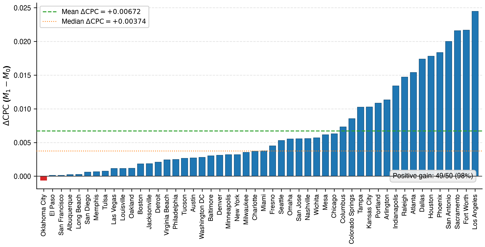
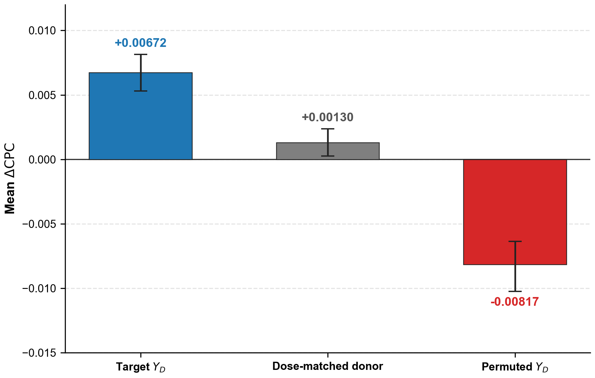
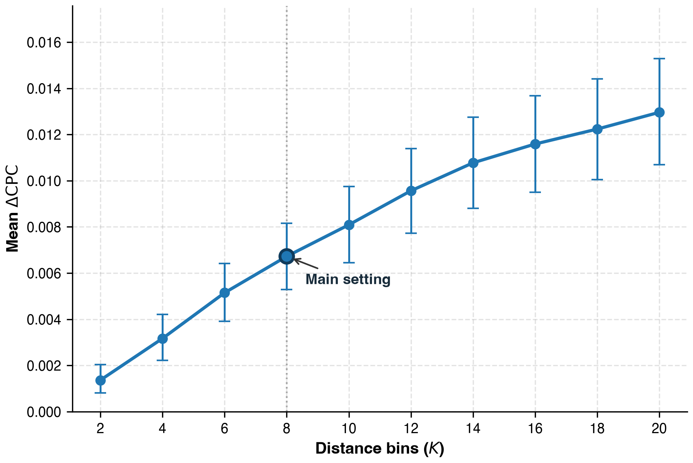
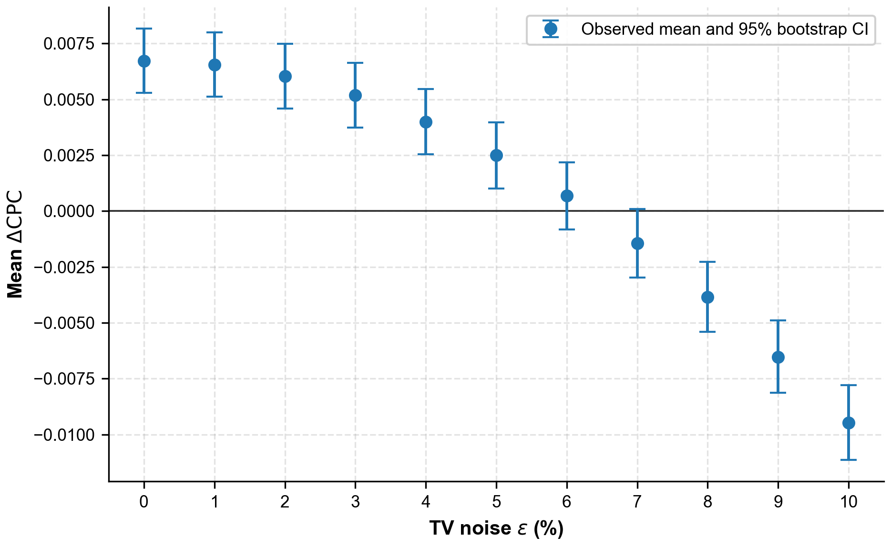
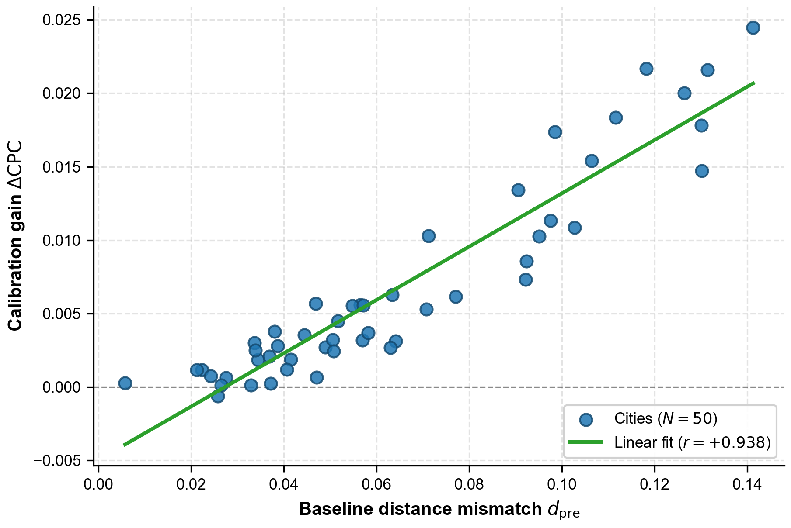
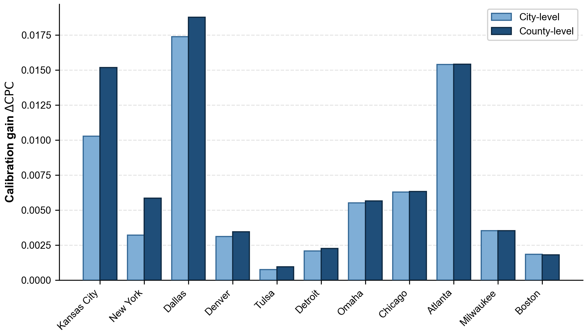

# Cải thiện tái tạo cường độ luồng OD zero-shot bằng phân phối di chuyển theo khoảng cách của thành phố mục tiêu

> **Trạng thái bản thảo:** Số liệu và hình thực nghiệm đã được cập nhật từ bộ `results/interzonal_only/artifacts`. Dữ liệu OD của bộ này đã được kiểm tra chỉ chứa các cặp liên vùng dương. Kết quả Gravity theo bộ mới đã được bổ sung đầy đủ. Metadata nguồn huấn luyện của checkpoint hiện có chưa đầy đủ, nên việc xác nhận toàn bộ chuỗi nguồn gốc thực nghiệm vẫn chưa hoàn tất.

## Tóm tắt

Việc chuyển giao mô hình sang một thành phố mới, nơi không có nhãn cường độ OD phục vụ huấn luyện, vẫn là một thách thức. Mặc dù các mô hình zero-shot đã khai thác đặc điểm đô thị và khoảng cách địa lý để thực hiện nhiệm vụ này, mức cải thiện độ chính xác mà phân phối di chuyển theo khoảng cách có thể mang lại cho các mô hình đó vẫn chưa được làm rõ. Để khảo sát giá trị của thông tin tổng hợp này, nghiên cứu sử dụng phân phối di chuyển theo khoảng cách của thành phố mục tiêu để hiệu chỉnh đầu ra của mô hình zero-shot được giữ nguyên tham số. Thí nghiệm được thực hiện trên tập hỗ trợ dương liên vùng đã biết, với phân phối oracle được tính trực tiếp từ dữ liệu OD tham chiếu.

Nghiên cứu áp dụng kiểm định chéo liên thành phố 5 lượt trên 50 vùng đô thị Hoa Kỳ. Với baseline GNN, hiệu chỉnh oracle cấp thành phố làm CPC tăng trung bình 0.00672, với 49/50 thành phố được cải thiện. So với các đối chứng được chuẩn hóa theo độ lớn can thiệp, phân phối mục tiêu cho kết quả tốt hơn, hỗ trợ vai trò của thông tin đặc thù theo thành phố và sự tương ứng giữa tín hiệu hiệu chỉnh với các nhóm khoảng cách. Trong phạm vi khảo sát, kết quả thử nghiệm cho thấy mức cải thiện trung bình tăng khi sử dụng nhiều nhóm khoảng cách hơn và giảm khi phân phối quan sát bị nhiễu. 

**Từ khóa:** ma trận nguồn–đích, tái tạo cường độ OD, phân phối di chuyển theo khoảng cách, zero-shot, học chuyển giao giữa các thành phố, quan sát tổng hợp, di chuyển không gian.

# 1. Giới thiệu

Ma trận nguồn–đích (OD) mô tả cường độ di chuyển giữa các đơn vị không gian và là đầu vào quan trọng cho phân tích giao thông và quy hoạch đô thị [@barbosa2018humanmobility]. Tuy nhiên, việc thu thập dữ liệu OD chi tiết tại thành phố mục tiêu thường gặp nhiều khó khăn. Ngay cả khi có dữ liệu, độ phủ và tính đại diện của dữ liệu đối với mô hình đi lại của toàn thành phố vẫn có thể bị hạn chế [@gallotti2024distorted; @pappalardo2023future]. Trong khi đó, luồng di chuyển phụ thuộc vào bối cảnh đô thị và đặc trưng địa phương, nên các quy luật học được từ thành phố này không nhất thiết phù hợp hoàn toàn với một thành phố khác. Vì vậy, các mô hình liên thành phố có thể dự báo kém chính xác hơn tại thành phố mục tiêu khi thiếu thông tin địa phương để hiệu chỉnh [@yang2014limits].

Các mô hình dự báo luồng di chuyển gần đây đã khai thác đặc điểm đô thị và khoảng cách địa lý để dự báo cho các thành phố mới [@enaya2026transgm; @guo2025ugnn; @simini2021deepgravity]. Trong thiết lập zero-shot, mô hình được huấn luyện trên các thành phố nguồn rồi áp dụng cho thành phố mục tiêu mà không sử dụng nhãn cường độ OD tại đó để huấn luyện hay cập nhật tham số. Tuy nhiên, mức độ suy giảm của luồng di chuyển theo khoảng cách có thể khác nhau giữa các bối cảnh đô thị [@lenormand2016comparison; @verma2025distance]. Vì vậy, quan hệ học được từ các thành phố nguồn có thể chưa phản ánh đúng cách lưu lượng di chuyển được phân bổ theo khoảng cách tại thành phố mục tiêu.

Cách phân bổ này được mô tả bằng phân phối di chuyển theo khoảng cách, cho biết tỷ trọng tổng lưu lượng nằm trong từng nhóm khoảng cách của một thành phố, nhưng không xác định cường độ luồng của từng cặp OD. Thông tin tổng hợp này có thể bổ sung cho khoảng cách địa lý của từng cặp vùng, vốn chỉ mô tả sự cách biệt về không gian. 

Trên cơ sở đó, nghiên cứu sử dụng phân phối của thành phố mục tiêu để hiệu chỉnh đầu ra của mô hình zero-shot, đồng thời giữ nguyên các tham số mô hình. Việc so sánh dự báo trước và sau hiệu chỉnh nhằm trả lời hai câu hỏi. Thứ nhất, hiệu chỉnh có cải thiện khả năng tái tạo cường độ luồng OD so với dự báo zero-shot ban đầu hay không và mức cải thiện là bao nhiêu? Thứ hai, kết quả hiệu chỉnh thay đổi như thế nào theo độ phân giải và chất lượng của phân phối quan sát? Để làm rõ nguồn gốc của mức cải thiện, nghiên cứu sử dụng các đối chứng nhằm kiểm tra vai trò của phân phối đúng thành phố và sự tương ứng giữa tín hiệu hiệu chỉnh với các nhóm khoảng cách.

Nghiên cứu áp dụng kiểm định chéo liên thành phố 5 lượt trên 50 vùng đô thị tại Hoa Kỳ để định lượng mức cải thiện và đánh giá ảnh hưởng của độ phân giải cũng như chất lượng phân phối đến kết quả hiệu chỉnh. Cụ thể, tại mỗi thành phố mục tiêu, mô hình chỉ tái tạo cường độ OD trên các cặp vùng khác nhau đã biết có luồng di chuyển. Phân phối dùng để hiệu chỉnh được tính từ các luồng OD thực trên chính tập đánh giá này, tạo thành thiết lập oracle nhằm đánh giá giá trị bổ sung của phân phối chính xác. Để kiểm tra tính ổn định của mức cải thiện, nghiên cứu còn thực hiện thí nghiệm với nhiều khởi tạo ngẫu nhiên và kiến trúc mô hình. Tuy nhiên, do thông tin hiệu chỉnh được tổng hợp từ luồng OD thực của tập đánh giá, hiệu quả khi sử dụng phân phối từ nguồn dữ liệu độc lập vẫn cần được kiểm chứng.
# 2. Nghiên cứu liên quan

## 2.1. Mô hình tương tác không gian và hiệu chỉnh dựa trên khoảng cách

Các mô hình tương tác không gian từ lâu đã biểu diễn luồng OD thông qua khả năng phát sinh, mức độ thu hút và lực cản không gian, trong đó khoảng cách hoặc chi phí di chuyển là thành phần cốt lõi của cấu trúc luồng [@ortuzar2011modelling; @wilson1971family]. Các phương pháp hiệu chỉnh cổ điển cho thấy thống kê tổng hợp về cự ly hoặc thời gian di chuyển có thể được sử dụng để xác định tham số lực cản. Hyman [@hyman1969calibration] đề xuất hiệu chỉnh mô hình phân bổ chuyến đi dựa trên chiều dài chuyến đi trung bình, trong khi Merlin [@merlin2020medians] sử dụng trung vị thời gian di chuyển để hiệu chỉnh mô hình tương tác không gian một tham số.

Các nghiên cứu so sánh cũng cho thấy quy luật suy giảm theo khoảng cách không cố định giữa các bộ dữ liệu và bối cảnh đô thị, mà có thể thay đổi theo phương thức di chuyển, mục đích chuyến đi, mức độ đô thị hóa và điều kiện kinh tế–xã hội [@verma2025distance]. Sự khác biệt này là cơ sở để xem xét hiệu chỉnh theo đặc điểm di chuyển của từng thành phố. Về cách thực hiện, phép nhân co giãn theo nhóm tỷ trọng quan sát có liên hệ chặt chẽ với phương pháp khớp tỷ lệ lặp (Iterative Proportional Fitting, IPF) hay thuật toán Furness trong quy hoạch giao thông cổ điển [@ortuzar2011modelling], vốn bắt nguồn từ nguyên lý chuẩn hóa bảng hai chiều của Deming và Stephan cũng như mô hình cực đại hóa entropy [@wilson1971family]. Khi tái phân bổ lưu lượng dự báo giữa các nhóm khoảng cách rời nhau, bước hiệu chỉnh có thể được thực hiện trực tiếp bằng một hệ số nhân cho mỗi nhóm. Nghiên cứu này áp dụng phép hiệu chỉnh đó cho đầu ra của baseline liên thành phố tại thời điểm suy luận, khi các tham số mô hình được giữ nguyên.

## 2.2. Mô hình học máy liên thành phố và quan sát tổng hợp

Khái quát hóa liên thành phố vẫn là một thách thức vì quan hệ giữa bối cảnh đô thị và luồng di chuyển có thể thay đổi giữa các thành phố. Yang et al. [@yang2014limits] cho thấy khả năng dự báo luồng đi làm bị giới hạn đáng kể khi thiếu dữ liệu địa phương dùng cho hiệu chỉnh. Kết quả này cho thấy việc sử dụng khoảng cách và đặc trưng đô thị không nhất thiết loại bỏ hoàn toàn nhu cầu về thông tin đặc thù của thành phố mục tiêu. Trong bối cảnh đó, quan sát tổng hợp cung cấp một mức thông tin trung gian giữa việc không có quan sát về cường độ luồng tại thành phố mục tiêu và quan sát trực tiếp toàn bộ ma trận OD. Các ràng buộc cổ điển như tổng luồng đi, tổng luồng đến hoặc mômen của chi phí di chuyển đã được sử dụng để bảo đảm các tổng lượng tương ứng của mô hình phù hợp với quan sát [@ortuzar2011modelling; @wilson1971family].

Khác với các phương pháp hiệu chỉnh một hoặc một số ít tham số, nghiên cứu này sử dụng trực tiếp tỷ trọng luồng theo từng nhóm khoảng cách, cho phép đánh giá giá trị của thông tin ở nhiều mức độ phân giải thông qua số lượng nhóm. Phân phối này cũng khác với tổng luồng đi, tổng luồng đến của từng vùng hoặc các cặp OD được quan sát trực tiếp: nó chỉ ràng buộc cách tổng lưu lượng được phân bổ giữa các nhóm khoảng cách, nhưng không xác định cách lưu lượng đó được phân bổ giữa các cặp nguồn–đích trong cùng một nhóm.

Các nghiên cứu trước đã làm rõ vai trò của khoảng cách và các ràng buộc trong mô hình tương tác không gian [@ortuzar2011modelling; @wilson1971family], đồng thời cho thấy khả năng khái quát hóa của các mô hình dự báo luồng và những giới hạn khi thiếu thông tin hiệu chỉnh địa phương [@guo2025ugnn; @simini2021deepgravity; @yang2014limits]. Tuy nhiên, vẫn chưa rõ phân phối di chuyển theo khoảng cách của chính thành phố mục tiêu có thể cung cấp thêm bao nhiêu giá trị sau khi mô hình liên thành phố đã học từ bối cảnh đô thị và khoảng cách giữa các cặp vùng, cũng như giá trị đó được duy trì trong những điều kiện quan sát nào. Nghiên cứu này xem xét khoảng trống đó bằng cách đo mức cải thiện sau khi cung cấp phân phối khoảng cách mục tiêu để hiệu chỉnh đầu ra của một baseline liên thành phố được giữ nguyên tham số.

# 3. Nguồn dữ liệu, đơn vị không gian và phương pháp luận

## 3.1. Ký hiệu và dữ liệu đầu vào

Gọi $c$ là một thành phố và $\mathcal{V}_c$ là tập các vùng đơn vị phân chia thành phố đó. Mỗi cặp có thứ tự $(i,j)$ với $i,j \in \mathcal{V}_c$ biểu diễn một cặp nguồn–đích (OD). 

### Bảng 1: Ký hiệu cốt lõi, nguồn dữ liệu và trạng thái sẵn có của thông tin

| Ký hiệu | Mô tả toán học | Nguồn / Vai trò |
| :--- | :--- | :--- |
| $c$ | Chỉ số thành phố ($c \in \{1, \dots, C\}$) | Mã định danh thành phố ($C = 50$) |
| $i, j$ | Chỉ số vùng xuất phát (origin) và vùng đích (destination) | Đơn vị không gian cơ sở |
| $t_{c,ij}$ | Cường độ luồng di chuyển quan sát được ($t_{c,ij} \ge 1$) | Dùng làm nhãn huấn luyện tại thành phố nguồn, còn tại thành phố mục tiêu được dùng để đánh giá và tổng hợp quan sát oracle. |
| $d_{c,ij}$ | Khoảng cách giữa tâm của vùng $i$ và vùng $j$ (km) | Tính từ tọa độ tâm (Haversine) |
| $\mathcal{P}_c$ | Không gian tất cả các cặp OD liên vùng hợp lệ ($\mathcal{P}_c = \{(i,j) \in \mathcal{V}_c \times \mathcal{V}_c : i \neq j, d_{c,ij} > 0\}$) | Không gian ứng viên liên vùng |
| $\Omega_c$ | Tập hỗ trợ liên vùng dương đã biết ($\Omega_c = \{(i,j) \in \mathcal{P}_c : t_{c,ij} \ge 1\}$) | Tập cặp OD được giả định đã biết và dùng chung cho dự báo, hiệu chỉnh và đánh giá. |
| $I_b$ | Khoảng giá trị khoảng cách xác định nhóm thứ $b$ ($b = 1, \dots, K$) | Khoảng giá trị xác định nhóm thứ $b$ |
| $K$ | Số nhóm khoảng cách ($K = 8$ ở thiết lập chính) | Cấu hình thực nghiệm cố định |
| $Y_{c,b}$ | Tỷ trọng luồng di chuyển mục tiêu trong nhóm $b$ ($\sum_{b=1}^K Y_{c,b} = 1$) | Dữ liệu đầu vào hiệu chỉnh oracle |
| $Y_{D,c}$ | Vector phân phối di chuyển theo khoảng cách của thành phố $c$, với $Y_{D,c} = (Y_{c,1}, \dots, Y_{c,K})$ | Quan sát tổng hợp oracle dùng để hiệu chỉnh tại thành phố mục tiêu. |
| $\widehat{t}_{c,ij}^{(0)}$ | Dự báo cường độ luồng của baseline cross-city zero-shot (điều kiện $M_0$) | Đầu ra baseline giữ nguyên tham số |
| $\widehat{t}_{c,ij}^{(1)}$ | Dự báo cường độ luồng sau hiệu chỉnh tại thời điểm suy luận (điều kiện $M_1$) | Đầu ra sau hiệu chỉnh |
| $M_0, M_1$ | Tên hai điều kiện thực nghiệm (baseline zero-shot giữ nguyên tham số và dự báo sau hiệu chỉnh) | Điều kiện thực nghiệm đối chứng |

Tại thành phố mục tiêu, baseline sử dụng đặc trưng đô thị, thông tin khoảng cách và tập hỗ trợ đã biết, còn phân phối $Y_{D,c}$ chỉ được cung cấp cho bước hiệu chỉnh.

## 3.2. Phạm vi hỗ trợ và biểu diễn không gian

Dữ liệu thực nghiệm bao gồm 50 vùng đô thị tại Hoa Kỳ, với tract là đơn vị không gian cơ sở. Mỗi tract được biểu diễn bằng tọa độ tâm và các đặc trưng đô thị. Bên cạnh đó, dữ liệu còn bao gồm khoảng cách giữa các cặp tract và cường độ luồng OD quan sát được. Nguồn và quy trình xây dựng benchmark sẽ được mô tả đầy đủ theo tài liệu dữ liệu gốc trước khi nộp bài.

Không gian tất cả các cặp OD liên vùng hợp lệ được xác định bởi:

$$
\mathcal{P}_c = \left\{(i,j) \in \mathcal{V}_c \times \mathcal{V}_c : i \neq j,\ d_{c,ij} > 0\right\}.
$$

Phạm vi đánh giá được giới hạn nghiêm ngặt trên tập hỗ trợ liên vùng dương đã biết:

$$
\Omega_c = \left\{(i,j) \in \mathcal{P}_c : t_{c,ij} \ge 1\right\}.
$$

Trong giao thức liên vùng thống nhất, các cặp nội vùng có $i=j$ được loại khỏi dữ liệu OD trước khi đưa vào mô hình. Giao thức quy định cả GNN, MLP và Gravity sử dụng tập $\Omega_c$ của các thành phố nguồn để huấn luyện hoặc ước lượng tham số. Tại các thành phố validation và kiểm tra, việc chọn checkpoint, hiệu chỉnh và đánh giá cũng chỉ sử dụng tập liên vùng tương ứng. Các vùng và đặc trưng đô thị vẫn được giữ nguyên để xây dựng biểu diễn không gian.

Mô hình dự báo cường độ luồng trên tập hỗ trợ dương $\Omega_c$, không giải quyết bài toán phát hiện liên kết (link discovery) hay phân loại cặp có luồng zero trong $\mathcal{P}_c$. Trong toàn bài, các cặp ngoài $\Omega_c$ được xem là chưa biết và không thuộc phạm vi đánh giá.

## 3.3. Phân phối di chuyển theo khoảng cách và cấu hình quan sát cấp thành phố

Nghiên cứu chia khoảng cách di chuyển thành $K$ nhóm và tính tỷ trọng tổng lưu lượng thuộc từng nhóm tại mỗi thành phố. Trong mỗi fold, các mốc chia được chọn sao cho số cặp OD liên vùng thuộc $\Omega_c$ của 35 thành phố huấn luyện trong các nhóm xấp xỉ bằng nhau, với mỗi cặp được tính một lần bất kể cường độ luồng. Các mốc này được xác định lại cho từng giá trị $K$ rồi áp dụng chung cho các thành phố validation và kiểm tra. Nếu một số phân vị trùng nhau, các mốc trùng được gộp lại để mỗi nhóm có độ rộng dương. Khi đó, số nhóm thực tế nhỏ hơn số nhóm yêu cầu ban đầu. Trong các công thức dưới đây, $K$ là số nhóm thực tế sau khi loại mốc trùng, còn $K_{\mathrm{act},c}$ là số nhóm chứa cặp OD tại thành phố $c$. Để bao phủ cả những khoảng cách ngoài phạm vi quan sát trong tập huấn luyện, mốc đầu được đặt tại $a_0=0$ và mốc cuối tại $a_K=+\infty$. Với nhóm thứ $b$ được ký hiệu là $I_b=(a_{b-1},a_b]$, tỷ trọng lưu lượng của nhóm được tính bằng tổng cường độ luồng trong nhóm chia cho tổng cường độ luồng của thành phố:

$$
Y_{c,b} = \frac{\sum_{(i,j) \in \Omega_c} t_{c,ij} \mathbf{1}(d_{c,ij} \in I_b)}{\sum_{(i,j) \in \Omega_c} t_{c,ij}}.
$$

Các tỷ trọng được chuẩn hóa để: $\sum_{b=1}^K Y_{c,b} = 1$.
Toàn bộ vector phân phối khoảng cách của thành phố $c$ được ký hiệu là $Y_{D,c} = (Y_{c,1}, \dots, Y_{c,K})$. Trong phần diễn giải, $Y_D$ được dùng như tên viết gọn cho loại quan sát này.

Do sử dụng chung các mốc chia từ tập huấn luyện, một số nhóm khoảng cách có thể không chứa cặp OD nào tại những thành phố có phạm vi địa lý nhỏ. Gọi $\mathcal A_c$ là tập các nhóm có ít nhất một cặp thuộc $\Omega_c$, và $K_{\mathrm{act},c}=|\mathcal A_c|$ là số nhóm hoạt động của thành phố $c$. Với nhóm rỗng, cả tỷ trọng lưu lượng quan sát và dự báo đều bằng 0. Vì không có cặp OD nào cần điều chỉnh trong nhóm này, nghiên cứu chỉ tính và áp dụng hệ số hiệu chỉnh cho các nhóm hoạt động, qua đó tránh phép chia cho 0. Các mốc chia khoảng cách vẫn được giữ nguyên. Trong thiết lập oracle, tỷ trọng của các nhóm hoạt động vốn đã có tổng bằng 1 nên không thay đổi khi bỏ qua nhóm rỗng. Quy trình chuẩn hóa và tính hệ số hiệu chỉnh được trình bày trong Phụ lục S2.

$Y_{D,c}$ được tổng hợp từ luồng ground-truth của thành phố mục tiêu và được sử dụng như một quan sát oracle tại thời điểm hiệu chỉnh. Một biến thể thăm dò sử dụng phân phối theo origin-county được đánh giá trên các vùng đô thị multi-county, thiết lập và giới hạn của phân tích này được trình bày trong Phụ lục S7.

## 3.4. Cấu trúc mô hình và hiệu chỉnh tại thời điểm suy luận

### 3.4.1. Các baseline và giao diện dự báo chung

Nghiên cứu sử dụng cả mô hình tương tác không gian truyền thống và mô hình học máy để đánh giá liệu lợi ích của phân phối khoảng cách mục tiêu có được duy trì trên các phương pháp dự báo khác nhau hay không. Gravity hai tham số được chọn làm mốc tham chiếu truyền thống, còn mạng nơ-ron đồ thị (Graph Neural Network, GNN) và mạng perceptron đa lớp (Multilayer Perceptron, MLP) cho phép khảo sát hiệu quả trên các mô hình học máy có và không khai thác quan hệ lân cận giữa các vùng. Để so sánh nhất quán, cả ba mô hình được quy định huấn luyện và đánh giá theo cùng giao thức liên thành phố, với dữ liệu OD chỉ gồm các cặp liên vùng thuộc $\Omega_c$. Điều kiện này được áp dụng từ bước huấn luyện đến bước hiệu chỉnh và đánh giá, nhờ đó loại bỏ sự khác biệt về việc sử dụng luồng nội vùng giữa các mô hình. Sau khi huấn luyện, các tham số được giữ cố định và đầu ra của từng mô hình được áp dụng cùng một phép hiệu chỉnh.

Trong nhóm mô hình học máy, GNN được sử dụng làm baseline chính. Mỗi tract được biểu diễn bằng 26 đặc trưng đô thị và được chiếu thành biểu diễn ẩn 64 chiều. Để kết hợp thông tin từ các vùng lân cận, mô hình sử dụng hai lớp truyền thông điệp có điều kiện theo khoảng cách, với phép tổng hợp trung bình lân cận, LayerNorm, kết nối residual và dropout 0.1. Các biểu diễn thu được sau đó được đưa vào decoder cặp OD, là một MLP có cấu trúc $130–64–32–1$. Decoder nhận biểu diễn của vùng xuất phát và vùng đích, khoảng cách biến đổi bằng $\log(1+d_{c,ij})$ và log gravity prior nội tại để tạo dự báo cường độ luồng. Hai tham số của gravity prior được học đồng thời với toàn bộ mạng.

Từ kiến trúc này, baseline MLP được xây dựng bằng cách thay hai lớp truyền thông điệp bằng hai khối residual MLP xử lý từng vùng độc lập. Các thành phần còn lại được giữ thống nhất với GNN, gồm đặc trưng đầu vào, kích thước biểu diễn ẩn, cấu trúc decoder, cấu hình huấn luyện và tổng số tham số. Hai decoder có cùng cấu trúc nhưng được học riêng trong từng mô hình, nên không dùng chung trọng số. Nhờ thiết kế so sánh có kiểm soát này, nghiên cứu có thể xem xét liệu lợi ích hiệu chỉnh có phụ thuộc vào cơ chế trao đổi thông tin giữa các vùng hay không.

Để mở rộng phép kiểm tra ra ngoài nhóm mô hình neural, nghiên cứu sử dụng thêm Gravity hai tham số. Mô hình này biểu diễn trực tiếp cường độ luồng thông qua tích dân số của vùng xuất phát và vùng đích cùng khoảng cách địa lý:

$$
\hat{t}_{c,ij}^{(0)} = \exp(G)\frac{P_{c,i}P_{c,j}}{\tilde d_{c,ij}^{\,\alpha}}, \qquad (i,j)\in\Omega_c.
$$

Trong đó, $G$ là logarit của hệ số quy mô toàn cục và $\alpha$ là tham số điều khiển mức độ phụ thuộc vào khoảng cách. Theo đó, luồng dự báo giảm theo khoảng cách khi $\alpha>0$. Ở đây, $P_{c,i}$ và $P_{c,j}$ là dân số của vùng xuất phát và vùng đích, còn $\tilde d_{c,ij}=\max(d_{c,ij},0.1\,\mathrm{km})$ là khoảng cách dùng trong công thức Gravity. Hai tham số $(G,\alpha)$ được ước lượng bằng bình phương tối thiểu trong không gian log trên dữ liệu liên vùng gộp từ các thành phố huấn luyện của từng fold, độc lập với các tham số gravity prior trong hai mô hình neural.

### 3.4.2. Mục tiêu và cấu hình huấn luyện

Dữ liệu huấn luyện chỉ gồm các cặp OD liên vùng thuộc $\Omega_c$ có lưu lượng quan sát là số nguyên dương. Hai baseline neural sử dụng phân phối nhị thức âm cắt cụt tại 0 (Zero-Truncated Negative Binomial, ZTNB) [@grogger1991truncated]. Để trình bày phân phối này, gọi $T$ là biến ngẫu nhiên biểu diễn cường độ luồng và $t$ là một giá trị quan sát. Phân phối nhị thức âm nền (NB) có trung bình $\mu>0$ và tham số phân tán $\phi>0$. Xác suất quan sát giá trị $t$ theo phân phối nền được ký hiệu là $p_{\mathrm{NB}}(t\mid\mu,\phi)$ và được tính như sau:

$$
p_{\mathrm{NB}}(t\mid\mu,\phi)
=
\frac{\Gamma(t+\phi)}{\Gamma(\phi)\Gamma(t+1)}
\left(\frac{\phi}{\phi+\mu}\right)^{\phi}
\left(\frac{\mu}{\phi+\mu}\right)^t,
\qquad t=0,1,2,\ldots
$$

Trong công thức, $\Gamma(\cdot)$ là hàm Gamma, với $\Gamma(t+1)=t!$ khi $t$ là số nguyên không âm. Theo cách tham số hóa này, phân phối NB nền có $E[T]=\mu$ và $\operatorname{Var}(T)=\mu+\mu^2/\phi$. Với cùng giá trị trung bình, $\phi$ nhỏ hơn tương ứng với phương sai lớn hơn.

Phân phối nền cho phép cả luồng bằng 0, với xác suất $p_{\mathrm{NB}}(0\mid\mu,\phi)=\left(\phi/(\phi+\mu)\right)^\phi$. Tuy nhiên, dữ liệu huấn luyện chỉ gồm các luồng dương. Vì vậy, nghiên cứu sử dụng phân phối ZTNB, ký hiệu là $p_+$, bằng cách loại trường hợp bằng 0 và chia các xác suất còn lại cho xác suất luồng dương:

$$
p_+(t\mid\mu,\phi)
=
\frac{p_{\mathrm{NB}}(t\mid\mu,\phi)}
{1-p_{\mathrm{NB}}(0\mid\mu,\phi)},
\qquad t=1,2,\ldots
$$

Mẫu số $1-p_{\mathrm{NB}}(0\mid\mu,\phi)$ bảo đảm tổng xác suất trên các giá trị dương bằng 1. Sự khác nhau về miền giá trị của $t$ trong hai công thức phản ánh bước điều kiện hóa này, không phải sự khác nhau giữa các tập dữ liệu. Việc loại giá trị luồng bằng 0 trong ZTNB khác với việc loại cặp nội vùng có $i=j$. Điều kiện liên vùng được áp dụng khi chọn các cặp OD, còn điều kiện luồng dương xác định miền giá trị của phân phối xác suất.

Với mỗi cặp OD, mạng dự báo tham số trung bình nền $\mu_{c,ij}$, còn $\phi$ được học cùng các tham số mạng và dùng chung cho mọi cặp trong mỗi mô hình. Tại mỗi thành phố nguồn $c$, hàm mất mát chỉ sử dụng các cặp liên vùng thuộc $\Omega_c$, thống nhất với phạm vi chọn checkpoint, hiệu chỉnh và đánh giá CPC. Hàm mất mát $\mathcal L_c$ là trung bình âm logarit xác suất của các luồng quan sát trên tập huấn luyện:

$$
\mathcal L_c
=
-\frac{1}{|\Omega_c|}
\sum_{(i,j)\in\Omega_c}
\log p_+(t_{c,ij}\mid\mu_{c,ij},\phi).
$$

Trong đó, $|\Omega_c|$ là số cặp liên vùng có luồng dương được dùng để huấn luyện tại thành phố $c$. Việc tối thiểu hóa hàm mất mát khuyến khích mô hình gán xác suất cao hơn cho các luồng đã quan sát. Mỗi bước cập nhật sử dụng một thành phố và lấy trung bình mất mát trên các cặp của thành phố đó.

Hai baseline neural sử dụng cùng cấu hình huấn luyện với thuật toán tối ưu AdamW [@loshchilov2019adamw], chọn checkpoint theo CPC trên tập validation và được huấn luyện với ba hạt giống khởi tạo ngẫu nhiên (random seed). Các phép biến đổi bảo đảm tham số dương và các biện pháp ổn định số học được trình bày trong Phụ lục S1. Khi suy luận, $\mu_{c,ij}$ chưa phải dự báo cường độ cuối cùng vì đây là trung bình của phân phối nền có cả trường hợp bằng 0. Dự báo được tính bằng kỳ vọng của phân phối sau khi điều kiện hóa trên luồng dương:

$$
\hat t_{c,ij}^{(0)}
=
\frac{\mu_{c,ij}}
{1-p_{\mathrm{NB}}(0\mid\mu_{c,ij},\phi)}.
$$

Do trường hợp $T=0$ không đóng góp vào kỳ vọng của phân phối nền, kỳ vọng trên luồng dương bằng trung bình nền chia cho xác suất luồng dương. Giá trị dự báo này có thể là số thập phân dù nhãn quan sát là số nguyên. Đây là dự báo baseline được đưa vào bước hiệu chỉnh ở mục 3.4.3. Kiến trúc và quy tắc huấn luyện được giữ cố định giữa các fold. Các phép biến đổi phụ thuộc dữ liệu được fit trên 35 thành phố huấn luyện của từng fold, còn checkpoint được chọn theo CPC của năm thành phố validation. Các thành phố kiểm tra không được sử dụng để chọn siêu tham số, checkpoint hoặc tiêu chí dừng. Chi tiết siêu tham số huấn luyện và các biện pháp ổn định số học được trình bày trong Phụ lục S1.

### 3.4.3. Toán tử hiệu chỉnh khoảng cách tại thời điểm suy luận

Từ dự báo ban đầu $\hat t_{c,ij}^{(0)}$ trên tập hỗ trợ $\Omega_c$, tỷ trọng lưu lượng dự báo thuộc nhóm khoảng cách thứ $b$ được tính bằng:

$$
\hat Y_{c,b}^{(0)}
=
\frac{
\sum_{(i,j)\in\Omega_c}
\hat t_{c,ij}^{(0)}
\mathbf{1}(d_{c,ij}\in I_b)
}{
\sum_{(i,j)\in\Omega_c}
\hat t_{c,ij}^{(0)}
}.
$$

Ký hiệu $p_{c,b}^{\mathrm{cond}}$ là tỷ trọng mục tiêu sau khi giới hạn trên các nhóm hoạt động và chuẩn hóa để tổng tỷ trọng trên các nhóm này bằng 1. Trong cấu hình oracle chính, các nhóm rỗng có tỷ trọng bằng 0 nên $p_{c,b}^{\mathrm{cond}} = Y_{c,b}$ trên các nhóm hoạt động. Dự báo của mỗi cặp OD được nhân với tỷ số giữa tỷ trọng mục tiêu và tỷ trọng dự báo của nhóm chứa cặp đó:

$$
\hat t_{c,ij}^{(1)}
=
\hat t_{c,ij}^{(0)}
\frac{p_{c,b(i,j)}^{\mathrm{cond}}}{\hat Y_{c,b(i,j)}^{(0)}},
\qquad (i,j)\in\Omega_c,
$$

trong đó $b(i,j)$ là nhóm chứa khoảng cách $d_{c,ij}$.

Trong cấu hình oracle chính, tỷ trọng mục tiêu và tỷ trọng dự báo đều dương trên các nhóm hoạt động, nên hệ số hiệu chỉnh dương. Sau hiệu chỉnh, phân phối lưu lượng theo nhóm khớp với phân phối mục tiêu, trong khi tổng lưu lượng dự báo được giữ nguyên. Các cặp OD trong cùng một nhóm nhận chung một hệ số nhân, nên tỷ lệ và thứ hạng giữa các dự báo trong nhóm đó không đổi, trong khi thứ hạng giữa các nhóm có thể thay đổi. Tuy nhiên, việc khớp tỷ trọng theo nhóm không bảo đảm CPC tăng, vì phân bổ tương đối giữa các cặp OD trong cùng nhóm vẫn do baseline quyết định và sai lệch về tổng lưu lượng dự báo không được điều chỉnh.

Chứng minh các tính chất này được trình bày trong Phụ lục S3, còn dạng hiệu chỉnh tổng quát với mức điều chỉnh $q\in[0,1]$ được trình bày trong Phụ lục S2. Cấu hình chính sử dụng $q=1$.

**Hình 1. Khung hiệu chỉnh oracle tại thời điểm suy luận.** Baseline $M_0$ được huấn luyện liên thành phố và giữ nguyên tham số trên thành phố mục tiêu. Phân phối khoảng cách oracle $Y_D$, được trích từ luồng tham chiếu của thành phố mục tiêu, dùng để tái phân bổ khối lượng giữa các khoảng và tạo các dự báo $\widehat{t}_{c,ij}^{(1)}$ trên cùng tập hỗ trợ $\Omega_c$.

## 3.5. Giao thức đánh giá cross-city và suy luận thống kê

### 3.5.1. Giao thức kiểm định chéo liên thành phố 5-fold

Nghiên cứu áp dụng giao thức kiểm định chéo liên thành phố 5-fold trên 50 vùng đô thị Hoa Kỳ (mỗi fold gồm 35 thành phố huấn luyện, 5 thành phố validation và 10 thành phố kiểm tra). Đơn vị phân chia fold là toàn bộ thành phố, nên không có bất kỳ cặp OD hoặc tract nào của cùng một thành phố bị phân tán giữa tập huấn luyện và tập kiểm tra.

### 3.5.2. Thước đo đánh giá và so sánh mô hình

Thước đo định lượng chính để đánh giá khả năng tái tạo luồng di chuyển zero-shot là Common Part of Commuters (CPC) [@lenormand2016comparison], được tính trên tập hỗ trợ liên vùng dương $\Omega_c$:

$$
\operatorname{CPC}_c(\widehat{t}) = \frac{2 \sum_{(i,j) \in \Omega_c} \min(t_{c,ij}, \widehat{t}_{c,ij})}{\sum_{(i,j) \in \Omega_c} t_{c,ij} + \sum_{(i,j) \in \Omega_c} \widehat{t}_{c,ij}}.
$$

CPC nằm trong $[0, 1]$, với giá trị lớn hơn biểu thị mức chồng lấp lớn hơn giữa cường độ dự báo và quan sát.

Ba thước đo bổ sung gồm NRMSE, RMSE trên thang $\log(1+x)$ và tương quan hạng Spearman được báo cáo trong Phụ lục S4 như các kiểm tra mô tả về mức độ nhất quán của kết quả. CPC vẫn là thước đo đánh giá chính và là cơ sở cho các phân tích suy luận thống kê.

Bên cạnh đó, phân phối khoảng cách gộp sau hiệu chỉnh được đối chiếu với $Y_D$ như một chẩn đoán cơ chế nội bộ nhằm xác nhận thuật toán đã tái phân bổ khối lượng đúng thiết kế. Cả ba họ mô hình (GNN, MLP, Gravity) được đánh giá trên cùng tập hỗ trợ bằng cùng thước đo CPC.

### 3.5.3. Phân tích thống kê và lượng hóa độ bất định

Đối với mỗi thành phố, mức cải thiện được tính từ chênh lệch CPC giữa dự báo sau hiệu chỉnh và baseline, sau đó lấy trung bình qua các model seeds trong từng thành phố và macro-average trên toàn bộ 50 thành phố. Thành phố là đơn vị thống kê ($N=50$). Kết quả của ba model seeds được trung bình trước khi thực hiện bootstrap và kiểm định Wilcoxon.

Khoảng tin cậy 95% được ước lượng bằng paired nonparametric bootstrap ở cấp thành phố, phân tầng theo fold [@efron1993bootstrap]. Các khoảng tin cậy này được tính có điều kiện trên cách chia fold và các mô hình đã huấn luyện được giữ cố định, không bao quát biến thiên do chia lại fold hoặc huấn luyện lại mô hình. Các chênh lệch ghép cặp được đánh giá bằng kiểm định Wilcoxon signed-rank hai phía [@wilcoxon1945ranking]. Khoảng tin cậy bootstrap được tính cho mức chênh lệch CPC trung bình giữa các thành phố. Kiểm định Wilcoxon signed-rank sử dụng dấu và thứ hạng của các chênh lệch ghép cặp, do đó đánh giá một khía cạnh khác của phân bố chênh lệch và không được diễn giải như một kiểm định trực tiếp đối với giá trị trung bình. Vì vậy, khoảng tin cậy bootstrap và kết quả Wilcoxon được báo cáo song song như hai mô tả bổ sung. Tỷ lệ thành phố có $\Delta\mathrm{CPC} > 0$ được báo cáo như một thống kê mô tả bổ sung. Các phân tích độ nhạy và độ bền tương ứng được trình bày trong Mục 4.

Trong stress-test nhiễu, mười mức dương $\epsilon\in\{0.01,0.02,\ldots,0.10\}$ thuộc cùng một họ Holm, còn mức $\epsilon=0$ chỉ là mốc mô tả và không thuộc họ này. Kiểm định Wilcoxon một phía được dùng cho giả thuyết lợi ích ($\Delta\mathrm{CPC}>0$). Các lượt lặp nhiễu được lấy trung bình trong từng model seed, rồi lấy trung bình qua ba seeds, giữ 50 giá trị cấp thành phố làm đơn vị suy luận. Mức nhiễu lớn nhất còn đáp ứng tiêu chí lợi ích được xác định trên lưới đã kiểm tra, với ba điều kiện: mức tăng CPC trung bình dương, CI 95% của trung bình nằm trên 0 và $p_{\mathrm{Holm}}<0.05$. Không nội suy điểm cắt giữa các mức nhiễu.

Ngoài các kiểm định chính, một phân tích cơ chế thăm dò đánh giá mối liên hệ giữa sai lệch phân phối khoảng cách của baseline và mức cải thiện sau hiệu chỉnh. Sai lệch ban đầu $d_{\mathrm{pre}}$ được tính bằng Total Variation giữa phân phối khoảng cách dự báo của baseline và phân phối tham chiếu. Tương quan Pearson và tương quan từng phần được báo cáo. Trong đó, tương quan từng phần kiểm soát độ chính xác baseline ($M_0$ CPC) và các đặc trưng quy mô không gian của thành phố gồm $\log N_{\mathrm{tracts}}$, $\log N_{\mathrm{pairs}}$ và khoảng cách địa lý trung bình.

# 4. Kết quả thực nghiệm

## 4.1. Phân phối khoảng cách mục tiêu có cải thiện tái tạo cường độ OD so với zero-shot hay không?

Trong thí nghiệm chính với GNN và phân phối oracle cấp thành phố ở độ phân giải $K=8$, hiệu chỉnh làm CPC liên vùng trung bình tăng từ 0.69498 lên 0.70170. Mức tăng trung bình đạt +0.00672, với khoảng tin cậy bootstrap 95% $[+0.00529,+0.00815]$ và 49/50 thành phố được cải thiện (Bảng 2). Kết quả kiểm định Wilcoxon hai phía cũng cho thấy sự khác biệt có ý nghĩa thống kê ($p=1.78\times10^{-14}$). Nhìn chung, mức cải thiện tuyệt đối nhỏ nhưng xuất hiện ở phần lớn thành phố.

Tuy nhiên, mức cải thiện khác nhau giữa các thành phố (Hình 2). Trung vị của mức tăng CPC là +0.00374, thấp hơn mức tăng trung bình, cho thấy một số thành phố có mức cải thiện lớn kéo giá trị trung bình lên. Trong khi đó, một thành phố có CPC giảm sau hiệu chỉnh (tỷ lệ bị tổn hại là 1/50 hay 2.0%). Vì vậy, phân phối khoảng cách chính xác giúp cải thiện dự báo ở phần lớn thành phố được đánh giá, nhưng không bảo đảm cải thiện trong mọi trường hợp.

**Hình 2. Mức thay đổi CPC theo thành phố sau hiệu chỉnh bằng phân phối khoảng cách oracle.**

Mỗi cột biểu diễn chênh lệch CPC giữa dự báo sau hiệu chỉnh và baseline GNN tại một thành phố, lấy trung bình qua ba seed và xếp từ thấp đến cao. Thí nghiệm sử dụng phân phối oracle cấp thành phố với $K=8$. Cột xanh biểu thị CPC tăng, cột đỏ biểu thị CPC giảm. Đường nét đứt và đường chấm lần lượt biểu diễn mức thay đổi trung bình (+0.00672) và trung vị (+0.00374).

### Bảng 2. Kết quả hiệu chỉnh oracle cấp thành phố với GNN trên 50 thành phố ($K=8$).

| Điều kiện | CPC trung bình ± SD | $\Delta\mathrm{CPC}$ trung bình | CI 95% của $\Delta\mathrm{CPC}$ trung bình | Thành phố cải thiện | Wilcoxon $p$ (hai phía) |
|:---|:---:|:---:|:---:|:---:|:---:|
| Baseline zero-shot ($M_0$) | $0.69498 \pm 0.04341$ | — | — | — | — |
| Hiệu chỉnh oracle ($M_1$) | $0.70170 \pm 0.04315$ | $+0.00672$ | $[+0.00529, +0.00815]$ | $49/50\ (98.0\%)$ | $1.78 \times 10^{-14}$ |

Chú thích: CPC được lấy trung bình qua ba seed trong từng thành phố trước khi tổng hợp trên 50 thành phố. SD là độ lệch chuẩn giữa các thành phố. CI 95% được tính cho mức tăng CPC trung bình bằng bootstrap ghép cặp cấp thành phố, phân tầng theo fold. P-value được tính bằng kiểm định Wilcoxon signed-rank hai phía trên các chênh lệch cấp thành phố. Thành phố được tính là cải thiện khi chênh lệch CPC trung bình qua ba seed lớn hơn 0.

## 4.2. Mức cải thiện có phụ thuộc vào phân phối của đúng thành phố và thứ tự các nhóm khoảng cách hay không?

Để kiểm tra liệu mức cải thiện có phụ thuộc vào phân phối của chính thành phố mục tiêu hay không, nghiên cứu sử dụng các đối chứng từ thành phố huấn luyện, phân phối trung bình tập huấn luyện và phép hoán vị log-ratio giữa các nhóm khoảng cách. Hai đối chứng đầu được chuẩn hóa về cùng độ lớn RMS của vector log-ratio đã trừ trung bình với tín hiệu mục tiêu (Phụ lục S6). Vì độ lớn tham chiếu được tính từ phân phối oracle, phép so sánh này kiểm tra nội dung tín hiệu khi độ lớn can thiệp đã được kiểm soát. Hiệu chỉnh bằng phân phối mục tiêu đạt mức tăng CPC trung bình +0.00672, so với +0.00130 của đối chứng donor và +0.00312 của đối chứng trung bình tập huấn luyện (Bảng 3).

Đối chứng trung bình tập huấn luyện sau chuẩn hóa tạo ra mức tăng CPC trung bình +0.00312 và trung vị +0.00135, với 33/50 thành phố cải thiện. Khoảng tin cậy bootstrap 95% là $[+0.00183,+0.00444]$, còn kiểm định Wilcoxon hai phía cho $p=0.000415$. Trong khi đó, đối chứng donor có khoảng tin cậy của trung bình nằm trên 0 nhưng Wilcoxon hai phía chưa cho thấy sự khác biệt có ý nghĩa ($p=0.2780$). Hai phép thống kê này phản ánh các đặc điểm khác nhau của phân bố chênh lệch giữa các thành phố.

Khi so sánh trực tiếp, phân phối mục tiêu cho CPC cao hơn đối chứng donor và đối chứng trung bình tập huấn luyện tại lần lượt 48/50 và 46/50 thành phố. Chênh lệch CPC trung bình tương ứng là +0.00542 và +0.00360, với cả hai khoảng tin cậy bootstrap 95% nằm hoàn toàn trên 0. Như vậy, trong các đối chứng được khảo sát, thông tin của đúng thành phố vẫn bổ sung giá trị sau khi đã kiểm soát độ lớn can thiệp.

Khi các thành phần của vector log-ratio mục tiêu đã trừ trung bình được hoán vị giữa các nhóm khoảng cách, CPC giảm trung bình 0.00817 so với baseline (Hình 3). Phân phối mục tiêu cho CPC cao hơn đối chứng hoán vị ở cả 50 thành phố, với chênh lệch trung bình +0.01489. Kết quả này hỗ trợ vai trò của sự tương ứng giữa tín hiệu hiệu chỉnh và các nhóm khoảng cách.

**Hình 3. Mức thay đổi CPC khi sử dụng phân phối đúng thành phố và các phân phối đối chứng giả dược (placebo controls).**

Các cột biểu diễn mức thay đổi CPC trung bình so với baseline GNN trên 50 thành phố khi sử dụng phân phối oracle của thành phố mục tiêu, phân phối đối chứng từ thành phố huấn luyện đã được điều chỉnh về cùng mức độ can thiệp (dose-matched donor), và đối chứng hoán vị log-ratio mục tiêu giữa các nhóm khoảng cách. Thanh sai số biểu diễn khoảng tin cậy bootstrap 95% của mức thay đổi trung bình, phân tầng theo fold. Đối chứng sử dụng phân phối trung bình của tập huấn luyện được báo cáo thêm trong Bảng 3.

### Bảng 3. Kết quả hiệu chỉnh với phân phối mục tiêu và các đối chứng trên 50 thành phố.

**Phần A. Thay đổi CPC so với baseline zero-shot**

| Điều kiện | $\Delta\mathrm{CPC}$ trung bình | CI 95% của $\Delta\mathrm{CPC}$ trung bình | Wilcoxon $p$ hai phía |
|:---|:---:|:---:|:---:|
| Phân phối oracle đúng thành phố | $+0.00672$ | $[+0.00530, +0.00813]$ | $1.78 \times 10^{-14}$ |
| Đối chứng từ thành phố huấn luyện, dose-matched | $+0.00130$ | $[+0.00025, +0.00236]$ | $2.78 \times 10^{-1}$ |
| Phân phối trung bình tập huấn luyện, dose-matched | $+0.00312$ | $[+0.00183, +0.00444]$ | $4.15 \times 10^{-4}$ |
| Đối chứng hoán vị log-ratio hiệu chỉnh | $-0.00817$ | $[-0.01026, -0.00637]$ | $1.78 \times 10^{-15}$ |

**Phần B. Chênh lệch CPC giữa phân phối đúng thành phố và từng đối chứng**

| Đối chứng | Chênh lệch CPC trung bình | CI 95% của chênh lệch trung bình | Wilcoxon $p$ một phía | Thành phố có CPC mục tiêu cao hơn đối chứng |
|:---|:---:|:---:|:---:|:---:|
| Đối chứng từ thành phố huấn luyện, dose-matched | $+0.00542$ | $[+0.00442, +0.00648]$ | $8.88 \times 10^{-15}$ | 48/50 |
| Phân phối trung bình tập huấn luyện, dose-matched | $+0.00360$ | $[+0.00272, +0.00455]$ | $5.68 \times 10^{-13}$ | 46/50 |
| Đối chứng hoán vị log-ratio hiệu chỉnh | $+0.01489$ | $[+0.01237, +0.01754]$ | $8.88 \times 10^{-16}$ | 50/50 |

Chú thích: Ở phần A, $\Delta\mathrm{CPC}$ là chênh lệch giữa dự báo sau hiệu chỉnh bằng từng phân phối và baseline zero-shot. Ở phần B, chênh lệch được tính bằng CPC khi dùng phân phối đúng thành phố trừ CPC khi dùng phân phối đối chứng. Do đó, giá trị dương cho biết phân phối đúng thành phố cho kết quả tốt hơn. Đối chứng từ thành phố huấn luyện được lấy trung bình qua 1.000 lượt chọn donor ngẫu nhiên. Đối với phép hoán vị, kết quả được lấy trung bình trên toàn bộ các hoán vị chỉ số khác hoán vị đồng nhất khi số lượng không vượt quá 1.000. Nếu vượt quá mức này, sử dụng 1.000 hoán vị được chọn ngẫu nhiên không hoàn lại. Kết quả của ba model seeds được lấy trung bình trước khi tổng hợp trên 50 thành phố. Khoảng tin cậy được tính cho chênh lệch trung bình bằng bootstrap ghép cặp cấp thành phố, phân tầng theo fold. Kiểm định Wilcoxon ở phần A là hai phía, còn ở phần B là một phía theo giả thuyết phân phối đúng thành phố cho CPC cao hơn đối chứng (các giá trị $p$ được báo cáo là $p$ gốc chưa điều chỉnh nhiều giả thuyết). Khoảng tin cậy bootstrap mô tả độ bất định của mức thay đổi trung bình, trong khi kiểm định Wilcoxon sử dụng dấu và thứ hạng của các chênh lệch ghép cặp. Vì vậy, hai kết quả phản ánh những đặc điểm khác nhau của phân bố chênh lệch giữa các thành phố.

## 4.3. Giá trị bổ sung của $Y_D$ phụ thuộc như thế nào vào độ phân giải và chất lượng quan sát?

Phần này đánh giá độ nhạy của mức cải thiện theo ba khía cạnh: số nhóm khoảng cách $K$, độ phân giải không gian của phân phối, và độ chính xác của quan sát dưới tác động của nhiễu.

Trước hết, khi số nhóm khoảng cách danh nghĩa tăng từ $K=2$ lên $K=20$, mức tăng CPC trung bình tăng từ +0.00137 lên +0.01296 (Bảng 4 và Hình 4). Tại cấu hình chính $K=8$, mức tăng đạt +0.00672, với 49/50 thành phố cải thiện. Mức tăng trung bình tăng trên toàn bộ các cấu hình được khảo sát, còn số thành phố cải thiện dao động từ 41 đến 49. Tuy nhiên, xu hướng trong thiết lập oracle này chưa xác định số nhóm tối ưu khi quan sát có nhiễu.

### Bảng 4. Mức thay đổi CPC theo số nhóm khoảng cách $K$ trên 50 thành phố.

| Số nhóm $K$ | $\Delta\mathrm{CPC}$ trung bình | Trung vị $\Delta\mathrm{CPC}$ | CI 95% của $\Delta\mathrm{CPC}$ trung bình | Thành phố cải thiện |
|:---|:---:|:---:|:---:|:---:|
| $K = 2$ | $+0.00137$ | $+0.00030$ | $[+0.00081, +0.00203]$ | 41/50 (82.0%) |
| $K = 4$ | $+0.00317$ | $+0.00111$ | $[+0.00223, +0.00421]$ | 43/50 (86.0%) |
| $K = 6$ | $+0.00515$ | $+0.00274$ | $[+0.00391, +0.00641]$ | 47/50 (94.0%) |
| $K = 8$ (cấu hình chính) | $+0.00672$ | $+0.00374$ | $[+0.00529, +0.00815]$ | 49/50 (98.0%) |
| $K = 10$ | $+0.00809$ | $+0.00583$ | $[+0.00645, +0.00974]$ | 49/50 (98.0%) |
| $K = 12$ | $+0.00956$ | $+0.00711$ | $[+0.00773, +0.01140]$ | 49/50 (98.0%) |
| $K = 14$ | $+0.01077$ | $+0.00782$ | $[+0.00881, +0.01275]$ | 49/50 (98.0%) |
| $K = 16$ | $+0.01159$ | $+0.00864$ | $[+0.00951, +0.01368]$ | 49/50 (98.0%) |
| $K = 18$ | $+0.01224$ | $+0.00916$ | $[+0.01005, +0.01441]$ | 49/50 (98.0%) |
| $K = 20$ | $+0.01296$ | $+0.01021$ | $[+0.01069, +0.01528]$ | 49/50 (98.0%) |

Chú thích: $\Delta\mathrm{CPC}$ là chênh lệch giữa dự báo sau hiệu chỉnh và baseline zero-shot ($M_0$ CPC trung bình $0.69498 \pm 0.04341$). Kết quả của ba model seeds được lấy trung bình trước khi tổng hợp trên 50 thành phố. Khoảng tin cậy được tính cho mức tăng trung bình bằng bootstrap ghép cặp cấp thành phố, phân tầng theo fold. Thành phố được tính là cải thiện khi chênh lệch trung bình qua ba seeds lớn hơn 0. $K$ là số khoảng danh nghĩa được xác định từ tập huấn luyện. Số khoảng hoạt động $K_{\mathrm{act},c}$ có thể nhỏ hơn $K$ tại những thành phố không có cặp OD trong một số khoảng cự ly xa.

**Hình 4. Mức thay đổi CPC trung bình theo số nhóm khoảng cách $K$.** Các điểm biểu diễn mức tăng CPC trung bình so với baseline trên 50 thành phố, còn thanh sai số biểu diễn khoảng tin cậy bootstrap 95%, phân tầng theo fold. Cấu hình chính $K=8$ được đánh dấu bằng đường gióng.

Mức cải thiện trung bình tăng trên toàn bộ dải $K$ được khảo sát. Kết quả này cho thấy độ phân giải danh nghĩa cao hơn có thể cung cấp thêm thông tin hiệu chỉnh, mặc dù số khoảng thực sự hoạt động còn phụ thuộc vào phạm vi khoảng cách của từng thành phố.

Ngoài độ phân giải theo khoảng cách, phân tích thăm dò trên 11 vùng đô thị có nhiều county cho thấy hiệu chỉnh theo county xuất phát làm CPC tăng thêm so với hiệu chỉnh cấp thành phố ở 10/11 trường hợp. Mức tăng bổ sung trung bình trong nhóm này là +0.00089. Khi gộp toàn bộ 50 thành phố, trong đó 39 vùng đơn county có chênh lệch bằng 0 theo cấu trúc, mức tăng trung bình là +0.00020. Kết quả gợi ý rằng phân nhóm quan sát theo county có thể bổ sung thông tin, nhưng cần kiểm tra trên nhiều vùng đô thị đa county hơn.

Về chất lượng của quan sát, mức tăng CPC trung bình giảm khi nhiễu Total Variation (TV) tăng lên trong miền thực nghiệm 0–10%, với bước 1% TV (Hình 5). Mức tăng giảm từ +0.00672 khi không có nhiễu xuống +0.00400 tại 4% TV, +0.00250 tại 5% TV và +0.00068 tại 6% TV; tại 7% TV, mức thay đổi trung bình là -0.00144. Như vậy, 6% TV là mức lớn nhất đã kiểm tra còn có mức tăng trung bình dương. CI 95% của trung bình còn nằm trên 0 tại 5% TV ([+0.00101, +0.00398]), nhưng bao gồm 0 tại 6% TV ([-0.00082, +0.00219]). Các kết luận này chỉ dựa trên các mức đã chạy thí nghiệm.

Trong mười mức nhiễu dương được khảo sát, 4% TV là mức lớn nhất còn đáp ứng đồng thời ba tiêu chí lợi ích: mức tăng trung bình dương, CI 95% nằm trên 0 và kiểm định Wilcoxon một phía có ý nghĩa sau hiệu chỉnh Holm ($p_{\mathrm{Holm}}=0.00579$), với 31/50 thành phố cải thiện. Tại 5% TV, mức tăng trung bình vẫn dương nhưng kiểm định không đạt tiêu chí này ($p_{\mathrm{Holm}}=0.7960$), với 25/50 thành phố cải thiện. Tại 6% và 7% TV, số thành phố cải thiện lần lượt là 18/50 và 15/50. Vì vậy, mức 4% TV là kết quả trong lưới khảo sát, không phải ngưỡng bảo đảm hiệu quả áp dụng cho từng thành phố.

**Hình 5. Mức thay đổi CPC trung bình theo mức nhiễu Total Variation thêm vào phân phối mục tiêu.** Các điểm biểu diễn kết quả thực nghiệm trên 50 thành phố tại các mức 0–10% TV, với bước 1%; thanh sai số biểu diễn khoảng tin cậy bootstrap 95% phân tầng theo fold. Mức tăng trung bình còn dương tại 6% TV và âm tại 7% TV. Hình không nội suy điểm cắt giữa các mức nhiễu.

Trong các cấu hình oracle được khảo sát, tăng số nhóm khoảng cách giúp tăng mức cải thiện trung bình. Nhiễu làm lợi ích suy giảm; mức tăng trung bình còn dương đến mức thực nghiệm 6% TV, trong khi tiêu chí lợi ích có ý nghĩa thống kê chỉ được duy trì đến mức thực nghiệm 4% TV.

## 4.4. Tính ổn định của mức cải thiện theo khởi tạo và kiến trúc baseline

Với các seed 1, 10 và 100 của GNN, mức thay đổi CPC trung bình lần lượt là +0.00791 (49/50 thành phố cải thiện), +0.00536 (45/50 thành phố cải thiện), +0.00690 (48/50 thành phố cải thiện), với trung bình qua ba seed đạt +0.00672. Lợi ích trung bình được duy trì qua cả ba lần khởi tạo đã khảo sát.

Mức tăng CPC trung bình đạt +0.00672 với GNN và +0.00503 với MLP, với số thành phố cải thiện tương ứng là 49/50 và 48/50. MLP giữ nguyên đầu vào, decoder cặp OD, cấu hình huấn luyện và quy mô tham số của GNN nhưng loại bỏ truyền thông điệp giữa các node. Kết quả ở hai mô hình cho thấy lợi ích hiệu chỉnh không phụ thuộc riêng vào thành phần truyền thông điệp trong cặp kiến trúc được so sánh.

### Bảng 5. Mức cải thiện CPC sau hiệu chỉnh oracle theo kiến trúc baseline trên 50 thành phố ($K=8$).

| Baseline | CPC trước hiệu chỉnh | CPC sau hiệu chỉnh | $\Delta\mathrm{CPC}$ trung bình | CI 95% của $\Delta\mathrm{CPC}$ trung bình | Thành phố cải thiện |
|:---|:---:|:---:|:---:|:---:|:---:|
| GNN | $0.69498$ | $0.70170$ | $+0.00672$ | $[+0.00531, +0.00812]$ | 49/50 (98.0%) |
| MLP | $0.69834$ | $0.70337$ | $+0.00503$ | $[+0.00389, +0.00627]$ | 48/50 (96.0%) |
| Gravity hai tham số | $0.38868$ | $0.38952$ | $+0.00083$ | $[+0.00017, +0.00154]$ | 22/50 (44.0%) |

Chú thích: CPC trước và sau hiệu chỉnh là trung bình trên 50 thành phố sau khi lấy trung bình ba seed trong từng thành phố đối với các mô hình neural. Chênh lệch được tính so với baseline tương ứng. CI 95% dùng bootstrap ghép cặp cấp thành phố, phân tầng theo fold. Mô hình Gravity hai tham số được ước lượng bằng OLS trên dữ liệu liên vùng gộp của các thành phố huấn luyện theo từng fold.

CPC trước hiệu chỉnh của GNN và MLP lần lượt là 0.69498 và 0.69834, trong khi Gravity hai tham số đạt 0.38868. Mặc dù MLP có CPC ban đầu cao hơn về mặt mô tả, GNN có mức tăng sau hiệu chỉnh lớn hơn. Cả hai mô hình neural đều cải thiện ở phần lớn thành phố (49/50 và 48/50). Trong khi đó, Gravity có mức tăng trung bình +0.00083 nhưng chỉ cải thiện ở 22/50 thành phố. Kiểm định Wilcoxon hai phía không cho thấy sự khác biệt có ý nghĩa thống kê ($p=0.709$). Khoảng tin cậy bootstrap của mức tăng trung bình nằm trên 0, còn Wilcoxon phản ánh dấu và thứ hạng của các chênh lệch, nên hai kết quả không mâu thuẫn. Nhìn chung, lợi ích hiệu chỉnh nhỏ hơn và kém nhất quán hơn trên Gravity. So sánh này mang tính mô tả và chưa đủ để quy sự khác biệt cho độ chính xác ban đầu hoặc khả năng biểu đạt của mô hình.

## 4.5. Mối liên hệ giữa sai lệch phân phối khoảng cách của baseline và mức cải thiện hiệu chỉnh

Nghiên cứu xem xét mối liên hệ giữa sai lệch phân phối khoảng cách của baseline và mức tăng CPC sau hiệu chỉnh. Sai lệch được đo bằng khoảng cách Total Variation giữa phân phối dự báo và phân phối oracle. Trên 50 thành phố được đánh giá, các thành phố có sai lệch lớn hơn thường có mức tăng CPC cao hơn (Hình 6).

Tương quan Pearson chưa điều chỉnh đạt $r=0.9383$. Sau khi kiểm soát CPC của baseline, số tract, số cặp OD và khoảng cách địa lý trung bình, tương quan từng phần vẫn dương ($r_{\mathrm{partial}}=0.9307$, $p=7.74\times10^{-21}$). Đây là mối liên hệ thăm dò trong tập thành phố được đánh giá, nên kết quả không bảo đảm rằng một thành phố có sai lệch lớn sẽ được cải thiện sau hiệu chỉnh.

**Hình 6. Mối liên hệ giữa sai lệch phân phối khoảng cách của baseline và mức tăng CPC sau hiệu chỉnh.** Mỗi điểm biểu diễn một thành phố ($N=50$) với GNN tại $K=8$, sau khi lấy trung bình các đại lượng tương ứng qua ba model seeds. Trục ngang là khoảng cách Total Variation giữa phân phối dự báo và phân phối oracle, còn trục dọc là chênh lệch CPC sau và trước hiệu chỉnh. Đường thẳng biểu diễn hồi quy tuyến tính giữa hai biến trên hình, chưa điều chỉnh theo các biến kiểm soát. Tương quan từng phần được báo cáo riêng trong mục 4.5.

# 5. Thảo luận

## 5.1. Giá trị bổ sung của phân phối khoảng cách trong dự báo liên thành phố

Khoảng cách giữa từng cặp vùng và phân phối lưu lượng theo khoảng cách cung cấp hai loại thông tin khác nhau. Khoảng cách mô tả quan hệ địa lý giữa các vùng, còn phân phối mục tiêu cho biết lưu lượng thực tế được phân bổ như thế nào giữa các nhóm khoảng cách. Việc hiệu chỉnh vẫn cải thiện CPC cho thấy, trong các baseline được đánh giá, thông tin tổng hợp này bổ sung cho những quan hệ đã học từ đặc trưng đô thị và khoảng cách địa lý.

Các mô hình như Deep Gravity và UGNN khai thác dữ liệu nguồn để học các quy luật di chuyển có khả năng chuyển giao giữa các thành phố [@guo2025ugnn; @simini2021deepgravity]. Nghiên cứu này bổ sung cho hướng tiếp cận đó bằng cách đánh giá phần cải thiện khi cung cấp thêm phân phối khoảng cách của thành phố mục tiêu cho một mô hình đã được huấn luyện. Do tham số mô hình được giữ nguyên, phần cải thiện được ghi nhận đến từ bước hiệu chỉnh đầu ra bằng quan sát tổng hợp, không kèm theo việc huấn luyện lại mô hình.

## 5.2. Khả năng và giới hạn của phép hiệu chỉnh khoảng cách

Hiệu chỉnh bằng $Y_D$ chỉ điều chỉnh phân bổ lưu lượng giữa các nhóm khoảng cách, không cung cấp thêm thông tin để phân biệt các cặp OD trong cùng một nhóm. Đồng thời, tổng lưu lượng dự báo được giữ nguyên, nên phép hiệu chỉnh không xử lý sai lệch về tổng lưu lượng của baseline. Vì vậy, toán tử chủ yếu khắc phục sai lệch về tỷ trọng giữa các nhóm khoảng cách, còn các sai lệch bên trong nhóm và sai lệch tổng lượng vẫn do baseline quyết định. Mối liên hệ giữa sai lệch phân phối ban đầu và mức tăng CPC ở mục 4.5 phù hợp với cơ chế này. Tuy nhiên, do sai lệch ban đầu được tính từ phân phối oracle, phân tích này không cung cấp một quy tắc độc lập để quyết định khi nào nên áp dụng hiệu chỉnh trên thực tế. 

Bên cạnh sai lệch phân phối, kết quả so sánh các kiến trúc cho thấy giá trị của thông tin mục tiêu còn phụ thuộc vào mô hình dự báo ban đầu. Mức tăng được duy trì trên hai baseline neural có CPC ban đầu cao hơn, trong khi nhỏ hơn và kém nhất quán trên Gravity. Mẫu kết quả này làm giảm khả năng kết quả chính chỉ là hệ quả của việc chọn một baseline có độ chính xác thấp. Tuy nhiên, GNN và MLP chia sẻ biểu diễn đầu vào và decoder, nên kết luận vẫn được giới hạn trong các mô hình đã khảo sát.

Các đối chứng đã khảo sát hỗ trợ vai trò của thông tin đặc thù theo thành phố và sự tương ứng giữa tín hiệu hiệu chỉnh với các nhóm khoảng cách. Kết quả này được duy trì khi độ lớn can thiệp được kiểm soát theo RMS của vector log-ratio đã trừ trung bình.

Về độ phân giải của quan sát, tăng số nhóm khoảng cách cung cấp thông tin chi tiết hơn để điều chỉnh lưu lượng theo dải cự ly, nhưng thí nghiệm này sử dụng phân phối oracle. Với quan sát thu thập độc lập, mức độ chi tiết và sai số của phân phối cần được xem xét đồng thời. Các thí nghiệm hiện tại chưa xác định được số nhóm phù hợp cho từng mức nhiễu.

## 5.3. Giới hạn và hướng nghiên cứu tiếp theo

Giới hạn chính của nghiên cứu là phân phối khoảng cách được tổng hợp từ chính dữ liệu OD tham chiếu của thành phố mục tiêu. Thiết lập oracle cho phép đánh giá lợi ích khi có phân phối chính xác trên tập hỗ trợ đã chọn, nhưng chưa xác nhận hiệu quả với một nguồn quan sát được thu thập độc lập. Các thí nghiệm gây nhiễu cũng chưa bao quát đầy đủ những sai lệch có thể xuất hiện trong dữ liệu thực tế, như hạn chế về độ phủ, tính đại diện và khác biệt về thời gian thu thập [@gallotti2024distorted; @pappalardo2023future]. Vì vậy, bước kiểm chứng tiếp theo là đánh giá các nguồn quan sát độc lập và mức độ tương thích của chúng với phạm vi không gian, thời gian và tập hỗ trợ dùng để tái tạo OD.

Ngoài ra, nghiên cứu chỉ tái tạo cường độ trên các cặp OD liên vùng đã biết có luồng dương, nên chưa đánh giá khả năng xác định cặp có luồng hoặc tái tạo toàn bộ ma trận OD. Các kết quả được ghi nhận trên 50 vùng đô thị Hoa Kỳ và các baseline đã khảo sát. Vì vậy, khả năng khái quát sang những bối cảnh khác vẫn cần được kiểm tra. Phân tích theo origin-county chỉ mang tính thăm dò do nhóm vùng đô thị có nhiều county chỉ gồm 11 trường hợp. Ranh giới hành chính cũng có thể không phản ánh các vùng di chuyển chức năng, nên cần kiểm tra thêm các cách phân chia không gian trước khi khái quát lợi ích của quan sát chi tiết hơn theo địa bàn.

Một hướng mở rộng khác là kết hợp phân phối khoảng cách với tổng luồng đi hoặc tổng luồng đến của từng vùng. Các ràng buộc này đã được sử dụng trong mô hình tương tác không gian [@ortuzar2011modelling; @wilson1971family] và có thể bổ sung thông tin theo vùng mà phân phối khoảng cách chưa cung cấp. Nghiên cứu tiếp theo cần kiểm tra liệu việc kết hợp các quan sát này có tạo thêm cải thiện khi cùng áp dụng cho một baseline được giữ cố định hay không.

Cuối cùng, phạm vi nghiên cứu giới hạn ở giá trị dự báo của quan sát tổng hợp và chưa bao gồm việc đánh giá mức bảo vệ quyền riêng tư. Việc tổng hợp dữ liệu thành phân phối khoảng cách tự nó không tạo thành một bảo đảm quyền riêng tư.

# 6. Kết luận

Trong thiết lập oracle trên 50 vùng đô thị Hoa Kỳ, phân phối di chuyển theo khoảng cách của thành phố mục tiêu giúp cải thiện tái tạo cường độ OD từ baseline zero-shot được giữ nguyên tham số. Với GNN, CPC tăng trung bình +0.00672 và 49/50 thành phố được cải thiện. Kết quả này cho thấy phân phối mục tiêu bổ sung thông tin hữu ích ngay cả khi baseline đã sử dụng đặc trưng đô thị và khoảng cách địa lý.

Tuy nhiên, mức cải thiện phụ thuộc vào độ phân giải và chất lượng của phân phối quan sát. Trong dải khảo sát, tăng số nhóm khoảng cách giúp tăng mức cải thiện trung bình, còn nhiễu làm lợi ích suy giảm. Trong các đối chứng đã khảo sát, phân phối đúng thành phố mục tiêu mang lại kết quả tốt hơn các phân phối từ tập huấn luyện và đối chứng hoán vị, cho thấy thông tin đặc thù theo thành phố và sự tương ứng với các nhóm khoảng cách đều có liên quan đến hiệu quả hiệu chỉnh. Các kết luận này giới hạn ở việc tái tạo cường độ luồng trên tập hỗ trợ liên vùng dương đã biết với phân phối oracle. Việc đánh giá phân phối được thu thập độc lập là bước tiếp theo để kiểm chứng khả năng áp dụng trong thực tế.

# 7. Tuyên bố về khả năng truy cập dữ liệu và mã nguồn

Bổ sung sau

# 8. Các tuyên bố và cam kết khoa học
Bổ sung sau

# 9. Tài liệu tham khảo

1. **Barbosa, H., Barthelemy, M., Ghoshal, G., James, C. R., Lenormand, M., Louail, T., Menezes, R., Ramasco, J. J., Simini, F., & Tomasini, M.** (2018). Human mobility: Models and applications. *Physics Reports*, 734, 1–74. [https://doi.org/10.1016/j.physrep.2018.01.001](https://doi.org/10.1016/j.physrep.2018.01.001)

2. **Efron, B., & Tibshirani, R. J.** (1993). *An introduction to the bootstrap*. Chapman & Hall.

3. **Enaya, A., Zhong, C., Batty, M., Morphet, R., & Lopane, F. D.** (2026). TransGM: Transferable gravity models for cross-city policy transfer. *Computers, Environment and Urban Systems*, 128, 102455. [https://doi.org/10.1016/j.compenvurbsys.2026.102455](https://doi.org/10.1016/j.compenvurbsys.2026.102455)

4. **GADM.** (n.d.). *GADM database of global administrative areas (Version 4.1)* [Data set]. Retrieved September 2, 2026, from [https://gadm.org/data.html](https://gadm.org/data.html)

5. **Gallotti, R., Maniscalco, D., Barthelemy, M., & De Domenico, M.** (2024). Distorted insights from human mobility data. *Communications Physics*, 7, 421. [https://doi.org/10.1038/s42005-024-01909-x](https://doi.org/10.1038/s42005-024-01909-x)

6. **Grogger, J. T., & Carson, R. T.** (1991). Models for truncated counts. *Journal of Applied Econometrics*, 6(3), 225–238. [https://doi.org/10.1002/jae.3950060302](https://doi.org/10.1002/jae.3950060302)

7. **Guo, J., Bai, S., Li, X., Xian, K., Liu, E., Ding, W., & Ma, X.** (2025). A universal geography neural network for mobility flow prediction in planning scenarios. *Computer-Aided Civil and Infrastructure Engineering*, 40, 5769–5789. [https://doi.org/10.1111/mice.13398](https://doi.org/10.1111/mice.13398)

8. **Holm, S.** (1979). A simple sequentially rejective multiple test procedure. *Scandinavian Journal of Statistics*, 6(2), 65–70. [https://www.jstor.org/stable/4615733](https://www.jstor.org/stable/4615733)

9. **Hyman, G. M.** (1969). The calibration of trip distribution models. *Environment and Planning A*, 1(1), 105–112. [https://doi.org/10.1068/a010105](https://doi.org/10.1068/a010105)

10. **Lenormand, M., Bassolas, A., & Ramasco, J. J.** (2016). Systematic comparison of trip distribution laws and models. *Journal of Transport Geography*, 51, 158–169. [https://doi.org/10.1016/j.jtrangeo.2015.12.008](https://doi.org/10.1016/j.jtrangeo.2015.12.008)

11. **Loshchilov, I., & Hutter, F.** (2019). Decoupled weight decay regularization. In *International Conference on Learning Representations (ICLR)*. [https://openreview.net/forum?id=Bkg6RiCqY7](https://openreview.net/forum?id=Bkg6RiCqY7)

12. **Merlin, L. A.** (2020). A new method using medians to calibrate single-parameter spatial interaction models. *Journal of Transport and Land Use*, 13(1), 49–70. [https://doi.org/10.5198/jtlu.2020.1614](https://doi.org/10.5198/jtlu.2020.1614)

13. **Ortúzar, J. de D., & Willumsen, L. G.** (2011). *Modelling transport* (4th ed.). John Wiley & Sons. [https://doi.org/10.1002/9781119993308](https://doi.org/10.1002/9781119993308)

14. **Pappalardo, L., Manley, E., Sekara, V., & Alessandretti, L.** (2023). Future directions in human mobility science. *Nature Computational Science*, 3, 588–600. [https://doi.org/10.1038/s43588-023-00469-4](https://doi.org/10.1038/s43588-023-00469-4)

15. **Simini, F., Barlacchi, G., Luca, M., & Pappalardo, L.** (2021). A Deep Gravity model for mobility flows generation. *Nature Communications*, 12, 6576. [https://doi.org/10.1038/s41467-021-26752-4](https://doi.org/10.1038/s41467-021-26752-4)

16. **Verma, R., & Ukkusuri, S. V.** (2025). What determines travel time and distance decay in spatial interaction and accessibility? *Journal of Transport Geography*, 122, 104061. [https://doi.org/10.1016/j.jtrangeo.2024.104061](https://doi.org/10.1016/j.jtrangeo.2024.104061)

17. **Wilcoxon, F.** (1945). Individual comparisons by ranking methods. *Biometrics Bulletin*, 1(6), 80–83. [https://doi.org/10.2307/3001968](https://doi.org/10.2307/3001968)

18. **Wilson, A. G.** (1971). A family of spatial interaction models, and associated developments. *Environment and Planning A*, 3(1), 1–32. [https://doi.org/10.1068/a030001](https://doi.org/10.1068/a030001)

19. **Yang, Y., Herrera, C., Eagle, N., & González, M. C.** (2014). Limits of predictability in commuting flows in the absence of data for calibration. *Scientific Reports*, 4, 5662. [https://doi.org/10.1038/srep05662](https://doi.org/10.1038/srep05662)

# Phụ lục phương pháp bổ sung (Supplementary Methods)

## S1. Chi tiết kiến trúc mạng neural GNN và ổn định số học

### S1.1. Các lớp tensor của GNN Encoder
Mạng GNN ánh xạ vector đặc trưng đô thị 26 chiều $\mathbf{x}_{c,i} \in \mathbb{R}^{26}$ và cấu trúc đồ thị bán kính không gian $\mathcal{G}_c = (\mathcal{V}_c, \mathcal{E}_c)$ thành biểu diễn ẩn 64 chiều $\mathbf{h}_{c,i} \in \mathbb{R}^{64}$:

1. **Chiếu nút ban đầu**:
$$
\mathbf{h}_{c,i}^{(0)} = \operatorname{Dropout}\bigl(\operatorname{ReLU}\bigl(\operatorname{LayerNorm}(\mathbf{W}_{\mathrm{in}} \mathbf{x}_{c,i} + \mathbf{b}_{\mathrm{in}})\bigr)\bigr).
$$

2. **Thông điệp điều kiện hóa theo khoảng cách**:
$$
\mathbf{m}_{ji}^{(\ell)} = \mathbf{W}_{\mathrm{msg}}^{(\ell)} \left[ \mathbf{h}_{c,j}^{(\ell-1)} \,\Vert\, \log(1 + d_{c,ji}) \right] + \mathbf{b}_{\mathrm{msg}}^{(\ell)}.
$$

3. **Tổng hợp thông điệp**:
$$
\mathbf{a}_{c,i}^{(\ell)} = \frac{1}{\max(\operatorname{deg}(i), 1)} \sum_{j \in \mathcal{N}(i)} \mathbf{m}_{ji}^{(\ell)}.
$$

4. **Biến đổi trạng thái nút**:
$$
\widetilde{\mathbf{h}}_{c,i}^{(\ell)} = \operatorname{LayerNorm}\bigl(\operatorname{ReLU}\bigl(\mathbf{a}_{c,i}^{(\ell)} + \mathbf{W}_{\mathrm{self}}^{(\ell)} \mathbf{h}_{c,i}^{(\ell-1)} + \mathbf{b}_{\mathrm{self}}^{(\ell)}\bigr)\bigr).
$$

5. **Cập nhật residual**:
$$
\mathbf{h}_{c,i}^{(\ell)} = \mathbf{h}_{c,i}^{(\ell-1)} + \operatorname{Dropout}\bigl(\widetilde{\mathbf{h}}_{c,i}^{(\ell)}\bigr).
$$

6. **Chiếu đầu ra**:
$$
\mathbf{h}_{c,i} = \mathbf{W}_{\mathrm{out}} \mathbf{h}_{c,i}^{(2)} + \mathbf{b}_{\mathrm{out}} \in \mathbb{R}^{64}.
$$

### S1.2. Ổn định số học và gradient clipping

Trong quá trình huấn luyện, log-likelihood của ZTNB được tính toán thông qua hàm `torch.lgamma`. Để ngăn hiện tượng tràn số hoặc biến mất gradient:

* Tham số trung bình cơ sở được chặn dưới: $\mu_{c,ij} = \operatorname{softplus}(\log T_{c,ij}^{\mathrm{grav}} + \operatorname{residual}_{c,ij}) + 10^{-4}$.
* Tham số phân tán được chặn trong không gian log: $\log \phi_{\mathrm{safe}} = \operatorname{clamp}(\log \phi, \text{min}=-10.0, \text{max}=10.0)$, sau đó $\phi = \exp(\log \phi_{\mathrm{safe}})$.
* Hằng số ổn định $\epsilon = 10^{-8}$ được cộng vào $\mu$ và $\phi$ trong các số hạng logarit. Đồng thời, xác suất tại 0 được chuẩn hóa số học qua $\log(1 - p_{\mathrm{NB}}(0)) = \operatorname{log1p}(-\exp(\log p_{\mathrm{NB}}(0)))$ với chặn trên $1.0 - 10^{-7}$. Khi suy luận kỳ vọng điều kiện, mẫu số $1 - p_{\mathrm{NB}}(0)$ được chặn dưới bằng $10^{-6}$.
* Gradient của toàn bộ tham số mô hình được cắt theo chuẩn Euclid tối đa: $\|\mathbf{g}\|_2 \le 5.0$ thông qua `torch.nn.utils.clip_grad_norm_`.

### S1.3. Danh sách 26 đặc trưng và đồ thị không gian

Theo thứ tự cột trong `src.data.dataset.NODE_FEATURE_COLUMNS`, 26 đặc trưng được chia thành ba nhóm. Nhóm thứ nhất gồm 13 đặc trưng Census: `total_population`, `median_age`, `median_income`, `per_capita_income`, `employment_rate`, `unemployment_rate`, `commute_transit_pct`, `commute_active_pct`, `commute_wfh_pct`, `zero_vehicle_pct`, `avg_vehicles_per_household`, `higher_education_pct`, `homeownership_rate`. Nhóm thứ hai gồm 8 đặc trưng POI: `office`, `office_density`, `industrial`, `industrial_density`, `commercial`, `commercial_density`, `education_primary`, `education_primary_density`. Nhóm cuối gồm 5 đặc trưng Road: `road_length_total`, `road_density`, `road_count`, `motorway_length`, `primary_length`. 

Khi đọc CSV, các giá trị thiếu được gán bằng 0, đồng thời NaN/Inf cũng được thay bằng 0. Các cột này không được biến đổi logarit. Trong mỗi fold, `load_cities()` khớp một `StandardScaler` trên đặc trưng nút gộp của 35 thành phố huấn luyện. Sau đó, dữ liệu validation và thành phố mục tiêu chỉ được biến đổi bằng `transform` với các thống kê đã học. Các thống kê chuẩn hóa này được lưu trong checkpoint.

Để xây dựng đồ thị, mỗi tract được xem là một nút có tọa độ tâm `(lon, lat)` lấy từ `meta.csv`. Khoảng cách giữa các nút được tính bằng công thức Haversine với bán kính Trái Đất 6371 km. Cấu hình chính sử dụng đồ thị bán kính 5.0 km có cạnh tự nối và các cạnh hai chiều sau bước đối xứng hóa. Cạnh tự nối trong đồ thị phục vụ xử lý đặc trưng của từng vùng, không phải nhãn luồng OD nội vùng và không bị loại khi lọc các cặp OD có $i=j$. Nếu một nút không có nút lân cận khác trong bán kính này, mã nguồn nối nó với nút gần nhất. Mỗi cạnh mang thuộc tính khoảng cách địa lý theo km. Như vậy, đồ thị được xây dựng từ thông tin địa lý quan sát được mà không sử dụng luồng OD.

### S1.4. Cấu hình siêu tham số kiến trúc và phân tách baseline

Cấu hình siêu tham số chính xác được trích xuất trực tiếp từ các checkpoint mô hình (`results/checkpoints/5fold_*.pt` và `mlp_*.pt`) được tổng hợp trong Bảng S1.

#### Bảng S1: Siêu tham số kiến trúc và huấn luyện của các zero-shot baseline
| Thành phần | Siêu tham số | Giá trị | Mô tả chi tiết |
|:---|:---|:---:|:---|
| **GNN Encoder** | Số chiều đặc trưng đầu vào ($d_{\mathrm{in}}$) | 26 | Đặc trưng nhân khẩu, kinh tế và xã hội của tract |
| | Số lớp truyền thông điệp (Message passing) | 2 | Khối `GraphConvLayer` có điều kiện khoảng cách |
| | Cơ chế Attention / Số attention heads | N/A (0) | Tổng hợp lân cận bằng trung bình và không dùng attention |
| | Chiều ẩn / Chiều đầu ra node embedding | 64 | LayerNorm(64) + ReLU + Dropout |
| | Xác suất Dropout | 0.1 | Chiếu đầu vào, cập nhật residual, chiếu đầu ra |
| | Loại đồ thị không gian | Radius graph | Bán kính địa lý $r = 5.0$ km có self-loops |
| **Pairwise Decoder** | Chiều vector đầu vào | 130 | Ghép $[\mathbf{h}_i \,(64) \parallel \mathbf{h}_j \,(64) \parallel \log(1+d) \,(1) \parallel \log T^{\mathrm{grav}} \,(1)]$ |
| | Các tầng ẩn | [64, 32] | Tầng 1: 64 (LayerNorm+ReLU+Dropout), tầng 2: 32 (ReLU+Dropout) |
| | Tầng đầu ra | 1 | Đầu ra neural residual khởi tạo bằng 0 |
| | Gravity prior nội tại | $(G, \alpha)$ khả vi | Khởi tạo tại $G_0=0.0, \alpha_0=1.0$ và huấn luyện end-to-end qua AdamW |
| **Tối ưu hóa** | Hàm mục tiêu | ZTNB NLL | Hợp lý Zero-Truncated Negative Binomial |
| | Thuật toán tối ưu | AdamW | Bước tối ưu city-by-city (city-balanced) |
| | Tốc độ học ban đầu (Initial LR) | 0.0032 | $3.2 \times 10^{-3}$ |
| | Hệ số suy giảm trọng số (Weight decay) | 0.0001 | $10^{-4}$ |
| | Hạt giống ngẫu nhiên (Model seeds) | $\{1, 10, 100\}$ | Ba khởi tạo độc lập cho từng fold |
| | Số epoch tối đa (Maximum epochs) | 200 | Cố định cho mọi fold |
| | Bộ điều chỉnh LR (Scheduler) | ReduceLROnPlateau | Hệ số 0.5, patience 4 epochs, min LR $10^{-5}$ |
| | Dừng sớm (Early stopping patience) | 16 epochs | Theo dõi trên CPC liên vùng tập validation ($\min \Delta = 10^{-4}$) |
| | Quy tắc chọn checkpoint | Best validation CPC | Lưu checkpoint đạt CPC cao nhất trên 5 validation cities |
| | Tổng số tham số mô hình | 33,668 | Giữ cùng tổng số tham số giữa GNN và MLP |

**Ghi chú phân tách tham số:** Hai tham số $(G_{\mathrm{NN}}, \alpha_{\mathrm{NN}})$ của gravity prior nội tại trong các mạng neural là các biến khả vi được tối ưu hóa đồng thời end-to-end cùng toàn bộ mạng qua AdamW và được lưu trữ trực tiếp trong checkpoint. Ngược lại, baseline Gravity hai tham số cổ điển độc lập được ước lượng riêng biệt bằng phương pháp bình phương tối thiểu pooled log-linear OLS trên các thành phố huấn luyện. Hai mô hình này hoàn toàn không dùng chung hay chia sẻ hệ số với nhau.

**Giao thức liên vùng thống nhất:** Script `run_interzonal_experiment.py` tạo bản dữ liệu riêng chỉ giữ các cặp có $i\ne j$, $d_{c,ij}>0$ và luồng quan sát dương. Bản dữ liệu gồm 6.065.339 cặp OD thuộc 50 thành phố, sau khi loại 11.775 cặp nội vùng khỏi dữ liệu gốc. Khoảng cách dùng để xác định biên nhóm, tổng hợp phân phối và hiệu chỉnh được lấy từ dữ liệu khoảng cách gốc. Các vùng và đặc trưng đô thị vẫn được giữ nguyên. Kết quả được lưu riêng tại `results/interzonal_only/artifacts`.

**Dấu vết tái lập:** Phân chia thành phố được lưu tại `results/e1/splits_manifest_v2.json`. Checkpoint của bộ mới nằm tại `results/interzonal_only/artifacts/checkpoints`. Bảng và hình trong bản thảo được cập nhật từ artifact trong cùng bộ, với danh sách nguồn và kiểm tra nhất quán lưu tại `paper/interzonal_update_audit.json`. Metadata checkpoint hiện có còn thiếu thông tin phạm vi huấn luyện và hash dữ liệu, nên chưa thể tự động xác nhận đầy đủ nguồn huấn luyện. Không dùng kết quả Direct-OD và Partial-OD lịch sử để bổ sung cho bộ này.

## S2. Dạng tổng quát của toán tử hiệu chỉnh giải tích ($q \in [0, 1]$)

Tham số cường độ hiệu chỉnh $q \in [0, 1]$ điều khiển mức độ can thiệp của thông tin khoảng cách mục tiêu:

- $q = 0$: giữ nguyên dự báo ban đầu của baseline ($\widehat{t}^{(1)} \equiv \widehat{t}^{(0)}$).
- $q = 1$: khớp đầy đủ tỷ trọng luồng theo từng nhóm khoảng cách hoạt động.
- Thiết lập chính cố định $q = 1$.

Ở cấu hình chính $K=8$, 40/50 thành phố có đủ tám nhóm hoạt động, còn tại 10 thành phố còn lại, một hoặc nhiều nhóm cự ly xa không chứa cặp OD, dẫn đến $K_{\mathrm{act},c}\in[5,7]$. Thuật toán chỉ thực hiện hiệu chỉnh trên tập nhóm hoạt động $\mathcal A_c$.

Các công thức dưới đây giả định tập $\Omega_c$ không rỗng và dự báo ban đầu dương trên mọi cặp thuộc tập này. Khi tỷ trọng mục tiêu dương trên các nhóm hoạt động, các hệ số hiệu chỉnh cũng dương. Nếu tỷ trọng mục tiêu bằng 0 ở một nhóm hoạt động, hệ số của nhóm đó bằng 0 khi $q>0$, nên không còn bảo toàn tính dương hoặc thứ hạng nghiêm ngặt trong nhóm. Tại $q=0$, hệ số được quy ước bằng 1 để giữ nguyên dự báo ban đầu.

Quy trình hiệu chỉnh tổng quát được thực hiện qua các bước:

### S2.1. Tập các nhóm hoạt động
Tập các nhóm hoạt động $\mathcal A_c$ được xác định trực tiếp từ sự tồn tại của các cặp OD thuộc tập hỗ trợ $\Omega_c$:
$$
\mathcal A_c = \left\{ b \in \{1, \dots, K\} : \exists(i,j) \in \Omega_c,\ d_{c,ij} \in I_b \right\},
$$
với $K_{\mathrm{act},c} = |\mathcal A_c|$. Trên tập hỗ trợ dương, nhóm có ít nhất một cặp OD có tỷ trọng oracle dương. Do dự báo baseline cũng dương trên tập hỗ trợ, nhóm đó có tỷ trọng dự báo dương. Về định nghĩa, tập nhóm hoạt động được xác định từ sự tồn tại của cặp OD, không phụ thuộc vào độ lớn tỷ trọng oracle. Nếu một triển khai dùng ngưỡng số học trên tỷ trọng để xác định nhóm hoạt động, cần đối chiếu với định nghĩa này để bảo đảm không bỏ sót nhóm có lưu lượng nhỏ.

### S2.2. Phân phối mục tiêu điều kiện trên các nhóm hoạt động
Tỷ trọng mục tiêu được điều kiện hóa trên các nhóm hoạt động theo:
$$
p_{c,b}^{\mathrm{cond}} = \frac{Y_{c,b} \mathbf{1}(b \in \mathcal A_c)}{\sum_{r \in \mathcal A_c} Y_{c,r}}.
$$
Việc điều kiện hóa bảo đảm tổng tỷ trọng trên các nhóm hoạt động bằng 1. Công thức yêu cầu tổng tỷ trọng mục tiêu trên tập nhóm hoạt động lớn hơn 0. Điều kiện này luôn thỏa mãn với phân phối oracle trên tập hỗ trợ dương không rỗng. Với phân phối ngoài tập hoặc phân phối đối chứng không có khối lượng trên các nhóm hoạt động, tỷ trọng có điều kiện không xác định và cần quy định cách xử lý riêng.

### S2.3. Trọng số hiệu chỉnh mềm
Với mỗi nhóm hoạt động $b \in \mathcal A_c$, tỷ lệ co giãn mềm được tính theo:
$$
w_{c,b}(q) = \biggl( \frac{p_{c,b}^{\mathrm{cond}}}{\widehat{Y}_{c,b}^{(0)}} \biggr)^q, \qquad b \in \mathcal A_c.
$$

### S2.4. Hệ số chuẩn hóa và hệ số co giãn
Hệ số chuẩn hóa bảo toàn tổng khối lượng và hệ số co giãn tương ứng là:
$$
Z_c(q) = \sum_{r \in \mathcal A_c} \widehat{Y}_{c,r}^{(0)} w_{c,r}(q), \qquad s_{c,b}(q) = \frac{w_{c,b}(q)}{Z_c(q)}.
$$

### S2.5. Dự báo sau hiệu chỉnh
Cường độ luồng dự báo sau hiệu chỉnh cho cặp $(i,j)$ được xác định bởi:
$$
\widehat{t}_{c,ij}^{(1)} = s_{c,b(i,j)}(q) \widehat{t}_{c,ij}^{(0)},
$$
trong đó $b(i,j)$ là nhóm cự ly chứa cặp $(i,j)$.

### S2.6. Trường hợp chính $q = 1$
Trong cấu hình oracle chính, các nhóm ngoài $\mathcal A_c$ không chứa cặp OD thuộc tập hỗ trợ nên có tỷ trọng mục tiêu bằng 0. Vì vậy, trên các nhóm hoạt động, $p^{\mathrm{cond}}_{c,b}=Y_{c,b}$. Với $q=1$, hệ số chuẩn hóa bằng 1 và hệ số hiệu chỉnh trở thành:
$$
Z_c(1)=1,
\qquad
s_{c,b}(1)
=
\frac{Y_{c,b}}{\widehat Y_{c,b}^{(0)}},
\qquad b\in \mathcal A_c.
$$
Kết quả này không yêu cầu tất cả $K$ nhóm đều hoạt động và thu về toán tử hiệu chỉnh trình bày ở mục 3.4.3.

## S3. Chứng minh giải tích các đặc tính bất biến

Các chứng minh dưới đây xét dự báo baseline dương trên $\Omega_c$ và tỷ trọng mục tiêu dương trên mọi nhóm hoạt động. Các điều kiện này được thỏa mãn trong cấu hình oracle chính.

### S3.1. Bảo toàn tập hỗ trợ
Vì $s_{c,b}(q) > 0$ trên mọi nhóm hoạt động, một dự báo dương trước hiệu chỉnh vẫn dương sau hiệu chỉnh. Toán tử chỉ hoạt động trên $\Omega_c$, nên không tạo thêm liên kết bên ngoài tập hỗ trợ đã biết:
$$
\widehat{t}_{c,ij}^{(1)} > 0 \quad \Longleftrightarrow \quad \widehat{t}_{c,ij}^{(0)} > 0, \qquad (i,j) \in \Omega_c.
$$

### S3.2. Bảo toàn thứ hạng nội khoảng
Với hai cặp $(i,j)$ và $(u,v)$ cùng thuộc khoảng $b$, ta có:
$$
\frac{\widehat{t}_{c,ij}^{(1)}}{\widehat{t}_{c,uv}^{(1)}} = \frac{s_{c,b}(q) \widehat{t}_{c,ij}^{(0)}}{s_{c,b}(q) \widehat{t}_{c,uv}^{(0)}} = \frac{\widehat{t}_{c,ij}^{(0)}}{\widehat{t}_{c,uv}^{(0)}}.
$$
Do đó, tỷ số giữa hai dự đoán trong cùng một khoảng không đổi và thứ tự nội bộ của các cặp trong khoảng đó được bảo toàn. Tuy nhiên, kết luận này không mở rộng thành bảo toàn thứ hạng toàn thành phố.

### S3.3. Bảo toàn tổng khối lượng dự báo
Gọi $S_c^{(0)}$ là tổng khối lượng dự báo của baseline:
$$
S_c^{(0)} = \sum_{(i,j) \in \Omega_c} \widehat{t}_{c,ij}^{(0)}.
$$
Tổng khối lượng luồng sau hiệu chỉnh thỏa mãn:
$$
\begin{aligned}
\sum_{(i,j) \in \Omega_c} \widehat{t}_{c,ij}^{(1)} &= S_c^{(0)} \sum_{b \in \mathcal A_c} \widehat{Y}_{c,b}^{(0)} s_{c,b}(q) \\
&= \frac{S_c^{(0)}}{Z_c(q)} \sum_{b \in \mathcal A_c} \widehat{Y}_{c,b}^{(0)} w_{c,b}(q) \\
&= S_c^{(0)}.
\end{aligned}
$$
Vì $S_c^{(0)}$ chính là tổng khối lượng dự báo trước hiệu chỉnh, toán tử bảo toàn tổng khối lượng dự báo của baseline.

### S3.4. Quan hệ giữa hiệu chỉnh và CPC

Gọi $S_c=\sum_{(i,j)\in\Omega_c}t_{c,ij}$ là tổng lưu lượng quan sát và $\widehat S_c=\sum_{(i,j)\in\Omega_c}\widehat t_{c,ij}$ là tổng lưu lượng dự báo. Với các luồng không âm, CPC có thể viết lại thành:

$$
\operatorname{CPC}_c(\widehat t)=1-\frac{\sum_{(i,j)\in\Omega_c}|t_{c,ij}-\widehat t_{c,ij}|}{S_c+\widehat S_c}.
$$

Do phép hiệu chỉnh bảo toàn tổng lưu lượng dự báo, mẫu số không đổi giữa hai điều kiện. Vì vậy, CPC tăng khi và chỉ khi tổng sai số tuyệt đối trên các cặp OD giảm. Việc khớp chính xác tỷ trọng giữa các nhóm không bảo đảm điều kiện này, vì phép nhân chung trong mỗi nhóm vẫn có thể làm tăng sai số của một số cặp. Phân phối oracle do đó là thông tin tổng hợp chính xác, không phải một bảo đảm về CPC tối ưu hay một cận trên của độ chính xác.

## S4. Các thước đo đánh giá bổ sung

Ngoài CPC, nghiên cứu báo cáo ba thước đo bổ sung trên cùng tập hỗ trợ liên vùng dương $\Omega_c$. Các thước đo này được sử dụng để kiểm tra mô tả liệu hướng thay đổi sau hiệu chỉnh có được duy trì khi xem xét độ lớn sai số và thứ hạng của các luồng hay không. CPC vẫn là thước đo chính, nên nghiên cứu không thực hiện thêm kiểm định giả thuyết cho các thước đo bổ sung.

1. **RMSE chuẩn hóa (NRMSE)**:
$$
\overline{t}_c = \frac{1}{\lvert\Omega_c\rvert} \sum_{(i,j)\in\Omega_c} t_{c,ij}, \qquad \operatorname{NRMSE}_c = \frac{\sqrt{\frac{1}{\lvert\Omega_c\rvert} \sum_{(i,j)\in\Omega_c} (t_{c,ij} - \widehat{t}_{c,ij})^2}}{\overline{t}_c}.
$$

2. **RMSE trên thang log ($\operatorname{RMSE}_{\mathrm{log1p}}$)**:
$$
\operatorname{RMSE}_{\mathrm{log1p},c} = \sqrt{ \frac{1}{\lvert\Omega_c\rvert} \sum_{(i,j)\in\Omega_c} \bigl[ \log(1+t_{c,ij}) - \log(1+\widehat{t}_{c,ij}) \bigr]^2 }.
$$

3. **Hệ số tương quan hạng Spearman ($\rho_{\mathrm{Spearman}}$)**: Tương quan hạng Spearman được tính giữa các vector cường độ quan sát và dự báo trên $\Omega_c$. Giá trị lớn hơn biểu thị mức độ phù hợp cao hơn về thứ hạng giữa các cặp OD.

### Bảng S2: Các thước đo đánh giá bổ sung cho GNN với $K=8$.

| Thước đo | Baseline $M_0$ | Sau hiệu chỉnh $M_1$ | Thay đổi trung bình | Trung vị thay đổi | Thành phố cải thiện |
|:---|---:|---:|---:|---:|---:|
| NRMSE $\downarrow$ | 1.70597 | 1.67182 | -0.03415 | -0.02347 | 42/50 |
| $\operatorname{RMSE}_{\mathrm{log1p}}$ $\downarrow$ | 0.93084 | 0.89099 | -0.03985 | -0.02142 | 46/50 |
| Spearman $\rho$ $\uparrow$ | 0.76821 | 0.77024 | +0.00203 | +0.00099 | 38/50 |

Chú thích: Các giá trị được tính trên tập hỗ trợ $\Omega_c$. Với mỗi thành phố, kết quả được lấy trung bình qua ba model seeds trước khi macro-average trên 50 thành phố. Mũi tên chỉ hướng tốt hơn của từng thước đo. “Thành phố cải thiện” được xác định bằng mức giảm đối với NRMSE và $\operatorname{RMSE}_{\mathrm{log1p}}$, và mức tăng đối với Spearman. Các kết quả này mang tính mô tả bổ sung, còn các khoảng tin cậy và kiểm định giả thuyết chính của nghiên cứu dựa trên CPC. RMSE trên thang $\log(1+x)$ cũng giảm, cho thấy mức cải thiện vẫn xuất hiện khi ảnh hưởng của các luồng cường độ rất lớn được giảm bớt.

## S5. Giao thức Bootstrap phân tầng theo fold và kiểm định thống kê

1. **Giao thức Bootstrap phân tầng theo fold**:
   - Đơn vị lấy mẫu lại là thành phố.
   - Việc lấy mẫu có hoàn lại được thực hiện riêng trong từng fold.
   - Mỗi fold lấy lại 10 thành phố từ 10 thành phố kiểm tra ban đầu.
   - Hai điều kiện $M_0$ và $M_1$ luôn được giữ ghép cặp.
   - Các cặp OD không được lấy mẫu lại độc lập.

   Gọi $\mathcal{C}^{*(r)}$ là multiset gồm 50 thành phố được lấy lại ở bootstrap replicate $r$ ($r = 1, \dots, B$ với $B = 10{,}000$ và $C = 50$):
$$
\overline{\Delta}^{*(r)} = \frac{1}{C} \sum_{c\in\mathcal{C}^{*(r)}} \Delta_c, \qquad r = 1, \dots, B.
$$

2. **Khoảng tin cậy bootstrap 95%**:
$$
\mathrm{CI}_{95\%} = \bigl[ Q_{0.025}\bigl(\overline{\Delta}^*\bigr), Q_{0.975}\bigl(\overline{\Delta}^*\bigr) \bigr].
$$

3. **Kiểm định Wilcoxon signed-rank hai phía**: Kiểm định Wilcoxon signed-rank hai phía sử dụng dấu và thứ hạng của các chênh lệch ghép cặp để đánh giá liệu phân bố chênh lệch có dịch chuyển nhất quán khỏi 0 hay không. Kiểm định này không trực tiếp kiểm định giá trị trung bình của các chênh lệch.

4. **Hiệu chỉnh Holm–Bonferroni** [@holm1979sequential]:
   Đối với họ gồm $M$ giả thuyết:
$$
p_{(k)} \leq \frac{\alpha}{M - k + 1}, \qquad k = 1, \dots, M.
$$
   Các $p$-value được sắp xếp tăng dần. Quy trình step-down dừng tại giả thuyết đầu tiên không thỏa điều kiện bác bỏ.

5. **Họ kiểm định của stress-test nhiễu**: Mười mức dương $\epsilon=0.01,0.02,\ldots,0.10$ dùng cùng một hiệu chỉnh Holm và kiểm định Wilcoxon một phía với đơn vị là 50 giá trị cấp thành phố. $\epsilon=0$ không thuộc họ Holm. CI 95% của mức tăng trung bình được tính bằng 10.000 lượt bootstrap cấp thành phố, phân tầng theo fold. Báo cáo riêng mức lớn nhất đã kiểm tra còn có trung bình dương và mức lớn nhất đáp ứng đồng thời trung bình dương, CI nằm trên 0 và $p_{\mathrm{Holm}}<0.05$. Không ước lượng điểm cắt liên tục bằng nội suy.

6. **Phân biệt các giả thuyết kiểm định**: Với $\Delta_c=\operatorname{CPC}_c(M_1)-\operatorname{CPC}_c(M_0)$, hiệu ứng chính được đánh giá bằng Wilcoxon hai phía. Khi so sánh phân phối mục tiêu với một đối chứng, chênh lệch được định nghĩa bằng CPC mục tiêu trừ CPC đối chứng và kiểm định một phía xét hướng mục tiêu tốt hơn. Kiểm định Wilcoxon signed-rank giả định các chênh lệch độc lập giữa các đơn vị và phân bố chênh lệch đối xứng để diễn giải theo độ dịch chuyển. Các thành phố trong cùng fold dùng chung mô hình đã huấn luyện, nên suy luận được hiểu có điều kiện trên các mô hình và cách chia fold đã cố định. Với độ nhạy theo $K$, kiểm định lợi ích tại từng $K$ hoặc so sánh với $K=8$ không thay thế cho kiểm định tính đơn điệu theo $K$.

7. **Tương quan từng phần**: Sau khi hồi quy hai biến lên cùng tập biến kiểm soát và hệ số chặn, tương quan Pearson giữa hai phần dư cho hệ số tương quan từng phần $r$. Với $n$ quan sát và $k$ biến kiểm soát độc lập tuyến tính, thống kê kiểm định được tính bằng:

$$
t_r=r\sqrt{\frac{n-k-2}{1-r^2}},\qquad \nu=n-k-2.
$$

Giá trị p hai phía được tính từ phân phối Student với $\nu$ bậc tự do theo các giả định của kiểm định tương quan từng phần tuyến tính. Không sử dụng trực tiếp p-value Pearson của hai phần dư với bậc tự do $n-2$. Tương quan này mô tả mối liên hệ sau khi kiểm soát tuyến tính các biến đã chọn, không chứng minh quan hệ nhân quả. Hệ số $R^2$ của hồi quy đa biến thuộc về toàn bộ mô hình và không được quy cho riêng một biến giải thích.

## S6. Chi tiết kỹ thuật các stress-test độ bền

1. **Tổng hợp nhiễu Total Variation (TV Noise Bisection)**:
   * Áp dụng trên các bin hoạt động có $p_b > 0$ ($b = 1, \dots, K_{\mathrm{act}}$). Vector nhiễu chuẩn hóa được trừ kỳ vọng (centered) theo đúng triển khai trong mã nguồn:
$$
z_b^{\mathrm{ctr}} = z_b - \frac{1}{K_{\mathrm{act}}} \sum_{r=1}^{K_{\mathrm{act}}} z_r, \qquad z_b \sim \mathcal{N}(0, 1).
$$
   * Tỷ trọng nhiễu thu được qua exponential tilting:
$$
p_b(\sigma) = \frac{\exp\bigl(\log p_b + \sigma z_b^{\mathrm{ctr}}\bigr)}{\sum_{r=1}^{K_{\mathrm{act}}} \exp\bigl(\log p_r + \sigma z_r^{\mathrm{ctr}}\bigr)}.
$$
   * Hệ số co giãn $\sigma$ được giải bằng phương pháp chia đôi (bisection solver) để khoảng cách Total Variation đạt đúng mức quy định $\epsilon$:
$$
\operatorname{TV}\bigl(p(\sigma), p\bigr) = \frac{1}{2} \sum_{b=1}^{K_{\mathrm{act}}} \lvert p_b(\sigma) - p_b \rvert = \epsilon.
$$

   Mức nhiễu TV đo độ sai khác giữa hai phân phối tỷ trọng và không biểu thị tỷ lệ chuyến đi bị đo sai hay tỷ lệ sai số của từng cặp OD. Thí nghiệm dùng $K=8$, seeds mô hình $\{1,10,100\}$, năm fold, 50 thành phố, một replicate tại $\epsilon=0$ và 1,000 replicate tại mỗi mức dương. Kết quả được lấy trung bình qua các lượt lặp nhiễu trong từng seed, rồi lấy trung bình qua các seed trước khi thực hiện suy luận ở cấp thành phố. Các khoảng tin cậy bootstrap phản ánh biến thiên giữa các thành phố đánh giá, có điều kiện trên cách chia fold, checkpoint và pipeline đã cố định. Vì vậy, chúng không bao quát biến thiên do huấn luyện lại mô hình hoặc chia lại fold.

2. **Đối chứng Placebo và chuẩn hóa liều can thiệp (Dose-Matched Controls)**:

   Để kiểm soát độ lớn can thiệp theo RMS của vector log-ratio đã trừ trung bình, các đối chứng được co giãn về cùng giá trị RMS với tín hiệu hiệu chỉnh mục tiêu. Với mỗi thành phố đánh giá, gọi $\widehat{Y}^{(0)}$ là phân phối khoảng cách do mô hình zero-shot $M_0$ dự báo trên các khoảng hoạt động ($b \in \mathcal A_c$). Vector log-ratio của phân phối mục tiêu và liều can thiệp mục tiêu $D_T$ (được định nghĩa bằng chuẩn root-mean-square đã khử kỳ vọng, $D_T = \|\tilde{\mathbf{r}}_T\|_2 / \sqrt{K_{\mathrm{act}}}$) được xác định bởi:

$$
r_{T,b} = \log\left(\frac{Y_{D,b}^{\mathrm{target}}}{\widehat{Y}_b^{(0)}}\right), \qquad \tilde{r}_{T,b} = r_{T,b} - \frac{1}{K_{\mathrm{act}}} \sum_{m\in\mathcal A_c} r_{T,m}, \qquad D_T = \sqrt{\frac{1}{K_{\mathrm{act}}} \sum_{b\in\mathcal A_c} \tilde{r}_{T,b}^2}.
$$

   - **Đối chứng từ thành phố huấn luyện (Wrong-City Donors, Dose-Matched)**: Với mỗi lượt rút donor ngẫu nhiên từ tập huấn luyện trong cùng fold ($B_{\mathrm{draw}} = 1.000$), gọi $Y_D^{\mathrm{donor}}$ là phân phối của thành phố donor. Trước khi tính log-ratio, quy trình lấy các tỷ trọng donor trên tập nhóm hoạt động của thành phố mục tiêu. Nếu có tỷ trọng nhỏ hơn $\delta=10^{-12}$, các tỷ trọng được chặn dưới tại $\delta$ rồi chuẩn hóa lại trên tập này. Tỷ trọng dự báo của baseline dùng trong log-ratio cũng được chặn dưới tại $\delta$. Vector log-ratio sau đó được trừ trung bình trên các nhóm hoạt động trước khi tính RMS. Log-ratio ban đầu và liều can thiệp donor $D_D$ được tính qua:

$$
r_{D,b} = \log\left(\frac{Y_{D,b}^{\mathrm{donor}}}{\widehat{Y}_b^{(0)}}\right), \qquad \tilde{r}_{D,b} = r_{D,b} - \frac{1}{K_{\mathrm{act}}} \sum_{m\in\mathcal A_c} r_{D,m}, \qquad D_D = \sqrt{\frac{1}{K_{\mathrm{act}}} \sum_{b\in\mathcal A_c} \tilde{r}_{D,b}^2}.
$$

   Khi $D_D \ge 10^{-12}$, vector log-ratio của donor được co giãn về cùng độ lớn RMS với vector mục tiêu:

$$
\tilde{r}_{D,b}^* = \tilde{r}_{D,b} \frac{D_T}{D_D}.
$$

   Phân phối donor sau khi chuẩn hóa liều được tái tạo bởi:

$$
p_{D,b}^* = \frac{\widehat{Y}_b^{(0)} \exp(\tilde{r}_{D,b}^*)}{\displaystyle\sum_{m\in\mathcal A_c} \widehat{Y}_m^{(0)} \exp(\tilde{r}_{D,m}^*)}, \qquad b \in \mathcal A_c.
$$

   Khi $D_D < 10^{-12}$, vector log-ratio đã trừ trung bình có độ lớn dưới ngưỡng số học và hướng co giãn được xem là suy biến. Khi đó, mã nguồn gán mức chênh lệch bằng kết quả của target ($\Delta\mathrm{CPC} = \Delta\mathrm{CPC}_{\mathrm{target}}$). Trường hợp suy biến cần được ghi nhận riêng khi kiểm tra kết quả.

   - **Đối chứng trung bình tập huấn luyện (Training-Mean Donor, Dose-Matched)**: Phân phối đối chứng được tính bằng trung bình cộng các phân phối khoảng cách đã chuẩn hóa của 35 thành phố huấn luyện trong fold tương ứng, với trọng số bằng nhau cho mỗi thành phố. Phân phối trung bình được xử lý bằng cùng hàm log-ratio và quy tắc ổn định số học như đối chứng donor. Trong các fold được đánh giá, phân phối trung bình trước bước chặn dưới có tỷ trọng dương trên mọi nhóm hoạt động của thành phố mục tiêu. Log-ratio và liều can thiệp $D_M$ được tính qua:

$$
r_{M,b} = \log\left(\frac{\overline{Y}_{D,\mathrm{train},b}}{\widehat{Y}_b^{(0)}}\right), \qquad \tilde{r}_{M,b} = r_{M,b} - \frac{1}{K_{\mathrm{act}}} \sum_{m\in\mathcal A_c} r_{M,m}, \qquad D_M = \sqrt{\frac{1}{K_{\mathrm{act}}} \sum_{b\in\mathcal A_c} \tilde{r}_{M,b}^2}.
$$

   Khi $D_M \ge 10^{-12}$, vector log-ratio được co giãn về cùng liều $D_T$:

$$
\tilde{r}_{M,b}^* = \tilde{r}_{M,b} \frac{D_T}{D_M}.
$$

   Phân phối sau khi chuẩn hóa liều được tái tạo bởi:

$$
p_{M,b}^* = \frac{\widehat{Y}_b^{(0)} \exp(\tilde{r}_{M,b}^*)}{\displaystyle\sum_{m\in\mathcal A_c} \widehat{Y}_m^{(0)} \exp(\tilde{r}_{M,m}^*)}, \qquad b \in \mathcal A_c.
$$

   Khi $D_M < 10^{-12}$, vector log-ratio đã trừ trung bình có độ lớn dưới ngưỡng số học và mã nguồn gán $\Delta\mathrm{CPC} = \Delta\mathrm{CPC}_{\mathrm{target}}$. Trường hợp suy biến cần được ghi nhận riêng khi kiểm tra kết quả.

   - **Đối chứng hoán vị log-ratio hiệu chỉnh**: Để kiểm tra vai trò của sự tương ứng giữa tín hiệu hiệu chỉnh và các nhóm khoảng cách, nghiên cứu hoán vị các thành phần của vector log-ratio mục tiêu đã trừ trung bình trên tập nhóm hoạt động: $\tilde{r}_{P,b} = \tilde{r}_{T,\pi(b)}$, trong đó $\pi$ là một hoán vị trên $\mathcal A_c$ khác hoán vị đồng nhất ($\pi \neq \mathrm{id}$). Trong cấu hình chính $K=8$, quy trình trước hết tạo tập các hoán vị chỉ số khác hoán vị đồng nhất trên các nhóm hoạt động. Nếu tập này có không quá 1.000 phần tử, toàn bộ các hoán vị được sử dụng. Nếu có nhiều hơn 1.000 phần tử, quy trình chọn ngẫu nhiên 1.000 hoán vị không hoàn lại. Kết quả đối chứng được tính bằng trung bình CPC trên các hoán vị được sử dụng. Trong benchmark được đánh giá, 3 thành phố sử dụng toàn bộ tập hoán vị hợp lệ, với số lượng lần lượt là 719, 119 và 119, còn 47 thành phố còn lại sử dụng 1.000 hoán vị mỗi thành phố. Phép hoán vị bảo toàn chuẩn Euclid và RMS của vector log-ratio đã trừ trung bình ($\|\tilde{\mathbf{r}}_P\|_2 = \|\tilde{\mathbf{r}}_T\|_2 = \sqrt{K_{\mathrm{act}}} D_T$), đồng thời làm ngẫu nhiên sự tương ứng giữa các thành phần của vector này và các nhóm khoảng cách. Phân phối hoán vị sau đó được tái tạo qua:

$$
p_{P,b} = \frac{\widehat{Y}_b^{(0)} \exp(\tilde{r}_{P,b})}{\displaystyle\sum_{m\in\mathcal A_c} \widehat{Y}_m^{(0)} \exp(\tilde{r}_{P,m})}, \qquad b \in \mathcal A_c.
$$

## S7. Phân tích thăm dò về độ phân giải không gian cấp county

### S7.1. Thiết lập

Phân tích thăm dò này kiểm tra xem việc cung cấp quan sát khoảng cách tổng hợp ở độ phân giải không gian chi tiết hơn cấp thành phố, cụ thể là nhóm theo đơn vị hành chính cấp hạt (county), có mang lại thông tin bổ sung hay không.

Ranh giới county được lấy từ Database of Global Administrative Areas, phiên bản 4.1 (GADM 4.1) [@gadm41]. Mỗi tract được gán vào county bao quanh tương ứng thông qua phép nối điểm nằm trong đa giác (point-in-polygon) giữa tọa độ tâm tract và polygon của county. Trường hợp tâm tract nằm trên ranh giới polygon hoặc gần bờ biển, quy trình sử dụng phép gán polygon gần nhất trong hệ tọa độ EPSG:5070 với ngưỡng khoảng cách tối đa 5 km. Mỗi tract được gán duy nhất vào một county. GADM chỉ được sử dụng nghiêm ngặt cho bước phân nhóm không gian này, không phải nguồn của tọa độ tâm, đặc trưng đô thị hay luồng OD.

Gọi $g(i)$ là county được gán cho tract $i$. Các cặp OD được nhóm theo **county của điểm xuất phát (origin tract)**:
$$
\Omega_{c,\ell} = \left\{(i,j) \in \Omega_c : g(i) = \ell\right\}.
$$
Tract đích $j$ có thể thuộc cùng county hoặc county khác trong vùng đô thị. Phân phối khoảng cách của nhóm origin-county $\ell$ được định nghĩa:
$$
Y_{c,\ell,b} = \frac{\sum_{(i,j) \in \Omega_{c,\ell}} t_{c,ij} \mathbf{1}(d_{c,ij} \in I_b)}{\sum_{(i,j) \in \Omega_{c,\ell}} t_{c,ij}}, \qquad \sum_{b=1}^K Y_{c,\ell,b} = 1.
$$
Vì dữ liệu đầu vào giới hạn trong tập tract của vùng đô thị do phòng thí nghiệm cung cấp, $Y_{D,c,\ell}$ mô tả phân phối khoảng cách xuất phát từ các tract thuộc county $\ell$ trong vùng đô thị đó, không đại diện cho toàn bộ di chuyển trên toàn địa bàn county ngoài phạm vi nghiên cứu.

Mỗi phân phối $Y_{D,c,\ell}$ được sử dụng để hiệu chỉnh các cặp OD có origin tract thuộc county $\ell$. Sau đó, các dự báo đã hiệu chỉnh từ toàn bộ các nhóm county được tập hợp lại thành dự báo hoàn chỉnh cho vùng đô thị:
$$
\widehat{\mathbf{T}}_c^{\mathrm{county}} = \bigcup_{\ell \in \mathcal{G}_c} \left\{ \widehat{t}_{c,ij}^{\mathrm{county}} : (i,j) \in \Omega_{c,\ell} \right\},
$$
trong đó $\mathcal{G}_c$ là tập hợp các county xuất hiện trong tập dữ liệu của vùng đô thị $c$.

Trong quy trình này, việc chuyển độ phân giải quan sát từ cấp thành phố sang cấp county không làm thay đổi phạm vi đánh giá: mô hình vẫn tái tạo và được đánh giá trên tập hỗ trợ $\Omega_c$ của vùng đô thị mục tiêu, trong khi tín hiệu giám sát tổng hợp trong bước hiệu chỉnh trở nên chi tiết hơn theo không gian.

Trong số 50 vùng đô thị của benchmark, có đúng 39 vùng single-county (nơi toàn bộ các tract thuộc cùng một county duy nhất, do đó $\lvert\mathcal{G}_c\rvert = 1$). Với 39 vùng này, phân hoạch theo county hoàn toàn trùng khớp với phân hoạch cấp thành phố, dẫn đến $M_{1,\mathrm{county}} \equiv M_{1,\mathrm{city}}$ và $\Delta\mathrm{CPC}_{\mathrm{res},c} = 0$ về mặt toán học. Chỉ có 11 vùng đô thị trải rộng qua từ 2 đến 7 county tạo ra phân hoạch mới thực sự.

### S7.2. Kết quả

Trên toàn bộ 50 vùng đô thị, mức tăng bổ sung pooled từ hiệu chỉnh cấp county so với hiệu chỉnh cấp thành phố là rất nhỏ:

$$
\Delta\mathrm{CPC}_{\mathrm{res}} = +0.00020, \quad \text{CI 95\% } [+0.00002,\,+0.00043], \quad \text{Wilcoxon hai phía } p = 0.00993.
$$

Mức tăng pooled khiêm tốn này chịu chi phối bởi 39 vùng single-county có mức tăng bằng 0 tuyệt đối theo cấu trúc.

Đối với nhóm 11 vùng đô thị multi-county (chiếm 22% tập benchmark), hiệu chỉnh cấp county đạt mức cải thiện tại 10/11 vùng, với mức tăng bổ sung trung bình là $+0.00089$ (Bảng S3 và Hình S1).

**Hình S1. So sánh mức tăng CPC của hiệu chỉnh cấp thành phố và cấp county trên 11 vùng đô thị multi-county. Phân tích mang tính thăm dò. Trong hình, 39 vùng single-county không được hiển thị vì hai cách phân nhóm tương đương về mặt toán học.**

### Bảng S3: Kết quả mô tả theo thành phố cho nhóm phân tích độ phân giải không gian đa county

*Bảng so sánh zero-shot baseline ($M_0$), hiệu chỉnh oracle cấp city ($M_{1,\mathrm{city}}$) và hiệu chỉnh oracle có điều kiện theo origin-county ($M_{1,\mathrm{county}}$) cho 11 bộ dữ liệu đô thị có các tract được gán vào nhiều hơn một county. Mức tăng do độ phân giải được định nghĩa là $\Delta\mathrm{CPC}_{\mathrm{res},c} = \operatorname{CPC}(M_{1,\mathrm{county}}) - \operatorname{CPC}(M_{1,\mathrm{city}})$. Các giá trị được tổng hợp ở cấp thành phố. Kết quả của nhóm 11 vùng đô thị được báo cáo ở mức mô tả, nên không trình bày khoảng tin cậy hoặc kiểm định giả thuyết riêng cho nhóm này.*

| Thành phố | Số county gốc | $M_0$ CPC | $M_{1,\mathrm{city}}$ CPC | $M_{1,\mathrm{county}}$ CPC | $\Delta\mathrm{CPC}_{\mathrm{city}}$ | $\Delta\mathrm{CPC}_{\mathrm{county}}$ | $\Delta\mathrm{CPC}_{\mathrm{res},c}$ |
|---|---:|---:|---:|---:|---:|---:|---:|
| Kansas City | 3 | 0.708476 | 0.718759 | 0.723658 | +0.010283 | +0.015182 | +0.004899 |
| New York | 7 | 0.519558 | 0.522770 | 0.525411 | +0.003213 | +0.005853 | +0.002641 |
| Dallas | 3 | 0.666432 | 0.683813 | 0.685196 | +0.017381 | +0.018764 | +0.001383 |
| Denver | 3 | 0.701829 | 0.704944 | 0.705280 | +0.003115 | +0.003451 | +0.000336 |
| Tulsa | 2 | 0.770552 | 0.771307 | 0.771514 | +0.000755 | +0.000961 | +0.000207 |
| Detroit | 2 | 0.681038 | 0.683129 | 0.683301 | +0.002091 | +0.002263 | +0.000172 |
| Omaha | 2 | 0.740305 | 0.745828 | 0.745956 | +0.005523 | +0.005651 | +0.000127 |
| Chicago | 2 | 0.663028 | 0.669320 | 0.669353 | +0.006292 | +0.006325 | +0.000033 |
| Atlanta | 2 | 0.688973 | 0.704372 | 0.704388 | +0.015398 | +0.015415 | +0.000016 |
| Milwaukee | 2 | 0.727362 | 0.730900 | 0.730901 | +0.003538 | +0.003539 | +0.000001 |
| Boston | 3 | 0.668343 | 0.670184 | 0.670145 | +0.001841 | +0.001801 | -0.000039 |
| **Trung bình đa county** | — | — | — | — | — | — | **+0.000889** |
| **Số thành phố tăng dương** | — | — | — | — | — | — | **10 / 11** |

### S7.3. Giới hạn diễn giải

Phân tích chỉ gồm 11 vùng đô thị có nhiều county và được báo cáo ở mức mô tả. Kết quả chưa đủ để khái quát lợi ích của việc tăng độ phân giải không gian sang các vùng đô thị khác.

Bên cạnh giới hạn về số lượng vùng đô thị, county là đơn vị hành chính và không nhất thiết tương ứng với các vùng di chuyển chức năng. Các nhóm quan sát chỉ bao gồm những tract thuộc phạm vi benchmark, không đại diện cho toàn bộ lưu lượng trên địa bàn county.

Ngoài ra, phân phối vẫn được xây dựng theo thiết lập oracle, nên hiệu quả với quan sát thu thập độc lập, bao gồm sai số phân nhóm và khác biệt về độ phủ, cần được đánh giá thêm.
