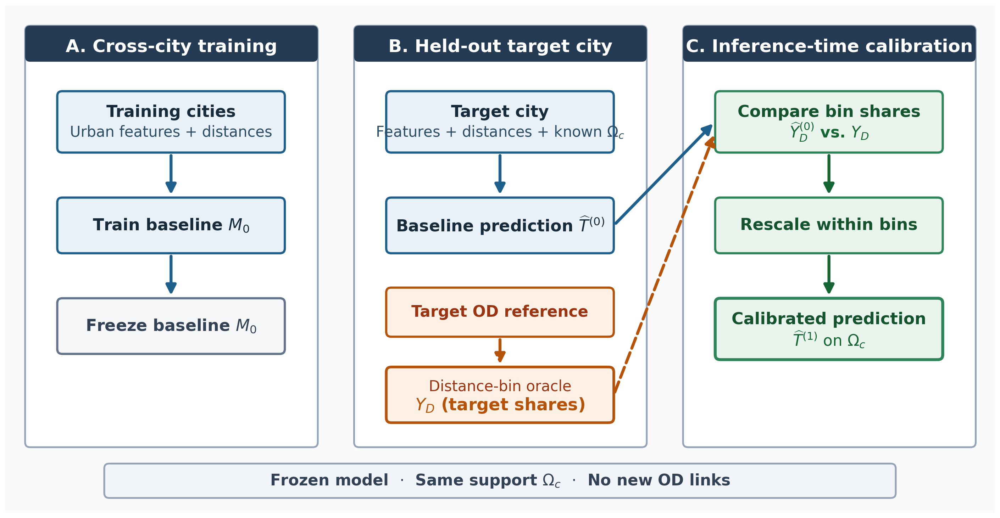
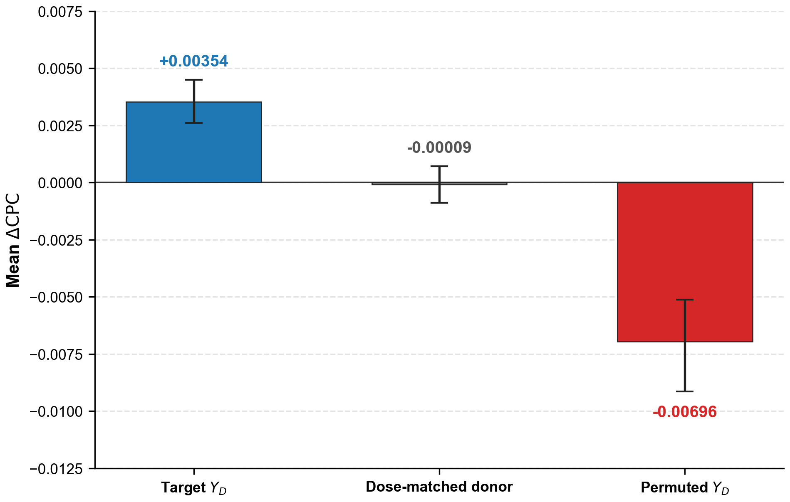
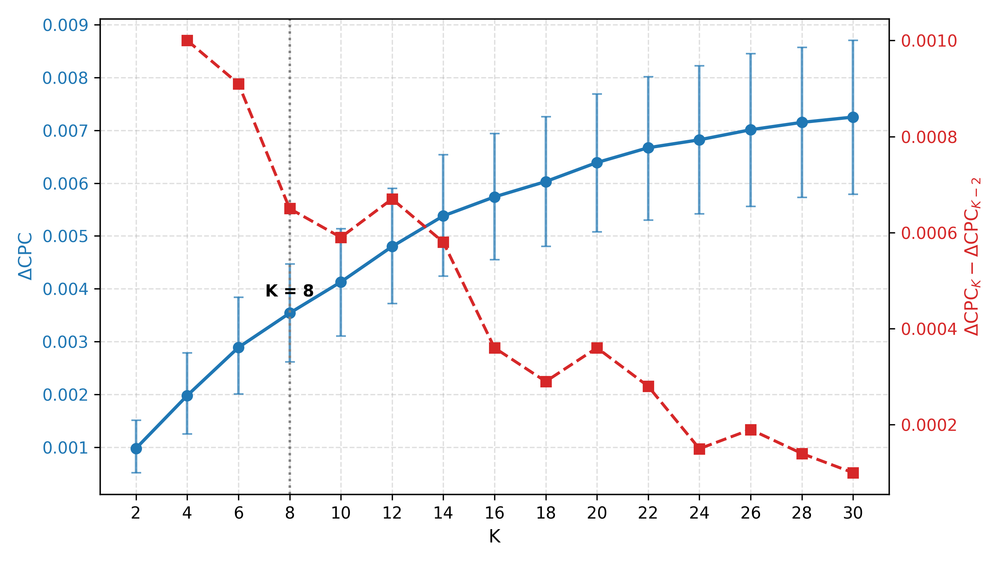
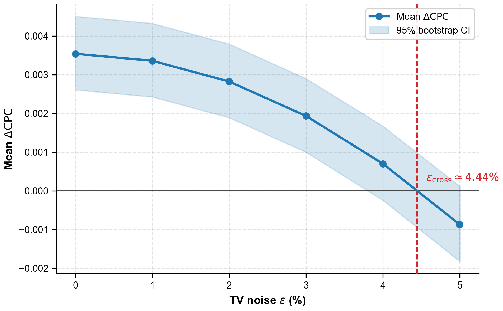

# Cải thiện tái tạo cường độ luồng OD zero-shot bằng phân phối di chuyển theo khoảng cách của thành phố mục tiêu

## Tóm tắt

Việc ước lượng cường độ luồng OD cho một thành phố mới chưa có quan sát về luồng giao thông vẫn là một thách thức. Mặc dù các mô hình zero-shot đã khai thác đặc điểm đô thị và khoảng cách địa lý để thực hiện nhiệm vụ này, giá trị bổ sung mà phân phối di chuyển theo khoảng cách có thể mang lại cho các mô hình đó vẫn chưa được làm rõ. Nghiên cứu sử dụng phân phối di chuyển theo khoảng cách của thành phố mục tiêu để hiệu chỉnh đầu ra của mô hình zero-shot được giữ nguyên tham số, trên tập hỗ trợ dương liên vùng đã biết. Phân phối được tính trực tiếp từ dữ liệu OD tham chiếu trên cùng tập hỗ trợ đánh giá, tạo thành thiết lập oracle để khảo sát lợi ích của thông tin tổng hợp chính xác.

Nghiên cứu áp dụng kiểm định chéo liên thành phố 5 lượt trên 50 vùng đô thị Hoa Kỳ. Với baseline Urban GNN, hiệu chỉnh oracle cấp thành phố làm CPC tăng trung bình 0.00354, với 45/50 thành phố được cải thiện. So với các đối chứng được chuẩn hóa theo độ lớn can thiệp, phân phối mục tiêu cho kết quả tốt hơn, hỗ trợ vai trò của thông tin đặc thù theo thành phố và sự tương ứng giữa tín hiệu hiệu chỉnh với các nhóm khoảng cách. Trong phạm vi khảo sát, mức cải thiện trung bình tăng khi sử dụng nhiều nhóm khoảng cách hơn và giảm khi phân phối quan sát bị nhiễu. Kết luận giới hạn ở tái tạo cường độ trên tập hỗ trợ dương liên vùng đã biết với phân phối oracle; hiệu quả với quan sát thu thập độc lập cần được kiểm chứng.

**Từ khóa:** ma trận nguồn–đích; tái tạo cường độ OD; phân phối di chuyển theo khoảng cách; zero-shot; học chuyển giao giữa các thành phố; quan sát tổng hợp; di chuyển không gian.

# 1. Giới thiệu

Ma trận nguồn–đích (OD) mô tả cường độ di chuyển giữa các đơn vị không gian và là đầu vào quan trọng cho phân tích giao thông và quy hoạch đô thị [@barbosa2018humanmobility]. Tuy nhiên, dữ liệu OD chi tiết thường khó thu thập đầy đủ tại thành phố mục tiêu và còn hạn chế về độ phủ cũng như tính đại diện [@gallotti2024distorted; @pappalardo2023future]. Trong khi đó, luồng di chuyển phụ thuộc vào bối cảnh đô thị và đặc trưng địa phương, nên các quy luật học được từ thành phố này không nhất thiết phù hợp hoàn toàn với một thành phố khác. Vì vậy, các mô hình liên thành phố có thể dự báo kém chính xác hơn tại thành phố mục tiêu khi thiếu thông tin địa phương để hiệu chỉnh [@yang2014limits].

Các mô hình dự báo luồng di chuyển gần đây đã khai thác đặc điểm đô thị và khoảng cách địa lý để dự báo cho các thành phố mới [@enaya2026transgm; @guo2025ugnn; @simini2021deepgravity]. Trong thiết lập zero-shot, mô hình được huấn luyện trên các thành phố nguồn và dự báo cho thành phố mục tiêu mà không sử dụng dữ liệu cường độ luồng OD của thành phố đó để huấn luyện hay cập nhật tham số. Tuy nhiên, khoảng cách giữa từng cặp vùng không trực tiếp cho biết tổng lưu lượng của thành phố mục tiêu được phân bổ như thế nào giữa các nhóm khoảng cách. Các nghiên cứu trước cho thấy mức độ suy giảm của luồng di chuyển theo khoảng cách có thể khác nhau giữa các bối cảnh đô thị [@lenormand2016comparison; @verma2025distance]. Mặc dù vậy, giá trị bổ sung mà phân phối di chuyển theo khoảng cách của thành phố mục tiêu có thể mang lại cho mô hình zero-shot vẫn chưa được làm rõ.

Để làm rõ vấn đề này, nghiên cứu sử dụng phân phối di chuyển theo khoảng cách của thành phố mục tiêu để hiệu chỉnh dự báo của mô hình zero-shot được giữ cố định. Phân phối này cho biết tỷ trọng tổng lưu lượng thuộc từng nhóm khoảng cách, nhưng không cho biết cường độ luồng của từng cặp OD. Việc so sánh kết quả trước và sau hiệu chỉnh giúp đánh giá liệu thông tin tổng hợp này có cải thiện dự báo ngoài những gì mô hình đã học từ đặc điểm đô thị và khoảng cách địa lý hay không. Nghiên cứu tập trung vào hai câu hỏi chính: thứ nhất, khi baseline zero-shot và tập hỗ trợ liên vùng dương được giữ cố định, phân phối di chuyển theo khoảng cách oracle của thành phố mục tiêu có cải thiện việc tái tạo cường độ luồng OD hay không, với mức cải thiện bao nhiêu và tại bao nhiêu thành phố; thứ hai, mức cải thiện đó phụ thuộc như thế nào vào độ phân giải nhóm và chất lượng của phân phối quan sát dưới các cấu hình được khảo sát? Các đối chứng được sử dụng để kiểm tra vai trò của phân phối đúng thành phố và sự tương ứng giữa tín hiệu hiệu chỉnh với các nhóm khoảng cách.

Trong thí nghiệm, phân phối di chuyển theo khoảng cách được xây dựng theo thiết lập oracle từ luồng OD thực của thành phố mục tiêu, trên cùng tập hỗ trợ dương liên vùng đã biết dùng để đánh giá. Nói cách khác, nghiên cứu chỉ tái tạo cường độ luồng trên các cặp vùng đã biết có luồng di chuyển và sử dụng phân phối tổng hợp từ các luồng này để hiệu chỉnh dự báo. Thiết lập này cho phép đánh giá giá trị bổ sung của một phân phối chính xác, còn hiệu quả khi sử dụng phân phối từ nguồn dữ liệu độc lập vẫn cần được kiểm chứng.

Nghiên cứu áp dụng quy trình kiểm định chéo liên thành phố 5 lượt (5-fold cross-validation) trên 50 vùng đô thị tại Hoa Kỳ để định lượng mức cải thiện và xác định các điều kiện quan sát ảnh hưởng đến mức cải thiện đó. Đồng thời, các thí nghiệm với nhiều khởi tạo ngẫu nhiên và kiến trúc mô hình được sử dụng để kiểm tra tính ổn định của kết quả.

# 2. Nghiên cứu liên quan

## 2.1. Mô hình tương tác không gian và hiệu chỉnh dựa trên khoảng cách

Các mô hình tương tác không gian từ lâu đã biểu diễn luồng OD thông qua khả năng phát sinh, mức độ thu hút và lực cản không gian, trong đó khoảng cách hoặc chi phí di chuyển là thành phần cốt lõi của cấu trúc luồng [@ortuzar2011modelling; @wilson1971family]. Các phương pháp hiệu chỉnh cổ điển cho thấy thống kê tổng hợp về cự ly hoặc thời gian di chuyển có thể được sử dụng để xác định tham số lực cản. Hyman [@hyman1969calibration] đề xuất hiệu chỉnh mô hình phân bổ chuyến đi dựa trên chiều dài chuyến đi trung bình, trong khi Merlin [@merlin2020medians] sử dụng trung vị thời gian di chuyển để hiệu chỉnh mô hình tương tác không gian một tham số.

Các nghiên cứu so sánh cũng cho thấy quy luật suy giảm theo khoảng cách không cố định giữa các bộ dữ liệu và bối cảnh đô thị, mà có thể thay đổi theo phương thức di chuyển, mục đích chuyến đi, mức độ đô thị hóa và điều kiện kinh tế–xã hội [@verma2025distance]. Những kết quả này cho thấy đặc điểm di chuyển theo khoảng cách phụ thuộc vào từng bối cảnh. Về mặt phương pháp toán học, phép nhân co giãn theo nhóm tỷ trọng quan sát có liên hệ chặt chẽ với phương pháp khớp tỷ lệ lặp (Iterative Proportional Fitting - IPF) hay thuật toán Furness trong quy hoạch giao thông cổ điển [@ortuzar2011modelling], vốn bắt nguồn từ nguyên lý chuẩn hóa bảng hai chiều của Deming và Stephan cũng như mô hình cực đại hóa entropy [@wilson1971family]. Khi tái phân bổ lưu lượng dự báo giữa các nhóm khoảng cách rời nhau, bước hiệu chỉnh có thể được thực hiện trực tiếp bằng một hệ số nhân cho mỗi nhóm. Nghiên cứu này áp dụng phép hiệu chỉnh đó cho đầu ra của baseline liên thành phố tại thời điểm suy luận, khi các tham số mô hình được giữ nguyên.

## 2.2. Mô hình học máy liên thành phố và quan sát tổng hợp

Khái quát hóa liên thành phố vẫn là một thách thức vì quan hệ giữa bối cảnh đô thị và luồng di chuyển có thể thay đổi giữa các thành phố. Yang et al. [@yang2014limits] cho thấy khả năng dự báo luồng đi làm bị giới hạn đáng kể khi thiếu dữ liệu địa phương dùng cho hiệu chỉnh. Kết quả này cho thấy việc sử dụng khoảng cách và đặc trưng đô thị không nhất thiết loại bỏ hoàn toàn nhu cầu về thông tin đặc thù của thành phố mục tiêu. Trong bối cảnh đó, quan sát tổng hợp cung cấp một mức thông tin trung gian giữa việc không có quan sát về cường độ luồng tại thành phố mục tiêu và quan sát trực tiếp toàn bộ ma trận OD. Các ràng buộc cổ điển như tổng luồng đi, tổng luồng đến hoặc mômen của chi phí di chuyển đã được sử dụng để bảo đảm các tổng lượng tương ứng của mô hình phù hợp với quan sát [@ortuzar2011modelling; @wilson1971family].

Khác với các phương pháp hiệu chỉnh một hoặc một số ít tham số, nghiên cứu này sử dụng trực tiếp tỷ trọng luồng theo từng nhóm khoảng cách, cho phép đánh giá giá trị của thông tin ở nhiều mức độ phân giải thông qua số lượng nhóm. Phân phối này cũng khác với tổng luồng đi, tổng luồng đến của từng vùng hoặc các cặp OD được quan sát trực tiếp: nó chỉ ràng buộc cách tổng lưu lượng được phân bổ giữa các nhóm khoảng cách, nhưng không xác định cách lưu lượng đó được phân bổ giữa các cặp nguồn–đích trong cùng một nhóm.

Các nghiên cứu trước đã làm rõ vai trò của khoảng cách và các ràng buộc trong mô hình tương tác không gian [@ortuzar2011modelling; @wilson1971family], đồng thời cho thấy khả năng khái quát hóa của các mô hình dự báo luồng và những giới hạn khi thiếu thông tin hiệu chỉnh địa phương [@guo2025ugnn; @simini2021deepgravity; @yang2014limits]. Tuy nhiên, vẫn chưa rõ phân phối di chuyển theo khoảng cách của chính thành phố mục tiêu có thể cung cấp thêm bao nhiêu giá trị sau khi mô hình liên thành phố đã học từ bối cảnh đô thị và khoảng cách giữa các cặp vùng, cũng như giá trị đó được duy trì trong những điều kiện quan sát nào. Nghiên cứu này xem xét khoảng trống đó bằng cách đo mức cải thiện sau khi cung cấp phân phối khoảng cách mục tiêu để hiệu chỉnh đầu ra của một baseline liên thành phố được giữ nguyên tham số.

# 3. Nguồn dữ liệu, đơn vị không gian và phương pháp luận

## 3.1. Ký hiệu và dữ liệu đầu vào

Gọi $c$ là một thành phố và $\mathcal{V}_c$ là tập các vùng đơn vị phân chia thành phố đó. Mỗi cặp có thứ tự $(i,j)$ với $i,j \in \mathcal{V}_c$ biểu diễn một cặp nguồn–đích (OD). 

### Bảng 1: Ký hiệu cốt lõi, nguồn dữ liệu và trạng thái sẵn có của thông tin

| Ký hiệu | Mô tả toán học | Nguồn / Vai trò |
| :--- | :--- | :--- |
| $c$ | Chỉ số thành phố ($c \in \{1, \dots, C\}$) | Mã định danh thành phố ($C = 50$) |
| $i, j$ | Chỉ số vùng xuất phát (origin) và vùng đích (destination) | Đơn vị không gian cơ sở |
| $t_{c,ij}$ | Cường độ luồng di chuyển quan sát được ($t_{c,ij} \ge 1$) | Nhãn huấn luyện tại thành phố nguồn; dữ liệu tham chiếu để đánh giá và tổng hợp quan sát oracle tại thành phố mục tiêu. |
| $d_{c,ij}$ | Khoảng cách giữa tâm của vùng $i$ và vùng $j$ (km) | Tính từ tọa độ tâm (Haversine) |
| $\mathcal{P}_c$ | Không gian tất cả các cặp OD liên vùng hợp lệ ($\mathcal{P}_c = \{(i,j) \in \mathcal{V}_c \times \mathcal{V}_c : i \neq j, d_{c,ij} > 0\}$) | Không gian ứng viên liên vùng |
| $\Omega_c$ | Tập hỗ trợ liên vùng dương đã biết ($\Omega_c = \{(i,j) \in \mathcal{P}_c : t_{c,ij} \ge 1\}$) | Tập cặp OD được giả định đã biết và dùng chung cho dự báo, hiệu chỉnh và đánh giá. |
| $I_b$ | Khoảng giá trị khoảng cách xác định nhóm thứ $b$ ($b = 1, \dots, K$) | Khoảng giá trị xác định nhóm thứ $b$ |
| $K$ | Số nhóm khoảng cách ($K = 8$ ở thiết lập chính) | Cấu hình thực nghiệm cố định |
| $Y_{c,b}$ | Tỷ trọng luồng di chuyển mục tiêu trong nhóm $b$ ($\sum_{b=1}^K Y_{c,b} = 1$) | Dữ liệu đầu vào hiệu chỉnh oracle |
| $Y_{D,c}$ | Vector phân phối di chuyển theo khoảng cách của thành phố $c$, với $Y_{D,c} = (Y_{c,1}, \dots, Y_{c,K})$ | Quan sát tổng hợp oracle dùng để hiệu chỉnh tại thành phố mục tiêu. |
| $\widehat{t}_{c,ij}^{(0)}$ | Dự báo cường độ luồng của baseline cross-city zero-shot (điều kiện $M_0$) | Đầu ra baseline giữ nguyên tham số |
| $\widehat{t}_{c,ij}^{(1)}$ | Dự báo cường độ luồng sau hiệu chỉnh tại thời điểm suy luận (điều kiện $M_1$) | Đầu ra sau hiệu chỉnh |
| $M_0, M_1$ | Tên hai điều kiện thực nghiệm (baseline zero-shot giữ nguyên tham số và dự báo sau hiệu chỉnh) | Điều kiện thực nghiệm đối chứng |

Tại thành phố mục tiêu, baseline sử dụng đặc trưng đô thị, thông tin khoảng cách và tập hỗ trợ đã biết; phân phối $Y_{D,c}$ chỉ được cung cấp cho bước hiệu chỉnh.

## 3.2. Phạm vi hỗ trợ và biểu diễn không gian

Dữ liệu thực nghiệm bao gồm 50 vùng đô thị tại Hoa Kỳ, với tract là đơn vị không gian cơ sở. Mỗi tract được biểu diễn bằng tọa độ tâm và các đặc trưng đô thị; dữ liệu còn bao gồm khoảng cách giữa các cặp tract và cường độ luồng OD quan sát được. Nguồn và quy trình xây dựng benchmark sẽ được mô tả đầy đủ theo tài liệu dữ liệu gốc trước khi nộp bài.

Không gian tất cả các cặp OD liên vùng hợp lệ được xác định bởi:

$$
\mathcal{P}_c = \left\{(i,j) \in \mathcal{V}_c \times \mathcal{V}_c : i \neq j,\ d_{c,ij} > 0\right\}.
$$

Phạm vi đánh giá được giới hạn nghiêm ngặt trên tập hỗ trợ liên vùng dương đã biết:

$$
\boxed{
\Omega_c = \left\{(i,j) \in \mathcal{P}_c : t_{c,ij} \ge 1\right\} = \left\{(i,j) \in \mathcal{V}_c \times \mathcal{V}_c : t_{c,ij} \ge 1,\ i \neq j,\ d_{c,ij} > 0\right\}.
}
$$

Mô hình dự báo cường độ luồng trên tập hỗ trợ dương $\Omega_c$, không giải quyết bài toán phát hiện liên kết (link discovery) hay phân loại cặp có luồng zero trong $\mathcal{P}_c$. Trong toàn bài, các cặp ngoài $\Omega_c$ được xem là chưa biết và không thuộc phạm vi đánh giá.

## 3.3. Phân phối di chuyển theo khoảng cách và cấu hình quan sát cấp thành phố

Các thử nghiệm chính sử dụng một phân phối di chuyển theo khoảng cách ở cấp thành phố. Với mỗi giá trị $K$, các biên nhóm được xác định lại từ phân vị khoảng cách của tập huấn luyện. Cụ thể, trong mỗi fold, $K-1$ biên bên trong được xác định từ các phân vị $b/K$, $b=1,\ldots,K-1$, của khoảng cách giữa các cặp OD liên vùng thuộc 35 thành phố huấn luyện. Mỗi cặp đóng góp một giá trị khoảng cách với trọng số bằng nhau; do đó, các biên được xem là pair-weighted theo số cặp. Các thành phố validation và kiểm tra không được sử dụng để xác định biên. Hai biên ngoài được đặt cố định tại $a_0=0$ và $a_K=+\infty$, tạo thành các khoảng $I_b=(a_{b-1},a_b]$ bao phủ toàn bộ các cặp có $d_{c,ij}>0$. Tỷ trọng luồng di chuyển mục tiêu rơi vào nhóm khoảng cách thứ $b$ được định nghĩa là:

$$
Y_{c,b} = \frac{\sum_{(i,j) \in \Omega_c} t_{c,ij} \mathbf{1}(d_{c,ij} \in I_b)}{\sum_{(i,j) \in \Omega_c} t_{c,ij}}.
$$

Các tỷ trọng được chuẩn hóa để: $\sum_{b=1}^K Y_{c,b} = 1$.
Toàn bộ vector phân phối khoảng cách của thành phố $c$ được ký hiệu là $Y_{D,c} = (Y_{c,1}, \dots, Y_{c,K})$. Trong phần diễn giải, $Y_D$ được dùng như tên viết gọn cho loại quan sát này.

Do các biên được xác định chung từ tập huấn luyện, một số khoảng cự ly xa có thể không chứa cặp OD tại những thành phố có phạm vi địa lý nhỏ. Gọi $\mathcal A_c$ là tập các nhóm có ít nhất một cặp thuộc $\Omega_c$, và $K_{\mathrm{act},c}=|\mathcal A_c|$ là số nhóm hoạt động của thành phố $c$. Các nhóm rỗng có tỷ trọng bằng 0 và được loại khỏi phép tính; các đại lượng của toán tử được biểu diễn trên tập nhóm hoạt động (chi tiết quy trình chuẩn hóa và co giãn được trình bày trong Phụ lục S2).

$Y_{D,c}$ được tổng hợp từ luồng ground-truth của thành phố mục tiêu và được sử dụng như một quan sát oracle tại thời điểm hiệu chỉnh. Một biến thể thăm dò sử dụng phân phối theo origin-county được đánh giá trên các vùng đô thị multi-county, thiết lập và giới hạn của phân tích này được trình bày trong Phụ lục S7.

## 3.4. Cấu trúc mô hình và hiệu chỉnh tại thời điểm suy luận

### 3.4.1. Các baseline và giao diện dự báo chung

Nghiên cứu sử dụng Urban GNN làm baseline chính, cùng Pairwise Node MLP và Gravity hai tham số để kiểm tra mức độ phụ thuộc của hiệu quả hiệu chỉnh vào kiến trúc mô hình. Cả ba baseline đều tạo ra dự báo cường độ luồng trên tập hỗ trợ dương liên vùng đã biết và được áp dụng cùng một phép hiệu chỉnh khi các tham số mô hình được giữ cố định.

Urban GNN sử dụng hai lớp truyền thông điệp có điều kiện theo khoảng cách, với phép tổng hợp trung bình lân cận, LayerNorm, kết nối residual và dropout 0.1. Mỗi tract được biểu diễn bằng 26 đặc trưng đô thị và được chiếu thành embedding 64 chiều. Decoder cặp OD là một MLP có cấu trúc $130–64–32–1$, nhận đầu vào gồm embedding của vùng xuất phát và vùng đích, khoảng cách biến đổi bằng $\log(1+d_{c,ij})$ và log gravity prior nội tại. Hai tham số của gravity prior được học đồng thời với toàn bộ mạng.

Pairwise Node MLP thay thế hai lớp truyền thông điệp của Urban GNN bằng hai khối MLP residual xử lý riêng từng node, đồng thời giữ nguyên đầu vào, kích thước embedding, decoder cặp OD, cấu hình huấn luyện và tổng số tham số. So sánh này giúp đánh giá vai trò của việc tổng hợp thông tin từ các vùng lân cận đối với hiệu quả hiệu chỉnh.

Baseline Gravity hai tham số dự báo cường độ luồng dựa trên tích dân số của vùng xuất phát và vùng đích cùng khoảng cách địa lý:

$$
\hat{t}_{c,ij}^{(0,\mathrm{grav})} = \exp(G)\frac{P_{c,i}P_{c,j}}{\tilde d_{c,ij}^{\,\alpha}}, \qquad (i,j)\in\Omega_c.
$$

Trong đó, $G$ là logarit của hệ số quy mô toàn cục và $\alpha$ là tham số điều khiển mức độ phụ thuộc vào khoảng cách; luồng dự báo giảm theo khoảng cách khi $\alpha>0$. Để bảo đảm ổn định số học, dân số $P_{c,i}$ và $P_{c,j}$ được chặn dưới tại 1, còn $\tilde d_{c,ij}=\max(d_{c,ij},0.1\,\mathrm{km})$ là khoảng cách dùng riêng trong công thức Gravity. Hai tham số $(G,\alpha)$ được ước lượng bằng bình phương tối thiểu trong không gian log trên dữ liệu gộp từ các thành phố huấn luyện của từng fold, độc lập với các tham số gravity prior trong hai mô hình neural.

### 3.4.2. Mục tiêu và cấu hình huấn luyện

Dữ liệu huấn luyện gồm các cặp OD có lưu lượng quan sát nguyên dương, $t_{c,ij}\in\{1,2,\ldots\}$. Hai baseline neural sử dụng phân phối nhị thức âm cắt cụt tại 0 (Zero-Truncated Negative Binomial, ZTNB) [@grogger1991truncated]. Phân phối NB nền được tham số hóa bằng trung bình $\mu$ và tham số phân tán $\phi$:

$$
p_{\mathrm{NB}}(t\mid\mu,\phi)
=
\frac{\Gamma(t+\phi)}{\Gamma(\phi)\Gamma(t+1)}
\left(\frac{\phi}{\phi+\mu}\right)^{\phi}
\left(\frac{\mu}{\phi+\mu}\right)^t,
\qquad t=0,1,2,\ldots
$$

Theo quy ước này, $E[T]=\mu$, $\operatorname{Var}(T)=\mu+\mu^2/\phi$, và $p_{\mathrm{NB}}(0)=\left(\phi/(\phi+\mu)\right)^\phi$. Phân phối ZTNB là phân phối có điều kiện trên giá trị quan sát lớn hơn 0:

$$
p_+(t\mid\mu,\phi)
=
\frac{p_{\mathrm{NB}}(t\mid\mu,\phi)}
{1-p_{\mathrm{NB}}(0\mid\mu,\phi)},
\qquad t=1,2,\ldots
$$

Trong đó, $\mu>0$ là trung bình của phân phối NB nền trước khi điều kiện hóa; $\phi>0$ là tham số phân tán. Hàm mất mát được tính bằng âm log-hợp lý trung bình trên các cặp OD của từng thành phố:

$$
\mathcal L_c
=
-\frac{1}{|\Omega_c|}
\sum_{(i,j)\in\Omega_c}
\log p_+(t_{c,ij}\mid\mu_{c,ij},\phi).
$$

Trong quá trình huấn luyện, mỗi bước cập nhật sử dụng một thành phố và hàm mất mát trung bình trên các cặp OD của thành phố đó.

Hai baseline neural sử dụng cùng cấu hình huấn luyện với thuật toán tối ưu AdamW [@loshchilov2019adamw], chọn checkpoint theo CPC trên tập validation và được huấn luyện với ba hạt giống khởi tạo ngẫu nhiên (random seed). Tham số phân tán $\phi$ được học cùng các tham số mạng và dùng chung cho mọi cặp OD trong mỗi mô hình. Các phép biến đổi bảo đảm tham số dương và các biện pháp ổn định số học được trình bày trong Phụ lục S1. Khi suy luận, cường độ luồng dự báo là kỳ vọng có điều kiện của phân phối ZTNB:

$$
\hat t_{c,ij}^{(0)}
=
\frac{\mu_{c,ij}}
{1-p_{\mathrm{NB}}(0\mid\mu_{c,ij},\phi)}.
$$

Kỳ vọng có điều kiện này là dự báo baseline được đưa vào bước hiệu chỉnh ở mục 3.4.3. Chi tiết siêu tham số huấn luyện và các biện pháp ổn định số học được trình bày trong Phụ lục S1.

### 3.4.3. Toán tử hiệu chỉnh khoảng cách tại thời điểm suy luận

Từ dự báo ban đầu $\hat t_{c,ij}^{(0)}$ trên tập hỗ trợ $\Omega_c$, tỷ trọng lưu lượng dự báo thuộc nhóm khoảng cách thứ $b$ được tính bằng:

$$
\hat Y_{c,b}^{(0)}
=
\frac{
\sum_{(i,j)\in\Omega_c}
\hat t_{c,ij}^{(0)}
\mathbf{1}(d_{c,ij}\in I_b)
}{
\sum_{(i,j)\in\Omega_c}
\hat t_{c,ij}^{(0)}
}.
$$

Ký hiệu $p_{c,b}^{\mathrm{cond}}$ là tỷ trọng mục tiêu sau khi giới hạn trên các nhóm hoạt động và chuẩn hóa để tổng tỷ trọng trên các nhóm này bằng 1. Trong cấu hình oracle chính, các nhóm rỗng có tỷ trọng bằng 0 nên $p_{c,b}^{\mathrm{cond}} = Y_{c,b}$ trên các nhóm hoạt động. Dự báo của mỗi cặp OD được nhân với tỷ số giữa tỷ trọng mục tiêu và tỷ trọng dự báo của nhóm chứa cặp đó:

$$
\hat t_{c,ij}^{(1)}
=
\hat t_{c,ij}^{(0)}
\frac{p_{c,b(i,j)}^{\mathrm{cond}}}{\hat Y_{c,b(i,j)}^{(0)}},
\qquad (i,j)\in\Omega_c,
$$

trong đó $b(i,j)$ là nhóm chứa khoảng cách $d_{c,ij}$.

Trong cấu hình oracle chính, tỷ trọng mục tiêu và tỷ trọng dự báo đều dương trên các nhóm hoạt động, nên hệ số hiệu chỉnh dương. Sau hiệu chỉnh, phân phối lưu lượng theo nhóm khớp với phân phối mục tiêu, trong khi tổng lưu lượng dự báo được giữ nguyên. Các cặp OD trong cùng một nhóm nhận chung một hệ số nhân, nên tỷ lệ và thứ hạng giữa các dự báo trong nhóm đó không đổi; thứ hạng giữa các nhóm có thể thay đổi.

Chứng minh các tính chất này được trình bày trong Phụ lục S3; dạng hiệu chỉnh tổng quát với mức điều chỉnh $q\in[0,1]$ được trình bày trong Phụ lục S2. Cấu hình chính sử dụng $q=1$.

**Hình 1. Khung hiệu chỉnh oracle tại thời điểm suy luận.** Baseline $M_0$ được huấn luyện liên thành phố và giữ nguyên tham số trên thành phố mục tiêu. Phân phối khoảng cách oracle $Y_D$, được trích từ luồng tham chiếu của thành phố mục tiêu, dùng để tái phân bổ khối lượng giữa các khoảng và tạo $\widehat{\mathbf{T}}_c^{(1)}$ trên cùng tập hỗ trợ $\Omega_c$.

## 3.5. Giao thức đánh giá cross-city và suy luận thống kê

### 3.5.1. Giao thức kiểm định chéo liên thành phố 5-fold

Nghiên cứu áp dụng giao thức kiểm định chéo liên thành phố 5-fold trên 50 vùng đô thị Hoa Kỳ (mỗi fold gồm 35 thành phố huấn luyện, 5 thành phố validation và 10 thành phố kiểm tra). Đơn vị phân chia fold là toàn bộ thành phố; không có bất kỳ cặp OD hoặc tract nào của cùng một thành phố bị phân tán giữa tập huấn luyện và tập kiểm tra.

### 3.5.2. Thước đo đánh giá và so sánh mô hình

Thước đo định lượng chính để đánh giá khả năng tái tạo luồng di chuyển zero-shot là Common Part of Commuters (CPC) [@lenormand2016comparison], được tính trên tập hỗ trợ liên vùng dương $\Omega_c$:

$$
\operatorname{CPC}_c(\widehat{t}) = \frac{2 \sum_{(i,j) \in \Omega_c} \min(t_{c,ij}, \widehat{t}_{c,ij})}{\sum_{(i,j) \in \Omega_c} t_{c,ij} + \sum_{(i,j) \in \Omega_c} \widehat{t}_{c,ij}}.
$$

CPC nằm trong $[0, 1]$, với giá trị lớn hơn biểu thị mức chồng lấp lớn hơn giữa cường độ dự báo và quan sát.

Ba thước đo bổ sung—NRMSE, RMSE trên thang $\log(1+x)$ và tương quan hạng Spearman—được báo cáo trong Phụ lục S4 như các kiểm tra mô tả về mức độ nhất quán của kết quả. CPC vẫn là thước đo đánh giá chính và là cơ sở cho các phân tích suy luận thống kê.

Bên cạnh đó, phân phối khoảng cách gộp sau hiệu chỉnh được đối chiếu với $Y_D$ như một chẩn đoán cơ chế nội bộ nhằm xác nhận thuật toán đã tái phân bổ khối lượng đúng thiết kế. Cả ba họ mô hình (GNN, MLP, Gravity) được đánh giá trên cùng tập hỗ trợ bằng cùng thước đo CPC.

### 3.5.3. Phân tích thống kê và lượng hóa độ bất định

Đối với mỗi thành phố, mức cải thiện được tính từ chênh lệch CPC giữa dự báo sau hiệu chỉnh và baseline, sau đó lấy trung bình qua các model seeds trong từng thành phố và macro-average trên toàn bộ 50 thành phố. Thành phố là đơn vị thống kê ($N=50$); kết quả của ba model seeds được trung bình trước khi thực hiện bootstrap và kiểm định Wilcoxon.

Khoảng tin cậy 95% được ước lượng bằng paired nonparametric bootstrap ở cấp thành phố, phân tầng theo fold [@efron1993bootstrap]. Các chênh lệch ghép cặp được đánh giá bằng kiểm định Wilcoxon signed-rank hai phía [@wilcoxon1945ranking]. Khoảng tin cậy bootstrap được tính cho mức chênh lệch CPC trung bình giữa các thành phố. Kiểm định Wilcoxon signed-rank sử dụng dấu và thứ hạng của các chênh lệch ghép cặp, do đó đánh giá một khía cạnh khác của phân bố chênh lệch và không được diễn giải như một kiểm định trực tiếp đối với giá trị trung bình. Vì vậy, khoảng tin cậy bootstrap và kết quả Wilcoxon được báo cáo song song như hai mô tả bổ sung. Tỷ lệ thành phố có $\Delta\mathrm{CPC} > 0$ được báo cáo như một thống kê mô tả bổ sung. Các phân tích độ nhạy và độ bền tương ứng được trình bày trong Mục 4.

Trong stress-test nhiễu, năm mức dương $\epsilon\in\{0.01,0.02,0.03,0.04,0.05\}$ thuộc cùng một họ Holm; mức $\epsilon=0$ chỉ là mốc mô tả và không thuộc họ này. Kiểm định Wilcoxon một phía được dùng cho giả thuyết lợi ích ($\Delta\mathrm{CPC}>0$). Các lượt lặp nhiễu được lấy trung bình trước qua ba model seeds, sau đó giữ 50 giá trị cấp thành phố làm đơn vị suy luận. Bootstrap crossing được dùng để đếm các đường cong có crossing trong miền 0–5%; các đường cong không crossing được báo cáo là bị kiểm duyệt phải phía trên miền khảo sát, không dùng để tạo một CI crossing bằng cách loại bỏ chúng.

Ngoài các kiểm định chính, một phân tích cơ chế thăm dò đánh giá mối liên hệ giữa sai lệch phân phối khoảng cách của baseline và mức cải thiện sau hiệu chỉnh. Sai lệch ban đầu $d_{\mathrm{pre}}$ được tính bằng Total Variation giữa phân phối khoảng cách dự báo của baseline và phân phối tham chiếu. Tương quan Pearson và tương quan từng phần được báo cáo; tương quan từng phần kiểm soát độ chính xác baseline ($M_0$ CPC) và các đặc trưng quy mô không gian của thành phố gồm $\log N_{\mathrm{tracts}}$, $\log N_{\mathrm{pairs}}$ và khoảng cách địa lý trung bình.

# 4. Kết quả thực nghiệm

## 4.1. Phân phối khoảng cách mục tiêu có cải thiện tái tạo cường độ OD so với zero-shot hay không?

Trong thí nghiệm chính với Urban GNN và phân phối oracle cấp thành phố ở độ phân giải $K=8$, hiệu chỉnh làm CPC liên vùng trung bình tăng từ 0.71281 lên 0.71635. Mức tăng trung bình đạt +0.00354, với khoảng tin cậy bootstrap 95% $[+0.0026,+0.0045]$ và 45/50 thành phố được cải thiện (Bảng 2). Kết quả kiểm định Wilcoxon hai phía cũng cho thấy sự khác biệt có ý nghĩa thống kê ($p=1.93\times10^{-9}$). Nhìn chung, mức cải thiện tuyệt đối nhỏ nhưng xuất hiện ở phần lớn thành phố.

Tuy nhiên, mức cải thiện khác nhau giữa các thành phố (Hình 2). Trung vị của mức tăng CPC là +0.00195, thấp hơn mức tăng trung bình, cho thấy một số thành phố có mức cải thiện lớn kéo giá trị trung bình lên. Trong khi đó, năm thành phố có CPC giảm sau hiệu chỉnh (tỷ lệ bị tổn hại / harm rate là 5/50 hay 10.0%). Vì vậy, phân phối khoảng cách chính xác giúp cải thiện dự báo ở phần lớn thành phố được đánh giá, nhưng không bảo đảm cải thiện trong mọi trường hợp.

**Hình 2. Mức thay đổi CPC theo thành phố sau hiệu chỉnh bằng phân phối khoảng cách oracle.**

Mỗi cột biểu diễn chênh lệch CPC giữa dự báo sau hiệu chỉnh và baseline Urban GNN tại một thành phố, lấy trung bình qua ba seed và xếp từ thấp đến cao. Thí nghiệm sử dụng phân phối oracle cấp thành phố với $K=8$. Cột xanh biểu thị CPC tăng, cột đỏ biểu thị CPC giảm; đường nét đứt và đường chấm lần lượt biểu diễn mức thay đổi trung bình (+0.00354) và trung vị (+0.00195).

### Bảng 2. Kết quả hiệu chỉnh oracle cấp thành phố với Urban GNN trên 50 thành phố ($K=8$).

| Điều kiện | CPC trung bình ± SD | $\Delta\mathrm{CPC}$ trung bình | CI 95% của $\Delta\mathrm{CPC}$ trung bình | Thành phố cải thiện | Wilcoxon $p$ (hai phía) |
|:---|:---:|:---:|:---:|:---:|:---:|
| Baseline zero-shot ($M_0$) | $0.71281 \pm 0.04434$ | — | — | — | — |
| Hiệu chỉnh oracle ($M_1$) | $0.71635 \pm 0.04454$ | $+0.00354$ | $[+0.0026, +0.0045]$ | $45/50\ (90.0\%)$ | $1.93 \times 10^{-9}$ |

Chú thích: CPC được lấy trung bình qua ba seed trong từng thành phố trước khi tổng hợp trên 50 thành phố; SD là độ lệch chuẩn giữa các thành phố. CI 95% được tính cho mức tăng CPC trung bình bằng bootstrap ghép cặp cấp thành phố, phân tầng theo fold. P-value được tính bằng kiểm định Wilcoxon signed-rank hai phía trên các chênh lệch cấp thành phố. Thành phố được tính là cải thiện khi chênh lệch CPC trung bình qua ba seed lớn hơn 0.

## 4.2. Mức cải thiện có phụ thuộc vào phân phối của đúng thành phố và thứ tự các nhóm khoảng cách hay không?

Để kiểm tra liệu mức cải thiện có phụ thuộc vào phân phối của chính thành phố mục tiêu hay không, nghiên cứu so sánh phân phối này với các phân phối từ thành phố hiến tặng (thành phố donor) trong tập huấn luyện và phân phối trung bình của tập huấn luyện trong cùng fold. Các đối chứng được chuẩn hóa liều can thiệp (dose-matched; Phụ lục S6) để có cùng mức độ tác động log-ratio với phân phối mục tiêu. Hiệu chỉnh bằng phân phối đúng thành phố đạt mức tăng CPC trung bình +0.00354, trong khi đối chứng từ các thành phố huấn luyện đạt −0.00009 và đối chứng từ phân phối trung bình đạt +0.00091 (Bảng 3). Đối chứng từ thành phố huấn luyện có mức thay đổi trung bình gần 0, với khoảng tin cậy bao gồm cả giá trị âm và dương.

Đối chứng sử dụng phân phối trung bình của tập huấn luyện tạo ra mức tăng CPC trung bình nhỏ ($+0.00091$), nhưng mức thay đổi không nhất quán giữa các thành phố: trung vị chỉ đạt $+0.00007$, với 27/50 thành phố có CPC tăng và 23/50 thành phố có CPC giảm. Khoảng tin cậy bootstrap 95% của mức thay đổi trung bình là $[+0.00001, +0.00186]$, trong khi kiểm định Wilcoxon hai phía không cho thấy sự dịch chuyển nhất quán của các chênh lệch ghép cặp ($p=0.4319$). Hai kết quả này phản ánh những đặc điểm khác nhau của phân bố chênh lệch giữa các thành phố.

Khi so sánh trực tiếp, phân phối đúng thành phố cho CPC cao hơn đối chứng từ thành phố huấn luyện và đối chứng phân phối trung bình tại lần lượt 46/50 và 47/50 thành phố. Chênh lệch CPC trung bình tương ứng là $+0.00363$ và $+0.00263$, với cả hai khoảng tin cậy bootstrap 95% nằm hoàn toàn trên 0. Trong phạm vi các đối chứng được khảo sát, phân phối mục tiêu vẫn cho kết quả tốt hơn khi độ lớn can thiệp được ghép bằng nhau theo RMS của vector log-ratio đã trừ trung bình. Kết quả này hỗ trợ vai trò bổ sung của thông tin phân bổ luồng theo khoảng cách tại thành phố mục tiêu.

Khi các thành phần của vector log-ratio hiệu chỉnh đã trừ trung bình được hoán vị giữa các nhóm khoảng cách, CPC giảm trung bình 0.00696 so với baseline (Hình 3). Hiệu chỉnh bằng phân phối mục tiêu cho CPC cao hơn đối chứng hoán vị tại 49/50 thành phố, với chênh lệch trung bình +0.01050. Kết quả này cho thấy hiệu quả hiệu chỉnh phụ thuộc vào sự tương ứng giữa tín hiệu điều chỉnh và các nhóm khoảng cách.

**Hình 3. Mức thay đổi CPC khi sử dụng phân phối đúng thành phố và các phân phối đối chứng giả dược (placebo controls).**

Các cột biểu diễn mức thay đổi CPC trung bình so với baseline Urban GNN trên 50 thành phố khi sử dụng phân phối oracle của thành phố mục tiêu, phân phối đối chứng từ thành phố huấn luyện đã được điều chỉnh về cùng mức độ can thiệp (dose-matched donor), và đối chứng hoán vị log-ratio mục tiêu giữa các nhóm khoảng cách. Thanh sai số biểu diễn khoảng tin cậy bootstrap 95% của mức thay đổi trung bình, phân tầng theo fold. Đối chứng sử dụng phân phối trung bình của tập huấn luyện được báo cáo thêm trong Bảng 3.

### Bảng 3. Kết quả hiệu chỉnh với phân phối mục tiêu và các đối chứng trên 50 thành phố.

**Phần A. Thay đổi CPC so với baseline zero-shot**

| Điều kiện | $\Delta\mathrm{CPC}$ trung bình | CI 95% của $\Delta\mathrm{CPC}$ trung bình | Wilcoxon $p$ hai phía |
|:---|:---:|:---:|:---:|
| Phân phối oracle đúng thành phố | $+0.00354$ | $[+0.0026, +0.0045]$ | $1.93 \times 10^{-9}$ |
| Đối chứng từ thành phố huấn luyện, dose-matched | $-0.00009$ | $[-0.0009, +0.0007]$ | $0.4097$ |
| Phân phối trung bình tập huấn luyện, dose-matched | $+0.00091$ | $[+0.00001, +0.00186]$ | $0.4319$ |
| Đối chứng hoán vị log-ratio hiệu chỉnh | $-0.00696$ | $[-0.0091, -0.0051]$ | $1.78 \times 10^{-15}$ |

**Phần B. Chênh lệch CPC giữa phân phối đúng thành phố và từng đối chứng**

| Đối chứng | Chênh lệch CPC trung bình | CI 95% của chênh lệch trung bình | Wilcoxon $p$ một phía | Thành phố có CPC mục tiêu cao hơn đối chứng |
|:---|:---:|:---:|:---:|:---:|
| Từ thành phố huấn luyện, dose-matched | $+0.00363$ | $[+0.0029, +0.0044]$ | $2.19 \times 10^{-11}$ | 46/50 |
| Trung bình tập huấn luyện, dose-matched | $+0.00263$ | $[+0.0020, +0.0034]$ | $4.03 \times 10^{-11}$ | 47/50 |
| Đối chứng hoán vị log-ratio hiệu chỉnh | $+0.01050$ | $[+0.0084, +0.0128]$ | $1.78 \times 10^{-15}$ | 49/50 |

Chú thích: Ở phần A, $\Delta\mathrm{CPC}$ là chênh lệch giữa dự báo sau hiệu chỉnh bằng từng phân phối và baseline zero-shot. Ở phần B, chênh lệch được tính bằng CPC khi dùng phân phối đúng thành phố trừ CPC khi dùng phân phối đối chứng; giá trị dương cho biết phân phối đúng thành phố cho kết quả tốt hơn. Đối chứng từ thành phố huấn luyện được lấy trung bình qua 1.000 lượt chọn donor ngẫu nhiên; đối chứng hoán vị được lấy trung bình trên toàn bộ các hoán vị chỉ số khác hoán vị đồng nhất khi số lượng không vượt quá 1.000; nếu vượt quá mức này, sử dụng 1.000 hoán vị được chọn ngẫu nhiên không hoàn lại; kết quả của ba model seeds được lấy trung bình trước khi tổng hợp trên 50 thành phố. Khoảng tin cậy được tính cho chênh lệch trung bình bằng bootstrap ghép cặp cấp thành phố, phân tầng theo fold. Kiểm định Wilcoxon ở phần A là hai phía; ở phần B là một phía theo giả thuyết phân phối đúng thành phố cho CPC cao hơn đối chứng (các giá trị $p$ được báo cáo là $p$ gốc chưa điều chỉnh nhiều giả thuyết). Đối với đối chứng sử dụng phân phối trung bình của tập huấn luyện, mức thay đổi CPC trung bình là $+0.00091$, trung vị là $+0.00007$, và 27/50 thành phố có thay đổi dương. Khoảng tin cậy bootstrap mô tả độ bất định của mức thay đổi trung bình, trong khi kiểm định Wilcoxon sử dụng dấu và thứ hạng của các chênh lệch ghép cặp. Vì vậy, hai kết quả phản ánh những đặc điểm khác nhau của phân bố chênh lệch giữa các thành phố.

## 4.3. Giá trị bổ sung của $Y_D$ phụ thuộc như thế nào vào độ phân giải và chất lượng quan sát?

Phần này đánh giá độ nhạy của mức cải thiện theo ba khía cạnh: số nhóm khoảng cách $K$, độ phân giải không gian của phân phối, và độ chính xác của quan sát dưới tác động của nhiễu.

Trước hết, khi số nhóm khoảng cách tăng từ $K=2$ lên $K=20$, mức tăng CPC trung bình tăng từ +0.00098 lên +0.00639 (Bảng 4 và Hình 4). Tại cấu hình chính $K=8$, mức tăng đạt +0.00354, với 45/50 thành phố được cải thiện. Mức tăng trung bình tăng trên toàn bộ các cấu hình được khảo sát, trong khi số thành phố cải thiện dao động từ 39 đến 47 trên tổng số 50 thành phố. Đây là kết quả của các cấu hình phân nhóm được đánh giá; nghiên cứu chưa xác định số nhóm tối ưu khi quan sát có nhiễu.

### Bảng 4. Mức thay đổi CPC theo số nhóm khoảng cách $K$ trên 50 thành phố.

| Số nhóm $K$ | $\Delta\mathrm{CPC}$ trung bình | Trung vị $\Delta\mathrm{CPC}$ | CI 95% của $\Delta\mathrm{CPC}$ trung bình | Thành phố cải thiện |
|:---|:---:|:---:|:---:|:---:|
| $K = 2$ | $+0.00098$ | $+0.00034$ | $[+0.0005, +0.0015]$ | 39/50 (78.0%) |
| $K = 4$ | $+0.00198$ | $+0.00088$ | $[+0.0013, +0.0028]$ | 39/50 (78.0%) |
| $K = 6$ | $+0.00289$ | $+0.00152$ | $[+0.0020, +0.0038]$ | 44/50 (88.0%) |
| **$K = 8$ (cấu hình chính)** | **$+0.00354$** | **$+0.00195$** | **$[+0.0026, +0.0045]$** | **45/50 (90.0%)** |
| $K = 10$ | $+0.00413$ | $+0.00235$ | $[+0.0031, +0.0051]$ | 45/50 (90.0%) |
| $K = 12$ | $+0.00480$ | $+0.00288$ | $[+0.0037, +0.0059]$ | 46/50 (92.0%) |
| $K = 14$ | $+0.00538$ | $+0.00373$ | $[+0.0042, +0.0065]$ | 45/50 (90.0%) |
| $K = 16$ | $+0.00574$ | $+0.00433$ | $[+0.0045, +0.0069]$ | 46/50 (92.0%) |
| $K = 18$ | $+0.00603$ | $+0.00458$ | $[+0.0048, +0.0073]$ | 47/50 (94.0%) |
| $K = 20$ | $+0.00639$ | $+0.00494$ | $[+0.0051, +0.0077]$ | 46/50 (92.0%) |

Chú thích: $\Delta\mathrm{CPC}$ là chênh lệch giữa dự báo sau hiệu chỉnh và baseline zero-shot ($M_0$ CPC trung bình $0.71281 \pm 0.04434$). Kết quả của ba model seeds được lấy trung bình trước khi tổng hợp trên 50 thành phố. Khoảng tin cậy được tính cho mức tăng trung bình bằng bootstrap ghép cặp cấp thành phố, phân tầng theo fold. Thành phố được tính là cải thiện khi chênh lệch trung bình qua ba seeds lớn hơn 0. $K$ là số khoảng danh nghĩa được xác định từ tập huấn luyện. Số khoảng hoạt động $K_{\mathrm{act},c}$ có thể nhỏ hơn $K$ tại những thành phố không có cặp OD trong một số khoảng cự ly xa.

**Hình 4. Mức thay đổi CPC trung bình theo số nhóm khoảng cách $K$.** Các điểm biểu diễn mức tăng CPC trung bình so với baseline trên 50 thành phố; thanh sai số biểu diễn khoảng tin cậy bootstrap 95%, phân tầng theo fold. Cấu hình chính $K=8$ được đánh dấu bằng đường gióng.

Mức cải thiện trung bình tăng trên toàn bộ dải $K$ được khảo sát. Kết quả này cho thấy độ phân giải danh nghĩa cao hơn có thể cung cấp thêm thông tin hiệu chỉnh, mặc dù số khoảng thực sự hoạt động còn phụ thuộc vào phạm vi khoảng cách của từng thành phố.

Ngoài độ phân giải theo khoảng cách, phân tích thăm dò về độ phân giải không gian cho thấy khi áp dụng phân phối theo từng county xuất phát trên 11 vùng đô thị có nhiều county, CPC tăng thêm so với hiệu chỉnh cấp thành phố ở 9/11 trường hợp, với mức tăng trung bình trong nhóm này là +0.00063. Khi tính gộp trên toàn bộ 50 thành phố (trong đó 39 vùng đơn county có mức chênh lệch bằng 0 theo cấu trúc), mức tăng bổ sung trung bình là +0.00014. Kết quả này bước đầu cho thấy việc phân nhóm quan sát theo county xuất phát có thể bổ sung thông tin tại một số vùng đô thị có nhiều county trong benchmark. Khả năng khái quát của kết quả cần được kiểm tra trên tập dữ liệu có nhiều vùng đô thị multi-county hơn.

Về chất lượng của quan sát, khi thêm nhiễu Total Variation vào phân phối của thành phố mục tiêu, mức cải thiện CPC giảm dần theo mức nhiễu (Hình 5). Mức tăng CPC trung bình giảm từ +0.00354 khi không thêm nhiễu xuống +0.00070 tại 4% TV và chuyển sang âm tại 5% TV (−0.00087; Hình 5). Nội suy tuyến tính giữa hai mức nhiễu liền kề có mức thay đổi CPC trung bình trái dấu cho điểm cắt mô tả khoảng 4.44% TV. Trong 10.000 đường cong bootstrap, 9.546 đường có điểm cắt trong miền khảo sát 0–5%; 454 đường còn lại vẫn dương tại mức nhiễu 5% và được ghi nhận là kiểm duyệt phải tại giới hạn khảo sát. Nghiên cứu không báo cáo khoảng tin cậy cho vị trí điểm cắt.

Trong năm mức nhiễu dương được khảo sát, 3% TV là mức lớn nhất mà kiểm định Wilcoxon một phía còn có ý nghĩa sau hiệu chỉnh Holm ($p_{\mathrm{Holm}}=0.0446$). Tại 4% TV, mức tăng CPC trung bình vẫn dương (+0.00070), nhưng kiểm định không đạt tiêu chí này ($p_{\mathrm{Holm}}=0.9695$). Kết quả kiểm định và điểm cắt của đường trung bình mô tả hai khía cạnh khác nhau; mức 3% TV không được xem là một ngưỡng bảo đảm hiệu quả áp dụng.

**Hình 5. Mức thay đổi CPC trung bình theo mức nhiễu Total Variation thêm vào phân phối mục tiêu.** Các điểm biểu diễn mức thay đổi CPC trung bình so với baseline trên 50 thành phố; dải bóng mờ biểu diễn khoảng tin cậy bootstrap 95% giữa các thành phố, phân tầng theo fold. Đường đứt nét đỏ đánh dấu điểm cắt mô tả tại $\epsilon_{\mathrm{cross}}=4.44\%$ TV, nơi mức cải thiện trung bình chuyển từ dương sang âm.

Trong các cấu hình oracle được khảo sát, tăng số nhóm khoảng cách giúp tăng mức cải thiện trung bình. Khi phân phối bị nhiễu theo cơ chế đã xét, lợi ích này suy giảm và có thể chuyển thành mức giảm CPC.

## 4.4. Tính ổn định của mức cải thiện theo khởi tạo và kiến trúc baseline

Với Urban GNN, mức tăng CPC trung bình dương ở cả ba seed được đánh giá, dao động từ khoảng +0.0031 đến +0.0043. Kết quả này cho thấy lợi ích trung bình của phép hiệu chỉnh được duy trì qua các lần khởi tạo đã khảo sát.

Mức tăng CPC trung bình đạt +0.00354 với Urban GNN và +0.00329 với Pairwise Node MLP; số thành phố cải thiện tương ứng là 45/50 và 47/50 (Bảng 5). Lợi ích xuất hiện ở phần lớn thành phố với cả hai baseline neural, cho thấy kết quả không chỉ giới hạn ở kiến trúc có truyền thông điệp trên đồ thị.

### Bảng 5. Mức cải thiện CPC sau hiệu chỉnh oracle theo kiến trúc baseline trên 50 thành phố ($K=8$).

| Baseline | $\Delta\mathrm{CPC}$ trung bình | CI 95% của $\Delta\mathrm{CPC}$ trung bình | Thành phố cải thiện |
|:---|:---:|:---:|:---:|
| Urban GNN | $+0.00354$ | $[+0.0026, +0.0045]$ | 45/50 (90.0%) |
| Pairwise Node MLP | $+0.00329$ | $[+0.0025, +0.0042]$ | 47/50 (94.0%) |
| Gravity hai tham số | $+0.00084$ | $[+0.0002, +0.0016]$ | 22/50 (44.0%) |

Chú thích: Với mỗi baseline, $\Delta\mathrm{CPC}$ được tính bằng CPC sau hiệu chỉnh trừ CPC trước hiệu chỉnh của chính baseline đó. Hai baseline neural được tổng hợp bằng cách lấy trung bình qua ba seed trong từng thành phố trước khi tính thống kê trên 50 thành phố. Gravity được ước lượng riêng trong từng fold bằng dữ liệu của các thành phố huấn luyện. Cả ba baseline được hiệu chỉnh bằng phân phối oracle cấp thành phố trên cùng tập hỗ trợ đánh giá. CI 95% được tính cho mức tăng trung bình bằng bootstrap ghép cặp cấp thành phố, phân tầng theo fold. Thành phố cải thiện là số thành phố có $\Delta\mathrm{CPC}>0$.

Với Gravity hai tham số, mức tăng CPC trung bình đạt +0.00084, nhưng chỉ 22/50 thành phố được cải thiện. Vì vậy, mức tăng trung bình dương của Gravity không đại diện cho một xu hướng cải thiện ở đa số thành phố.

## 4.5. Mối liên hệ giữa sai lệch phân phối khoảng cách của baseline và mức cải thiện hiệu chỉnh

Nghiên cứu xem xét mối liên hệ giữa sai lệch phân phối khoảng cách của baseline và mức tăng CPC sau hiệu chỉnh. Sai lệch được đo bằng khoảng cách Total Variation giữa phân phối dự báo và phân phối oracle. Trên 50 thành phố được đánh giá, các thành phố có sai lệch lớn hơn thường có mức tăng CPC cao hơn (Hình 6).

Sau khi kiểm soát CPC của baseline, số tract, số cặp OD và khoảng cách địa lý trung bình, tương quan từng phần vẫn dương ($r_{\mathrm{partial}}=0.7951$, $p=5.35\times10^{-12}$). Đây là mối liên hệ thăm dò trong tập thành phố được đánh giá; kết quả không bảo đảm rằng một thành phố có sai lệch lớn sẽ được cải thiện sau hiệu chỉnh.

**Hình 6. Mối liên hệ giữa sai lệch phân phối khoảng cách của baseline và mức tăng CPC sau hiệu chỉnh.** Mỗi điểm biểu diễn một thành phố ($N=50$) với Urban GNN tại $K=8$, sau khi lấy trung bình các đại lượng tương ứng qua ba model seeds. Trục ngang là khoảng cách Total Variation giữa phân phối dự báo và phân phối oracle; trục dọc là chênh lệch CPC sau và trước hiệu chỉnh. Đường thẳng biểu diễn hồi quy tuyến tính giữa hai biến trên hình, chưa điều chỉnh theo các biến kiểm soát. Tương quan từng phần được báo cáo riêng trong mục 4.5.

# 5. Thảo luận

## 5.1. Giá trị bổ sung của phân phối khoảng cách trong dự báo liên thành phố

Khoảng cách giữa từng cặp vùng và phân phối lưu lượng theo khoảng cách cung cấp hai loại thông tin khác nhau. Khoảng cách mô tả quan hệ địa lý giữa các vùng, còn phân phối mục tiêu cho biết lưu lượng thực tế được phân bổ như thế nào giữa các nhóm khoảng cách. Việc hiệu chỉnh vẫn cải thiện CPC cho thấy, trong các baseline được đánh giá, thông tin tổng hợp này bổ sung cho những quan hệ đã học từ đặc trưng đô thị và khoảng cách địa lý.

Các mô hình như Deep Gravity và UGNN khai thác dữ liệu nguồn để học các quy luật di chuyển có khả năng chuyển giao giữa các thành phố [@guo2025ugnn; @simini2021deepgravity]. Nghiên cứu này bổ sung cho hướng tiếp cận đó bằng cách đánh giá phần cải thiện khi cung cấp thêm phân phối khoảng cách của thành phố mục tiêu cho một mô hình đã được huấn luyện. Do tham số mô hình được giữ nguyên, phần cải thiện được ghi nhận đến từ bước hiệu chỉnh đầu ra bằng quan sát tổng hợp, không kèm theo việc huấn luyện lại mô hình.

## 5.2. Khả năng và giới hạn của phép hiệu chỉnh khoảng cách

Phân phối khoảng cách chỉ cho biết tỷ trọng lưu lượng thuộc từng nhóm, nên phép hiệu chỉnh điều chỉnh cách lưu lượng được phân bổ giữa các nhóm này. Trong cùng một nhóm, các cặp OD được nhân với cùng một hệ số, vì vậy tỷ lệ và thứ hạng giữa các luồng vẫn do baseline quyết định. Đồng thời, tổng lưu lượng dự báo được giữ nguyên, nên phép hiệu chỉnh không xử lý sai lệch về tổng lưu lượng của baseline. Những giới hạn này giúp lý giải vì sao mức cải thiện có thể nhỏ ngay cả khi phân phối khoảng cách được cung cấp chính xác.

Phân tích ở mục 4.5 phù hợp với vai trò của phép hiệu chỉnh trong việc điều chỉnh phân bổ lưu lượng giữa các nhóm khoảng cách. Tuy nhiên, sai lệch phân phối ban đầu được tính bằng phân phối oracle, nên phân tích này chưa cung cấp một quy tắc độc lập để quyết định khi nào nên áp dụng hiệu chỉnh. Sự khác nhau giữa các baseline cho thấy giá trị của cùng một quan sát tổng hợp còn phụ thuộc vào dự báo ban đầu mà nó được dùng để hiệu chỉnh.

Trong các đối chứng được khảo sát, phân phối của thành phố mục tiêu cho CPC trung bình cao hơn các phân phối đối chứng. Khi độ lớn can thiệp được ghép theo RMS log-ratio, sự tương ứng giữa tín hiệu hiệu chỉnh và các nhóm khoảng cách vẫn có liên quan đến kết quả. Vì vậy, giá trị của quan sát phụ thuộc vào nội dung thông tin mà nó cung cấp, bên cạnh độ lớn của phép điều chỉnh.

Tăng số nhóm khoảng cách cung cấp thêm chi tiết để điều chỉnh lưu lượng giữa các dải cự ly, nhưng thí nghiệm này sử dụng phân phối oracle. Với quan sát thu thập độc lập, cần đánh giá đồng thời độ chi tiết và sai số của phân phối. Các thí nghiệm hiện tại chưa xác định số nhóm phù hợp nhất cho từng mức nhiễu.

## 5.3. Giới hạn nghiên cứu và hướng kiểm chứng tiếp theo

Giới hạn chính của nghiên cứu là phân phối khoảng cách được tổng hợp từ chính dữ liệu OD tham chiếu của thành phố mục tiêu. Thiết lập oracle cho phép đánh giá lợi ích khi có phân phối chính xác trên tập hỗ trợ đã chọn, nhưng chưa xác nhận hiệu quả với một nguồn quan sát được thu thập độc lập. Các thí nghiệm gây nhiễu cũng chưa bao quát đầy đủ những sai lệch có thể xuất hiện trong dữ liệu thực tế, như hạn chế về độ phủ, tính đại diện và khác biệt về thời gian thu thập [@gallotti2024distorted; @pappalardo2023future]. Vì vậy, bước kiểm chứng tiếp theo là đánh giá các nguồn quan sát độc lập và mức độ tương thích của chúng với phạm vi không gian, thời gian và tập hỗ trợ dùng để tái tạo OD.

Ngoài ra, nghiên cứu chỉ tái tạo cường độ trên các cặp OD liên vùng đã biết có luồng dương, nên chưa đánh giá khả năng xác định cặp có luồng hoặc tái tạo toàn bộ ma trận OD. Các kết quả được ghi nhận trên 50 vùng đô thị Hoa Kỳ và các baseline đã khảo sát; khả năng khái quát sang những bối cảnh khác vẫn cần được kiểm tra. Phân tích theo origin-county cũng chỉ mang tính thăm dò vì chỉ 11 vùng đô thị có nhiều county, còn 39 trường hợp còn lại không tạo ra thay đổi về cách tổng hợp so với cấp thành phố. Hơn nữa, ranh giới county là ranh giới hành chính và có thể không phù hợp với các vùng di chuyển chức năng. Do đó, cần đánh giá thêm các cách phân chia không gian trước khi kết luận về lợi ích của quan sát chi tiết hơn theo địa bàn.

Một hướng mở rộng khác là kết hợp phân phối khoảng cách với tổng luồng đi hoặc tổng luồng đến của từng vùng. Các ràng buộc này đã được sử dụng trong mô hình tương tác không gian [@ortuzar2011modelling; @wilson1971family] và có thể bổ sung thông tin theo vùng mà phân phối khoảng cách chưa cung cấp. Nghiên cứu tiếp theo cần kiểm tra liệu việc kết hợp các quan sát này có tạo thêm cải thiện khi cùng áp dụng cho một baseline được giữ cố định hay không.

Nghiên cứu đánh giá giá trị dự báo của quan sát tổng hợp, không đánh giá mức bảo vệ quyền riêng tư. Việc tổng hợp dữ liệu thành phân phối khoảng cách tự nó không tạo thành một bảo đảm quyền riêng tư.

# 6. Kết luận

Trong thiết lập oracle trên 50 vùng đô thị Hoa Kỳ, phân phối di chuyển theo khoảng cách của thành phố mục tiêu giúp cải thiện tái tạo cường độ OD từ baseline zero-shot được giữ nguyên tham số. Với Urban GNN, CPC tăng trung bình +0.00354 và 45/50 thành phố được cải thiện. Kết quả này cho thấy phân phối mục tiêu bổ sung thông tin hữu ích ngay cả khi baseline đã sử dụng đặc trưng đô thị và khoảng cách địa lý.

Tuy nhiên, mức cải thiện phụ thuộc vào độ phân giải và chất lượng của phân phối quan sát. Trong dải khảo sát, tăng số nhóm khoảng cách giúp tăng mức cải thiện trung bình, còn nhiễu làm lợi ích suy giảm. Trong các đối chứng đã khảo sát, phân phối đúng thành phố mục tiêu mang lại kết quả tốt hơn các phân phối từ tập huấn luyện và đối chứng hoán vị, cho thấy thông tin đặc thù theo thành phố và sự tương ứng với các nhóm khoảng cách đều có liên quan đến hiệu quả hiệu chỉnh. Các kết luận này giới hạn ở việc tái tạo cường độ luồng trên tập hỗ trợ liên vùng dương đã biết với phân phối oracle. Việc đánh giá phân phối được thu thập độc lập là bước tiếp theo để kiểm chứng khả năng áp dụng trong thực tế.

# 7. Tuyên bố về khả năng truy cập dữ liệu và mã nguồn

Bổ sung sau

# 8. Các tuyên bố và cam kết khoa học
Bổ sung sau

# 9. Tài liệu tham khảo

1. **Barbosa, H., Barthelemy, M., Ghoshal, G., James, C. R., Lenormand, M., Louail, T., Menezes, R., Ramasco, J. J., Simini, F., & Tomasini, M.** (2018). Human mobility: Models and applications. *Physics Reports*, 734, 1–74. [https://doi.org/10.1016/j.physrep.2018.01.001](https://doi.org/10.1016/j.physrep.2018.01.001)

2. **Efron, B., & Tibshirani, R. J.** (1993). *An introduction to the bootstrap*. Chapman & Hall.

3. **Enaya, A., Zhong, C., Batty, M., Morphet, R., & Lopane, F. D.** (2026). TransGM: Transferable gravity models for cross-city policy transfer. *Computers, Environment and Urban Systems*, 128, 102455. [https://doi.org/10.1016/j.compenvurbsys.2026.102455](https://doi.org/10.1016/j.compenvurbsys.2026.102455)

4. **GADM.** (n.d.). *GADM database of global administrative areas (Version 4.1)* [Data set]. Retrieved September 2, 2026, from [https://gadm.org/data.html](https://gadm.org/data.html)

5. **Gallotti, R., Maniscalco, D., Barthelemy, M., & De Domenico, M.** (2024). Distorted insights from human mobility data. *Communications Physics*, 7, 421. [https://doi.org/10.1038/s42005-024-01909-x](https://doi.org/10.1038/s42005-024-01909-x)

6. **Grogger, J. T., & Carson, R. T.** (1991). Models for truncated counts. *Journal of Applied Econometrics*, 6(3), 225–238. [https://doi.org/10.1002/jae.3950060302](https://doi.org/10.1002/jae.3950060302)

7. **Guo, J., Bai, S., Li, X., Xian, K., Liu, E., Ding, W., & Ma, X.** (2025). A universal geography neural network for mobility flow prediction in planning scenarios. *Computer-Aided Civil and Infrastructure Engineering*, 40, 5769–5789. [https://doi.org/10.1111/mice.13398](https://doi.org/10.1111/mice.13398)

8. **Holm, S.** (1979). A simple sequentially rejective multiple test procedure. *Scandinavian Journal of Statistics*, 6(2), 65–70. [https://www.jstor.org/stable/4615733](https://www.jstor.org/stable/4615733)

9. **Hyman, G. M.** (1969). The calibration of trip distribution models. *Environment and Planning A*, 1(1), 105–112. [https://doi.org/10.1068/a010105](https://doi.org/10.1068/a010105)

10. **Lenormand, M., Bassolas, A., & Ramasco, J. J.** (2016). Systematic comparison of trip distribution laws and models. *Journal of Transport Geography*, 51, 158–169. [https://doi.org/10.1016/j.jtrangeo.2015.12.008](https://doi.org/10.1016/j.jtrangeo.2015.12.008)

11. **Loshchilov, I., & Hutter, F.** (2019). Decoupled weight decay regularization. In *International Conference on Learning Representations (ICLR)*. [https://openreview.net/forum?id=Bkg6RiCqY7](https://openreview.net/forum?id=Bkg6RiCqY7)

12. **Merlin, L. A.** (2020). A new method using medians to calibrate single-parameter spatial interaction models. *Journal of Transport and Land Use*, 13(1), 49–70. [https://doi.org/10.5198/jtlu.2020.1614](https://doi.org/10.5198/jtlu.2020.1614)

13. **Ortúzar, J. de D., & Willumsen, L. G.** (2011). *Modelling transport* (4th ed.). John Wiley & Sons. [https://doi.org/10.1002/9781119993308](https://doi.org/10.1002/9781119993308)

14. **Pappalardo, L., Manley, E., Sekara, V., & Alessandretti, L.** (2023). Future directions in human mobility science. *Nature Computational Science*, 3, 588–600. [https://doi.org/10.1038/s43588-023-00469-4](https://doi.org/10.1038/s43588-023-00469-4)

15. **Simini, F., Barlacchi, G., Luca, M., & Pappalardo, L.** (2021). A Deep Gravity model for mobility flows generation. *Nature Communications*, 12, 6576. [https://doi.org/10.1038/s41467-021-26752-4](https://doi.org/10.1038/s41467-021-26752-4)

16. **Verma, R., & Ukkusuri, S. V.** (2025). What determines travel time and distance decay in spatial interaction and accessibility? *Journal of Transport Geography*, 122, 104061. [https://doi.org/10.1016/j.jtrangeo.2024.104061](https://doi.org/10.1016/j.jtrangeo.2024.104061)

17. **Wilcoxon, F.** (1945). Individual comparisons by ranking methods. *Biometrics Bulletin*, 1(6), 80–83. [https://doi.org/10.2307/3001968](https://doi.org/10.2307/3001968)

18. **Wilson, A. G.** (1971). A family of spatial interaction models, and associated developments. *Environment and Planning A*, 3(1), 1–32. [https://doi.org/10.1068/a030001](https://doi.org/10.1068/a030001)

19. **Yang, Y., Herrera, C., Eagle, N., & González, M. C.** (2014). Limits of predictability in commuting flows in the absence of data for calibration. *Scientific Reports*, 4, 5662. [https://doi.org/10.1038/srep05662](https://doi.org/10.1038/srep05662)

# Phụ lục phương pháp bổ sung (Supplementary Methods)

## S1. Chi tiết kiến trúc mạng neural GNN và ổn định số học

### S1.1. Các lớp tensor của Urban GNN Encoder
Mạng Urban GNN ánh xạ vector đặc trưng đô thị 26 chiều $\mathbf{x}_{c,i} \in \mathbb{R}^{26}$ và cấu trúc đồ thị bán kính không gian $\mathcal{G}_c = (\mathcal{V}_c, \mathcal{E}_c)$ thành biểu diễn ẩn 64 chiều $\mathbf{h}_{c,i} \in \mathbb{R}^{64}$:

1. **Chiếu nút ban đầu**:
$$
\mathbf{h}_{c,i}^{(0)} = \operatorname{Dropout}\bigl(\operatorname{ReLU}\bigl(\operatorname{LayerNorm}(\mathbf{W}_{\mathrm{in}} \mathbf{x}_{c,i} + \mathbf{b}_{\mathrm{in}})\bigr)\bigr).
$$

2. **Thông điệp điều kiện hóa theo khoảng cách**:
$$
\mathbf{m}_{ji}^{(\ell)} = \mathbf{W}_{\mathrm{msg}}^{(\ell)} \left[ \mathbf{h}_{c,j}^{(\ell-1)} \,\Vert\, \log(1 + d_{c,ji}) \right] + \mathbf{b}_{\mathrm{msg}}^{(\ell)}.
$$

3. **Tổng hợp thông điệp**:
$$
\mathbf{a}_{c,i}^{(\ell)} = \frac{1}{\max(\operatorname{deg}(i), 1)} \sum_{j \in \mathcal{N}(i)} \mathbf{m}_{ji}^{(\ell)}.
$$

4. **Biến đổi trạng thái nút**:
$$
\widetilde{\mathbf{h}}_{c,i}^{(\ell)} = \operatorname{LayerNorm}\bigl(\operatorname{ReLU}\bigl(\mathbf{a}_{c,i}^{(\ell)} + \mathbf{W}_{\mathrm{self}}^{(\ell)} \mathbf{h}_{c,i}^{(\ell-1)} + \mathbf{b}_{\mathrm{self}}^{(\ell)}\bigr)\bigr).
$$

5. **Cập nhật residual**:
$$
\mathbf{h}_{c,i}^{(\ell)} = \mathbf{h}_{c,i}^{(\ell-1)} + \operatorname{Dropout}\bigl(\widetilde{\mathbf{h}}_{c,i}^{(\ell)}\bigr).
$$

6. **Chiếu đầu ra**:
$$
\mathbf{h}_{c,i} = \mathbf{W}_{\mathrm{out}} \mathbf{h}_{c,i}^{(2)} + \mathbf{b}_{\mathrm{out}} \in \mathbb{R}^{64}.
$$

### S1.2. Ổn định số học và gradient clipping

Trong quá trình huấn luyện, log-likelihood của ZTNB được tính toán thông qua hàm `torch.lgamma`. Để ngăn hiện tượng tràn số hoặc biến mất gradient:

* Tham số trung bình cơ sở được chặn dưới: $\mu_{c,ij} = \operatorname{softplus}(\log T_{c,ij}^{\mathrm{grav}} + \operatorname{residual}_{c,ij}) + 10^{-4}$.
* Tham số phân tán được chặn trong không gian log: $\log \phi_{\mathrm{safe}} = \operatorname{clamp}(\log \phi, \text{min}=-10.0, \text{max}=10.0)$, sau đó $\phi = \exp(\log \phi_{\mathrm{safe}})$.
* Hằng số ổn định $\epsilon = 10^{-8}$ được cộng vào $\mu$ và $\phi$ trong các số hạng logarit; xác suất tại 0 được chuẩn hóa số học qua $\log(1 - p_{\mathrm{NB}}(0)) = \operatorname{log1p}(-\exp(\log p_{\mathrm{NB}}(0)))$ với chặn trên $1.0 - 10^{-7}$. Khi suy luận kỳ vọng điều kiện, mẫu số $1 - p_{\mathrm{NB}}(0)$ được chặn dưới bằng $10^{-6}$.
* Gradient của toàn bộ tham số mô hình được cắt theo chuẩn Euclid tối đa: $\|\mathbf{g}\|_2 \le 5.0$ thông qua `torch.nn.utils.clip_grad_norm_`.

### S1.3. Danh sách 26 đặc trưng và đồ thị không gian

Theo thứ tự cột trong `src.data.dataset.NODE_FEATURE_COLUMNS`, 26 đặc trưng gồm 13 Census: `total_population`, `median_age`, `median_income`, `per_capita_income`, `employment_rate`, `unemployment_rate`, `commute_transit_pct`, `commute_active_pct`, `commute_wfh_pct`, `zero_vehicle_pct`, `avg_vehicles_per_household`, `higher_education_pct`, `homeownership_rate`; 8 POI: `office`, `office_density`, `industrial`, `industrial_density`, `commercial`, `commercial_density`, `education_primary`, `education_primary_density`; và 5 Road: `road_length_total`, `road_density`, `road_count`, `motorway_length`, `primary_length`. CSV thiếu giá trị được đọc như 0; NaN/Inf được thay bằng 0. Code không áp dụng log transform cho các cột này. Trong mỗi fold, `load_cities()` fit một `StandardScaler` trên node features gộp của 35 thành phố huấn luyện; validation và target chỉ gọi `transform`, và scaler statistics được lưu trong checkpoint.

Đồ thị dùng node là tract và tọa độ centroid `(lon, lat)` từ `meta.csv`. Khoảng cách là Haversine với bán kính Trái Đất 6371 km. Cấu hình frozen chính dùng radius graph 5.0 km, self-loop, cạnh hai chiều sau bước symmetrize; nếu một node không có hàng xóm khác trong bán kính, code nối nó với node gần nhất. Edge attribute là khoảng cách địa lý theo km. Đồ thị chỉ dùng geography quan sát được, không dùng OD flows.

### S1.4. Cấu hình siêu tham số kiến trúc và phân tách baseline

Cấu hình siêu tham số chính xác được trích xuất trực tiếp từ các checkpoint mô hình (`results/checkpoints/5fold_*.pt` và `mlp_*.pt`) được tổng hợp trong Bảng S1.

#### Bảng S1: Siêu tham số kiến trúc và huấn luyện của các zero-shot baseline
| Thành phần | Siêu tham số | Giá trị | Mô tả chi tiết |
|:---|:---|:---:|:---|
| **Urban GNN Encoder** | Số chiều đặc trưng đầu vào ($d_{\mathrm{in}}$) | 26 | Đặc trưng nhân khẩu, kinh tế - xã hội của tract |
| | Số lớp truyền thông điệp (Message passing) | 2 | Khối `GraphConvLayer` có điều kiện khoảng cách |
| | Cơ chế Attention / Số attention heads | N/A (0) | Tổng hợp lân cận bằng trung bình; không dùng attention |
| | Chiều ẩn / Chiều đầu ra node embedding | 64 | LayerNorm(64) + ReLU + Dropout |
| | Xác suất Dropout | 0.1 | Chiếu đầu vào, cập nhật residual, chiếu đầu ra |
| | Loại đồ thị không gian | Radius graph | Bán kính địa lý $r = 5.0$ km có self-loops |
| **Pairwise Decoder** | Chiều vector đầu vào | 130 | Ghép $[\mathbf{h}_i \,(64) \parallel \mathbf{h}_j \,(64) \parallel \log(1+d) \,(1) \parallel \log T^{\mathrm{grav}} \,(1)]$ |
| | Các tầng ẩn | [64, 32] | Tầng 1: 64 (LayerNorm+ReLU+Dropout); Tầng 2: 32 (ReLU+Dropout) |
| | Tầng đầu ra | 1 | Đầu ra neural residual khởi tạo bằng 0 |
| | Gravity prior nội tại | $(G, \alpha)$ khả vi | Khởi tạo tại $G_0=0.0, \alpha_0=1.0$; huấn luyện end-to-end qua AdamW |
| **Tối ưu hóa** | Hàm mục tiêu | ZTNB NLL | Hợp lý Zero-Truncated Negative Binomial |
| | Thuật toán tối ưu | AdamW | Bước tối ưu city-by-city (city-balanced) |
| | Tốc độ học ban đầu (Initial LR) | 0.0032 | $3.2 \times 10^{-3}$ |
| | Hệ số suy giảm trọng số (Weight decay) | 0.0001 | $10^{-4}$ |
| | Bộ điều chỉnh LR (Scheduler) | ReduceLROnPlateau | Hệ số 0.5, patience 4 epochs, min LR $10^{-5}$ |
| | Dừng sớm (Early stopping patience) | 16 epochs | Theo dõi trên CPC liên vùng tập validation ($\min \Delta = 10^{-4}$) |
| | Tổng số tham số mô hình | 33,668 | Giữ đúng số tham số như nhau giữa Urban GNN và Node MLP |

**Ghi chú phân tách tham số:** Hai tham số $(G_{\mathrm{NN}}, \alpha_{\mathrm{NN}})$ của gravity prior nội tại trong các mạng neural là các biến khả vi được tối ưu hóa đồng thời end-to-end cùng toàn bộ mạng qua AdamW và được lưu trữ trực tiếp trong checkpoint. Ngược lại, baseline Gravity hai tham số cổ điển độc lập được ước lượng riêng biệt bằng phương pháp bình phương tối thiểu pooled log-linear OLS trên các thành phố huấn luyện ($G_{\mathrm{OLS}} \approx -8.54, \alpha_{\mathrm{OLS}} \approx 1.66$ trên Fold 1). Hai mô hình này hoàn toàn không dùng chung hay chia sẻ hệ số với nhau.

## S2. Dạng tổng quát của toán tử hiệu chỉnh giải tích ($q \in [0, 1]$)

Tham số cường độ hiệu chỉnh $q \in [0, 1]$ điều khiển mức độ can thiệp của thông tin khoảng cách mục tiêu:

- $q = 0$: giữ nguyên dự báo ban đầu của baseline ($\widehat{t}^{(1)} \equiv \widehat{t}^{(0)}$).
- $q = 1$: khớp đầy đủ tỷ trọng luồng theo từng nhóm khoảng cách hoạt động.
- Thiết lập chính cố định $q = 1$.

Ở cấu hình chính $K=8$, 40/50 thành phố có đủ tám nhóm hoạt động; tại 10 thành phố còn lại, một hoặc nhiều nhóm cự ly xa không chứa cặp OD, dẫn đến $K_{\mathrm{act},c}\in[5,7]$. Thuật toán chỉ thực hiện hiệu chỉnh trên tập nhóm hoạt động $\mathcal A_c$.

Quy trình hiệu chỉnh tổng quát được thực hiện qua các bước:

### S2.1. Tập các nhóm hoạt động
Tập các nhóm hoạt động $\mathcal A_c$ được xác định trực tiếp từ sự tồn tại của các cặp OD thuộc tập hỗ trợ $\Omega_c$:
$$
\mathcal A_c = \left\{ b \in \{1, \dots, K\} : \exists(i,j) \in \Omega_c,\ d_{c,ij} \in I_b \right\},
$$
với $K_{\mathrm{act},c} = |\mathcal A_c|$. Trên tập hỗ trợ dương, nhóm có ít nhất một cặp OD có tỷ trọng oracle dương. Do dự báo baseline cũng dương trên tập hỗ trợ, nhóm đó có tỷ trọng dự báo dương. Trong pipeline placebo, nhóm hoạt động được xác định bằng ngưỡng số học $Y_{c,b} > 10^{-8}$. Kiểm tra trên 50 thành phố cho thấy tập nhóm thu được bằng ngưỡng này trùng với tập nhóm xác định từ sự tồn tại của cặp OD.

### S2.2. Phân phối mục tiêu điều kiện trên các nhóm hoạt động
Tỷ trọng mục tiêu được điều kiện hóa trên các nhóm hoạt động theo:
$$
p_{c,b}^{\mathrm{cond}} = \frac{Y_{c,b} \mathbf{1}(b \in A_c)}{\sum_{r \in A_c} Y_{c,r}}.
$$
Việc điều kiện hóa bảo đảm tổng tỷ trọng trên các nhóm hoạt động bằng 1.

### S2.3. Trọng số hiệu chỉnh mềm
Với mỗi nhóm hoạt động $b \in A_c$, tỷ lệ co giãn mềm được tính theo:
$$
w_{c,b}(q) = \biggl( \frac{p_{c,b}^{\mathrm{cond}}}{\widehat{Y}_{c,b}^{(0)}} \biggr)^q, \qquad b \in A_c.
$$

### S2.4. Hệ số chuẩn hóa và hệ số co giãn
Hệ số chuẩn hóa bảo toàn tổng khối lượng và hệ số co giãn tương ứng là:
$$
Z_c(q) = \sum_{r \in A_c} \widehat{Y}_{c,r}^{(0)} w_{c,r}(q), \qquad s_{c,b}(q) = \frac{w_{c,b}(q)}{Z_c(q)}.
$$

### S2.5. Dự báo sau hiệu chỉnh
Cường độ luồng dự báo sau hiệu chỉnh cho cặp $(i,j)$ được xác định bởi:
$$
\widehat{t}_{c,ij}^{(1)} = s_{c,b(i,j)}(q) \widehat{t}_{c,ij}^{(0)},
$$
trong đó $b(i,j)$ là nhóm cự ly chứa cặp $(i,j)$.

### S2.6. Trường hợp chính $q = 1$
Trong cấu hình oracle chính, các nhóm ngoài $A_c$ không chứa cặp OD thuộc tập hỗ trợ nên có tỷ trọng mục tiêu bằng 0. Vì vậy, trên các nhóm hoạt động, $p^{\mathrm{cond}}_{c,b}=Y_{c,b}$. Với $q=1$, hệ số chuẩn hóa bằng 1 và hệ số hiệu chỉnh trở thành:
$$
Z_c(1)=1,
\qquad
s_{c,b}(1)
=
\frac{Y_{c,b}}{\widehat Y_{c,b}^{(0)}},
\qquad b\in A_c.
$$
Kết quả này không yêu cầu tất cả $K$ nhóm đều hoạt động và thu về toán tử hiệu chỉnh trình bày ở mục 3.4.3.

## S3. Chứng minh giải tích các đặc tính bất biến

Các chứng minh dưới đây xét dự báo baseline dương trên $\Omega_c$ và tỷ trọng mục tiêu dương trên mọi nhóm hoạt động. Các điều kiện này được thỏa mãn trong cấu hình oracle chính.

### S3.1. Bảo toàn tập hỗ trợ
Vì $s_{c,b}(q) > 0$ trên mọi nhóm hoạt động, một dự báo dương trước hiệu chỉnh vẫn dương sau hiệu chỉnh. Toán tử chỉ hoạt động trên $\Omega_c$, nên không tạo thêm liên kết bên ngoài tập hỗ trợ đã biết:
$$
\widehat{t}_{c,ij}^{(1)} > 0 \quad \Longleftrightarrow \quad \widehat{t}_{c,ij}^{(0)} > 0, \qquad (i,j) \in \Omega_c.
$$

### S3.2. Bảo toàn thứ hạng nội khoảng
Với hai cặp $(i,j)$ và $(u,v)$ cùng thuộc khoảng $b$, ta có:
$$
\frac{\widehat{t}_{c,ij}^{(1)}}{\widehat{t}_{c,uv}^{(1)}} = \frac{s_{c,b}(q) \widehat{t}_{c,ij}^{(0)}}{s_{c,b}(q) \widehat{t}_{c,uv}^{(0)}} = \frac{\widehat{t}_{c,ij}^{(0)}}{\widehat{t}_{c,uv}^{(0)}}.
$$
Do đó, tỷ số giữa hai dự đoán trong cùng một khoảng không đổi và thứ tự nội bộ của các cặp trong khoảng đó được bảo toàn; kết luận này không mở rộng thành bảo toàn thứ hạng toàn thành phố.

### S3.3. Bảo toàn tổng khối lượng dự báo
Gọi $S_c^{(0)}$ là tổng khối lượng dự báo của baseline:
$$
S_c^{(0)} = \sum_{(i,j) \in \Omega_c} \widehat{t}_{c,ij}^{(0)}.
$$
Tổng khối lượng luồng sau hiệu chỉnh thỏa mãn:
$$
\begin{aligned}
\sum_{(i,j) \in \Omega_c} \widehat{t}_{c,ij}^{(1)} &= S_c^{(0)} \sum_{b \in A_c} \widehat{Y}_{c,b}^{(0)} s_{c,b}(q) \\
&= \frac{S_c^{(0)}}{Z_c(q)} \sum_{b \in A_c} \widehat{Y}_{c,b}^{(0)} w_{c,b}(q) \\
&= S_c^{(0)}.
\end{aligned}
$$
Vì $S_c^{(0)}$ chính là tổng khối lượng dự báo trước hiệu chỉnh, toán tử bảo toàn tổng khối lượng dự báo của baseline.

## S4. Các thước đo đánh giá bổ sung

Ngoài CPC, nghiên cứu báo cáo ba thước đo bổ sung trên cùng tập hỗ trợ liên vùng dương $\Omega_c$. Các thước đo này được sử dụng để kiểm tra mô tả liệu hướng thay đổi sau hiệu chỉnh có được duy trì khi xem xét độ lớn sai số và thứ hạng của các luồng hay không. CPC vẫn là thước đo chính; không thực hiện thêm kiểm định giả thuyết cho các thước đo bổ sung.

1. **RMSE chuẩn hóa (NRMSE)**:
$$
\overline{t}_c = \frac{1}{\lvert\Omega_c\rvert} \sum_{(i,j)\in\Omega_c} t_{c,ij}, \qquad \operatorname{NRMSE}_c = \frac{\sqrt{\frac{1}{\lvert\Omega_c\rvert} \sum_{(i,j)\in\Omega_c} (t_{c,ij} - \widehat{t}_{c,ij})^2}}{\overline{t}_c}.
$$

2. **RMSE trên thang log ($\operatorname{RMSE}_{\mathrm{log1p}}$)**:
$$
\operatorname{RMSE}_{\mathrm{log1p},c} = \sqrt{ \frac{1}{\lvert\Omega_c\rvert} \sum_{(i,j)\in\Omega_c} \bigl[ \log(1+t_{c,ij}) - \log(1+\widehat{t}_{c,ij}) \bigr]^2 }.
$$

3. **Hệ số tương quan hạng Spearman ($\rho_{\mathrm{Spearman}}$)**: Tương quan hạng Spearman được tính giữa các vector cường độ quan sát và dự báo trên $\Omega_c$. Giá trị lớn hơn biểu thị mức độ phù hợp cao hơn về thứ hạng giữa các cặp OD.

### Bảng S2: Các thước đo đánh giá bổ sung cho Urban GNN với $K=8$.

| Thước đo | Baseline $M_0$ | Sau hiệu chỉnh $M_1$ | Thay đổi trung bình | Trung vị thay đổi | Thành phố cải thiện |
|:---|---:|---:|---:|---:|---:|
| NRMSE $\downarrow$ | 1.58647 | 1.58146 | −0.00502 | −0.00466 | 32/50 |
| $\operatorname{RMSE}_{\mathrm{log1p}}$ $\downarrow$ | 0.92586 | 0.90050 | −0.02536 | −0.01158 | 35/50 |
| Spearman $\rho$ $\uparrow$ | 0.76913 | 0.77167 | +0.00253 | +0.00119 | 38/50 |

Chú thích: Các giá trị được tính trên tập hỗ trợ $\Omega_c$. Với mỗi thành phố, kết quả được lấy trung bình qua ba model seeds trước khi macro-average trên 50 thành phố. Mũi tên chỉ hướng tốt hơn của từng thước đo. “Thành phố cải thiện” được xác định bằng mức giảm đối với NRMSE và $\operatorname{RMSE}_{\mathrm{log1p}}$, và mức tăng đối với Spearman. Các kết quả này mang tính mô tả bổ sung; các khoảng tin cậy và kiểm định giả thuyết chính của nghiên cứu dựa trên CPC. RMSE trên thang $\log(1+x)$ cũng giảm, cho thấy mức cải thiện vẫn xuất hiện khi ảnh hưởng của các luồng cường độ rất lớn được giảm bớt.

## S5. Giao thức Bootstrap phân tầng theo fold và kiểm định thống kê

1. **Giao thức Bootstrap phân tầng theo fold**:
   - Đơn vị lấy mẫu lại là thành phố.
   - Việc lấy mẫu có hoàn lại được thực hiện riêng trong từng fold.
   - Mỗi fold lấy lại 10 thành phố từ 10 thành phố kiểm tra ban đầu.
   - Hai điều kiện $M_0$ và $M_1$ luôn được giữ ghép cặp.
   - Các cặp OD không được lấy mẫu lại độc lập.

   Gọi $\mathcal{C}^{*(r)}$ là multiset gồm 50 thành phố được lấy lại ở bootstrap replicate $r$ ($r = 1, \dots, B$ với $B = 10{,}000$ và $C = 50$):
$$
\overline{\Delta}^{*(r)} = \frac{1}{C} \sum_{c\in\mathcal{C}^{*(r)}} \Delta_c, \qquad r = 1, \dots, B.
$$

2. **Khoảng tin cậy bootstrap 95%**:
$$
\mathrm{CI}_{95\%} = \bigl[ Q_{0.025}\bigl(\overline{\Delta}^*\bigr), Q_{0.975}\bigl(\overline{\Delta}^*\bigr) \bigr].
$$

3. **Kiểm định Wilcoxon signed-rank hai phía**: Kiểm định Wilcoxon signed-rank hai phía sử dụng dấu và thứ hạng của các chênh lệch ghép cặp để đánh giá liệu phân bố chênh lệch có dịch chuyển nhất quán khỏi 0 hay không. Kiểm định này không trực tiếp kiểm định giá trị trung bình của các chênh lệch.

4. **Hiệu chỉnh Holm–Bonferroni** [@holm1979sequential]:
   Đối với họ gồm $M$ giả thuyết:
$$
p_{(k)} \leq \frac{\alpha}{M - k + 1}, \qquad k = 1, \dots, M.
$$
   Các $p$-value được sắp xếp tăng dần. Quy trình step-down dừng tại giả thuyết đầu tiên không thỏa điều kiện bác bỏ.

5. **Họ kiểm định của stress-test nhiễu**: Năm mức dương $\epsilon=0.01,0.02,0.03,0.04,0.05$ dùng cùng một hiệu chỉnh Holm và kiểm định Wilcoxon một phía với đơn vị là 50 giá trị cấp thành phố. $\epsilon=0$ không thuộc họ Holm. Crossing bootstrap lấy mẫu lại thành phố riêng trong từng fold, dùng cùng chỉ số thành phố được lấy mẫu ở mọi mức nhiễu, rồi đếm crossing trong miền 0–5%. Trong kết quả bootstrap được báo cáo, các đường cong không có điểm cắt trong miền khảo sát đều còn dương tại mức nhiễu 5% và được ghi nhận là kiểm duyệt phải tại giới hạn này. Không tính khoảng tin cậy cho vị trí điểm cắt từ riêng tập đường cong có điểm cắt quan sát được.

## S6. Chi tiết kỹ thuật các stress-test độ bền

1. **Tổng hợp nhiễu Total Variation (TV Noise Bisection)**:
   * Áp dụng trên các bin hoạt động có $p_b > 0$ ($b = 1, \dots, K_{\mathrm{act}}$). Vector nhiễu chuẩn hóa được trừ kỳ vọng (centered) theo đúng triển khai trong mã nguồn:
$$
z_b^{\mathrm{ctr}} = z_b - \frac{1}{K_{\mathrm{act}}} \sum_{r=1}^{K_{\mathrm{act}}} z_r, \qquad z_b \sim \mathcal{N}(0, 1).
$$
   * Tỷ trọng nhiễu thu được qua exponential tilting:
$$
p_b(\sigma) = \frac{\exp\bigl(\log p_b + \sigma z_b^{\mathrm{ctr}}\bigr)}{\sum_{r=1}^{K_{\mathrm{act}}} \exp\bigl(\log p_r + \sigma z_r^{\mathrm{ctr}}\bigr)}.
$$
   * Hệ số co giãn $\sigma$ được giải bằng phương pháp chia đôi (bisection solver) để khoảng cách Total Variation đạt đúng mức quy định $\epsilon$:
$$
\operatorname{TV}\bigl(p(\sigma), p\bigr) = \frac{1}{2} \sum_{b=1}^{K_{\mathrm{act}}} \lvert p_b(\sigma) - p_b \rvert = \epsilon.
$$

   Mức nhiễu TV đo độ sai khác giữa hai phân phối tỷ trọng; không biểu thị tỷ lệ chuyến đi bị đo sai hay tỷ lệ sai số của từng cặp OD. Thí nghiệm dùng $K=8$, seeds mô hình $\{1,10,100\}$, năm fold, 50 thành phố, một replicate tại $\epsilon=0$ và 1,000 replicate tại mỗi mức dương. Các lượt lặp được trung bình trước seeds, seeds được trung bình trước suy luận cấp thành phố. Các khoảng tin cậy bootstrap phản ánh biến thiên giữa các thành phố đánh giá, có điều kiện trên cách chia fold, checkpoint và pipeline đã cố định; chúng không bao quát biến thiên do huấn luyện lại mô hình hoặc chia lại fold.

2. **Đối chứng Placebo và chuẩn hóa liều can thiệp (Dose-Matched Controls)**:

   Để kiểm soát độ lớn can thiệp theo RMS của vector log-ratio đã trừ trung bình, các đối chứng được co giãn về cùng giá trị RMS với tín hiệu hiệu chỉnh mục tiêu. Với mỗi thành phố đánh giá, gọi $\widehat{Y}^{(0)}$ là phân phối khoảng cách do mô hình zero-shot $M_0$ dự báo trên các khoảng hoạt động ($b \in \mathcal A_c$). Vector log-ratio của phân phối mục tiêu và liều can thiệp mục tiêu $D_T$ (được định nghĩa bằng chuẩn root-mean-square đã khử kỳ vọng, $D_T = \|\tilde{\mathbf{r}}_T\|_2 / \sqrt{K_{\mathrm{act}}}$) được xác định bởi:

$$
r_{T,b} = \log\left(\frac{Y_{D,b}^{\mathrm{target}}}{\widehat{Y}_b^{(0)}}\right), \qquad \tilde{r}_{T,b} = r_{T,b} - \frac{1}{K_{\mathrm{act}}} \sum_{m\in\mathcal A_c} r_{T,m}, \qquad D_T = \sqrt{\frac{1}{K_{\mathrm{act}}} \sum_{b\in\mathcal A_c} \tilde{r}_{T,b}^2}.
$$

   - **Đối chứng từ thành phố huấn luyện (Wrong-City Donors, Dose-Matched)**: Với mỗi lượt rút donor ngẫu nhiên từ tập huấn luyện trong cùng fold ($B_{\mathrm{draw}} = 1.000$), gọi $Y_D^{\mathrm{donor}}$ là phân phối của thành phố donor. Trước khi tính log-ratio, quy trình lấy các tỷ trọng donor trên tập nhóm hoạt động của thành phố mục tiêu. Nếu có tỷ trọng nhỏ hơn $\delta=10^{-12}$, các tỷ trọng được chặn dưới tại $\delta$ rồi chuẩn hóa lại trên tập này. Tỷ trọng dự báo của baseline dùng trong log-ratio cũng được chặn dưới tại $\delta$. Vector log-ratio sau đó được trừ trung bình trên các nhóm hoạt động trước khi tính RMS. Log-ratio ban đầu và liều can thiệp donor $D_D$ được tính qua:

$$
r_{D,b} = \log\left(\frac{Y_{D,b}^{\mathrm{donor}}}{\widehat{Y}_b^{(0)}}\right), \qquad \tilde{r}_{D,b} = r_{D,b} - \frac{1}{K_{\mathrm{act}}} \sum_{m\in\mathcal A_c} r_{D,m}, \qquad D_D = \sqrt{\frac{1}{K_{\mathrm{act}}} \sum_{b\in\mathcal A_c} \tilde{r}_{D,b}^2}.
$$

   Khi $D_D \ge 10^{-12}$, vector log-ratio của donor được co giãn về cùng độ lớn RMS với vector mục tiêu:

$$
\tilde{r}_{D,b}^* = \tilde{r}_{D,b} \frac{D_T}{D_D}.
$$

   Phân phối donor sau khi chuẩn hóa liều được tái tạo bởi:

$$
p_{D,b}^* = \frac{\widehat{Y}_b^{(0)} \exp(\tilde{r}_{D,b}^*)}{\displaystyle\sum_{m\in\mathcal A_c} \widehat{Y}_m^{(0)} \exp(\tilde{r}_{D,m}^*)}, \qquad b \in \mathcal A_c.
$$

   Khi $D_D < 10^{-12}$, vector log-ratio đã trừ trung bình có độ lớn dưới ngưỡng số học và hướng co giãn được xem là suy biến; khi đó mã nguồn gán mức chênh lệch bằng kết quả của target ($\Delta\mathrm{CPC} = \Delta\mathrm{CPC}_{\mathrm{target}}$). Nhánh xử lý suy biến không được kích hoạt trong các thí nghiệm được báo cáo.

   - **Đối chứng trung bình tập huấn luyện (Training-Mean Donor, Dose-Matched)**: Phân phối đối chứng được tính bằng trung bình cộng các phân phối khoảng cách đã chuẩn hóa của 35 thành phố huấn luyện trong fold tương ứng, với trọng số bằng nhau cho mỗi thành phố. Phân phối trung bình được xử lý bằng cùng hàm log-ratio và quy tắc ổn định số học như đối chứng donor. Trong các fold được đánh giá, phân phối trung bình trước bước chặn dưới có tỷ trọng dương trên mọi nhóm hoạt động của thành phố mục tiêu. Log-ratio và liều can thiệp $D_M$ được tính qua:

$$
r_{M,b} = \log\left(\frac{\overline{Y}_{D,\mathrm{train},b}}{\widehat{Y}_b^{(0)}}\right), \qquad \tilde{r}_{M,b} = r_{M,b} - \frac{1}{K_{\mathrm{act}}} \sum_{m\in\mathcal A_c} r_{M,m}, \qquad D_M = \sqrt{\frac{1}{K_{\mathrm{act}}} \sum_{b\in\mathcal A_c} \tilde{r}_{M,b}^2}.
$$

   Khi $D_M \ge 10^{-12}$, vector log-ratio được co giãn về cùng liều $D_T$:

$$
\tilde{r}_{M,b}^* = \tilde{r}_{M,b} \frac{D_T}{D_M}.
$$

   Phân phối sau khi chuẩn hóa liều được tái tạo bởi:

$$
p_{M,b}^* = \frac{\widehat{Y}_b^{(0)} \exp(\tilde{r}_{M,b}^*)}{\displaystyle\sum_{m\in\mathcal A_c} \widehat{Y}_m^{(0)} \exp(\tilde{r}_{M,m}^*)}, \qquad b \in \mathcal A_c.
$$

   Khi $D_M < 10^{-12}$, vector log-ratio đã trừ trung bình có độ lớn dưới ngưỡng số học và mã nguồn gán $\Delta\mathrm{CPC} = \Delta\mathrm{CPC}_{\mathrm{target}}$. Nhánh xử lý suy biến không được kích hoạt trong các thí nghiệm được báo cáo.

   - **Đối chứng hoán vị log-ratio hiệu chỉnh**: Để kiểm tra vai trò của sự tương ứng giữa tín hiệu hiệu chỉnh và các nhóm khoảng cách, nghiên cứu hoán vị các thành phần của vector log-ratio mục tiêu đã trừ trung bình trên tập nhóm hoạt động: $\tilde{r}_{P,b} = \tilde{r}_{T,\pi(b)}$, trong đó $\pi$ là một hoán vị trên $\mathcal A_c$ khác hoán vị đồng nhất ($\pi \neq \mathrm{id}$). Trong cấu hình chính $K=8$, quy trình trước hết tạo tập các hoán vị chỉ số khác hoán vị đồng nhất trên các nhóm hoạt động. Nếu tập này có không quá 1.000 phần tử, toàn bộ các hoán vị được sử dụng; nếu có nhiều hơn 1.000 phần tử, quy trình chọn ngẫu nhiên 1.000 hoán vị không hoàn lại. Kết quả đối chứng được tính bằng trung bình CPC trên các hoán vị được sử dụng. Trong benchmark được đánh giá, 3 thành phố sử dụng toàn bộ tập hoán vị hợp lệ, với số lượng lần lượt là 719, 119 và 119; 47 thành phố còn lại sử dụng 1.000 hoán vị mỗi thành phố. Phép hoán vị bảo toàn chuẩn Euclid và RMS của vector log-ratio đã trừ trung bình ($\|\tilde{\mathbf{r}}_P\|_2 = \|\tilde{\mathbf{r}}_T\|_2 = \sqrt{K_{\mathrm{act}}} D_T$), đồng thời làm ngẫu nhiên sự tương ứng giữa các thành phần của vector này và các nhóm khoảng cách. Phân phối hoán vị sau đó được tái tạo qua:

$$
p_{P,b} = \frac{\widehat{Y}_b^{(0)} \exp(\tilde{r}_{P,b})}{\displaystyle\sum_{m\in\mathcal A_c} \widehat{Y}_m^{(0)} \exp(\tilde{r}_{P,m})}, \qquad b \in \mathcal A_c.
$$

## S7. Phân tích thăm dò về độ phân giải không gian cấp county

### S7.1. Thiết lập

Phân tích thăm dò này kiểm tra xem việc cung cấp quan sát khoảng cách tổng hợp ở độ phân giải không gian chi tiết hơn cấp thành phố—cụ thể là nhóm theo đơn vị hành chính cấp hạt (county)—có mang lại thông tin bổ sung hay không.

Ranh giới county được lấy từ Database of Global Administrative Areas, phiên bản 4.1 (GADM 4.1) [@gadm41]. Mỗi tract được gán vào county bao quanh tương ứng thông qua phép nối điểm nằm trong đa giác (point-in-polygon) giữa tọa độ tâm tract và polygon của county. Trường hợp tâm tract nằm trên ranh giới polygon hoặc gần bờ biển, quy trình sử dụng phép gán polygon gần nhất trong hệ tọa độ EPSG:5070 với ngưỡng khoảng cách tối đa 5 km. Mỗi tract được gán duy nhất vào một county. GADM chỉ được sử dụng nghiêm ngặt cho bước phân nhóm không gian này, không phải nguồn của tọa độ tâm, đặc trưng đô thị hay luồng OD.

Gọi $g(i)$ là county được gán cho tract $i$. Các cặp OD được nhóm theo **county của điểm xuất phát (origin tract)**:
$$
\Omega_{c,\ell} = \left\{(i,j) \in \Omega_c : g(i) = \ell\right\}.
$$
Tract đích $j$ có thể thuộc cùng county hoặc county khác trong vùng đô thị. Phân phối khoảng cách của nhóm origin-county $\ell$ được định nghĩa:
$$
Y_{c,\ell,b} = \frac{\sum_{(i,j) \in \Omega_{c,\ell}} t_{c,ij} \mathbf{1}(d_{c,ij} \in I_b)}{\sum_{(i,j) \in \Omega_{c,\ell}} t_{c,ij}}, \qquad \sum_{b=1}^K Y_{c,\ell,b} = 1.
$$
Vì dữ liệu đầu vào giới hạn trong tập tract của vùng đô thị do phòng thí nghiệm cung cấp, $Y_{D,c,\ell}$ mô tả phân phối khoảng cách xuất phát từ các tract thuộc county $\ell$ trong vùng đô thị đó, không đại diện cho toàn bộ di chuyển trên toàn địa bàn county ngoài phạm vi nghiên cứu.

Mỗi phân phối $Y_{D,c,\ell}$ được sử dụng để hiệu chỉnh các cặp OD có origin tract thuộc county $\ell$. Sau đó, các dự báo đã hiệu chỉnh từ toàn bộ các nhóm county được tập hợp lại thành dự báo hoàn chỉnh cho vùng đô thị:
$$
\widehat{\mathbf{T}}_c^{\mathrm{county}} = \bigcup_{\ell \in \mathcal{G}_c} \left\{ \widehat{t}_{c,ij}^{\mathrm{county}} : (i,j) \in \Omega_{c,\ell} \right\},
$$
trong đó $\mathcal{G}_c$ là tập hợp các county xuất hiện trong tập dữ liệu của vùng đô thị $c$.

Quan trọng là việc chuyển độ phân giải quan sát từ cấp thành phố sang cấp county không làm thay đổi phạm vi đánh giá: mô hình vẫn tái tạo và được đánh giá trên tập hỗ trợ $\Omega_c$ của vùng đô thị mục tiêu; chỉ có tín hiệu giám sát tổng hợp trong bước hiệu chỉnh trở nên chi tiết hơn theo không gian.

Trong số 50 vùng đô thị của benchmark, có đúng 39 vùng single-county (nơi toàn bộ các tract thuộc cùng một county duy nhất, do đó $\lvert\mathcal{G}_c\rvert = 1$). Với 39 vùng này, phân hoạch theo county hoàn toàn trùng khớp với phân hoạch cấp thành phố, dẫn đến $M_{1,\mathrm{county}} \equiv M_{1,\mathrm{city}}$ và $\Delta\mathrm{CPC}_{\mathrm{res},c} = 0$ về mặt toán học. Chỉ có 11 vùng đô thị trải rộng qua từ 2 đến 7 county tạo ra phân hoạch mới thực sự.

### S7.2. Kết quả

Trên toàn bộ 50 vùng đô thị, mức tăng bổ sung pooled từ hiệu chỉnh cấp county so với hiệu chỉnh cấp thành phố là rất nhỏ:

$$
\Delta\mathrm{CPC}_{\mathrm{res}} = +0.00014, \quad \text{CI 95% } [+0.00002,\,+0.00028], \quad \text{Wilcoxon } p = 0.0064.
$$

Mức tăng pooled khiêm tốn này chịu chi phối bởi 39 vùng single-county có mức tăng bằng 0 tuyệt đối theo cấu trúc.

Đối với nhóm 11 vùng đô thị multi-county (chiếm 22% tập benchmark), hiệu chỉnh cấp county đạt mức cải thiện tại 9/11 vùng, với mức tăng bổ sung trung bình là $+0.00063$ (Bảng S3 và Hình S1).

**Hình S1. So sánh mức tăng CPC của hiệu chỉnh cấp thành phố và cấp county trên 11 vùng đô thị multi-county. Phân tích mang tính thăm dò; 39 vùng single-county không được hiển thị vì hai cách phân nhóm tương đương về mặt toán học.**

### Bảng S3: Kết quả mô tả theo thành phố cho nhóm phân tích độ phân giải không gian đa county

*Bảng so sánh zero-shot baseline ($M_0$), hiệu chỉnh oracle cấp city ($M_{1,\mathrm{city}}$) và hiệu chỉnh oracle có điều kiện theo origin-county ($M_{1,\mathrm{county}}$) cho 11 bộ dữ liệu đô thị có các tract được gán vào nhiều hơn một county. Mức tăng do độ phân giải được định nghĩa là $\Delta\mathrm{CPC}_{\mathrm{res},c} = \operatorname{CPC}(M_{1,\mathrm{county}}) - \operatorname{CPC}(M_{1,\mathrm{city}})$. Các giá trị được tổng hợp ở cấp thành phố. Kết quả của nhóm 11 vùng đô thị được báo cáo ở mức mô tả; không trình bày khoảng tin cậy hoặc kiểm định giả thuyết riêng cho nhóm này.*

| Thành phố | Số county gốc | $M_0$ CPC | $M_{1,\mathrm{city}}$ CPC | $M_{1,\mathrm{county}}$ CPC | $\Delta\mathrm{CPC}_{\mathrm{city}}$ | $\Delta\mathrm{CPC}_{\mathrm{county}}$ | $\Delta\mathrm{CPC}_{\mathrm{res},c}$ |
|---|---:|---:|---:|---:|---:|---:|---:|
| Kansas City | 3 | 0.721071 | 0.726877 | 0.729612 | +0.005807 | +0.008542 | +0.002735 |
| New York | 7 | 0.524464 | 0.525775 | 0.527870 | +0.001311 | +0.003407 | +0.002096 |
| Dallas | 3 | 0.685251 | 0.695768 | 0.696916 | +0.010517 | +0.011665 | +0.001148 |
| Denver | 3 | 0.715551 | 0.715713 | 0.716053 | +0.000162 | +0.000501 | +0.000339 |
| Omaha | 2 | 0.747005 | 0.752621 | 0.752828 | +0.005616 | +0.005822 | +0.000207 |
| Tulsa | 2 | 0.779746 | 0.781563 | 0.781750 | +0.001817 | +0.002005 | +0.000187 |
| Detroit | 2 | 0.684499 | 0.685059 | 0.685239 | +0.000560 | +0.000740 | +0.000180 |
| Chicago | 2 | 0.672433 | 0.674337 | 0.674358 | +0.001905 | +0.001925 | +0.000021 |
| Boston | 3 | 0.687180 | 0.687561 | 0.687578 | +0.000381 | +0.000398 | +0.000017 |
| Milwaukee | 2 | 0.741276 | 0.742868 | 0.742854 | +0.001591 | +0.001578 | -0.000014 |
| Atlanta | 2 | 0.710814 | 0.719676 | 0.719645 | +0.008862 | +0.008831 | -0.000031 |
| **Trung bình đa county** | — | — | — | — | — | — | **+0.000626** |
| **Số thành phố tăng dương** | — | — | — | — | — | — | **9 / 11** |

### S7.3. Giới hạn diễn giải

Phân tích chỉ gồm 11 vùng đô thị có nhiều county và được báo cáo ở mức mô tả. Kết quả chưa đủ để khái quát lợi ích của việc tăng độ phân giải không gian sang các vùng đô thị khác.

County là đơn vị hành chính và không nhất thiết tương ứng với các vùng di chuyển chức năng. Các nhóm quan sát chỉ bao gồm những tract thuộc phạm vi benchmark, không đại diện cho toàn bộ lưu lượng trên địa bàn county.

Phân phối được xây dựng theo thiết lập oracle. Hiệu quả với quan sát thu thập độc lập, bao gồm sai số phân nhóm và khác biệt về độ phủ, cần được đánh giá thêm.
