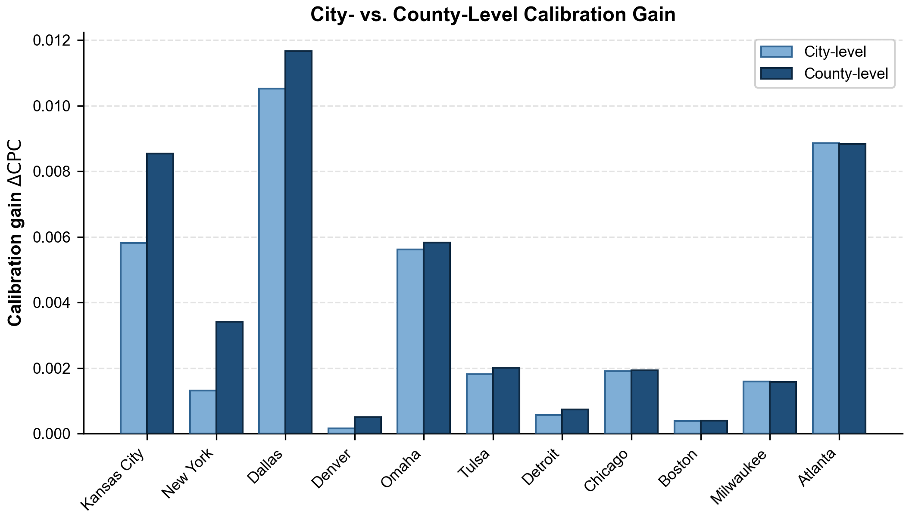

# Cải thiện tái tạo cường độ luồng OD của mô hình zero-shot giữ nguyên tham số bằng phân phối di chuyển theo khoảng cách của thành phố mục tiêu

## Tóm tắt

Ma trận nguồn–đích là đầu vào quan trọng cho phân tích giao thông và quy hoạch đô thị, nhưng dữ liệu chi tiết về cường độ luồng OD của thành phố mục tiêu thường khó thu thập. Các nghiên cứu sử dụng ngữ cảnh đô thị và khoảng cách địa lý đã phát triển các baseline cross-city zero-shot có khả năng dự báo luồng di chuyển mà không sử dụng dữ liệu quan sát về cường độ OD của thành phố mục tiêu. Nghiên cứu này xem xét liệu phân phối di chuyển theo khoảng cách của thành phố mục tiêu có thể cải thiện việc tái tạo cường độ luồng OD liên vùng trên tập hỗ trợ dương đã biết thông qua hiệu chỉnh kết quả của một baseline zero-shot có tham số được giữ nguyên hay không.

Phân phối di chuyển này được tổng hợp từ dữ liệu quan sát luồng của chính thành phố mục tiêu và chỉ cung cấp tỷ trọng khối lượng luồng theo các khoảng khoảng cách, không cung cấp cường độ của từng cặp OD cụ thể. Trong thí nghiệm chính, phương pháp được đánh giá bằng quy trình kiểm định chéo 5-fold trên các thành phố của Hoa Kỳ. Hiệu chỉnh ở cấp thành phố tạo ra mức cải thiện nhỏ nhưng nhất quán: CPC trung bình tăng 0.00354 (CI 95%: $[+0{.}0026; +0{.}0045]$), với 45/50 thành phố được cải thiện. Đồng thời, mức cải thiện cũng giảm khi độ phân giải hoặc chất lượng của phân phối quan sát dần suy giảm.

Nghiên cứu giới hạn phạm vi tập trung đánh giá ở các cặp OD đã biết có luồng di chuyển. Các cặp OD chưa được quan sát chưa có số liệu di chuyển không được đưa vào các phép đánh giá.

**Từ khóa:** ma trận nguồn–đích; tái tạo cường độ OD; phân phối di chuyển theo khoảng cách; zero-shot; học chuyển giao giữa các thành phố; quan sát tổng hợp; di chuyển không gian.

# Mục 1: Giới thiệu

Ma trận nguồn–đích (origin–destination, OD) mô tả khối lượng di chuyển giữa các cặp đơn vị không gian và cung cấp một biểu diễn tương tác không gian ở cấp độ quần thể. Dữ liệu này hỗ trợ nhiều bài toán giao thông và đô thị, bao gồm mô hình hóa nhu cầu đi lại, quy hoạch mạng lưới, đánh giá khả năng tiếp cận và nghiên cứu cấu trúc đô thị [@wilson1971family; @ortuzar2011modelling; @barbosa2018humanmobility]. Vì vậy, ước lượng luồng OD đáng tin cậy có giá trị không chỉ trong mô tả di chuyển quan sát được mà còn trong phân tích sự khác biệt của nhu cầu di chuyển giữa các bối cảnh địa lý.

Tuy nhiên, việc thu thập cường độ OD chi tiết cho mọi thành phố mục tiêu gặp nhiều khó khăn. Khảo sát hộ gia đình sẽ tốn kém và chỉ thực hiện cho vùng không gian giới hạn, trong khi dữ liệu di chuyển được thu thập thụ động thông qua các thiết bị có thể chịu ảnh hưởng của độ phủ không đầy đủ, sai lệch mẫu, sai lệch do quy trình xử lý, hạn chế truy cập và tính đại diện chưa rõ ràng [@gallotti2024distorted; @pappalardo2023future]. Hơn nữa, luồng di chuyển không chỉ được quyết định bởi khoảng cách địa lý. Cấu trúc luồng còn phản ánh phân bố dân cư và việc làm, sử dụng đất, hạ tầng giao thông, hình thái đô thị và hành vi đặc thù của từng thành phố. Do đó, các mô hình chuyển giao giữa thành phố vẫn có thể mang sai lệch có hệ thống tại thành phố mục tiêu khi không có thông tin hiệu chỉnh địa phương [@yang2014limits].

Các mô hình neural mobility gần đây kết hợp thuộc tính địa lý, biểu diễn không gian và tương tác phụ thuộc khoảng cách để học các quy luật luồng có khả năng chuyển giao giữa các khu vực [@simini2021deepgravity; @guo2025ugnn; @enaya2026transgm]. Những phương pháp này làm giảm nhu cầu phải xây dựng một mô hình độc lập từ đầu cho từng thành phố. Tuy nhiên, một mô hình cross-city có tham số được giữ nguyên vẫn phải suy luận cấu trúc di chuyển của thành phố mục tiêu từ các đặc trưng đầu vào sẵn có. Mặc dù baseline biết khoảng cách địa lý của từng cặp OD, mô hình không trực tiếp quan sát cách tổng khối lượng di chuyển của thành phố mục tiêu được phân bổ giữa các khoảng khoảng cách. Phân phối cự ly chuyến đi này là một đặc trưng tổng hợp quan trọng, phản ánh lực cản không gian và cấu trúc di chuyển đặc thù của thành phố, trong khi quy luật suy giảm theo khoảng cách thực tế lại thay đổi theo bộ dữ liệu, thang không gian, mục đích chuyến đi và bối cảnh đô thị [@lenormand2016comparison; @verma2025distance].

Nghiên cứu này kiểm tra liệu phần thông tin còn thiếu đó có thể được bổ sung bằng một quan sát tổng hợp gọn nhẹ là phân phối di chuyển theo các khoảng khoảng cách của thành phố mục tiêu. Đây là một tín hiệu tổng hợp số chiều thấp, phân phối này chỉ mô tả cách tổng khối lượng được phân bổ theo khoảng cách và không tiết lộ cường độ của từng cặp OD riêng lẻ. Thay vì huấn luyện lại hoặc fine-tune mô hình dự báo, phân phối này chỉ được sử dụng tại thời điểm suy luận để tái phân bổ giải tích khối lượng luồng dự báo giữa các khoảng khoảng cách trong khi backbone và toàn bộ tham số đã huấn luyện được giữ cố định. Phép hiệu chỉnh này được thiết kế có chủ ý theo dạng đơn giản và đóng. Vai trò của nó không phải là đề xuất một thuật toán hiệu chỉnh tổng quát mới, mà là một công cụ thực nghiệm để đo lượng thông tin bổ sung chứa trong một tín hiệu tổng hợp có số chiều thấp và đặc thù cho thành phố mục tiêu. Nghiên cứu chỉ đánh giá khả năng tái tạo cường độ trên tập hỗ trợ dương đã biết và các cặp ngoài support được xem là chưa biết và không thuộc phạm vi đánh giá.

Nghiên cứu được tổ chức quanh hai câu hỏi: 
- Khi được đánh giá trên cùng một tập hỗ trợ liên vùng dương đã biết, việc đưa phân phối di chuyển theo các khoảng khoảng cách của thành phố mục tiêu vào như thông tin bổ sung duy nhất tại bước hiệu chỉnh có cải thiện tái tạo cường độ luồng OD zero-shot so với mô hình cross-city đã cố định tham số hay không? 
- Nếu có cải thiện thì mức cải thiện thay đổi như thế nào theo số lượng khoảng khoảng cách, chất lượng quan sát, thứ tự của các khoảng và tính đặc thù của thành phố mục tiêu? 

Cả hai câu hỏi được đánh giá trong phạm vi tái tạo cường độ luồng OD liên vùng trên tập hỗ trợ dương đã biết. Các cặp ngoài tập hỗ trợ được xem là chưa biết, không được gán là luồng bằng 0 và không thuộc phạm vi đánh giá của nghiên cứu. Do đó, kết quả không đại diện cho khả năng phát hiện liên kết hoặc khôi phục toàn bộ ma trận OD. Ngoài ra, phân phối này được trích xuất trực tiếp từ luồng tham chiếu của chính thành phố mục tiêu nên được xem là một quan sát tổng hợp từ thực tế. Thiết lập này đóng vai trò như một thí nghiệm thăm dò giá trị thông tin có kiểm soát hoặc một thí nghiệm định tính khả thi nhằm kiểm tra xem một tín hiệu tổng hợp có số chiều thấp có chứa thông tin bổ sung đủ rõ để tạo động lực cho các nghiên cứu thu thập hoặc ước lượng phân phối này trong tương lai hay không.

Nghiên cứu sử dụng kiểm định chéo liên thành phố 5-fold trên 50 vùng đô thị của Hoa Kỳ, trong đó mỗi thành phố được đánh giá ở fold mà thành phố đó không tham gia huấn luyện mô hình. Backbone neural và toàn bộ tham số đã huấn luyện được giữ cố định trước bước hiệu chỉnh cho thành phố mục tiêu. Thí nghiệm chính sử dụng phân phối cấp thành phố. Các phân tích bổ sung khảo sát ảnh hưởng của số lượng khoảng khoảng cách, sai số quan sát, hoán vị khoảng cách, phân phối từ thành phố khác, các lần khởi tạo ngẫu nhiên và kiến trúc mô hình khác nhau. Một phân tích thăm dò bổ sung về phân giải không gian cấp county được trình bày trong Phụ lục S7.

Kết quả cho thấy phân phối di chuyển theo các khoảng khoảng cách của thành phố mục tiêu tạo ra mức cải thiện nhỏ nhưng tương đối nhất quán so với baseline zero-shot giữ nguyên tham số: CPC trung bình tăng 0.00354 và cải thiện kết quả tại 45 trong tổng số 50 thành phố. Mức cải thiện giảm khi độ phân giải và chất lượng của phân phối quan sát suy giảm, đồng thời phụ thuộc vào việc các khoảng khoảng cách được giữ đúng thứ tự và đặc thù cho thành phố mục tiêu. 

Nghiên cứu có bốn đóng góp chính: 
- Thiết lập một thí nghiệm có điều kiện theo tập hỗ trợ liên vùng dương đã biết nhằm cô lập giá trị thông tin bổ sung của phân phối khoảng cách cấp thành phố trong khi giữ cố định mô hình dự báo. Từ đó đánh giá đúng giá trị mà phân phối thực sự cung cấp.
- Đánh giá tín hiệu này bằng kiểm định chéo liên thành phố 5-fold trên 50 vùng đô thị, với bất định được lượng hóa ở cấp thành phố thay vì xem các cặp OD trong cùng thành phố là độc lập. 
- Xác định các điều kiện làm tín hiệu trở nên hữu ích thông qua phân tích độ phân giải, nhiễu, hoán vị, donor placebo, khởi tạo và kiến trúc.
- Diễn giải cơ chế hiệu chỉnh như sự tái phân bổ khối lượng liên khoảng có bảo toàn thứ hạng nội khoảng, đồng thời phân biệt rõ liên hệ thực nghiệm với bằng chứng nhân quả và đánh giá oracle với triển khai vận hành.

# Mục 2: Nghiên cứu liên quan

## 2.1. Mô hình tương tác không gian và hiệu chỉnh dựa trên khoảng cách

Mô hình hóa luồng điểm đi–điểm đến từ lâu đã được nghiên cứu thông qua các mô hình tương tác không gian, trong đó chuyển động giữa origin và destination được biểu diễn theo khả năng phát sinh chuyến đi, mức độ thu hút và độ phân cách hoặc chi phí di chuyển. Công trình dựa trên entropy của Wilson đặt nền tảng cho một họ mô hình tương tác không gian có ràng buộc, còn các khung mô hình giao thông sau đó tích hợp phân bổ chuyến đi vào hệ thống phân tích nhu cầu rộng hơn [@wilson1971family; @ortuzar2011modelling]. Trong hướng tiếp cận này, khoảng cách địa lý hoặc chi phí di chuyển tổng quát đóng vai trò impedance, làm giảm tương tác kỳ vọng khi hai địa điểm cách xa nhau hơn.

Dạng hàm và tham số suy giảm theo khoảng cách thường cần được hiệu chỉnh từ dữ liệu thực nghiệm. Phương pháp của Hyman là một trong những cách tiếp cận sớm có hệ thống để hiệu chỉnh tham số cản trở của mô hình gravity theo cự ly chuyến đi trung bình quan sát được [@hyman1969calibration]. Các nghiên cứu gần đây cho thấy những thống kê tóm tắt gọn nhẹ khác, chẳng hạn trung vị thời gian di chuyển, cũng có thể giúp xác định một tham số impedance khi các giả định cấu trúc phù hợp được thỏa mãn [@merlin2020medians]. Tuy nhiên, các đánh giá so sánh cũng chỉ ra rằng không có một quy luật phân bổ chuyến đi hoặc dạng distance-decay duy nhất luôn hoạt động tốt trên mọi bộ dữ liệu và thang không gian [@lenormand2016comparison]. Mẫu hình suy giảm thực nghiệm có thể thay đổi theo phương thức, mục đích chuyến đi, mức độ đô thị hóa và điều kiện kinh tế–xã hội [@verma2025distance].

Các nghiên cứu trên xác lập hai nguyên lý liên quan trực tiếp đến đề tài này. Thứ nhất, khoảng cách là một biến tổ chức trung tâm của luồng không gian. Thứ hai, quan sát đặc thù của miền mục tiêu về cấu trúc cự ly chuyến đi có thể chứa thông tin không thể khôi phục hoàn toàn từ một hàm cản trở cố định được chuyển giao chung cho mọi nơi. Nghiên cứu hiện tại kế thừa nhận định cổ điển này nhưng không ước lượng một hệ số suy giảm tham số của mô hình gravity. Thay vào đó, nghiên cứu sử dụng vector tỷ lệ luồng quan sát theo các khoảng khoảng cách như một ràng buộc vĩ mô phi tham số áp dụng lên dự báo đã có.

## 2.2. Sinh dữ liệu di chuyển và mô hình không gian dựa trên học máy

Sự gia tăng của dữ liệu thuộc tính địa lý và quan sát di chuyển đã tạo điều kiện cho các mô hình học máy biểu diễn tương tác phi tuyến giữa đặc trưng origin, đặc trưng destination và độ phân cách không gian. Deep Gravity cho thấy kiến trúc neural có thể kết hợp đặc trưng địa lý với khoảng cách để sinh luồng di chuyển và khái quát ra ngoài từng khu vực huấn luyện riêng lẻ [@simini2021deepgravity]. Các mô hình neural có nhận thức địa lý gần đây tiếp tục tích hợp cấu trúc không gian và biểu diễn có khả năng chuyển giao nhằm cải thiện dự báo tại những đô thị chưa xuất hiện trong huấn luyện [@guo2025ugnn]. Các khung gravity có khả năng chuyển giao cũng nhấn mạnh bài toán chuyển giao giữa thành phố và thích nghi giữa các hệ thống đô thị không đồng nhất [@enaya2026transgm].

Khái quát hóa giữa các thành phố vẫn là một bài toán khó vì ánh xạ từ bối cảnh đô thị sang luồng di chuyển không bất biến theo không gian. Mô hình huấn luyện trên các thành phố nguồn có thể học được quy luật chung nhưng vẫn biểu diễn sai tỷ trọng đặc thù giữa các chuyến đi cục bộ và đường dài tại thành phố mục tiêu. Nghiên cứu trước về khả năng dự báo luồng đi làm cho thấy việc thiếu dữ liệu hiệu chỉnh địa phương tạo ra giới hạn đáng kể đối với độ chính xác [@yang2014limits]. Hạn chế này không tự biến mất khi khoảng cách cặp được đưa vào đầu vào: khoảng cách cho mô hình biết hai vùng cách nhau bao xa, nhưng không cho biết tỷ lệ thực nghiệm của tổng luồng tại thành phố mục tiêu được phân bổ vào dải cự ly đó.

Vì vậy, nghiên cứu hiện tại giải quyết một vấn đề bổ sung cho hướng thiết kế kiến trúc neural. Nghiên cứu giả định mô hình cross-city đã được huấn luyện, sau đó kiểm tra liệu một quan sát tổng hợp gọn nhẹ của miền mục tiêu có thể sửa phần sai lệch vĩ mô còn lại mà không cập nhật tham số đã học hay không. Cách thiết kế này tách giá trị thông tin của quan sát mục tiêu khỏi những cải thiện có thể phát sinh do huấn luyện bổ sung, fine-tuning hoặc thay đổi kiến trúc.

## 2.3. Quan sát tổng hợp như một ràng buộc hiệu chỉnh

Hiệu chỉnh bằng quan sát tổng hợp nằm giữa hai cực: dự báo hoàn toàn không có quan sát tại miền mục tiêu và ước lượng từ một ma trận OD mục tiêu đầy đủ. Các mô hình có ràng buộc cổ điển sử dụng tổng lượng chuyến đi theo điểm đi và điểm đến hoặc moment của chi phí di chuyển để áp đặt tính nhất quán về production, attraction hoặc impedance [@wilson1971family; @hyman1969calibration; @ortuzar2011modelling]. Những ràng buộc này có thể mang nhiều thông tin vì chúng tóm tắt thuộc tính của toàn hệ thống luồng nhưng chỉ cần số lượng đại lượng quan sát nhỏ hơn rất nhiều so với số ô OD.

Phần lớn phương pháp hiệu chỉnh khoảng cách truyền thống ước lượng một hoặc một số tham số của mô hình tương tác không gian. Ngược lại, quan sát mục tiêu trong nghiên cứu này là phân phối di chuyển theo các khoảng khoảng cách của thành phố mục tiêu, biểu diễn tỷ trọng của tổng khối lượng di chuyển được phân bổ vào từng khoảng khoảng cách riêng biệt. Phân phối này được dùng để điều chỉnh trực tiếp khối lượng dự báo giữa các khoảng cự ly thực nghiệm. Sự khác biệt này cho phép nghiên cứu trực tiếp độ chi tiết của quan sát: thay đổi số lượng khoảng khoảng cách sẽ làm thay đổi số chiều và độ phân giải cự ly của tín hiệu. Đầu ra luôn là dự báo cường độ luồng cho toàn bộ bộ dữ liệu thành phố trên tập hỗ trợ liên vùng dương đã biết.

Tín hiệu tổng hợp trong nghiên cứu này không đồng nhất với tổng lượng chuyến đi theo điểm đi và điểm đến hoặc một mẫu các cặp OD được quan sát trực tiếp. Mỗi loại quan sát ràng buộc một khía cạnh khác nhau của ma trận luồng chưa biết. Phân phối di chuyển theo các khoảng khoảng cách của thành phố mục tiêu chỉ ràng buộc tỷ lệ của tổng khối lượng di chuyển của thành phố trên tập hỗ trợ liên vùng dương đã biết được phân bổ vào từng khoảng cự ly; bản thân nó không xác định cặp origin–destination cụ thể nào phải nhận nhiều luồng hơn trong cùng một khoảng. Vì vậy, giá trị tiềm năng của tín hiệu phụ thuộc đồng thời vào ràng buộc cự ly vĩ mô và cấu trúc cặp mà baseline đã học được.

## 2.4. Mô hình hóa dữ liệu đếm trên support dương

Cường độ OD là dữ liệu đếm không âm và thường có phương sai lớn hơn trung bình, do đó cần các phân phối có khả năng biểu diễn overdispersion. Negative binomial regression là một khung phổ biến cho loại dữ liệu này [@hilbe2011negative]. Khi bộ dữ liệu chỉ chứa các quan sát dương, việc áp dụng một likelihood đếm thông thường mà không xử lý phần khối lượng xác suất tại 0 sẽ không phản ánh đúng cơ chế lấy mẫu. Mô hình đếm cắt tại 0 khắc phục điều này bằng cách đặt likelihood có điều kiện theo các quan sát luồng dương [@grogger1991truncated].

Sự phân biệt này là nền tảng của phạm vi nghiên cứu. Bài toán được xác định là **tái tạo cường độ luồng OD liên vùng trên tập hỗ trợ dương đã biết**: các cặp OD có trong benchmark được biết là có luồng tham chiếu dương, và mô hình ước lượng cường độ dương của chúng. Các cặp ngoài tập hỗ trợ được xem là chưa biết, không được gán là luồng bằng 0 và không thuộc phạm vi đánh giá của nghiên cứu; do đó, kết quả không đại diện cho khả năng phát hiện liên kết hoặc khôi phục toàn bộ ma trận OD. Cách xây dựng thống kê này làm cho likelihood phù hợp với mẫu quan sát và tránh đưa ra claim toàn ma trận mạnh hơn khả năng hỗ trợ của dữ liệu.

## 2.5. Chất lượng dữ liệu di chuyển, mức độ tổng hợp và ranh giới quyền riêng tư

Dữ liệu di chuyển có thể chịu sai lệch về độ phủ, tính đại diện và quy trình xử lý, làm thay đổi phân phối khoảng cách quan sát được [@gallotti2024distorted; @pappalardo2023future]. Mặc dù dữ liệu tổng hợp có độ chi tiết thấp hơn dữ liệu OD theo từng cặp, phép tổng hợp không tự động tạo ra bảo đảm quyền riêng tư chính thức [@demontjoye2013unique]. Vì vậy, nghiên cứu này chỉ xem $Y_D$ như một quan sát tổng hợp oracle để đánh giá giá trị thông tin; nghiên cứu không đánh giá tính đại diện của nguồn dữ liệu, khả năng chống tái nhận dạng, mức bảo vệ quyền riêng tư hoặc khả năng triển khai dữ liệu thực tế.

## 2.6. Khoảng trống nghiên cứu và vị trí của nghiên cứu hiện tại

Các nghiên cứu đã tổng quan xác lập vai trò quan trọng của khoảng cách trong tương tác không gian, nhu cầu hiệu chỉnh địa phương, khả năng chuyển giao ngày càng cao của mô hình neural mobility và giá trị của một số ràng buộc tổng hợp. Tuy nhiên, một câu hỏi thông tin cụ thể vẫn chưa được làm rõ đầy đủ: **sau khi mô hình cross-city đã học từ bối cảnh đô thị tĩnh và khoảng cách giữa các cặp vùng, phân phối di chuyển theo các khoảng khoảng cách của thành phố mục tiêu còn cung cấp thêm bao nhiêu giá trị, và giá trị đó duy trì trong những điều kiện quan sát nào?**

Nghiên cứu này không xem phân phối di chuyển theo các khoảng khoảng cách của thành phố mục tiêu là sự thay thế cho ma trận OD mục tiêu, cũng không xem nó là một đặc trưng mới để huấn luyện lại mạng neural. Thay vào đó, phân phối này là tín hiệu tổng hợp duy nhất về cường độ của thành phố mục tiêu được đưa vào sau khi mô hình đã huấn luyện xong. Thiết kế giữ nguyên tham số backbone (không cập nhật trọng số), đánh giá liên thành phố và các đối chứng chẩn đoán được khớp phù hợp được sử dụng để phân biệt giá trị thông tin đặc thù của target với hiệu ứng thích nghi mô hình, distance decay chung hoặc rescaling tùy ý. Các nghiên cứu hiện có chưa trực tiếp kiểm tra giá trị cải thiện biên của tín hiệu này trên một baseline cross-city đã được huấn luyện và giữ nguyên tham số. Phân tích cũng tách riêng độ phân giải cự ly với độ phân giải không gian dưới cấp vùng đô thị và kiểm tra độ trung thực của quan sát bằng nhiễu có kiểm soát cùng placebo về thứ tự ngữ nghĩa.

Cách định vị này làm hẹp phạm vi claim nhưng giúp phạm vi đánh giá trở nên minh bạch. Nghiên cứu đặt câu hỏi liệu một đại lượng tổng hợp mục tiêu có số chiều thấp và đã biết có cải thiện ước lượng cường độ của các liên kết OD liên vùng có luồng dương đã biết trong một hệ thống dự báo cố định hay không. Nghiên cứu không tuyên bố tái tạo support chưa biết của mạng, chứng minh khả năng thu thập vận hành của tín hiệu tổng hợp này hoặc cung cấp bảo đảm quyền riêng tư chính thức.

# Mục 3: Nguồn dữ liệu, đơn vị không gian và phương pháp luận

## 3.1. Ký hiệu và dữ liệu đầu vào

Gọi $c$ là một thành phố và $\mathcal{V}_c$ là tập các vùng đơn vị phân chia thành phố đó. Mỗi cặp có thứ tự $(i,j)$ với $i,j \in \mathcal{V}_c$ biểu diễn một cặp nguồn–đích (OD). 

### Bảng 1: Ký hiệu cốt lõi, nguồn dữ liệu và trạng thái sẵn có của thông tin

| Ký hiệu | Mô tả toán học | Nguồn / Vai trò |
| :--- | :--- | :--- |
| $c$ | Chỉ số thành phố ($c \in \{1, \dots, C\}$) | Mã định danh thành phố ($C = 50$) |
| $i, j$ | Chỉ số vùng xuất phát (origin) và vùng đích (destination) | Đơn vị không gian cơ sở |
| $t_{c,ij}$ | Cường độ luồng di chuyển quan sát được ($t_{c,ij} \ge 1$) | Dữ liệu tham chiếu (ground truth) |
| $d_{c,ij}$ | Khoảng cách giữa tâm của vùng $i$ và vùng $j$ (km) | Tính từ tọa độ tâm (Haversine) |
| $\Omega_c$ | Tập hỗ trợ liên vùng dương đã biết; xem định nghĩa đầy đủ tại Mục 3.2. | Giả định support đã biết |
| $I_b$ | Khoảng khoảng cách thứ $b$ ($b = 1, \dots, K$) | Phân vị khoảng cách |
| $K$ | Số lượng khoảng khoảng cách ($K = 8$ ở thiết lập chính) | Cấu hình thực nghiệm cố định |
| $Y_{c,b}$ | Tỷ trọng luồng di chuyển mục tiêu trong khoảng $b$ ($\sum_{b=1}^K Y_{c,b} = 1$) | Dữ liệu đầu vào hiệu chỉnh oracle |
| $\hat{t}_{c,ij}^{(0)}$ | Dự báo cường độ luồng của baseline cross-city zero-shot (điều kiện $M_0$) | Đầu ra baseline giữ nguyên tham số |
| $\hat{t}_{c,ij}^{(1)}$ | Dự báo cường độ luồng sau hiệu chỉnh tại thời điểm suy luận (điều kiện $M_1$) | Đầu ra sau hiệu chỉnh |
| $M_0, M_1$ | Tên hai điều kiện thực nghiệm (baseline zero-shot giữ nguyên tham số và dự báo sau hiệu chỉnh) | Điều kiện thực nghiệm đối chứng |

## 3.2. Nguồn dữ liệu và biểu diễn không gian

Nghiên cứu được thực hiện trên 50 thành phố của Hoa Kỳ. Mỗi thành phố được biểu diễn dưới dạng một tập hợp các đơn vị không gian cấp tract. Mỗi tract có tọa độ tâm địa lý $\mathbf{u}_i = (\operatorname{lon}_i, \operatorname{lat}_i)$ và 26 đặc trưng mô tả bối cảnh đô thị, bao gồm 13 đặc trưng Census, 8 đặc trưng điểm quan tâm (POI) và 5 đặc trưng mạng lưới đường. Các đặc trưng này được lấy từ bộ dữ liệu do Lab tổng hợp. Nghiên cứu không sử dụng hình học polygon của tract mà biểu diễn mỗi tract bằng tọa độ tâm. Khoảng cách giữa các cặp tract $d_{c,ij}$ được tính bằng công thức Haversine với bán kính Trái Đất 6371 km.

Với mỗi fold $f$ trong kiểm định chéo, các biên khoảng cách $a_b$ ($b = 1, \dots, K-1$) được xác định độc lập theo phân vị cặp luồng (pair-weighted quantile bins) từ tập các thành phố huấn luyện, với $a_0 = 0$ và $a_K = \infty$. Không sử dụng thông tin của thành phố kiểm tra để thiết lập các biên khoảng cách.

Phạm vi đánh giá và tái tạo luồng di chuyển được giới hạn nghiêm ngặt trên tập hỗ trợ liên vùng dương đã biết:

$$
\Omega_c = \left\{ (i,j) : t_{c,ij} \ge 1,\ i \neq j,\ d_{c,ij} > 0 \right\}.
$$

Trong phần còn lại của bài báo, $\Omega_c$ luôn chỉ tập hỗ trợ liên vùng dương đã biết của thành phố $c$. Mọi luồng nội vùng ($i = j$) và các cặp có khoảng cách không dương ($d_{c,ij} \le 0$) đều bị loại trừ khỏi phạm vi nghiên cứu. Các cặp không xuất hiện trong dữ liệu được xem là chưa biết (unknown/missing), không được gán nhãn zero, và mô hình không đưa ra bất kỳ tuyên bố nào về việc phân loại số không hoặc dự báo liên kết mới.

## 3.3. Đơn vị không gian và cấu hình chuẩn cấp thành phố
Các thử nghiệm chính sử dụng một phân phối di chuyển theo khoảng cách duy nhất ở cấp thành phố. Tỷ trọng luồng di chuyển mục tiêu rơi vào khoảng khoảng cách thứ $b$ ($I_b = [a_{b-1}, a_b)$) được định nghĩa là:

$$
Y_{c,b} = \frac{\sum_{(i,j) \in \Omega_c} t_{c,ij} \mathbf{1}(d_{c,ij} \in I_b)}{\sum_{(i,j) \in \Omega_c} t_{c,ij}}, \qquad \sum_{b=1}^K Y_{c,b} = 1.
$$

$Y_{D,c}$ được tổng hợp từ luồng ground-truth của thành phố mục tiêu và được sử dụng như một quan sát oracle tại thời điểm hiệu chỉnh. Một biến thể thăm dò sử dụng phân phối theo origin-county được đánh giá trên các vùng đô thị multi-county, thiết lập và giới hạn của phân tích này được trình bày trong Phụ lục S7.

## 3.4. Cấu trúc mô hình và hiệu chỉnh tại thời điểm suy luận

### 3.4.1. Giao diện dự báo baseline chung

Ba mô hình dự báo được đánh giá gồm Urban GNN kết hợp tiên nghiệm Gravity, Pairwise Node MLP và Gravity hai tham số. Mỗi mô hình tạo dự báo zero-shot ban đầu $\hat{t}_{c,ij}^{(0)}$ trên $\Omega_c$, sau khi được huấn luyện hoặc khớp tham số hoàn toàn bằng các thành phố nguồn của fold tương ứng. Các tham số được giữ cố định khi suy luận trên thành phố mục tiêu và \(Y_{D,c}\) không được sử dụng để tạo dự báo \(M_0\).

Cùng một quy tắc hiệu chỉnh theo khoảng cách được áp dụng cho dự báo ban đầu của cả ba mô hình. Urban GNN là mô hình chính, Pairwise Node MLP và Gravity hai tham số được sử dụng để đánh giá mức độ phụ thuộc của hiệu quả hiệu chỉnh vào kiến trúc baseline.

### 3.4.2. Mô hình neural chính: Urban GNN kết hợp tiên nghiệm Gravity

Mô hình dự báo chính kết hợp tích chập đồ thị không gian, tiên nghiệm gravity vật lý và output head phân phối Negative Binomial cắt tại 0 (ZTNB).

Cấu trúc mô hình bao gồm:
- **Đầu vào**: 26 đặc trưng bối cảnh đô thị đã chuẩn hóa của mỗi tract và một đồ thị bán kính không gian không trọng số với ngưỡng khoảng cách $r = 5.0\text{ km}$ (bổ sung kết nối láng giềng gần nhất cho các nút cô lập).
- **Node Encoder**: Gồm lớp chiếu tuyến tính ban đầu, theo sau bởi $L = 2$ lớp truyền thông điệp điều biến theo khoảng cách (`GraphConvLayer`) với chiều ẩn $d = 64$. Mỗi lớp sử dụng thông điệp điều kiện hóa theo log khoảng cách, cơ chế tổng hợp trung bình chuẩn hóa theo bậc, chuẩn hóa LayerNorm, hàm kích hoạt ReLU, tỷ lệ dropout 0.1 và kết nối tắt residual.
- **Biểu diễn cặp OD**: Ghép nối embedding của origin $\mathbf{h}_i$, embedding của destination $\mathbf{h}_j$, log khoảng cách $\log(1 + d_{c,ij})$, và log tiên nghiệm gravity $\log T_{c,ij}^{\mathrm{grav}}$, tạo thành vector biểu diễn 130 chiều.
- **Pairwise Decoder**: Perceptron đa tầng với cấu trúc kích thước 130–64–32–1 kết hợp LayerNorm, ReLU và dropout 0.1. Lớp tuyến tính cuối cùng được khởi tạo bằng 0 để dự báo phần bù dư vào log gravity prior.
- **Output Head**: Đầu ra được ánh xạ qua hàm softplus để xác định tham số trung bình $\mu_{c,ij} > 0$ của phân phối ZTNB, kết hợp cùng tham số phân tán toàn cục $\phi > 0$.

Chi tiết phương trình từng layer và tensor được trình bày trong Phụ lục S1.

### 3.4.3. Mô hình tham số cổ điển: Gravity hai tham số

Để cung cấp một đường cơ sở tham số phi neural với độ phức tạp thấp, mô hình tương tác không gian Gravity hai tham số dạng lũy thừa cổ điển được xác định bởi:

$$
\hat{t}_{c,ij}^{(0,\mathrm{grav})} = \exp(G) \cdot \frac{P_{c,i} P_{c,j}}{d_{c,ij}^\alpha}, \qquad (i,j) \in \Omega_c
$$

trong đó:
- $P_{c,i} = \max(\operatorname{pop}_{c,i}, 1.0)$ và $P_{c,j} = \max(\operatorname{pop}_{c,j}, 1.0)$ là dân số của tract xuất phát và tract đích (chặn dưới tại 1.0 để bảo đảm ổn định số học);
- $d_{c,ij} = \max(\operatorname{dist}_{c,ij}, 0.1\text{ km})$ là khoảng cách Haversine giữa hai tâm tract (chặn dưới tại 0.1 km);
- $G \in \mathbb{R}$ là hệ số quy mô toàn cục (hằng số log-scale);
- $\alpha > 0$ là số mũ suy giảm tương tác theo khoảng cách (power-law distance decay exponent).

Hai tham số $(G, \alpha)$ được ước lượng giải tích bằng phương pháp bình phương tối thiểu thông thường (Ordinary Least Squares - OLS) dạng log-linear gộp trên toàn bộ các cặp OD liên vùng dương của các thành phố huấn luyện trong fold $f$:

$$
\log t_{c,ij} - \log(P_{c,i} P_{c,j}) = G - \alpha \log d_{c,ij}
$$

Phương trình trên tương ứng với bài toán tối ưu bình phương tối thiểu:

$$
\min_{\boldsymbol{\beta}} \|\mathbf{y} - \mathbf{X}\boldsymbol{\beta}\|_2^2, \qquad \boldsymbol{\beta} = [G, \alpha]^T
$$

trong đó vector đáp ứng $\mathbf{y}$ có các phần tử $y_{c,ij} = \log t_{c,ij} - (\log P_{c,i} + \log P_{c,j})$ và ma trận thiết kế $\mathbf{X}$ có các hàng $[1, -\log d_{c,ij}]$ trên toàn bộ các cặp $(i,j) \in \Omega_c$ của các thành phố thuộc $\mathcal{C}_{\mathrm{train}}^{(f)}$. Nghiệm đóng được tính trực tiếp qua đại số tuyến tính (`np.linalg.lstsq`):

$$
\widehat{\boldsymbol{\beta}}^{(f)} = \left(\mathbf{X}^T \mathbf{X}\right)^{-1} \mathbf{X}^T \mathbf{y} = \left[\widehat{G}^{(f)}, \widehat{\alpha}^{(f)}\right]^T
$$

Các tham số $(\widehat{G}^{(f)}, \widehat{\alpha}^{(f)})$ được ước lượng một lần duy nhất cho mỗi fold từ các thành phố nguồn và được giữ nguyên tuyệt đối khi suy luận trên thành phố kiểm tra. Mô hình baseline này không sử dụng bất kỳ thông tin luồng nào của thành phố mục tiêu, không có hệ số cân bằng sản sinh/thu hút ($A_i, B_j$), và không truy cập các cặp ngoài tập hỗ trợ liên vùng dương $\Omega_c$. Đầu ra baseline zero-shot $\hat{t}_{c,ij}^{(0,\mathrm{grav})}$ sau đó được đưa qua toán tử hiệu chỉnh khoảng cách tại Mục 3.4.7 để đánh giá lợi ích của tín hiệu $Y_D$ trên một kiến trúc phi neural.

### 3.4.4. Mô hình bóc tách: Pairwise Node MLP

Để đánh giá vai trò của cơ chế truyền thông điệp trên đồ thị, mô hình Pairwise Node MLP sử dụng cùng các đặc trưng nút 26 chiều, cùng pairwise decoder, cùng tiên nghiệm gravity và cùng hàm mất mát ZTNB, nhưng loại bỏ hoàn toàn các lớp graph convolution. Biểu diễn của mỗi tract được sinh ra độc lập chỉ từ đặc trưng của chính nó thông qua một MLP 2 lớp trước khi đưa vào decoder cặp OD.

Bảng so sánh ba kiến trúc dự báo:

| Thành phần kiến trúc | Urban GNN (Chính) | Pairwise Node MLP (Ablation) | Classical Gravity (Baseline) |
| :--- | :--- | :--- | :--- |
| **Bản chất mô hình** | Deep Graph Neural Network | Feedforward Neural Network | Non-neural Parametric |
| **Đầu vào tract** | 26 đặc trưng bối cảnh đô thị | 26 đặc trưng bối cảnh đô thị | Dân số tract $P_i, P_j$ |
| **Cấu trúc không gian** | Đồ thị bán kính 5 km (message passing) | Không có đồ thị không gian | Khoảng cách cặp $d_{ij}$ |
| **Tiên nghiệm vật lý** | Gravity prior nhúng vào decoder | Gravity prior nhúng vào decoder | Dạng hàm trọng lực hoàn chỉnh |
| **Output distribution** | ZTNB conditional expectation | ZTNB conditional expectation | Trực tiếp từ hàm mũ OLS |
| **Phương pháp ước lượng** | Tối ưu hóa AdamW trên loss ZTNB | Tối ưu hóa AdamW trên loss ZTNB | Pooled log-linear OLS |

### 3.4.5. Mục tiêu huấn luyện dưới quan sát partial OD

Do dữ liệu di chuyển chỉ bao gồm các luồng dương ($t_{c,ij} \ge 1$), cả hai mô hình neural (GNN và MLP) được huấn luyện bằng hàm mất mát Negative Binomial cắt tại 0 (Zero-Truncated Negative Binomial, ZTNB) [@grogger1991truncated; @hilbe2011negative]:

$$
p_+(t \mid \mu, \phi) = \frac{p_{\mathrm{NB}}(t \mid \mu, \phi)}{1 - p_{\mathrm{NB}}(0 \mid \mu, \phi)}, \qquad \mathcal{L}_c = -\frac{1}{|\Omega_c|} \sum_{(i,j) \in \Omega_c} \log p_+(t_{c,ij} \mid \mu_{c,ij}, \phi).
$$

Hàm mất mát ZTNB điều kiện hóa hàm hợp lý trên các liên kết có lưu lượng dương ($t \ge 1$). Các cặp ngoài tập hỗ trợ được xem là chưa biết, không được gán là luồng bằng 0 và không thuộc phạm vi đánh giá của nghiên cứu. Hàm mất mát được chuẩn hóa theo số cặp $|\Omega_c|$ của từng thành phố để ngăn các đô thị lớn áp đảo quá trình học. Chi tiết kỹ thuật về ổn định số học và gradient clipping được cung cấp trong Phụ lục S1.

### 3.4.6. Cấu hình huấn luyện và lựa chọn checkpoint

Toàn bộ quá trình huấn luyện tuân thủ cấu hình cố định tiên nghiệm và được áp dụng đồng nhất cho cả hai backbone neural (Urban GNN và Pairwise Node MLP):

| Siêu tham số / Cấu hình | Giá trị | Vai trò / Cơ chế |
| :--- | :--- | :--- |
| **Thuật toán tối ưu** | AdamW | Tối ưu hóa trọng số neural |
| **Tốc độ học (Learning Rate)** | $3.2 \times 10^{-3}$ | Cố định tiên nghiệm trong toàn bộ các run |
| **Bộ điều chỉnh tốc độ học** | ReduceLROnPlateau | Giảm LR với hệ số $0.5$, patience $4$ epochs, threshold $10^{-4}$, $\mathrm{LR}_{\min} = 10^{-5}$ |
| **Weight Decay** | $10^{-4}$ | Regularization trọng số ($\lambda_{\mathrm{wd}} = 10^{-4}$) |
| **Dropout** | $0.1$ | Regularization trong encoder và decoder |
| **Đơn vị batch** | 1 thành phố / batch | Tối ưu tuần tự từng thành phố nguồn, tính loss trung bình trên $|\Omega_c|$ cặp |
| **Số epoch tối đa** | 200 epochs | Giới hạn huấn luyện tối đa |
| **Patience dừng sớm** | 16 epochs | Dừng khi validation CPC liên vùng không tăng $\ge 10^{-4}$ |
| **Tiêu chí chọn checkpoint** | Validation CPC cao nhất | Chọn mô hình tốt nhất theo macro-average trên $\mathcal{C}_{\mathrm{val}}^{(f)}$ |
| **Chặn gradient (Clipping)** | $\|\mathbf{g}\|_2 \le 5.0$ | Cắt chuẩn Euclid tối đa bằng `clip_grad_norm_` |
| **Model Seeds** | $\mathcal{S} = \{1, 10, 100\}$ | Đánh giá độ ổn định ngẫu nhiên |
| **Cố định tham số** | Giữ nguyên tuyệt đối | Không cập nhật trọng số trên test cities |

Cả hai neural backbone sử dụng cùng cấu hình huấn luyện. Điều chuẩn được thực hiện thông qua weight decay của AdamW và dropout; không có hàm phạt bổ sung được cộng trực tiếp vào loss ZTNB.

### 3.4.7. Toán tử hiệu chỉnh khoảng cách tại thời điểm suy luận

Cho bất kỳ mô hình baseline giữ nguyên tham số nào tạo ra dự báo ban đầu $\hat{t}_{c,ij}^{(0)}$ trên $\Omega_c$, phân phối khoảng cách ngầm định bởi baseline trong khoảng thứ $b$ là:

$$
\widehat{Y}_{c,b}^{(0)} = \frac{\sum_{(i,j) \in \Omega_c} \hat{t}_{c,ij}^{(0)} \mathbf{1}(d_{c,ij} \in I_b)}{\sum_{(i,j) \in \Omega_c} \hat{t}_{c,ij}^{(0)}}.
$$

Với cường độ hiệu chỉnh được khóa cố định tiên nghiệm tại $q = 1.0$ trong toàn bộ benchmark, toán tử hiệu chỉnh giải tích tái phân bổ khối lượng luồng theo công thức nghiệm đóng:

$$
\hat{t}_{c,ij}^{(1)} = \hat{t}_{c,ij}^{(0)} \frac{Y_{c,b(i,j)}}{\widehat{Y}_{c,b(i,j)}^{(0)}}
$$

Trong đó, \(b(i,j)\) là khoảng chứa \(d_{c,ij}\). Mọi cặp OD trong cùng một khoảng được nhân với cùng một hệ số. Ở cấu hình chính \(K=8\), tất cả các khoảng đều hoạt động trên 50 thành phố đánh giá. Phép hiệu chỉnh không cập nhật tham số mô hình. Dạng tổng quát với \(q\in[0,1]\) được trình bày trong Phụ lục S2. Do các hệ số hiệu chỉnh dương và không đổi trong mỗi khoảng, toán tử bảo toàn tập hỗ trợ, thứ hạng nội khoảng và tổng khối lượng dự báo; các chứng minh được trình bày trong Phụ lục S3.

Hình 1 minh họa toàn bộ pipeline mô hình hóa zero-shot và hiệu chỉnh tại thời điểm suy luận.

**Hình 1. Framework hiệu chỉnh oracle có điều kiện theo support.** 

Mô hình cross-city $M_0$ được huấn luyện trên các thành phố nguồn và giữ nguyên toàn bộ tham số trước khi suy luận trên thành phố mục tiêu. Đối với một thành phố mục tiêu, $M_0$ trước hết tạo ra dự báo cường độ baseline $\widehat{\mathbf{T}}_c^{(0)}$ trên tập hỗ trợ dương đã biết $\Omega_c$. Phân phối theo nhóm khoảng cách oracle $Y_D$ được xác định trực tiếp từ các luồng OD ground-truth của thành phố mục tiêu và chỉ được đưa vào tại thời điểm suy luận. Các hệ số theo bin tái phân bổ khối lượng dự báo giữa các khoảng cự ly để tạo $\widehat{\mathbf{T}}_c^{(1)}$ mà không cập nhật tham số mô hình hoặc tạo liên kết OD mới.

## 3.5. Giao thức đánh giá cross-city và suy luận thống kê

### 3.5.1. Giao thức kiểm định chéo liên thành phố 5-fold

Nghiên cứu áp dụng giao thức kiểm định chéo liên thành phố 5-fold trên 50 vùng đô thị Hoa Kỳ (mỗi fold gồm 35 thành phố huấn luyện, 5 thành phố validation và 10 thành phố kiểm tra). Đơn vị phân chia fold là toàn bộ thành phố; không có bất kỳ cặp OD hoặc tract nào của cùng một thành phố bị phân tán giữa tập huấn luyện và tập kiểm tra.

### 3.5.2. Thước đo đánh giá và so sánh mô hình

Thước đo định lượng chính để đánh giá khả năng tái tạo luồng di chuyển zero-shot là Common Part of Commuters (CPC) [@lenormand2016comparison], được tính trên tập hỗ trợ liên vùng dương $\Omega_c$:

$$
\operatorname{CPC}_c(\hat{t}) = \frac{2 \sum_{(i,j) \in \Omega_c} \min(t_{c,ij}, \hat{t}_{c,ij})}{\sum_{(i,j) \in \Omega_c} t_{c,ij} + \sum_{(i,j) \in \Omega_c} \hat{t}_{c,ij}}.
$$

CPC đo tỷ lệ phần trăm khối lượng di chuyển được chia sẻ đồng thời giữa luồng thực tế và cường độ dự báo, bị chặn nghiêm ngặt trong đoạn $[0, 1]$. Dự báo $\hat{t}_{c,ij}$ là các giá trị thực dương ước lượng cường độ di chuyển.

Để kiểm tra độ nhạy và bảo đảm kết luận không phụ thuộc riêng vào dạng hàm CPC, sáu thước đo sai số phụ gồm MAE, RMSE, NRMSE, RMSE trên thang log ($\operatorname{RMSE}_{\log1p}$), hệ số tương quan hạng Spearman, và sai số tương đối tổng luồng ($\operatorname{RelError}$) được tính toán trên cùng tập hỗ trợ $\Omega_c$ (định nghĩa chi tiết tại Phụ lục S4).

Bên cạnh đó, phân phối khoảng cách gộp sau hiệu chỉnh được đối chiếu với $Y_D$ như một chẩn đoán cơ chế nội bộ nhằm xác nhận thuật toán đã tái phân bổ khối lượng đúng thiết kế. Cả ba họ mô hình (GNN, MLP, Gravity) được so sánh trên cùng tập hỗ trợ $\Omega_c$ theo CPC baseline.

### 3.5.3. Phân tích thống kê và lượng hóa độ bất định

Đối với mỗi thành phố $c$, dự báo baseline và hiệu chỉnh được đánh giá ghép cặp trong từng model seed $s \in \mathcal{S}$, lấy trung bình qua các seed, và tính mức cải thiện trung bình vĩ mô (macro-average) trên toàn bộ $C$ thành phố:

$$
\overline{\Delta\mathrm{CPC}} = \frac{1}{C} \sum_{c=1}^C \frac{1}{|S|} \sum_{s \in S} \left[ \operatorname{CPC}_{c,s}(M_1) - \operatorname{CPC}_{c,s}(M_0) \right].
$$

Giao thức này bảo đảm mỗi thành phố đóng góp đúng một đơn vị trọng số, ngăn các đại đô thị áp đảo kết quả chung.

Khoảng tin cậy 95% của $\overline{\Delta\mathrm{CPC}}$ được ước lượng bằng phương pháp paired nonparametric bootstrap ở cấp thành phố, phân tầng theo fold với $B = 10{,}000$ lần lấy mẫu lại [@efron1993bootstrap]. Ý nghĩa thống kê của mức cải thiện được kiểm định bằng kiểm định Wilcoxon signed-rank hai phía trên 50 hiệu số cấp thành phố. Tỷ lệ thành phố có mức tăng dương (win rate) được báo cáo như một thống kê mô tả trực quan. Hiệu chỉnh kiểm định đa giả thuyết Holm–Bonferroni được áp dụng nghiêm ngặt cho các họ phân tích phụ có nhiều phép so sánh. Chi tiết thuật toán được trình bày tại Phụ lục S5.
### 3.5.4. Các thí nghiệm độ bền và chẩn đoán cơ chế

Các phân tích độ bền và chẩn đoán được thực hiện nhằm kiểm tra toàn diện các khía cạnh của framework:
- **Độ phân giải khoảng cách ($K$-sensitivity)**: Đánh giá trên lưới $K \in \{2, 4, 6, 8, 10, 12, 14, 16, 18, 20\}$ khoảng cự ly.
- **Độ bền với nhiễu quan sát (Observation Noise Robustness)**: Bổ sung nhiễu Total Variation nhân tạo trên lưới $\epsilon \in \{0.00, 0.01, 0.02, 0.03, 0.04, 0.05\}$ để xác định ngưỡng giao cắt thực nghiệm.
- **Hoán vị thứ tự khoảng cự ly (Bin-Order Permutation)**: Hoán vị ngẫu nhiên các phần tử của $Y_D$ để kiểm tra tính phụ thuộc vào trật tự không gian thực tế.
- **Đối chứng Placebo thành phố hiến tặng (Donor-City Placebos)**: Đánh giá 3 đối chứng âm gồm donor đã ghép cặp cùng mức can thiệp (dose-matched donor), donor thô trong cùng fold (unadjusted in-fold donor), và phân phối trung bình tập huấn luyện (training-mean donor).
- **Độ bền theo khởi tạo và kiến trúc mô hình**: Lặp lại đánh giá qua 3 model seeds độc lập và trên 3 họ mô hình dự báo khác nhau (Urban GNN, Pairwise Node MLP, Classical Two-Parameter Gravity).
(Phân tích thăm dò về độ phân giải không gian cấp county được trình bày riêng tại Phụ lục S7).

# 4. Kết quả thực nghiệm

## 4.1. Việc sử dụng $Y_D$ có cải thiện tái tạo OD so với baseline zero-shot giữ nguyên tham số hay không?

Trong thí nghiệm chính, CPC liên vùng trung bình trên 50 thành phố tăng từ 0.71281 ở baseline $M_0$ lên 0.71635 sau hiệu chỉnh $M_1$, tương ứng với $\Delta\mathrm{CPC}=+0.00354$ và khoảng tin cậy bootstrap 95% $[+0.0026,+0.0045]$. Trung vị $\Delta\mathrm{CPC}$ là $+0.00195$, với 45/50 thành phố có mức thay đổi dương. Kiểm định Wilcoxon signed-rank ghép cặp cho $p=1.93\times10^{-9}$. Mức tăng tương đương khoảng 0.5% CPC của baseline và có năm thành phố suy giảm, cho thấy hiệu quả có quy mô nhỏ và không xuất hiện ở mọi thành phố.

**Hình 2: Mức cải thiện CPC liên vùng theo từng thành phố từ hiệu chỉnh khoảng cách mục tiêu.** 

Biểu đồ cột thể hiện mức thay đổi hiệu năng theo từng thành phố $\Delta\text{CPC}_c = \text{CPC}(M_{1,c}) - \text{CPC}(M_{0,c})$ trên $N=50$ thành phố kiểm tra, xếp từ thấp đến cao. Đường nét đứt màu xanh lá thể hiện mức cải thiện trung bình ($+0.00354$) và đường chấm màu cam thể hiện trung vị ($+0.00195$). Tổng cộng có 45/50 thành phố (90.0%) đạt mức tăng dương, với khoảng tin cậy 95% phân tầng theo fold là $[+0.0026, +0.0045]$.

### Bảng 2: Benchmark tái tạo luồng zero-shot chính ($N=50$ thành phố, $K=8$ khoảng khoảng cách)

| Điều kiện thực nghiệm | CPC liên vùng TB | Trung vị CPC | $\Delta\text{CPC}$ trung bình | Khoảng tin cậy 95% (Phân tầng) | Tỷ lệ thành phố thắng | Wilcoxon $p$ (Hai phía) |
|---|---|---|---|---|---|---|
| **Baseline zero-shot giữ nguyên tham số ($M_0$)** | $0.71281 \pm 0.04434$ | $0.71632$ | — | — | — | — |
| **Dự báo sau hiệu chỉnh ($M_1$)** | $0.71635 \pm 0.04454$ | $0.71988$ | **$+0.00354$** | **$[+0.0026, +0.0045]$** | **45 / 50 (90.0%)** | $\mathbf{1.93 \times 10^{-9}}$ |

## 4.2. Mức cải thiện có thực sự đặc thù theo thành phố mục tiêu và có ý nghĩa cấu trúc hay không?

Để phân biệt thông tin đặc thù của thành phố mục tiêu với ảnh hưởng chung của việc thay đổi dự báo, chúng tôi so sánh $Y_D$ chính xác của target với các phân phối donor được khớp để tạo ra cùng mức thay đổi phân phối. $Y_D$ của target tạo ra mức tăng trung bình $\Delta\mathrm{CPC}=+0.003539$, trong khi các donor đã khớp chỉ tạo ra $-0.000091$. Chênh lệch giữa hai điều kiện là $+0.003630$, với khoảng tin cậy 95% $[+0.00287,+0.00445]$ và kiểm định Wilcoxon một phía $p=2.19\times10^{-11}$. Vì vậy, cùng một mức độ điều chỉnh nhưng sử dụng phân phối của thành phố khác không tái tạo được lợi ích của thông tin target.

Để kiểm tra liệu một phân phối khoảng cách chung có đủ để hiệu chỉnh baseline hay không, chúng tôi sử dụng phân phối trung bình của các thành phố huấn luyện, được khớp theo cùng mức độ thay đổi phân phối. Điều kiện này tạo ra $\Delta\mathrm{CPC}=+0.000914$, thấp hơn mức $+0.003539$ khi sử dụng $Y_D$ của target. Chênh lệch giữa hai điều kiện là $+0.002626$, với khoảng tin cậy 95% $[+0.00197,+0.00336]$ và kiểm định Wilcoxon một phía $p=4.03\times10^{-11}$, cho thấy phân phối trung bình không tái tạo được lợi ích của thông tin đặc thù theo thành phố.

Để kiểm tra vai trò của thứ tự khoảng cách, chúng tôi hoán vị các thành phần trong $Y_D$ của target. Phép biến đổi này giữ nguyên các giá trị tỷ trọng nhưng phá vỡ sự tương ứng giữa mỗi tỷ trọng và khoảng cách của nó. Hiệu chỉnh bằng phân phối đã hoán vị làm CPC giảm trung bình $-0.006964$, trái với mức tăng $+0.003539$ khi sử dụng đúng thứ tự. Kết quả cho thấy lợi ích của $Y_D$ phụ thuộc vào sự liên kết chính xác giữa tỷ trọng luồng và các khoảng cách tương ứng.

**Hình 3: Các đối chứng placebo khớp liều lượng công bằng.** 

So sánh mức tăng tái tạo trung bình $\Delta\mathrm{CPC}$ trên $N=50$ thành phố kiểm tra dưới 3 điều kiện: (1) Phân phối mục tiêu thực sự ($Y_D$, $+0.00354$, $p < 10^{-8}$); (2) Đối chứng donor từ thành phố khác đã khớp liều lượng ($-0.00009$, không có ý nghĩa); và (3) Hoán vị các khoảng khoảng cách ($-0.00696$, $p < 10^{-14}$). Thanh sai số biểu diễn khoảng tin cậy 95% bootstrap phân tầng.

### Bảng 3: Tính đặc thù mục tiêu và các đối chứng Placebo ($N=50$)

| Experimental Condition | $\Delta\text{CPC}$ trung bình | Khoảng tin cậy 95% (Phân tầng) | Benefit vs $M_0$ ($p_{\text{2-sided}}$) | Specificity Gain vs Placebo | Specificity 95% CI | Target vs Placebo ($p_{\text{1-sided}}$) | Tỷ lệ thắng ($Target > Placebo$) |
|---|:---:|:---:|:---:|:---:|:---:|:---:|:---:|
| **1. Oracle Target $Y_D$ (Upper Bound)** | **$+0.003539$** | $[+0.00260, +0.00450]$ | $1.93 \times 10^{-9}$ | — | — | — | **45 / 50 (vs M0)** |
| **2. Dose-Matched Training Donors ($B_{\text{draw}}=1000$)** | **$-0.000091$** | $[-0.00089, +0.00071]$ | $0.4097$ (n.s.) | **$+0.003630$** | $[+0.00287, +0.00445]$ | $\mathbf{2.19 \times 10^{-11}}$ | **46 / 50 (92.0%)** |
| **3. Dose-Matched Fold Train-Mean $Y_D$** | **$+0.000914$** | $[+0.00001, +0.00186]$ | $0.4319$ (n.s.) | **$+0.002626$** | $[+0.00197, +0.00336]$ | $\mathbf{4.03 \times 10^{-11}}$ | **47 / 50 (94.0%)** |
| **4. Permuted Target $Y_D$ ($B_{\text{draw}}=1000$ Permutations)** | **$-0.006964$** | $[-0.00914, -0.00512]$ | $1.78 \times 10^{-15}$ | **$+0.010504$** | $[+0.00843, +0.01279]$ | $1.78 \times 10^{-15}$ | **49 / 50 (98.0%)** |

## 4.3. Giá trị bổ sung của $Y_D$ phụ thuộc như thế nào vào độ phân giải và chất lượng quan sát?

Mức độ đóng góp của phân phối di chuyển theo nhóm khoảng cách tại thành phố mục tiêu có thể phụ thuộc vào lượng thông tin tổng hợp mà quan sát này còn giữ lại được. Vì vậy, chúng tôi xem xét độ phân giải theo khoảng cách $K$ cũng như độ trung thực của quan sát dưới các mức nhiễu tổng hợp. Các thí nghiệm này nhằm kiểm tra xem việc giữ lại nhiều cấu trúc chi tiết và chính xác hơn có cung cấp thêm các ràng buộc hữu ích cho quá trình tái tạo OD hay không.

### 4.3.1. Độ phân giải khoảng cách cao hơn cung cấp ràng buộc giàu thông tin hơn

Trên các giá trị $K$ đã kiểm tra, mức cải thiện trong tái tạo OD tăng khi số lượng nhóm khoảng cách tăng. Ngay tại độ phân giải thấp nhất ($K=2$), việc hiệu chỉnh bằng $Y_D$ đã cải thiện CPC trung bình $+0.00098$ so với mô hình zero-shot cố định, với khoảng tin cậy bootstrap 95% là $[+0.00052,+0.00151]$, đồng thời cải thiện kết quả ở 39/50 thành phố. Mức cải thiện đạt $+0.00354$ CPC tại cấu hình tham chiếu ($K=8$) và $+0.00639$ CPC tại $K=20$. Ở độ phân giải cao nhất được kiểm tra, 46/50 thành phố có kết quả tốt hơn zero-shot baseline và khoảng tin cậy bootstrap 95% vẫn nằm hoàn toàn trên 0, $[+0.00508,+0.00769]$.

### Bảng 4: Độ mở rộng của độ phân giải thông tin qua các khoảng khoảng cách

| Độ phân giải ($K$) | CPC liên vùng TB | Trung vị CPC | $\Delta\text{CPC}$ trung bình | Trung vị $\Delta\text{CPC}$ | Khoảng tin cậy 95% (Phân tầng) | Tỷ lệ thành phố thắng | Average Gain / Bin ($\Delta\text{CPC}/K$) |
|:---:|:---:|:---:|:---:|:---:|:---:|:---:|:---:|
| **Baseline ($M_0$)** | $0.71281 \pm 0.04434$ | $0.71632$ | — | — | — | — | — |
| **$K = 2$** | $0.71379 \pm 0.04441$ | $0.71665$ | **$+0.00098$** | $+0.00034$ | $[+0.00052, +0.00151]$ | **39 / 50 (78.0%)** | $0.000488$ |
| **$K = 4$** | $0.71479 \pm 0.04439$ | $0.71720$ | **$+0.00198$** | $+0.00088$ | $[+0.00125, +0.00279]$ | **39 / 50 (78.0%)** | $0.000494$ |
| **$K = 6$** | $0.71570 \pm 0.04445$ | $0.71784$ | **$+0.00289$** | $+0.00152$ | $[+0.00201, +0.00384]$ | **44 / 50 (88.0%)** | $0.000481$ |
| **$K = 8$ (Anchor)** | $0.71635 \pm 0.04454$ | $0.71988$ | **$+0.00354$** | $+0.00195$ | $[+0.00262, +0.00447]$ | **45 / 50 (90.0%)** | $0.000442$ |
| **$K = 10$** | $0.71694 \pm 0.04450$ | $0.72007$ | **$+0.00413$** | $+0.00235$ | $[+0.00311, +0.00514]$ | **45 / 50 (90.0%)** | $0.000413$ |
| **$K = 12$** | $0.71761 \pm 0.04453$ | $0.72060$ | **$+0.00480$** | $+0.00288$ | $[+0.00372, +0.00590]$ | **46 / 50 (92.0%)** | $0.000400$ |
| **$K = 14$** | $0.71819 \pm 0.04456$ | $0.72145$ | **$+0.00538$** | $+0.00373$ | $[+0.00424, +0.00654]$ | **45 / 50 (90.0%)** | $0.000384$ |
| **$K = 16$** | $0.71855 \pm 0.04458$ | $0.72205$ | **$+0.00574$** | $+0.00433$ | $[+0.00455, +0.00694]$ | **46 / 50 (92.0%)** | $0.000359$ |
| **$K = 18$** | $0.71884 \pm 0.04460$ | $0.72230$ | **$+0.00603$** | $+0.00458$ | $[+0.00480, +0.00726]$ | **47 / 50 (94.0%)** | $0.000335$ |
| **$K = 20$** | $0.71920 \pm 0.04462$ | $0.72266$ | **$+0.00639$** | $+0.00494$ | $[+0.00508, +0.00769]$ | **46 / 50 (92.0%)** | $0.000319$ |

**Hình 4 | Phân tích độ nhạy của độ phân giải thông tin ($K$).** Mức tăng CPC liên vùng trung bình $\Delta\text{CPC}$ tăng đơn điệu từ $K=2$ ($+0.00098$) lên $K=20$ ($+0.00639$). Dải bóng mờ biểu diễn khoảng tin cậy 95% bootstrap phân tầng.

Trong một phân tích thăm dò trên 11 vùng đô thị trải rộng qua nhiều county, hiệu chỉnh cấp county cải thiện so với hiệu chỉnh cấp thành phố tại 9/11 trường hợp. Tuy nhiên, mức tăng bổ sung pooled trên toàn bộ 50 vùng đô thị chỉ là $\Delta\mathrm{CPC}_{\mathrm{res}} = +0.00014$, vì 39 vùng single-county tạo ra hai phân hoạch tương đương về mặt toán học. Do đó, kết quả này không được xem là bằng chứng tổng quát rằng tăng độ phân giải không gian sẽ cải thiện hiệu năng; chi tiết được trình bày trong Phụ lục S7.

### 4.3.2. Nhiễu quan sát tổng hợp làm giảm giá trị bổ sung của $Y_D$

Sau khi đánh giá ảnh hưởng của độ phân giải quan sát, chúng tôi tiếp tục kiểm tra mức độ phụ thuộc của hiệu quả hiệu chỉnh vào chất lượng của $Y_D$. Cụ thể, phân phối di chuyển theo khoảng cách của thành phố mục tiêu được gây nhiễu ở nhiều mức khác nhau ($\epsilon \in [0.00, 0.05]$ sai số Total Variation), trong khi giữ nguyên mô hình zero-shot, tập thành phố đánh giá và toàn bộ quy trình hiệu chỉnh. Thiết kế này cho phép cô lập ảnh hưởng của sai lệch trong $Y_D$ khỏi các nguồn biến thiên khác của mô hình.

**Hình 5 | Đường đáp ứng liều lượng nhiễu Total Variation (TV).** Hiệu năng sau hiệu chỉnh ($M_1$) suy giảm đơn điệu theo mức nhiễu TV tăng dần từ $\epsilon=0.00$ đến $\epsilon=0.05$. Đường ngang đứt nét màu đỏ thể hiện ngưỡng baseline zero-shot ($M_0 = 0.71281$). Điểm giao cắt thực nghiệm nằm tại mức sai số TV $\approx 4.44\%$, chỉ ra rằng $Y_D$ vẫn mang lại giá trị gia tăng chừng nào sai số ước lượng phân phối tổng hợp còn dưới ngưỡng này.

Kết quả trên Hình 5 cho thấy mức tăng suy giảm đơn điệu qua các mức nhiễu tổng hợp đã kiểm tra. Quan sát không nhiễu tạo ra mức tăng lớn nhất ($+0.00354$); mức tăng giảm còn $+0.00070$ tại sai số TV $4\%$ và trở thành âm tại $5\%$ ($-0.00087$). Trên 1.000 hướng nhiễu tổng hợp, điểm giao cắt trung bình được ước lượng tại $\epsilon_{\mathrm{cross}}=4.44\%$ (khoảng tin cậy 95% $[4.16\%,4.77\%]$). Đây là quan hệ dose-response riêng cho benchmark và thiết kế perturbation này, không phải ngưỡng dung sai phổ quát cho quan sát thực tế.

Trong thiết kế perturbation này, mức tăng trung bình vẫn dương tại các mức nhiễu thấp đã kiểm tra, chẳng hạn $+0.00336$ ở TV $1\%$ và $+0.00282$ ở TV $2\%$. Sự suy giảm ở các mức nhiễu cao hơn cũng cho thấy không thể xem $Y_D$ là có lợi bất kể chất lượng quan sát.

### Bảng 5: Khả năng chịu đựng nhiễu và độ nhạy trước các mức sai số Total Variation

| Mức nhiễu TV ($\epsilon$) | Mean Calibrated CPC | $\Delta\text{CPC}$ trung bình | Khoảng tin cậy 95% (Phân tầng) | Số thành phố tăng dương | Degradation vs Clean (Holm-adjusted $p$) |
|:---:|:---:|:---:|:---:|:---:|:---:|
| **$\epsilon = 0.00$ (Clean Target $Y_D$)** | $0.71635$ | **$+0.00354$** | $[+0.00261, +0.00451]$ | **45 / 50 (90.0%)** | — |
| **$\epsilon = 0.01$ (1% TV Error)** | $0.71617$ | **$+0.00336$** | $[+0.00243, +0.00432]$ | **44 / 50 (88.0%)** | $4.44 \times 10^{-15}$ |
| **$\epsilon = 0.02$ (2% TV Error)** | $0.71563$ | **$+0.00282$** | $[+0.00189, +0.00379]$ | **36 / 50 (72.0%)** | $4.44 \times 10^{-15}$ |
| **$\epsilon = 0.03$ (3% TV Error)** | $0.71474$ | **$+0.00193$** | $[+0.00100, +0.00290]$ | **28 / 50 (56.0%)** | $4.44 \times 10^{-15}$ |
| **$\epsilon = 0.04$ (4% TV Error)** | $0.71351$ | **$+0.00070$** | $[-0.00025, +0.00167]$ | **18 / 50 (36.0%)** | $4.44 \times 10^{-15}$ |
| **$\epsilon = 0.05$ (5% TV Error)** | $0.71193$ | **$-0.00087$** | $[-0.00183, +0.00012]$ | 17 / 50 (34.0%) | $4.44 \times 10^{-15}$ |

## 4.4. Kết quả có bền vững trước các lựa chọn huấn luyện và mô hình hóa hay không?

Các kết quả trước cho thấy $Y_D$ cung cấp thông tin bổ sung hữu ích cho dự báo zero-shot, đồng thời mức độ hữu ích này phụ thuộc vào độ phân giải, chất lượng quan sát và tính đặc thù mục tiêu. Tuy nhiên, cần kiểm tra liệu mức cải thiện quan sát được có ổn định trước biến thiên của quá trình huấn luyện và lựa chọn mô hình hay không. Vì vậy, chúng tôi đánh giá nhiều model seeds và các backbone dự báo khác nhau. Một phép so sánh riêng theo protocol kiểm tra hiệu năng thu được từ quan sát trực tiếp các cặp OD.

### 4.4.1. Tính ổn định qua các lần khởi tạo mô hình độc lập

Các mô hình học sâu có thể tạo ra kết quả khác nhau giữa các lần huấn luyện do sự ngẫu nhiên trong khởi tạo tham số và quá trình tối ưu. Nếu lợi ích của $Y_D$ chỉ xuất hiện ở một model seed cụ thể, hiệu ứng quan sát được có thể phản ánh biến thiên ngẫu nhiên của quá trình huấn luyện thay vì một đóng góp ổn định từ quan sát mục tiêu.

Để kiểm tra khả năng này, chúng tôi đánh giá cùng một protocol trên ba model seeds độc lập. Với mỗi thành phố và mỗi seed, zero-shot baseline $M_0$ được so sánh trực tiếp với phiên bản được hiệu chỉnh bằng $Y_D$, sau đó mức thay đổi CPC được tổng hợp qua các seed. Thiết kế ghép cặp này cho phép đánh giá trực tiếp ảnh hưởng của $Y_D$ trong cùng một trạng thái baseline, thay vì để sự khác biệt về chất lượng tuyệt đối giữa các lần huấn luyện chi phối kết quả.

Kết quả cho thấy hướng cải thiện do $Y_D$ mang lại được duy trì qua các model seeds, mặc dù CPC tuyệt đối của từng mô hình có thể thay đổi nhẹ giữa các lần huấn luyện. Điều này cho thấy hiệu ứng của $Y_D$ không phụ thuộc vào một nghiệm tối ưu ngẫu nhiên cụ thể, mà xuất hiện lặp lại khi cùng loại thông tin của thành phố mục tiêu được sử dụng để hiệu chỉnh dự báo zero-shot.

### Bảng 6: Độ bền vững theo khởi tạo mô hình qua các seed độc lập ($N=50$ thành phố, $K=8$ khoảng)

| Model Seed mô hình | Mean $M_0$ CPC | Mean $M_1$ CPC | $\Delta\text{CPC}$ trung bình | Trung vị $\Delta\text{CPC}$ | Khoảng tin cậy 95% (Phân tầng) | Tỷ lệ thành phố thắng |
|:---:|:---:|:---:|:---:|:---:|:---:|:---:|
| **Seed mô hình 1** | $0.70861 \pm 0.04492$ | $0.71295 \pm 0.04491$ | **$+0.00434$** | $+0.00207$ | $[+0.00322, +0.00547]$ | **41 / 50 (82.0%)** |
| **Seed mô hình 10** | $0.71477 \pm 0.04443$ | $0.71785 \pm 0.04470$ | **$+0.00308$** | $+0.00182$ | $[+0.00216, +0.00404]$ | **44 / 50 (88.0%)** |
| **Seed mô hình 100** | $0.71504 \pm 0.04439$ | $0.71824 \pm 0.04471$ | **$+0.00320$** | $+0.00217$ | $[+0.00236, +0.00408]$ | **44 / 50 (88.0%)** |
| **Seed mô hình-Averaged (Canonical)** | **$0.71281 \pm 0.04434$** | **$0.71635 \pm 0.04454$** | **$+0.00354$** | **$+0.00195$** | **$[+0.00260, +0.00451]$** | **45 / 50 (90.0%)** |

### 4.4.2. Hiệu quả trên các kiến trúc neural và mô hình Gravity cổ điển

Bên cạnh biến thiên do khởi tạo mô hình, một câu hỏi khác là liệu lợi ích của $Y_D$ có chỉ xuất hiện khi sử dụng một kiến trúc backbone cụ thể hay không. Chúng tôi thay backbone Urban GNN bằng một mô hình MLP đơn giản hơn, cũng như một mô hình trọng lực cổ điển, trong khi giữ nguyên tập đặc trưng đầu vào, protocol huấn luyện, tập thành phố đánh giá và cơ chế hiệu chỉnh bằng $Y_D$.

Kết quả tại Bảng 7 cho thấy mức tăng do hiệu chỉnh xuất hiện trên cả hai neural backbone đã kiểm tra nhưng suy giảm trên mô hình trọng lực cổ điển. Với Node MLP, hiệu chỉnh cải thiện CPC trung bình $+0.00329$ ($p=4.38\times10^{-11}$, thắng 47/50 thành phố). Với gravity baseline cổ điển, hiệu chỉnh chỉ tạo ra mức tăng nhỏ không có ý nghĩa thống kê ($+0.00084$, thắng 22/50, $p=0.3545$). Trong phạm vi các kiến trúc đã kiểm tra, sự tương phản này gợi ý rằng tái phân bổ khối lượng theo khoảng cách hữu ích hơn khi mô hình cơ sở đã học được cấu trúc không gian phi tuyến phong phú hơn.

### Bảng 7: Tính tổng quát trên các kiến trúc backbone ($N=50$ thành phố, $K=8$ khoảng)

| Kiến trúc backbone | CPC $M_0$ (Zero-Shot giữ nguyên tham số) | CPC $M_1$ (Sau hiệu chỉnh) | $\Delta\text{CPC}$ trung bình | Khoảng tin cậy 95% Bootstrap | Tỷ lệ thành phố thắng | Wilcoxon $p$ | $\Delta\text{RMSE}$ |
|---|:---:|:---:|:---:|:---:|:---:|:---:|:---:|
| **Urban GNN (Truyền thông điệp)** | $0.71281 \pm 0.04434$ | $0.71635 \pm 0.04454$ | **$+0.00354$** | $[+0.0026, +0.0045]$ | **45 / 50 (90.0%)** | $\mathbf{1.93 \times 10^{-9}}$ | $-2.98$ |
| **Node MLP (Không truyền thông điệp đồ thị)** | $0.70913 \pm 0.04754$ | $0.71242 \pm 0.04737$ | **$+0.00329$** | $[+0.0025, +0.0042]$ | **47 / 50 (94.0%)** | $\mathbf{4.38 \times 10^{-11}}$ | $-2.57$ |
| **Mô hình Gravity 2 tham số cổ điển** | $0.38868 \pm 0.15312$ | $0.38952 \pm 0.15435$ | $+0.00084$ | $[+0.0002, +0.0016]$ | 22 / 50 (44.0%) | $0.3545$ (n.s.) | $-0.93$ |

*Ghi chú: Tất cả mô hình được đánh giá theo cùng kiểm định chéo 5-fold ($N=50$ thành phố kiểm tra; hai mô hình neural được tính trung bình qua 3 seeds). Mô hình Gravity dạng log-linear được ước lượng bằng pooled ordinary least squares (OLS) trên dữ liệu các thành phố huấn luyện của từng fold, tuyệt đối không sử dụng dữ liệu luồng của thành phố kiểm tra.*

### 4.4.3. So sánh theo giao thức cụ thể với quan sát OD trực tiếp theo từng cặp

Để kiểm tra xem liệu lợi ích quan sát được có đơn thuần phản ánh việc mô hình nhận thêm target supervision nói chung hay không, chúng tôi so sánh $Y_D$ với các tỷ lệ quan sát OD trực tiếp $p \in [0.10\%, 5.0\%]$ trên các cặp chưa thấy bằng mô hình OD Fixed-Effect adapter.

Trong phép so sánh OD-FE cụ thể này, Bảng 8 xác định điểm giao cắt vận hành nội suy gần $p_{\mathrm{eq}}\approx0.20\%$ tổng số cặp OD liên vùng dương. Việc tiết lộ $0.10\%$ số cặp mang lại mức tăng $\Delta\mathrm{CPC}=+0.00180$ trên các cặp chưa thấy, thấp hơn mức $+0.00354$ của $Y_D$ (chênh lệch $D=-0.00174$, khoảng tin cậy 95% $[-0.00279,-0.00068]$). Khi tỷ lệ tăng lên $0.25\%$, mức tăng đạt $+0.00448$ ($D=+0.00094$). Nội suy tuyến tính giữa hai điểm đã đánh giá đặt điểm giao cắt tại $0.20\%$ (khoảng bootstrap 95% $[0.133\%,0.287\%]$), tương ứng trung bình khoảng 35 luồng tract-to-tract được tiết lộ trên mỗi thành phố. Đây là so sánh vận hành dưới OD-FE adapter, thiết kế lấy mẫu, support và metric đã nêu; kết quả không thiết lập một quan hệ tương đương chung giữa tám giá trị tổng hợp và dữ liệu khảo sát OD.

Sự khác biệt giữa hai loại thông tin nằm ở phạm vi tác động. Một quan sát OD trực tiếp cung cấp thông tin về một cặp cụ thể, trong khi mỗi thành phần của $Y_D$ mô tả tổng khối lượng di chuyển trên một tập lớn các cặp có khoảng cách tương tự. Do đó, mặc dù $Y_D$ có số chiều rất thấp, mỗi thành phần của nó có khả năng ràng buộc đồng thời nhiều dự báo OD thông qua cấu trúc khoảng cách chung.

### Bảng 8: So sánh hiệu năng Direct-OD theo giao thức cụ thể ($N=50$ thành phố kiểm tra, đánh giá trên các cặp chưa thấy)

| Tỷ lệ OD tiết lộ ($p$) | CPC $M_0$ trên cặp chưa thấy | Mức tăng của Full $Y_D$ ($K=8$) | Mức tăng của Direct-OD ($\Delta\text{CPC}$) | Chênh lệch so với Full $Y_D$ ($D(p)$) | Khoảng tin cậy 95% Bootstrap | Số thành phố Direct $\ge$ Full $Y_D$ |
|:---:|:---:|:---:|:---:|:---:|:---:|:---:|
| **$0.00\%$** | $0.7128$ | $+0.00354$ | $+0.00000$ | $-0.00354$ | $[-0.00450, -0.00260]$ | 5 / 50 |
| **$0.10\%$** | $0.7128$ | $+0.00354$ | $+0.00180$ | $-0.00174$ | $[-0.00279, -0.00068]$ | 22 / 50 |
| **$0.20\%$ (Interpolated Crossing $p_{\text{eq}}$)** | $0.7128$ | $+0.00354$ | **$+0.00354$** | **$0.00000$** | $[-0.00140, +0.00150]$ | 26 / 50 |
| **$0.25\%$** | $0.7128$ | $+0.00354$ | $+0.00448$ | $+0.00094$ | $[-0.00051, +0.00259]$ | 29 / 50 |
| **$0.50\%$** | $0.7128$ | $+0.00354$ | $+0.00859$ | $+0.00505$ | $[+0.00289, +0.00765]$ | 36 / 50 |
| **$1.00\%$** | $0.7128$ | $+0.00354$ | $+0.01549$ | $+0.01195$ | $[+0.00883, +0.01560]$ | 46 / 50 |
| **$5.00\%$** | $0.7128$ | $+0.00354$ | $+0.04363$ | $+0.04009$ | $[+0.03507, +0.04542]$ | 50 / 50 |

### 4.4.4 Tổng hợp về độ bền vững và tính ổn định của hiệu chỉnh

Mức tăng do hiệu chỉnh được tái hiện qua nhiều model seeds độc lập và trên cả hai neural backbone đã đánh giá là Urban GNN và Node MLP. Gravity baseline cổ điển chỉ cho mức thay đổi nhỏ, không có ý nghĩa thống kê; vì vậy bằng chứng kiến trúc chỉ hỗ trợ robustness trên hai neural backbone đã kiểm tra, không mở rộng cho mọi họ mô hình. Phân tích độ nhạy theo độ phân giải khoảng cách sử dụng pair-weighted quantile bins được xây dựng hoàn toàn từ các thành phố huấn luyện. Tổng hợp lại, kết quả chính không phải hệ quả riêng của một lần khởi tạo tham số hoặc chỉ của kiến trúc Urban GNN.

## 4.5. Mức sai lệch phân phối khoảng cách của baseline có liên hệ mạnh với mức cải thiện hiệu chỉnh theo thành phố

Mặc dù $Y_D$ mang lại mức cải thiện dương trên phần lớn các thành phố, độ lớn của $\Delta\mathrm{CPC}$ không đồng nhất giữa các khu vực mục tiêu. Sự khác biệt này cho thấy giá trị của $Y_D$ mang tính điều kiện và có liên quan đến trạng thái ban đầu của zero-shot baseline tại từng thành phố.

Cơ chế hiệu chỉnh nhân tất cả các cặp OD trong cùng một khoảng khoảng cách với cùng một hệ số $w_k$. Do đó, quá trình hiệu chỉnh thay đổi tổng khối lượng di chuyển của từng bin nhưng giữ nguyên tuyệt đối tỷ lệ tương đối giữa các cặp OD bên trong cùng một bin.

Giới hạn toán học này cho thấy hiệu chỉnh không thể sửa thứ tự nội bin. Một giả thuyết có thể đặt ra là baseline có chất lượng xếp hạng nội bin ($Q_c^{\mathrm{intra}}$) tốt hơn sẽ hưởng lợi nhiều hơn. Tuy nhiên, trong mẫu hiện tại, liên hệ ước lượng nhỏ và không phân biệt được với 0 về mặt thống kê ($r=+0.046$, $p=0.75$); kết quả null này không chứng minh rằng chất lượng nội bin không quan trọng.

Ngược lại, sai lệch phân phối khoảng cách ban đầu $d_{\mathrm{pre}}=\mathrm{TV}(\hat{Y}_D^{(0)},Y_D^{\mathrm{GT}})$ có liên hệ mạnh với tính không đồng nhất của mức tăng giữa các thành phố (Pearson $r=+0.7995$; partial $r=+0.7951$, $p=5.35\times10^{-12}$). Mô hình hồi quy đa biến có $R^2=73.7\%$ và hệ số của $d_{\mathrm{pre}}$ vẫn dương ($\beta=+0.1487$, $t=+8.70$, $p=4.12\times10^{-11}$). Đây là chẩn đoán liên hệ quan sát phù hợp với cơ chế đề xuất, không phải bằng chứng nhân quả.

**Hình 6 | Phân tích cơ chế giải thích sai lệch phân phối khoảng cách ban đầu ($d_{\text{pre}}$).** Tương quan giữa sai số Total Variation ban đầu của baseline $d_{\text{pre}} = \text{TV}(\widehat{Y}_D^{(0)}, Y_D^{\text{GT}})$ và mức cải thiện $\Delta\mathrm{CPC}$ tại từng thành phố. Hệ số tương quan từng phần sau khi kiểm soát độ chính xác ban đầu và quy mô đô thị đạt $r_{\mathrm{partial}} = +0.7951$ ($p = 5.35 \times 10^{-12}$), cho thấy các thành phố mà mô hình cơ sở ước lượng sai lệch nhiều nhất về cơ cấu cự ly sẽ nhận được lợi ích lớn nhất từ phép hiệu chỉnh.

### Bảng 9: Phân tích hồi quy cơ chế và tương quan từng phần đối với sai lệch khoảng cách ban đầu ($d_{\text{pre}}$)

| Mô hình / Quy cách | Biến kiểm soát | Chỉ số | Giá trị | $p$-value | Mức ý nghĩa |
|---|---|:---:|:---:|:---:|:---:|
| **Raw Bivariate Pearson** | None | $r$ | **$+0.7995$** | $3.36 \times 10^{-12}$ | *** |
| **Raw Bivariate Spearman** | None | $\rho$ | **$+0.7464$** | $4.92 \times 10^{-10}$ | *** |
| **Partial Correlation 1** | Baseline accuracy ($M_0$ CPC) | $r_{\text{part}}$ | **$+0.8067$** | $1.52 \times 10^{-12}$ | *** |
| **Partial Correlation 2** | Network size ($\log N_{\text{tracts}}$) | $r_{\text{part}}$ | **$+0.7936$** | $6.25 \times 10^{-12}$ | *** |
| **Full Partial Correlation** | $M_0 + \log N_{\text{pairs}} + \log N_{\text{tracts}} + \text{MeanDist}$ | $r_{\text{part}}$ | **$+0.7951$** | $\mathbf{5.35 \times 10^{-12}}$ | *** |
| **Multivariate OLS Regression** | All Controls ($R^2 = 73.7\%$) | $\beta(d_{\text{pre}})$ | **$+0.1487$** | $\mathbf{4.12 \times 10^{-11}}$ | *** ($t = +8.70$) |

*Ghi chú: Đánh giá trên toàn bộ $N=50$ thành phố kiểm tra. $d_{\mathrm{pre}} = \mathrm{TV}(\hat{Y}_D^{(0)}, Y_D^{\mathrm{GT}})$ measures the Total Variation error between the zero-shot baseline's distance allocation and ground truth. Multivariate OLS serves as an observational diagnostic for linear association with performance gain heterogeneity rather than a causal model. Significance: *** $p < 0.001$.*

# Mục 5: Thảo luận chuyên sâu

Trong phần này, chúng tôi đặt các phát hiện của nghiên cứu vào bức tranh tổng thể của các nghiên cứu về mô hình hóa di chuyển con người và học chuyển giao không gian [@barbosa2018humanmobility; @enaya2026transgm; @lenormand2016comparison; @simini2021deepgravity]. Chúng tôi phân tích các cơ chế lý thuyết giải thích giá trị thông tin của phân phối cự ly tổng hợp, đánh giá độ phân giải quan sát và độ nhạy đối với nhiễu tổng hợp có kiểm soát, thảo luận ý nghĩa phương pháp luận và thực tiễn cho phân tích đô thị khan hiếm dữ liệu, đồng thời nêu rõ các hạn chế chính và định hướng nghiên cứu tiếp theo.

## 5.1. Các phát hiện chính và giá trị thông tin

Nghiên cứu về di chuyển con người bao gồm nhiều dạng dữ liệu, thang không gian và mô hình khác nhau, trong đó OD matrices là một biểu diễn quan trọng của tương tác không gian ở cấp độ quần thể [@barbosa2018humanmobility]. Các mô hình neural mobility gần đây cho thấy đặc trưng địa lý và biểu diễn học từ nhiều khu vực có thể hỗ trợ dự báo luồng tại những khu vực không xuất hiện trong huấn luyện [@simini2021deepgravity; @guo2025ugnn]. Nghiên cứu hiện tại mở rộng hướng tiếp cận này bằng cách kiểm tra liệu một quan sát tổng hợp có số chiều thấp của thành phố mục tiêu có cung cấp thông tin bổ sung cho một mô hình cross-city có tham số được giữ nguyên hay không. Kết quả thực nghiệm trên 50 thành phố cho thấy $\mathbf{Y}_{D,c}$ tạo ra mức cải thiện nhỏ nhưng có ý nghĩa thống kê và nhất quán (Bảng 2: $\overline{\Delta\mathrm{CPC}} = +0.00354$, $95\%\text{ CI: } [+0.0026, +0.0045]$, $p = 1.93 \times 10^{-9}$, thắng 45/50 thành phố).

## 5.2. Cơ chế giải thích: Tái phân bổ cự ly vĩ mô và thứ hạng nội khoảng

Khoảng cách hoặc chi phí di chuyển từ lâu đã được xem là thành phần impedance trung tâm trong spatial-interaction models [@wilson1971family]. Các phương pháp calibration cổ điển cũng nhấn mạnh rằng hình dạng distance-decay cần được xác định từ thông tin di chuyển quan sát được thay vì được giả định là cố định giữa các bối cảnh [@hyman1969calibration]. Các nghiên cứu gần đây tiếp tục cho thấy distance-decay có thể thay đổi theo phương thức, mục đích chuyến đi, mức độ đô thị hóa và đặc điểm kinh tế–xã hội [@verma2025distance]. Trong nghiên cứu này, $Y_D$ không được dùng để ước lượng một hàm gravity tham số. Thay vào đó, nó cung cấp trực tiếp tỷ lệ khối lượng cần được phân bổ vào từng khoảng cách. Mối liên hệ dương mạnh giữa sai lệch ban đầu $d_{\mathrm{pre}}$ và $\Delta\mathrm{CPC}$ phù hợp với cơ chế tái phân bổ khối lượng liên khoảng ($r_{\text{partial}} = +0.7951, R^2 = 73.7\%$, Hình 6, Bảng 9), nhưng không thiết lập quan hệ nhân quả.

Do tất cả cặp trong cùng một khoảng được nhân với cùng một hệ số dương (Mục 3.5), phép hiệu chỉnh bảo toàn thứ tự nội khoảng về mặt toán học. Phân tích thực nghiệm không phát hiện mối tương quan có ý nghĩa giữa chỉ số chất lượng nội khoảng $Q_c^{\mathrm{intra}}$ và mức cải thiện ($r=0.046, p=0.75$). Kết quả không có ý nghĩa thống kê này không chứng minh rằng chất lượng nội khoảng hoàn toàn không quan trọng; nó chỉ cho thấy dữ liệu hiện tại chưa cung cấp bằng chứng về một quan hệ đơn điệu giữa hai đại lượng. Chất lượng cuối cùng vẫn bị giới hạn bởi cấu trúc nội khoảng mà baseline đã dự báo, vì bước hiệu chỉnh không thể sửa thứ tự sai giữa các cặp thuộc cùng một nhóm.

## 5.3. Độ phân giải thông tin và quy luật lợi suất giảm dần

Một số nghiên cứu trước cho thấy các thống kê di chuyển tổng hợp có số chiều thấp vẫn có thể chứa thông tin hữu ích cho calibration trong những mô hình giới hạn. Chẳng hạn, median travel time có thể được dùng để hiệu chỉnh một spatial-interaction model đơn tham số khi thông tin cấu trúc cần thiết đã được biết [@merlin2020medians]. Nghiên cứu hiện tại khác với hướng này ở chỗ sử dụng toàn bộ vector tỷ lệ theo $K$ khoảng để hiệu chỉnh trực tiếp cường độ OD dự báo, thay vì suy luận một tham số distance-decay duy nhất. Ngay cả tại $K=20$, quan sát tổng hợp vẫn có số chiều rất nhỏ so với số cặp OD dương ($K / |\Omega_c| < 0.1\%$, trung bình khoảng 1.757 cặp OD dương trên mỗi bin). Kết quả này phản ánh khả năng nén thông tin: một thống kê tóm tắt có số chiều thấp vẫn có thể cung cấp thông tin cấu trúc hữu ích cho hiệu chỉnh. Việc giảm số chiều này không nên được diễn giải là một bảo đảm quyền riêng tư. Nghiên cứu không đánh giá rủi ro tái nhận dạng, differential privacy hoặc bất kỳ cơ chế công bố nào cho $\mathbf{Y}_{D,c}$; vì vậy, nghiên cứu không khẳng định quan sát tổng hợp này là privacy-preserving [@demontjoye2013unique; @houssiau2022differential].

## 5.4. Tính đúng thứ tự không gian và ngưỡng phá vỡ do nhiễu

Trong các điều kiện đã đánh giá, giá trị sử dụng của $Y_D$ gắn với nội dung ngữ nghĩa không gian: hoán vị sai thứ tự các khoảng làm sụt giảm nghiêm trọng CPC ($\Delta\mathrm{CPC}=-0.00696$, $p<10^{-14}$, Bảng 3). Kết quả noise experiment cần được diễn giải trong bối cảnh rộng hơn của chất lượng mobility data. Nguồn dữ liệu, độ phủ mẫu và quy trình xử lý có thể tạo ra các sai lệch làm thay đổi kết luận rút ra từ dữ liệu di chuyển [@gallotti2024distorted; @pappalardo2023future]. Vì vậy, ngưỡng nhiễu quan sát được ($\epsilon_{\text{cross}}\approx4.44\%$, Hình 5) chỉ là một ngưỡng thực nghiệm dưới cơ chế perturbation đã thiết kế, không phải bảo đảm chung cho mọi nguồn dữ liệu thực tế.

## 5.5. Tính đặc thù mục tiêu và các prior suy giảm cự ly phổ quát

Khả năng chuyển giao của mobility models giữa các khu vực thường bị giới hạn bởi khác biệt về quy mô, cấu trúc không gian và mức độ sẵn có của dữ liệu hiệu chỉnh [@yang2014limits]. Các phương pháp transfer gần đây cũng cho thấy mức độ thích nghi cần thiết phụ thuộc vào sự tương đồng cấu trúc giữa thành phố nguồn và thành phố mục tiêu [@enaya2026transgm]. Do đó, việc target-specific $Y_D$ vượt trội hơn wrong-donor ($\Delta = -0.000091, p=0.4097$) và training-mean observations ($\Delta = +0.000914, p=0.4319$, không phân biệt được với 0; Bảng 3) phù hợp với nhận định rằng một prior cross-city chung chưa thể biểu diễn đầy đủ cấu trúc di chuyển của mọi thành phố.

## 5.6. Sự không đồng nhất về hiệu quả giữa các thành phố

Các benchmark trước đây cho thấy hiệu quả của trip-distribution models, distance-decay functions và calibration procedures thay đổi giữa các bộ dữ liệu và thang không gian [@lenormand2016comparison]. Sự không đồng nhất giữa các thành phố trong nghiên cứu hiện tại (với 45 thành phố tăng và 5 thành phố giảm nhẹ) vì vậy không phải là một ngoại lệ bất thường, mà phản ánh tính phụ thuộc bối cảnh vốn có của mobility modelling [@verma2025distance]. Hiệu chỉnh $Y_D$ là một công cụ suy luận có điều kiện phụ thuộc vào độ lệch cự ly vĩ mô ban đầu của baseline.

## 5.7. Ý nghĩa phương pháp luận và giả thuyết triển khai

Các mô hình như Deep Gravity và UGNN cho thấy neural networks có thể kết hợp nhiều dạng thông tin địa lý để học các quy luật mobility có khả năng chuyển giao [@simini2021deepgravity; @guo2025ugnn]. Tuy nhiên, các mô hình này vẫn cần OD observations từ các khu vực nguồn để huấn luyện. Đóng góp của nghiên cứu hiện tại không phải loại bỏ nhu cầu về OD training data, mà là cho thấy một mô hình nguồn đã huấn luyện có thể được điều chỉnh tại inference time bằng một quan sát tổng hợp của thành phố mục tiêu mà không cần cập nhật tham số.

Về mặt phương pháp, kết quả cho thấy một ràng buộc tổng hợp chính xác tại miền mục tiêu có thể điều chỉnh mô hình cross-city có tham số được giữ nguyên ở thời điểm suy luận mà không cần fine-tuning tham số hoặc huấn luyện lại end-to-end. Thí nghiệm oracle này xác lập giá trị thông tin tiềm năng của ràng buộc; việc các quan sát tổng hợp thu thập độc lập có mang lại mức hữu ích tương đương hay không cần được kiểm chứng bằng thực nghiệm riêng.

Nghiên cứu đánh giá việc tái tạo cường độ luồng OD liên vùng trên tập hỗ trợ dương đã biết $\Omega_c$. Phép hiệu chỉnh tái phân bổ khối lượng luồng dự báo giữa các khoảng cự ly mà không cập nhật tham số mô hình hoặc tạo liên kết OD mới. Các cặp ngoài tập hỗ trợ được xem là chưa biết thay vì được gán là 0. Do đó, kết quả không đại diện cho khả năng phát hiện liên kết hoặc khôi phục toàn bộ ma trận OD. Đồng thời việc phân phối khoảng cách ước lượng từ nguồn độc lập có còn mang lại lợi ích tương đương hay không cần được kiểm chứng riêng.

## 5.8. Các giới hạn của nghiên cứu

Mobility datasets có thể chứa sai lệch về độ phủ, tính đại diện và quy trình tiền xử lý [@gallotti2024distorted; @pappalardo2023future]. Ngoài ra, giảm độ phân giải hoặc tổng hợp dữ liệu không tự động tạo ra bảo đảm quyền riêng tư. Mobility traces vẫn có thể chứa thông tin nhận dạng đáng kể sau khi được làm thô [@demontjoye2013unique], và việc cung cấp bảo đảm differential privacy ở cấp người dùng cho dữ liệu vị trí tổng hợp vẫn gặp nhiều khó khăn thực tế [@houssiau2022differential]. Nghiên cứu hiện tại không thực hiện privacy analysis đối với $Y_D$; vì vậy, $Y_D$ chỉ nên được gọi là một quan sát tổng hợp có số chiều thấp, không phải một cơ chế privacy-preserving đã được chứng minh.

Phân tích county-level chỉ mang tính thăm dò. Chỉ 11 vùng đô thị trong benchmark tạo ra phân hoạch multi-county thực sự, trong khi 39 trường hợp còn lại tương đương với hiệu chỉnh cấp thành phố. Hơn nữa, county là ranh giới hành chính và có thể không phản ánh đúng các vùng di chuyển chức năng. Vì vậy, kết quả này không hỗ trợ một claim tổng quát về lợi ích của độ phân giải không gian chi tiết hơn.

## 5.9. Các định hướng nghiên cứu tương lai

Một hướng phát triển tự nhiên là kết hợp $Y_D$ với các ràng buộc tổng hợp khác, chẳng hạn tổng outflow theo origin hoặc tổng inflow theo destination. Các mô hình spatial interaction cổ điển cung cấp nền tảng cho việc áp dụng đồng thời các ràng buộc sản sinh, thu hút và impedance [@wilson1971family; @ortuzar2011modelling]. Các hướng nghiên cứu gần đây cũng nhấn mạnh giá trị của việc kết hợp mechanistic mobility models với các phương pháp học máy có khả năng mở rộng và diễn giải [@pappalardo2023future]. Future work có thể đánh giá các nguồn quan sát tổng hợp độc lập—bao gồm Meta Movement Distribution nếu provenance, đơn vị địa lý, điều kiện truy cập và mức độ phù hợp được xác lập—nhưng nghiên cứu hiện tại chưa sử dụng telemetry bên ngoài.

# 6. Kết luận

Nghiên cứu này xem xét liệu một quan sát tổng hợp có số chiều thấp—phân phối di chuyển theo các khoảng khoảng cách của thành phố mục tiêu, ký hiệu là $Y_D$—có thể cải thiện kết quả tái tạo cường độ luồng OD liên vùng trên tập hỗ trợ dương đã biết so với một baseline cross-city zero-shot có tham số được giữ nguyên hay không. Trong thiết lập này, baseline ($M_0$) có toàn bộ tham số được giữ nguyên và chỉ sử dụng bối cảnh đô thị cùng khoảng cách địa lý giữa các cặp vùng. Thông tin về cường độ luồng của thành phố mục tiêu chỉ đi vào $M_1$ dưới dạng phân phối di chuyển theo khoảng cách tổng hợp $Y_D$ tại thời điểm suy luận mà không đòi hỏi bất kỳ sự huấn luyện lại hay cập nhật tham số nào.

Kết quả thực nghiệm trên 50 thành phố Hoa Kỳ cho thấy việc hiệu chỉnh bằng $Y_D$ tạo ra mức cải thiện CPC trung bình $+0.00354$ (khoảng tin cậy bootstrap 95%: $[+0.0026, +0.0045]$, trung vị $+0.00195$, kiểm định Wilcoxon ghép cặp $W = 83.0, p = 1.93 \times 10^{-9}$), với 45 trong 50 thành phố có kết quả tốt hơn baseline (tỷ lệ thắng 90.0%). Những kết quả này trả lời tích cực cho câu hỏi nghiên cứu chính: phân phối khoảng cách theo khoảng của thành phố mục tiêu chứa thông tin bổ sung có giá trị định lượng mà mô hình zero-shot không thể suy diễn đầy đủ chỉ từ các prior liên thành phố và khoảng cách hình học.

Các thí nghiệm chẩn đoán và kiểm tra độ bền vững làm rõ các điều kiện chi phối giá trị thông tin này. Trên các độ phân giải đã kiểm tra ($K\in\{2,4,6,8,10,12,14,16,18,20\}$), tổng mức cải thiện tăng trong khi lợi ích trung bình trên mỗi bin giảm sau các phân hoạch thô nhất. Trong thiết kế nhiễu Total Variation tổng hợp của nghiên cứu, mức tăng trung bình đi qua 0 gần $\epsilon_{\text{cross}}\approx4.44\%$ sai số TV; đây là điểm giao cắt thực nghiệm riêng cho benchmark, không phải bảo đảm dung sai phổ quát. Hoán vị sai thứ tự các bin làm giảm độ chính xác ($\Delta\mathrm{CPC}=-0.00696$, $p<10^{-14}$), còn donor placebo từ thành phố khác được khớp liều lượng không tái tạo mức tăng của target ($\Delta\mathrm{CPC}=-0.000091$, $p=0.4097$). Tổng hợp các kiểm tra này hỗ trợ cách diễn giải rằng lợi ích quan sát được phụ thuộc vào thông tin khoảng cách đúng thứ tự và đặc thù của thành phố mục tiêu trong các điều kiện đã đánh giá.

Về mặt phương pháp, nghiên cứu cung cấp bằng chứng thực nghiệm rằng một quan sát tổng hợp có số chiều thấp có thể hiệu chỉnh một mô hình neural cross-city có tham số được giữ nguyên tại thời điểm suy luận mà không cần fine-tuning. Về mặt cơ chế, toán tử hiệu chỉnh sử dụng $Y_D$ để tái phân bổ khối lượng luồng dự báo giữa các khoảng khoảng cách và bảo toàn thứ hạng nội khoảng. Sai lệch phân bổ khoảng cách của baseline có liên hệ mạnh với mức tăng sau hiệu chỉnh ($r_{\text{partial}}=+0.7951$, $p=5.35\times10^{-12}$); mẫu hình này phù hợp với cơ chế trên nhưng chưa đủ để thiết lập quan hệ nhân quả. Vì vậy, $Y_D$ là một ràng buộc vĩ mô bổ sung chứ không phải sự thay thế độc lập cho ma trận OD chi tiết.

Ranh giới phạm vi của kết luận nằm ở bài toán tái tạo cường độ luồng OD liên vùng trên tập hỗ trợ dương đã biết ($\Omega_c$). Các cặp ngoài tập hỗ trợ được xem là chưa biết thay vì được gán bằng 0; do đó, kết quả không đại diện cho khả năng phát hiện liên kết hoặc khôi phục toàn bộ ma trận OD. Mặc dù mức cải thiện xuất hiện tại 90% số thành phố được đánh giá, độ lớn tuyệt đối vẫn khiêm tốn và thay đổi theo mức sai lệch ban đầu của baseline. Do đó, phương pháp nên được hiểu như một bước hậu xử lý nhẹ, không phải sự thay thế cho các cuộc khảo sát giao thông toàn diện.

Tóm lại, phân phối di chuyển theo nhóm khoảng cách của thành phố mục tiêu cung cấp một ràng buộc tổng hợp minh bạch về mặt toán học và tạo ra mức cải thiện nhỏ nhưng tương đối nhất quán so với baseline zero-shot giữ nguyên tham số trong benchmark này. Nghiên cứu chỉ đánh giá việc tái tạo cường độ luồng OD liên vùng trên tập hỗ trợ dương đã biết với quan sát tổng hợp oracle. Các cặp ngoài tập hỗ trợ được xem là chưa biết thay vì được gán bằng 0; do đó, kết quả không đại diện cho khả năng phát hiện liên kết, khôi phục toàn bộ ma trận OD hoặc triển khai vận hành với dữ liệu tổng hợp thực tế được thu thập độc lập.

# Mục 7: Tuyên bố về khả năng truy cập dữ liệu và mã nguồn

Bố sung sau

# Mục 8: Các tuyên bố và cam kết khoa học
Bổ sung sau

# Mục 9: Tài liệu tham khảo

1. **Barbosa, H., Barthelemy, M., Ghoshal, G., James, C. R., Lenormand, M., Louail, T., Menezes, R., Ramasco, J. J., Simini, F., & Tomasini, M.** (2018). Human mobility: Models and applications. *Physics Reports*, 734, 1–74. [https://doi.org/10.1016/j.physrep.2018.01.001](https://doi.org/10.1016/j.physrep.2018.01.001)

2. **de Montjoye, Y.-A., Hidalgo, C. A., Verleysen, M., & Blondel, V. D.** (2013). Unique in the crowd: The privacy bounds of human mobility. *Scientific Reports*, 3, 1376. [https://doi.org/10.1038/srep01376](https://doi.org/10.1038/srep01376)

3. **Enaya, A., Zhong, C., Batty, M., Morphet, R., & Lopane, F. D.** (2026). TransGM: Transferable gravity models for cross-city policy transfer. *Computers, Environment and Urban Systems*, 128, 102455. [https://doi.org/10.1016/j.compenvurbsys.2026.102455](https://doi.org/10.1016/j.compenvurbsys.2026.102455)

4. **GADM.** (n.d.). *GADM database of global administrative areas (Version 4.1)* [Data set]. Retrieved September 2, 2026, from [https://gadm.org/data.html](https://gadm.org/data.html)

5. **Gallotti, R., Maniscalco, D., Barthelemy, M., & De Domenico, M.** (2024). Distorted insights from human mobility data. *Communications Physics*, 7, 421. [https://doi.org/10.1038/s42005-024-01909-x](https://doi.org/10.1038/s42005-024-01909-x)

6. **Grogger, J. T., & Carson, R. T.** (1991). Models for truncated counts. *Journal of Applied Econometrics*, 6(3), 225–238. [https://doi.org/10.1002/jae.3950060302](https://doi.org/10.1002/jae.3950060302)

7. **Guo, J., Bai, S., Li, X., Xian, K., Liu, E., Ding, W., & Ma, X.** (2025). A universal geography neural network for mobility flow prediction in planning scenarios. *Computer-Aided Civil and Infrastructure Engineering*, 40, 5769–5789. [https://doi.org/10.1111/mice.13398](https://doi.org/10.1111/mice.13398)

8. **Hilbe, J. M.** (2011). *Negative binomial regression* (2nd ed.). Cambridge University Press.

9. **Houssiau, F., Rocher, L., & de Montjoye, Y.-A.** (2022). On the difficulty of achieving differential privacy in practice: User-level guarantees in aggregate location data. *Nature Communications*, 13, 29. [https://doi.org/10.1038/s41467-021-27566-0](https://doi.org/10.1038/s41467-021-27566-0)

10. **Hyman, G. M.** (1969). The calibration of trip distribution models. *Environment and Planning A*, 1(1), 105–112. [https://doi.org/10.1068/a010105](https://doi.org/10.1068/a010105)

11. **Lenormand, M., Bassolas, A., & Ramasco, J. J.** (2016). Systematic comparison of trip distribution laws and models. *Journal of Transport Geography*, 51, 158–169. [https://doi.org/10.1016/j.jtrangeo.2015.12.008](https://doi.org/10.1016/j.jtrangeo.2015.12.008)

12. **Merlin, L. A.** (2020). A new method using medians to calibrate single-parameter spatial interaction models. *Journal of Transport and Land Use*, 13(1), 49–70. [https://doi.org/10.5198/jtlu.2020.1614](https://doi.org/10.5198/jtlu.2020.1614)

13. **Ortúzar, J. de D., & Willumsen, L. G.** (2011). *Modelling transport* (4th ed.). John Wiley & Sons. [https://doi.org/10.1002/9781119993308](https://doi.org/10.1002/9781119993308)

14. **Pappalardo, L., Manley, E., Sekara, V., & Alessandretti, L.** (2023). Future directions in human mobility science. *Nature Computational Science*, 3, 588–600. [https://doi.org/10.1038/s43588-023-00469-4](https://doi.org/10.1038/s43588-023-00469-4)

15. **Simini, F., Barlacchi, G., Luca, M., & Pappalardo, L.** (2021). A Deep Gravity model for mobility flows generation. *Nature Communications*, 12, 6576. [https://doi.org/10.1038/s41467-021-26752-4](https://doi.org/10.1038/s41467-021-26752-4)

16. **Verma, R., & Ukkusuri, S. V.** (2025). What determines travel time and distance decay in spatial interaction and accessibility? *Journal of Transport Geography*, 122, 104061. [https://doi.org/10.1016/j.jtrangeo.2024.104061](https://doi.org/10.1016/j.jtrangeo.2024.104061)

17. **Wilson, A. G.** (1971). A family of spatial interaction models, and associated developments. *Environment and Planning A*, 3(1), 1–32. [https://doi.org/10.1068/a030001](https://doi.org/10.1068/a030001)

18. **Yang, Y., Herrera, C., Eagle, N., & González, M. C.** (2014). Limits of predictability in commuting flows in the absence of data for calibration. *Scientific Reports*, 4, 5662. [https://doi.org/10.1038/srep05662](https://doi.org/10.1038/srep05662)

19. **Efron, B., & Tibshirani, R. J.** (1993). *An introduction to the bootstrap*. Chapman & Hall.

20. **Holm, S.** (1979). A simple sequentially rejective multiple test procedure. *Scandinavian Journal of Statistics*, 6(2), 65–70. [https://www.jstor.org/stable/4615733](https://www.jstor.org/stable/4615733)

21. **Loshchilov, I., & Hutter, F.** (2019). Decoupled weight decay regularization. In *International Conference on Learning Representations (ICLR)*. [https://openreview.net/forum?id=Bkg6RiCqY7](https://openreview.net/forum?id=Bkg6RiCqY7)

22. **Wilcoxon, F.** (1945). Individual comparisons by ranking methods. *Biometrics Bulletin*, 1(6), 80–83. [https://doi.org/10.2307/3001968](https://doi.org/10.2307/3001968)

# Phụ lục phương pháp bổ sung (Supplementary Methods)

## S1. Chi tiết kiến trúc mạng neural GNN và ổn định số học

### S1.1. Các lớp tensor của Urban GNN Encoder
Mạng Urban GNN ánh xạ vector đặc trưng đô thị 26 chiều $\mathbf{x}_{c,i} \in \mathbb{R}^{26}$ và cấu trúc đồ thị bán kính không gian $\mathcal{G}_c = (\mathcal{V}_c, \mathcal{E}_c)$ thành biểu diễn ẩn 64 chiều $\mathbf{h}_{c,i} \in \mathbb{R}^{64}$:

1. **Chiếu nút ban đầu**:
$$
h_{c,i}^{(0)} = \mathrm{Dropout}\bigl(\mathrm{ReLU}\bigl(\mathrm{LayerNorm}(W_{\mathrm{in}}x_{c,i}+b_{\mathrm{in}})\bigr)\bigr).
$$

2. **Thông điệp điều kiện hóa theo khoảng cách**:
$$
m_{ji}^{(\ell)} = W_{\mathrm{msg}}^{(\ell)} [h_{c,j}^{(\ell-1)} \mathbin{\Vert} \log(1+d_{c,ji})] + b_{\mathrm{msg}}^{(\ell)}.
$$

3. **Tổng hợp thông điệp**:
$$
a_{c,i}^{(\ell)} = \frac{1}{\max(\deg(i),1)} \sum_{j\in\mathcal{N}(i)} m_{ji}^{(\ell)}.
$$

4. **Biến đổi trạng thái nút**:
$$
\widetilde{h}_{c,i}^{(\ell)} = \mathrm{LayerNorm}\bigl(\mathrm{ReLU}\bigl(a_{c,i}^{(\ell)} + W_{\mathrm{self}}^{(\ell)} h_{c,i}^{(\ell-1)} + b_{\mathrm{self}}^{(\ell)}\bigr)\bigr).
$$

5. **Cập nhật residual**:
$$
h_{c,i}^{(\ell)} = h_{c,i}^{(\ell-1)} + \mathrm{Dropout}\bigl(\widetilde{h}_{c,i}^{(\ell)}\bigr).
$$

6. **Chiếu đầu ra**:
$$
h_{c,i} = W_{\mathrm{out}}h_{c,i}^{(2)} + b_{\mathrm{out}} \in \mathbb{R}^{64}.
$$

### S1.2. Ổn định số học và gradient clipping

Trong quá trình huấn luyện, log-likelihood của ZTNB được tính toán thông qua hàm `torch.lgamma`. Để ngăn hiện tượng tràn số hoặc biến mất gradient:

* Tham số trung bình cơ sở được chặn dưới: $\mu_{c,ij} = \operatorname{softplus}(\log T_{c,ij}^{\mathrm{grav}} + \text{residual}_{c,ij}) + 10^{-4}$.
* Tham số phân tán được chặn trong không gian log: $\log \phi_{\mathrm{safe}} = \operatorname{clamp}(\log \phi, \min=-10.0, \max=10.0)$, sau đó $\phi = \exp(\log \phi_{\mathrm{safe}})$.
* Hằng số ổn định $\epsilon = 10^{-8}$ được cộng vào $\mu$ và $\phi$ trong các số hạng logarit; xác suất tại 0 được chuẩn hóa số học qua $\log(1 - P_{\mathrm{NB}}(0)) = \operatorname{log1p}(-\exp(\log P_{\mathrm{NB}}(0)))$ với chặn trên $1.0 - 10^{-7}$. Khi suy luận kỳ vọng điều kiện, mẫu số $1 - P_{\mathrm{NB}}(0)$ được chặn dưới bằng $10^{-6}$.
* Gradient của toàn bộ tham số mô hình được cắt theo chuẩn Euclid tối đa: $\|\mathbf{g}\|_2 \le 5.0$ thông qua `torch.nn.utils.clip_grad_norm_`.

## S2. Dạng tổng quát của toán tử hiệu chỉnh giải tích ($q \in [0, 1]$)

Tham số cường độ hiệu chỉnh $q \in [0, 1]$ điều khiển mức độ can thiệp của thông tin khoảng cách mục tiêu:
* $q = 0$: giữ nguyên dự báo ban đầu của baseline ($\widehat{t}^{(1)} \equiv \widehat{t}^{(0)}$);
* $q = 1$: khớp đầy đủ tỷ trọng luồng theo từng khoảng khoảng cách;
* Nghiên cứu chính cố định $q = 1$.

Quy trình hiệu chỉnh tổng quát được thực hiện qua các bước:

### S2.1. Tập các khoảng hoạt động
Tập các khoảng cự ly có dự báo baseline dương được xác định bởi:
$$
A_c = \{ b \in \{1, \dots, K\} : \widehat{Y}_{c,b}^{(0)} > 0 \}.
$$

### S2.2. Phân phối mục tiêu điều kiện trên các khoảng hoạt động
Tỷ trọng mục tiêu được điều kiện hóa trên các khoảng hoạt động theo:
$$
p_{c,b}^{\mathrm{cond}} = \frac{Y_{c,b} \mathbf{1}(b \in A_c)}{\sum_{r \in A_c} Y_{c,r}}.
$$
Việc điều kiện hóa bảo đảm tổng tỷ trọng trên các khoảng hoạt động bằng 1.

### S2.3. Trọng số hiệu chỉnh mềm
Với mỗi khoảng hoạt động $b \in A_c$, tỷ lệ co giãn mềm được tính theo:
$$
w_{c,b}(q) = \biggl( \frac{p_{c,b}^{\mathrm{cond}}}{\widehat{Y}_{c,b}^{(0)}} \biggr)^q, \qquad b \in A_c.
$$

### S2.4. Hệ số chuẩn hóa và hệ số co giãn
Hệ số chuẩn hóa bảo toàn tổng khối lượng và hệ số co giãn tương ứng là:
$$
Z_c(q) = \sum_{r \in A_c} \widehat{Y}_{c,r}^{(0)} w_{c,r}(q), \qquad s_{c,b}(q) = \frac{w_{c,b}(q)}{Z_c(q)}.
$$

### S2.5. Dự báo sau hiệu chỉnh
Cường độ luồng dự báo sau hiệu chỉnh cho cặp $(i,j)$ được xác định bởi:
$$
\widehat{t}_{c,ij}^{(1)} = s_{c,b(i,j)}(q) \widehat{t}_{c,ij}^{(0)}
$$
trong đó $b(i,j)$ là khoảng cự ly chứa cặp $(i,j)$.

### S2.6. Trường hợp chính $q = 1$
Khi tất cả các khoảng khoảng cách đều hoạt động:
$$
A_c = \{1, \dots, K\}
$$
ta có:
$$
p_{c,b}^{\mathrm{cond}} = Y_{c,b}, \qquad Z_c(1) = 1, \qquad s_{c,b}(1) = \frac{Y_{c,b}}{\widehat{Y}_{c,b}^{(0)}}.
$$
Khi đó, dạng tổng quát thu về đúng toán tử hiệu chỉnh rút gọn được sử dụng trong thân bài.

## S3. Chứng minh giải tích các đặc tính bất biến

### S3.1. Bảo toàn tập hỗ trợ
Vì $s_{c,b}(q) > 0$ trên mọi khoảng hoạt động, một dự báo dương trước hiệu chỉnh vẫn dương sau hiệu chỉnh. Toán tử chỉ hoạt động trên $\Omega_c$, nên không tạo thêm liên kết bên ngoài tập hỗ trợ đã biết:
$$
\widehat{t}_{c,ij}^{(1)} > 0 \quad \Longleftrightarrow \quad \widehat{t}_{c,ij}^{(0)} > 0, \qquad (i,j) \in \Omega_c.
$$

### S3.2. Bảo toàn thứ hạng nội khoảng
Với hai cặp $(i,j)$ và $(u,v)$ cùng thuộc khoảng $b$, ta có:
$$
\frac{\widehat{t}_{c,ij}^{(1)}}{\widehat{t}_{c,uv}^{(1)}} = \frac{s_{c,b}(q) \widehat{t}_{c,ij}^{(0)}}{s_{c,b}(q) \widehat{t}_{c,uv}^{(0)}} = \frac{\widehat{t}_{c,ij}^{(0)}}{\widehat{t}_{c,uv}^{(0)}}.
$$
Do đó, thứ tự tương đối của các cặp trong cùng một khoảng không thay đổi ($\tau = 1$).

### S3.3. Bảo toàn tổng khối lượng dự báo
Gọi $S_c^{(0)}$ là tổng khối lượng dự báo của baseline:
$$
S_c^{(0)} = \sum_{(i,j) \in \Omega_c} \widehat{t}_{c,ij}^{(0)}.
$$
Tổng khối lượng luồng sau hiệu chỉnh thỏa mãn:
$$
\begin{aligned}
\sum_{(i,j) \in \Omega_c} \widehat{t}_{c,ij}^{(1)} &= S_c^{(0)} \sum_{b \in A_c} \widehat{Y}_{c,b}^{(0)} s_{c,b}(q) \\
&= \frac{S_c^{(0)}}{Z_c(q)} \sum_{b \in A_c} \widehat{Y}_{c,b}^{(0)} w_{c,b}(q) \\
&= S_c^{(0)}.
\end{aligned}
$$
Vì $S_c^{(0)}$ chính là tổng khối lượng dự báo trước hiệu chỉnh, toán tử bảo toàn tổng khối lượng dự báo của baseline.

## S4. Định nghĩa toán học các thước đo sai số phụ

Tất cả các thước đo sai số phụ được tính trên cùng tập hỗ trợ liên vùng dương đã biết $\Omega_c$. CPC vẫn là thước đo chính; các metric dưới đây chỉ phục vụ kiểm tra độ bền của kết quả.

1. **Sai số tuyệt đối trung bình (MAE)**:
$$
\mathrm{MAE}_c = \frac{1}{|\Omega_c|} \sum_{(i,j)\in\Omega_c} \lvert t_{c,ij} - \widehat{t}_{c,ij} \rvert.
$$

2. **Căn bậc hai sai số bình phương trung bình (RMSE)**:
$$
\mathrm{RMSE}_c = \sqrt{ \frac{1}{|\Omega_c|} \sum_{(i,j)\in\Omega_c} \bigl( t_{c,ij} - \widehat{t}_{c,ij} \bigr)^2 }.
$$

3. **RMSE chuẩn hóa (NRMSE)**:
$$
\overline{t}_c = \frac{1}{|\Omega_c|} \sum_{(i,j)\in\Omega_c} t_{c,ij}, \qquad \mathrm{NRMSE}_c = \frac{\mathrm{RMSE}_c}{\overline{t}_c}.
$$

4. **RMSE trên thang log ($\mathrm{RMSE}_{\log 1p}$)**:
$$
\mathrm{RMSE}_{\log 1p,c} = \sqrt{ \frac{1}{|\Omega_c|} \sum_{(i,j)\in\Omega_c} \bigl[ \log(1+t_{c,ij}) - \log(1+\widehat{t}_{c,ij}) \bigr]^2 }.
$$

5. Hệ số tương quan hạng Spearman $\rho_{\mathrm{Spearman},c}$: đo mức độ tương quan đơn điệu giữa các cường độ quan sát và dự báo trên $\Omega_c$. Giá trị lớn hơn biểu thị thứ hạng phù hợp hơn.

6. **Sai số tương đối tổng luồng ($\mathrm{RelError}$)**:
$$
\mathrm{RelError}_c = \frac{ \lvert \sum_{(i,j)\in\Omega_c} \widehat{t}_{c,ij} - \sum_{(i,j)\in\Omega_c} t_{c,ij} \rvert }{ \sum_{(i,j)\in\Omega_c} t_{c,ij} }.
$$

## S5. Giao thức Bootstrap phân tầng theo fold và kiểm định thống kê

1. **Paired Nonparametric Bootstrap phân tầng theo fold**:
   * Đơn vị lấy mẫu lại là thành phố.
   * Lấy mẫu có hoàn lại riêng trong từng fold.
   * Mỗi fold lấy lại 10 thành phố từ 10 thành phố kiểm tra ban đầu.
   * $M_0$ và $M_1$ luôn được giữ ghép cặp.
   * Không lấy mẫu độc lập các cặp OD.
   * Gọi $\mathcal{C}^{*(r)}$ là multiset gồm 50 thành phố được lấy lại ở bootstrap replicate $r$ ($r = 1, \dots, B$ với $B = 10{,}000$ và $C = 50$):
$$
\overline{\Delta}^{*(r)} = \frac{1}{C} \sum_{c\in\mathcal{C}^{*(r)}} \Delta_c, \qquad r = 1, \dots, B.
$$

2. **Khoảng tin cậy percentile 95%**:
$$
\mathrm{CI}_{95\%} = \bigl[ Q_{0.025}\bigl(\overline{\Delta}^*\bigr), Q_{0.975}\bigl(\overline{\Delta}^*\bigr) \bigr].
$$

3. **Kiểm định Wilcoxon signed-rank hai phía**:
   Kiểm định giả thuyết ghép cặp hai phía trên 50 hiệu số cấp thành phố:
$$
H_0: \operatorname{median}(\Delta_c) = 0, \qquad H_1: \operatorname{median}(\Delta_c) \neq 0.
$$

4. **Hiệu chỉnh Holm–Bonferroni**:
   Đối với họ gồm $M$ giả thuyết:
$$
p_{(k)} \leq \frac{\alpha}{M - k + 1}, \qquad k = 1, \dots, M.
$$
   Các $p$-value được sắp xếp tăng dần. Quy trình step-down dừng tại giả thuyết đầu tiên không thỏa điều kiện bác bỏ.

## S6. Chi tiết kỹ thuật các stress-test độ bền

1. **Tổng hợp nhiễu Total Variation (TV Noise Bisection)**:
   * Áp dụng trên các bin hoạt động có $p_b > 0$ ($b = 1, \dots, K_{\mathrm{act}}$). Vector nhiễu chuẩn hóa được trừ kỳ vọng (centered) theo đúng triển khai trong mã nguồn:
$$
z_b^{\mathrm{ctr}} = z_b - \frac{1}{K_{\mathrm{act}}} \sum_{r=1}^{K_{\mathrm{act}}} z_r, \qquad z_b \sim \mathcal{N}(0, 1).
$$
   * Tỷ trọng nhiễu thu được qua exponential tilting:
$$
p_b(\sigma) = \frac{\exp\bigl(\log p_b + \sigma z_b^{\mathrm{ctr}}\bigr)}{\sum_{r=1}^{K_{\mathrm{act}}} \exp\bigl(\log p_r + \sigma z_r^{\mathrm{ctr}}\bigr)}.
$$
   * Hệ số co giãn $\sigma$ được giải bằng phương pháp chia đôi (bisection solver) để khoảng cách Total Variation đạt đúng mức quy định $\epsilon$:
$$
\operatorname{TV}\bigl(p(\sigma), p\bigr) = \frac{1}{2} \sum_{b=1}^{K_{\mathrm{act}}} \lvert p_b(\sigma) - p_b \rvert = \epsilon.
$$
   Sau công thức, hệ số co giãn $\sigma$ được tìm bằng phương pháp chia đôi (bisection solver) để đạt mức TV yêu cầu $\epsilon$.

2. **Đối chứng Donor Placebo**:
   * *Matched Donor*: Chọn thành phố hiến tặng trong cùng fold có khoảng cách can thiệp $D_T = \mathrm{TV}(\widehat{\mathbf{Y}}_c^{(0)}, \mathbf{Y}_{\mathrm{donor}})$ gần nhất với mức can thiệp thực tế của mục tiêu.
   * *Unadjusted Donor*: Lấy trung bình hiệu năng trên toàn bộ các thành phố khác trong cùng fold huấn luyện mà không điều chỉnh mức can thiệp.
   * *Training-Mean Donor*: Sử dụng phân phối khoảng cách trung bình cộng gộp của toàn bộ các thành phố huấn luyện trong fold.

## S7. Phân tích thăm dò về độ phân giải không gian cấp county

### S7.1. Thiết lập

Phân tích thăm dò này kiểm tra xem việc cung cấp quan sát khoảng cách tổng hợp ở độ phân giải không gian chi tiết hơn cấp thành phố—cụ thể là nhóm theo đơn vị hành chính cấp hạt (county)—có mang lại thông tin bổ sung hay không.

Ranh giới county được lấy từ Database of Global Administrative Areas, phiên bản 4.1 (GADM 4.1) [@gadm41]. Mỗi tract được gán vào county bao quanh tương ứng thông qua phép nối điểm trong đa giác (point-in-polygon) giữa tọa độ tâm tract và polygon của county. Trường hợp tâm tract nằm trên ranh giới polygon hoặc gần bờ biển, quy trình sử dụng phép gán polygon gần nhất trong hệ tọa độ EPSG:5070 với ngưỡng khoảng cách tối đa 5 km. Mỗi tract được gán duy nhất vào một county. GADM chỉ được sử dụng nghiêm ngặt cho bước phân nhóm không gian này, không phải nguồn của tọa độ tâm, đặc trưng đô thị hay luồng OD.

Gọi $g(i)$ là county được gán cho tract $i$. Các cặp OD được nhóm theo **county của điểm xuất phát (origin tract)**:
$$
\Omega_{c,\ell}^+ = \left\{(i,j) \in \Omega_c : g(i) = \ell\right\}.
$$
Tract đích $j$ có thể thuộc cùng county hoặc county khác trong vùng đô thị. Phân phối khoảng cách của nhóm origin-county $\ell$ được định nghĩa:
$$
Y_{c,\ell,b} = \frac{\sum_{(i,j) \in \Omega_{c,\ell}^+} t_{c,ij} \mathbf{1}(d_{c,ij} \in I_b)}{\sum_{(i,j) \in \Omega_{c,\ell}^+} t_{c,ij}}, \qquad \sum_{b=1}^K Y_{c,\ell,b} = 1.
$$
Vì dữ liệu đầu vào giới hạn trong tập tract của vùng đô thị do phòng thí nghiệm cung cấp, $\mathbf{Y}_{c,\ell}$ mô tả phân phối khoảng cách xuất phát từ các tract thuộc county $\ell$ trong vùng đô thị đó, không đại diện cho toàn bộ di chuyển trên toàn địa bàn county ngoài phạm vi nghiên cứu.

Mỗi phân phối $\mathbf{Y}_{c,\ell}$ được sử dụng để hiệu chỉnh các cặp OD có origin tract thuộc county $\ell$. Sau đó, các dự báo đã hiệu chỉnh từ toàn bộ các nhóm county được tập hợp lại thành dự báo hoàn chỉnh cho vùng đô thị:
$$
\widehat{\mathbf{T}}_c^{\mathrm{county}} = \bigcup_{\ell \in \mathcal{G}_c} \left\{ \hat{t}_{c,ij}^{\mathrm{county}} : (i,j) \in \Omega_{c,\ell}^+ \right\},
$$
trong đó $\mathcal{G}_c$ là tập hợp các county xuất hiện trong tập dữ liệu của vùng đô thị $c$.

Quan trọng là việc chuyển độ phân giải quan sát từ cấp thành phố sang cấp county không làm thay đổi phạm vi đánh giá: mô hình vẫn tái tạo và được đánh giá trên toàn bộ tập hỗ trợ luồng dương $\Omega_c$ của vùng đô thị mục tiêu; chỉ có tín hiệu giám sát tổng hợp trong bước hiệu chỉnh trở nên chi tiết hơn theo không gian.

Trong số 50 vùng đô thị của benchmark, có đúng 39 vùng single-county (nơi toàn bộ các tract thuộc cùng một county duy nhất, do đó $|\mathcal{G}_c| = 1$). Với 39 vùng này, phân hoạch theo county hoàn toàn trùng khớp với phân hoạch cấp thành phố, dẫn đến $M1_{\mathrm{county}} \equiv M1_{\mathrm{city}}$ và $\Delta\mathrm{CPC}_{\mathrm{res},c} = 0$ về mặt toán học. Chỉ có 11 vùng đô thị trải rộng qua từ 2 đến 7 county tạo ra phân hoạch mới thực sự.

### S7.2. Kết quả

Trên toàn bộ 50 vùng đô thị, mức tăng bổ sung pooled từ hiệu chỉnh cấp county so với hiệu chỉnh cấp thành phố là rất nhỏ:

$\Delta \mathrm{CPC}_{\mathrm{res}} = +0.00014$, 95% CI $[+0.00002,\,+0.00028]$, Wilcoxon $p = 0.0064$.

Mức tăng pooled khiêm tốn này chịu chi phối bởi 39 vùng single-county có mức tăng bằng 0 tuyệt đối theo cấu trúc.

Đối với nhóm 11 vùng đô thị multi-county (chiếm 22% tập benchmark), hiệu chỉnh cấp county đạt mức cải thiện tại 9/11 vùng, với mức tăng bổ sung trung bình là $+0.00063$ (Bảng S1 và Hình S1).

**Hình S1. So sánh mức tăng CPC của hiệu chỉnh cấp thành phố và cấp county trên 11 vùng đô thị multi-county. Phân tích mang tính thăm dò; 39 vùng single-county không được hiển thị vì hai cách phân nhóm tương đương về mặt toán học.**

### **Bảng S1. Kết quả mô tả theo thành phố cho nhóm phân tích độ phân giải không gian đa county.** Bảng so sánh zero-shot baseline ($M_0$), hiệu chỉnh oracle cấp city ($M1_{\mathrm{city}}$) và hiệu chỉnh oracle có điều kiện theo origin-county ($M1_{\mathrm{county}}$) cho 11 bộ dữ liệu đô thị có các tract được gán vào nhiều hơn một county. Mức tăng do độ phân giải được định nghĩa là $\Delta\mathrm{CPC}_{\mathrm{res},c}=\mathrm{CPC}(M1_{\mathrm{county}})-\mathrm{CPC}(M1_{\mathrm{city}})$. Các giá trị là ước lượng mô tả ở cấp city. Không báo cáo khoảng tin cậy hoặc kiểm định giả thuyết cho subgroup nếu không có artifact bất định riêng đã được xác minh.

| Thành phố | Số county gốc | $M_0$ CPC | $M1_{\mathrm{city}}$ CPC | $M1_{\mathrm{county}}$ CPC | $\Delta\mathrm{CPC}_{\mathrm{city}}$ | $\Delta\mathrm{CPC}_{\mathrm{county}}$ | $\Delta\mathrm{CPC}_{\mathrm{res}}$ |
|---|---:|---:|---:|---:|---:|---:|---:|
| Kansas City | 3 | 0.721071 | 0.726877 | 0.729612 | +0.005807 | +0.008542 | +0.002735 |
| New York | 7 | 0.524464 | 0.525775 | 0.527870 | +0.001311 | +0.003407 | +0.002096 |
| Dallas | 3 | 0.685251 | 0.695768 | 0.696916 | +0.010517 | +0.011665 | +0.001148 |
| Denver | 3 | 0.715551 | 0.715713 | 0.716053 | +0.000162 | +0.000501 | +0.000339 |
| Omaha | 2 | 0.747005 | 0.752621 | 0.752828 | +0.005616 | +0.005822 | +0.000207 |
| Tulsa | 2 | 0.779746 | 0.781563 | 0.781750 | +0.001817 | +0.002005 | +0.000187 |
| Detroit | 2 | 0.684499 | 0.685059 | 0.685239 | +0.000560 | +0.000740 | +0.000180 |
| Chicago | 2 | 0.672433 | 0.674337 | 0.674358 | +0.001905 | +0.001925 | +0.000021 |
| Boston | 3 | 0.687180 | 0.687561 | 0.687578 | +0.000381 | +0.000398 | +0.000017 |
| Milwaukee | 2 | 0.741276 | 0.742868 | 0.742854 | +0.001591 | +0.001578 | -0.000014 |
| Atlanta | 2 | 0.710814 | 0.719676 | 0.719645 | +0.008862 | +0.008831 | -0.000031 |
| **Trung bình đa county** | — | — | — | — | — | — | **+0.000626** |
| **Số thành phố tăng dương** | — | — | — | — | — | — | **9 / 11** |

### S7.3. Giới hạn diễn giải

Kết quả phân tích cấp county cần được diễn giải với các giới hạn nghiêm ngặt sau:

1. **Quy mô mẫu nhỏ và bằng chứng mô tả**: Phân tích chỉ dựa trên 11 vùng đô thị multi-county. Do không có ước lượng bất định phân tầng riêng cho tập con này, kết quả 9/11 vùng cải thiện chỉ mang tính chất mô tả thực nghiệm, không đủ cơ sở để khẳng định tính quy luật thống kê tổng quát.
2. **Ranh giới hành chính so với ranh giới chức năng**: County (đơn vị hành chính cấp hạt) là ranh giới quản lý hành chính lịch sử, không được thiết kế dựa trên lưu vực đi lại, hành lang giao thông hay cấu trúc phân vùng chức năng đô thị. Vì vậy, việc phân nhóm theo county không nhất thiết phản ánh đúng tính không đồng nhất của hành vi di chuyển.
3. **Phạm vi không gian không đầy đủ**: Các nhóm county chỉ bao gồm các tract nằm trong ranh giới vùng đô thị do phòng thí nghiệm cung cấp, không đại diện cho toàn bộ luồng di chuyển trên toàn diện tích địa giới của các county đó.
4. **Không chứng minh quan hệ nhân quả hay bảo đảm thực tế**: Việc gán tâm tract bằng phương pháp hình học và sử dụng phân phối oracle không phản ánh các sai số ghép nối thực tế. Thí nghiệm không chứng minh rằng tăng độ phân giải không gian nói chung sẽ luôn cải thiện việc tái tạo ma trận OD trong các ứng dụng thực tế.
