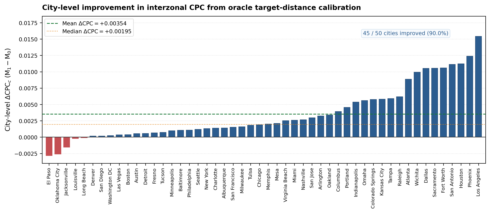

# Section 4: Empirical Results

In this section, we present the empirical evaluation designed to answer **RQ1** and **RQ2**. Across all experiments, our objective is not to propose a novel calibration algorithm, but to employ a closed-form, mass-preserving calibration operator as an **experimental instrument** to quantify the information value of target-city aggregate distance distributions ($Y_D$).

All evaluations are conducted under a strict 5-fold cross-validation protocol (10 held-out test cities per fold, totaling $N=50$ metropolitan areas across the United States) on the observed positive interzonal support $\Omega_c^+ = \{(i, j) \mid i \ne j, D_{ij} > 0, T_{ij} \ge 1\}$. The headline metric is the Common Part of Commuters (CPC) on interzonal flows, evaluated relative to the frozen zero-shot cross-city baseline $M_0$.

---

## 4.1 Target Distance Information Improves Zero-Shot OD Reconstruction

In the primary experiment, incorporating the oracle target-city distance-binned mobility distribution increased the mean interzonal CPC across 50 U.S. cities from 0.71281 for the zero-shot baseline ($M_0$) to 0.71635 after calibration ($M_1$). This corresponds to a mean improvement of $\Delta\mathrm{CPC}=+0.00354$, with a 95% confidence interval of $[+0.0026,+0.0045]$ obtained from the fold-stratified hierarchical bootstrap. Because the entire confidence interval lies above zero, the estimated mean improvement remains positive under the adopted bootstrap procedure.

*(Tiếng Việt: Trong thí nghiệm chính, việc bổ sung phân phối di chuyển theo nhóm khoảng cách oracle của thành phố mục tiêu làm CPC liên vùng trung bình trên 50 thành phố Hoa Kỳ tăng từ 0.71281 ở mô hình zero-shot cơ sở ($M_0$) lên 0.71635 sau hiệu chỉnh ($M_1$). Mức cải thiện trung bình đạt $\Delta\mathrm{CPC}=+0.00354$, với khoảng tin cậy 95% từ fold-stratified hierarchical bootstrap là $[+0.0026,+0.0045]$. Toàn bộ khoảng tin cậy nằm phía trên 0, cho thấy mức cải thiện CPC trung bình được ước lượng là dương dưới giao thức bootstrap đã sử dụng.)*

As shown in Figure 2, the improvement was not concentrated in a small subset of cities but was observed across most of the evaluation set. Specifically, CPC increased after calibration in 45 of 50 cities (90.0%). The median city-level change was also positive ($\Delta\mathrm{CPC}=+0.00195$), although the magnitude of improvement varied considerably across cities. The remaining five cities exhibited lower CPC after calibration, indicating that the benefit of target distance information did not occur in every case. Overall, the city-level distribution shows that the improvement was modest in magnitude but broadly consistent across the evaluated cities.

*(Tiếng Việt: Theo Hình 2, mức cải thiện không chỉ tập trung ở một số ít thành phố mà xuất hiện trên phần lớn các thành phố được đánh giá. Cụ thể, CPC tăng sau hiệu chỉnh ở 45 trong 50 thành phố (90.0%). Trung vị $\Delta\mathrm{CPC}=+0.00195$ cũng nằm phía dương, mặc dù mức cải thiện khác nhau đáng kể giữa các thành phố. Năm thành phố còn lại có CPC giảm sau hiệu chỉnh, cho thấy lợi ích của thông tin khoảng cách không xuất hiện ở mọi trường hợp. Nhìn chung, phân bố theo thành phố cho thấy mức cải thiện có quy mô nhỏ nhưng khá nhất quán trên tập đánh giá.)*

To further assess whether this pattern represented a systematic paired difference, we applied a two-sided Wilcoxon signed-rank test to the $M_0$ and $M_1$ results across the 50 cities. The test yielded $p=1.93\times10^{-9}$, providing strong evidence against the null hypothesis of no systematic paired difference between the two conditions. Taken together, these results indicate that the oracle target-city distance-binned mobility distribution provides a modest but consistent improvement over the zero-shot baseline across most evaluated cities.

*(Tiếng Việt: Để kiểm tra thêm liệu xu hướng cải thiện này có mang tính hệ thống hay không, chúng tôi sử dụng kiểm định Wilcoxon signed-rank hai phía trên các cặp kết quả $M_0$ và $M_1$ của 50 thành phố. Kiểm định cho $p=1.93\times10^{-9}$, cung cấp bằng chứng mạnh chống lại giả thuyết không có sự thay đổi có hệ thống giữa hai điều kiện. Kết hợp các kết quả trên, phân phối di chuyển theo nhóm khoảng cách oracle của thành phố mục tiêu mang lại một mức cải thiện nhỏ nhưng nhất quán trên phần lớn các thành phố được đánh giá so với mô hình zero-shot cơ sở.)*

---

**Figure 2 | City-level improvement in interzonal CPC from oracle target-distance calibration.** Bars show the per-city performance change $\Delta\text{CPC}_c = \text{CPC}(M_{1,c}) - \text{CPC}(M_{0,c})$ for $N=50$ held-out test cities, ordered from lowest to highest. The dashed green line indicates the mean improvement ($+0.00354$) and the dotted orange line indicates the median improvement ($+0.00195$). Overall, 45 of 50 cities (90.0%) exhibit positive gains, with the primary fold-stratified 95% confidence interval spanning $[+0.0026, +0.0045]$.

---

### Table 1: Primary Zero-Shot Flow Reconstruction Benchmark ($N=50$ Cities, $K=8$ Bins)

| Model Condition | Mean Interzonal CPC | Median CPC | Mean $\Delta\text{CPC}$ | 95% Fold-Stratified CI | City Win Rate | Wilcoxon $p$ (Two-Sided) |
|---|---|---|---|---|---|---|
| **Zero-Shot Baseline ($M_0$)** | $0.71281 \pm 0.04434$ | $0.71632$ | — | — | — | — |
| **Calibrated Model ($M_1$)** | $0.71635 \pm 0.04454$ | $0.71988$ | **$+0.00354$** | **$[+0.0026, +0.0045]$** | **45 / 50 (90.0%)** | $\mathbf{1.93 \times 10^{-9}}$ |

*Note: Evaluated on observed positive interzonal support $\Omega_c^+$. Confidence interval computed via $B=10,000$ fold-stratified bootstrap over cities. Seed-averaged across 3 independent model seeds.*

---

## 4.2 Improvement depends on target-specific distance information

Although the results in Section 4.1 demonstrate that calibration using the target-city distance-binned distribution ($Y_D$) improves CPC, they do not yet establish whether this performance gain genuinely stems from target-specific distance information or is simply an artifact of the calibration process itself. To test this, we compare calibration using the true target-city $Y_D$ against calibration using distributions from other cities. To ensure a fair comparison, donor distributions from other cities are dose-matched so that they induce the exact same intervention magnitude ($D_T$) as the target-city distribution.

When applying the true target-city $Y_D$, the mean CPC improvement reaches $\Delta\text{CPC} = +0.003539$. In contrast, when using dose-matched donor distributions from other cities, the mean CPC change is only $\Delta\text{CPC} = -0.000091$, representing virtually no improvement. The performance difference between the two conditions is $+0.003630$, with a 95% confidence interval of $[+0.00287, +0.00445]$. A one-sided Wilcoxon signed-rank test comparing target calibration against dose-matched wrong-city calibration yields $p = 2.19 \times 10^{-11}$. This result demonstrates that when the magnitude of calibration is held constant, donor distance distributions from other cities fail to replicate the performance gains achieved with the target city's own distribution. In other words, the benefit of calibration does not arise merely from altering the predictions, but depends critically on whether the distance information is correctly aligned with the target city.

*(Tiếng Việt: Mặc dù kết quả ở Mục 4.1 cho thấy việc hiệu chỉnh bằng phân phối di chuyển theo nhóm khoảng cách $Y_D$ của thành phố mục tiêu giúp cải thiện CPC, kết quả đó vẫn chưa cho biết liệu mức cải thiện có thực sự đến từ thông tin khoảng cách đặc thù của thành phố mục tiêu hay chỉ đơn giản là hệ quả của quá trình hiệu chỉnh. Để kiểm tra điều này, chúng tôi so sánh trường hợp sử dụng đúng $Y_D$ của thành phố mục tiêu với trường hợp sử dụng phân phối của các thành phố khác. Để bảo đảm so sánh công bằng, các phân phối từ thành phố khác được điều chỉnh sao cho tạo ra cùng mức độ can thiệp $D_T$ như trường hợp sử dụng thông tin của thành phố mục tiêu. Khi sử dụng đúng $Y_D$ của thành phố mục tiêu, mức cải thiện CPC trung bình đạt $\Delta\text{CPC}=+0.003539$. Ngược lại, khi sử dụng các phân phối từ thành phố khác nhưng đã được khớp cùng mức độ can thiệp, mức thay đổi CPC trung bình chỉ là $\Delta\text{CPC}=-0.000091$, tức gần như không mang lại cải thiện. Chênh lệch về mức cải thiện giữa hai điều kiện đạt $+0.003630$, với khoảng tin cậy 95% là $[+0.00287,+0.00445]$. Kiểm định Wilcoxon signed-rank một phía khi so sánh trường hợp sử dụng đúng thông tin của thành phố mục tiêu với trường hợp sử dụng thông tin từ thành phố khác cho $p=2.19\times10^{-11}$. Kết quả này cho thấy rằng khi mức độ hiệu chỉnh được kiểm soát ở cùng một mức, việc sử dụng phân phối khoảng cách của các thành phố khác không tái tạo được mức cải thiện đạt được khi sử dụng phân phối của chính thành phố mục tiêu. Nói cách khác, lợi ích của quá trình hiệu chỉnh không chỉ đến từ việc thay đổi dự báo, mà phụ thuộc đáng kể vào việc thông tin khoảng cách được sử dụng có đúng với thành phố mục tiêu hay không.)*

---

### Table 2: Target Specificity and Placebo Controls ($N=50$ Cities, $B=1000$ Draws)

| Experimental Condition | Mean $\Delta\text{CPC}$ | 95% Fold-Stratified CI | Benefit vs $M_0$ ($p_{\text{2-sided}}$) | Specificity Gain vs Placebo | Specificity 95% CI | Target vs Placebo ($p_{\text{1-sided}}$) | Win Rate ($Target > Placebo$) |
|---|:---:|:---:|:---:|:---:|:---:|:---:|:---:|
| **1. Oracle Target $Y_D$** | **$+0.003539$** | $[+0.00260, +0.00450]$ | $1.93 \times 10^{-9}$ | — | — | — | **45 / 50 (vs M0)** |
| **2. Dose-Matched Wrong Donors ($B=1000$)** | **$-0.000091$** | $[-0.00089, +0.00071]$ | $0.4097$ (n.s.) | **$+0.003630$** | $[+0.00287, +0.00445]$ | $\mathbf{2.19 \times 10^{-11}}$ | **46 / 50 (92.0%)** |
| **3. Dose-Matched Train-Mean $Y_D$** | **$+0.000914$** | $[+0.00001, +0.00186]$ | $0.4319$ (n.s.) | **$+0.002626$** | $[+0.00197, +0.00336]$ | $\mathbf{4.03 \times 10^{-11}}$ | **47 / 50 (94.0%)** |
| **4. Raw Test Donors (E1-v2 9 Donors)** | **$-0.037721$** | $[-0.04357, -0.03268]$ | $1.78 \times 10^{-15}$ | **$+0.041261$** | $[+0.03641, +0.04688]$ | $8.88 \times 10^{-16}$ | **50 / 50 (100%)** |
| **5. Raw Test Donors ($B=1000$ Draws)** | **$-0.037787$** | $[-0.04358, -0.03278]$ | $1.78 \times 10^{-15}$ | **$+0.041326$** | $[+0.03646, +0.04688]$ | $8.88 \times 10^{-16}$ | **50 / 50 (100%)** |
| **6. Raw Training Donors ($B=1000$ Draws)** | **$-0.035148$** | $[-0.04014, -0.03067]$ | $1.78 \times 10^{-15}$ | **$+0.038687$** | $[+0.03431, +0.04349]$ | $8.88 \times 10^{-16}$ | **50 / 50 (100%)** |
| **7. Raw Train-Mean $Y_D$** | **$-0.017735$** | $[-0.02365, -0.01243]$ | $4.91 \times 10^{-12}$ | **$+0.021275$** | $[+0.01613, +0.02706]$ | $4.44 \times 10^{-15}$ | **48 / 50 (96.0%)** |
| **8. Permuted Target $Y_D$ ($B=1000$ Draws)** | **$-0.006964$** | $[-0.00914, -0.00512]$ | $1.78 \times 10^{-15}$ | **$+0.010504$** | $[+0.00843, +0.01279]$ | $1.78 \times 10^{-15}$ | **49 / 50 (98.0%)** |

*Note: All donor and train-mean conditions evaluated across $N=50$ test cities $\times$ 3 model seeds. Dose matching normalizes the L2 log-ratio perturbation norm to match the target city's intervention dose $D_T$.*
